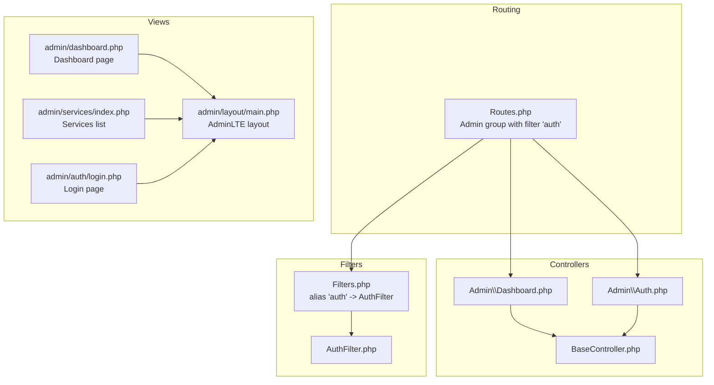
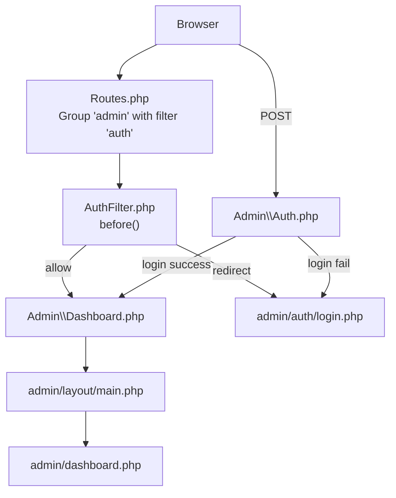
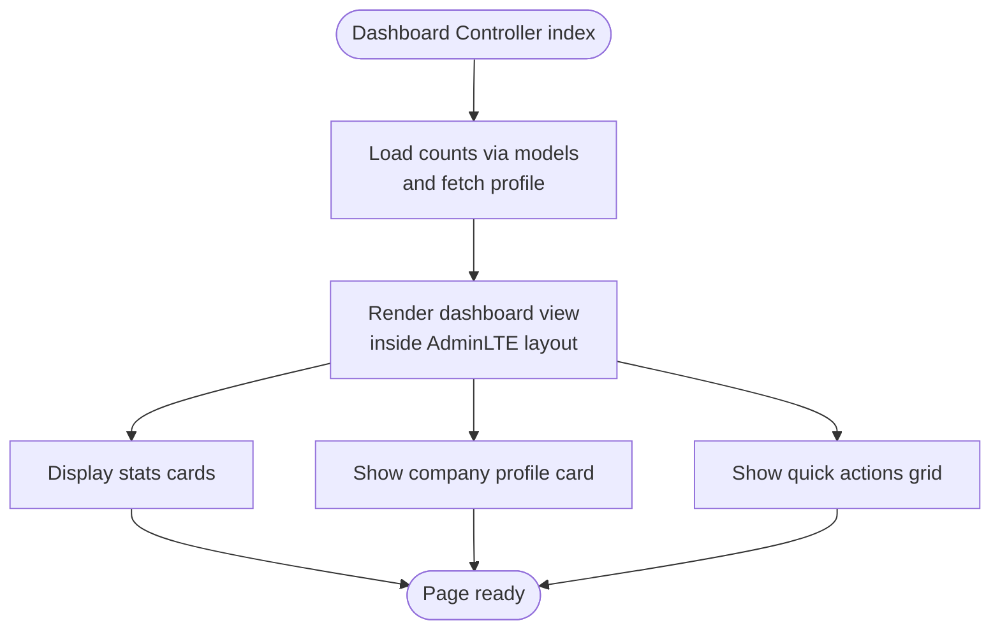
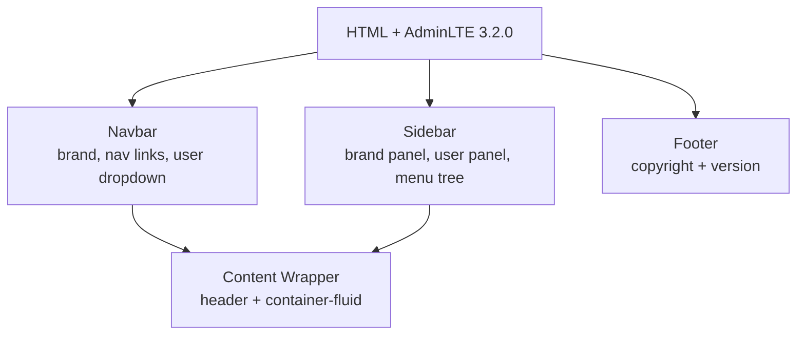
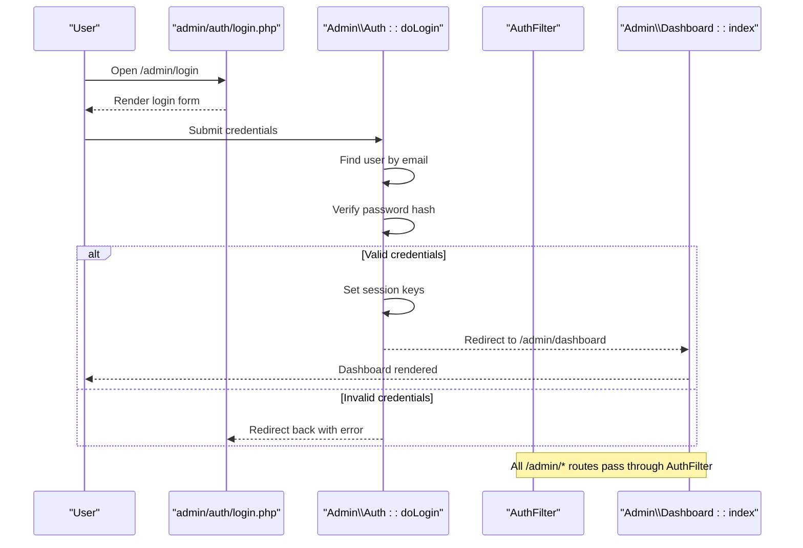
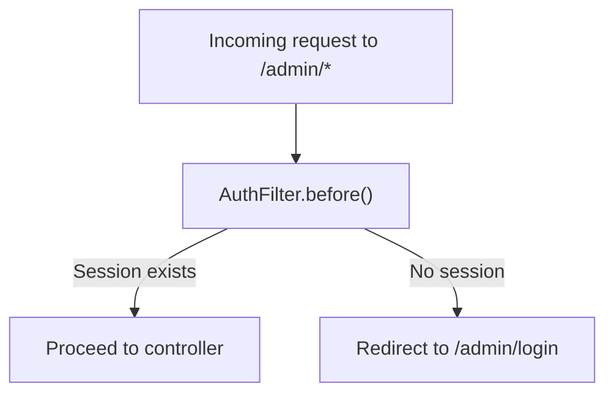
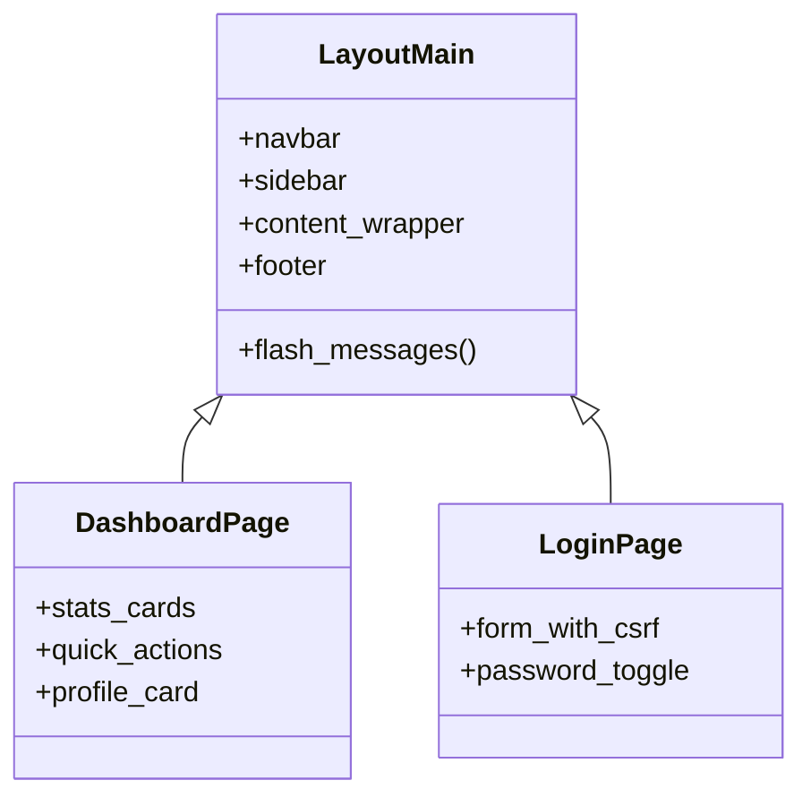
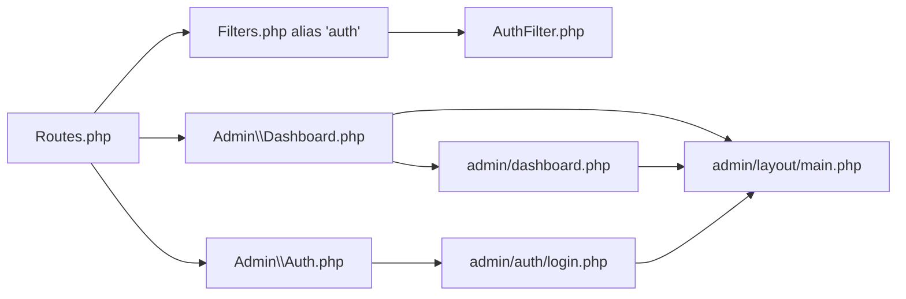

# Admin Interface

<cite>
**Referenced Files in This Document**
- [Dashboard.php](file://app/Controllers/Admin/Dashboard.php)
- [Auth.php](file://app/Controllers/Admin/Auth.php)
- [AuthFilter.php](file://app/Filters/AuthFilter.php)
- [BaseController.php](file://app/Controllers/BaseController.php)
- [UserModel.php](file://app/Models/UserModel.php)
- [Routes.php](file://app/Config/Routes.php)
- [Filters.php](file://app/Config/Filters.php)
- [login.php](file://app/Views/admin/auth/login.php)
- [main.php](file://app/Views/admin/layout/main.php)
- [dashboard.php](file://app/Views/admin/dashboard.php)
- [index.php](file://app/Views/admin/services/index.php)
</cite>

## Table of Contents
1. [Introduction](#introduction)
2. [Project Structure](#project-structure)
3. [Core Components](#core-components)
4. [Architecture Overview](#architecture-overview)
5. [Detailed Component Analysis](#detailed-component-analysis)
6. [Dependency Analysis](#dependency-analysis)
7. [Performance Considerations](#performance-considerations)
8. [Troubleshooting Guide](#troubleshooting-guide)
9. [Conclusion](#conclusion)

## Introduction
This document describes the administrative dashboard interface built with CodeIgniter 4 and AdminLTE 3.2.0. It covers the dashboard analytics overview, navigation structure, layout system, authentication and session-based security, access control, and user experience considerations. It also outlines security best practices, audit trail readiness, and administrative workflow optimization.

## Project Structure
The admin interface is organized around:
- Controllers under app/Controllers/Admin for dashboard, authentication, and CRUD modules
- A shared base controller for common helpers and initialization
- Filters for access control
- Views organized by module with a shared AdminLTE-based layout
- Routing configured to protect admin routes via a filter

**Diagram sources**
- [Routes.php:17-54](file://app/Config/Routes.php#L17-L54)
- [Filters.php:20](file://app/Config/Filters.php#L20)
- [AuthFilter.php:9-22](file://app/Filters/AuthFilter.php#L9-L22)
- [BaseController.php:12-25](file://app/Controllers/BaseController.php#L12-L25)
- [Dashboard.php:11-24](file://app/Controllers/Admin/Dashboard.php#L11-L24)
- [Auth.php:8-49](file://app/Controllers/Admin/Auth.php#L8-L49)
- [main.php:1-198](file://app/Views/admin/layout/main.php#L1-L198)
- [dashboard.php:1-133](file://app/Views/admin/dashboard.php#L1-L133)
- [login.php:1-157](file://app/Views/admin/auth/login.php#L1-L157)
- [index.php:1-69](file://app/Views/admin/services/index.php#L1-L69)

**Section sources**
- [Routes.php:17-54](file://app/Config/Routes.php#L17-L54)
- [Filters.php:20](file://app/Config/Filters.php#L20)
- [AuthFilter.php:9-22](file://app/Filters/AuthFilter.php#L9-L22)
- [BaseController.php:12-25](file://app/Controllers/BaseController.php#L12-L25)
- [Dashboard.php:11-24](file://app/Controllers/Admin/Dashboard.php#L11-L24)
- [Auth.php:8-49](file://app/Controllers/Admin/Auth.php#L8-L49)
- [main.php:1-198](file://app/Views/admin/layout/main.php#L1-L198)
- [dashboard.php:1-133](file://app/Views/admin/dashboard.php#L1-L133)
- [login.php:1-157](file://app/Views/admin/auth/login.php#L1-L157)
- [index.php:1-69](file://app/Views/admin/services/index.php#L1-L69)

## Core Components
- Admin Dashboard Controller: prepares analytics counts and renders the dashboard view inside the AdminLTE layout.
- Admin Authentication Controller: handles login, logout, and session creation; validates credentials against the user model.
- Access Control Filter: redirects unauthenticated requests to the login page.
- Shared Layout: AdminLTE 3.2.0-based master layout with navbar, sidebar, content wrapper, breadcrumbs, and flash messages.
- Login View: styled login form with CSRF protection and client-side password visibility toggle.
- Dashboard View: statistics cards, quick actions, and company profile summary.
- Services List View: table of services with images, categories, statuses, and action buttons.

**Section sources**
- [Dashboard.php:11-24](file://app/Controllers/Admin/Dashboard.php#L11-L24)
- [Auth.php:8-49](file://app/Controllers/Admin/Auth.php#L8-L49)
- [AuthFilter.php:9-22](file://app/Filters/AuthFilter.php#L9-L22)
- [main.php:1-198](file://app/Views/admin/layout/main.php#L1-L198)
- [login.php:1-157](file://app/Views/admin/auth/login.php#L1-L157)
- [dashboard.php:1-133](file://app/Views/admin/dashboard.php#L1-L133)
- [index.php:1-69](file://app/Views/admin/services/index.php#L1-L69)

## Architecture Overview
The admin architecture follows a layered MVC pattern with centralized access control and a reusable AdminLTE layout.

**Diagram sources**
- [Routes.php:22-54](file://app/Config/Routes.php#L22-L54)
- [AuthFilter.php:11-16](file://app/Filters/AuthFilter.php#L11-L16)
- [Dashboard.php:13-23](file://app/Controllers/Admin/Dashboard.php#L13-L23)
- [Auth.php:18-48](file://app/Controllers/Admin/Auth.php#L18-L48)
- [main.php:133-179](file://app/Views/admin/layout/main.php#L133-L179)
- [dashboard.php:1-133](file://app/Views/admin/dashboard.php#L1-L133)
- [login.php:111-133](file://app/Views/admin/auth/login.php#L111-L133)

## Detailed Component Analysis

### Admin Dashboard Analytics Overview
The dashboard aggregates counts for services, gallery items, and users, and displays company profile information. It uses small boxes for metrics and quick action buttons for common tasks.

**Diagram sources**
- [Dashboard.php:13-23](file://app/Controllers/Admin/Dashboard.php#L13-L23)
- [dashboard.php:4-46](file://app/Views/admin/dashboard.php#L4-L46)
- [dashboard.php:49-130](file://app/Views/admin/dashboard.php#L49-L130)

**Section sources**
- [Dashboard.php:13-23](file://app/Controllers/Admin/Dashboard.php#L13-L23)
- [dashboard.php:4-46](file://app/Views/admin/dashboard.php#L4-L46)
- [dashboard.php:49-130](file://app/Views/admin/dashboard.php#L49-L130)

### Navigation Structure and Layout System
The AdminLTE layout defines:
- Top navbar with push menu toggle, breadcrumb navigation, and user dropdown
- Collapsible sidebar with menu groups and active-state highlighting
- Content wrapper with container-fluid and flash message rendering
- Footer with version info

**Diagram sources**
- [main.php:34-65](file://app/Views/admin/layout/main.php#L34-L65)
- [main.php:68-131](file://app/Views/admin/layout/main.php#L68-L131)
- [main.php:133-179](file://app/Views/admin/layout/main.php#L133-L179)
- [main.php:182-187](file://app/Views/admin/layout/main.php#L182-L187)

**Section sources**
- [main.php:34-65](file://app/Views/admin/layout/main.php#L34-L65)
- [main.php:68-131](file://app/Views/admin/layout/main.php#L68-L131)
- [main.php:133-179](file://app/Views/admin/layout/main.php#L133-L179)
- [main.php:182-187](file://app/Views/admin/layout/main.php#L182-L187)

### Authentication System and Session-Based Security
Authentication flow:
- Login GET shows the form with CSRF field
- Login POST validates email/password against the user model
- On success, sets session keys and redirects to dashboard
- Logout destroys session and redirects to login
- Access control filter checks session flag for protected routes

**Diagram sources**
- [login.php:111-133](file://app/Views/admin/auth/login.php#L111-L133)
- [Auth.php:18-48](file://app/Controllers/Admin/Auth.php#L18-L48)
- [AuthFilter.php:11-16](file://app/Filters/AuthFilter.php#L11-L16)
- [Dashboard.php:13-23](file://app/Controllers/Admin/Dashboard.php#L13-L23)

**Section sources**
- [login.php:111-133](file://app/Views/admin/auth/login.php#L111-L133)
- [Auth.php:18-48](file://app/Controllers/Admin/Auth.php#L18-L48)
- [AuthFilter.php:11-16](file://app/Filters/AuthFilter.php#L11-L16)
- [Dashboard.php:13-23](file://app/Controllers/Admin/Dashboard.php#L13-L23)

### Access Control Mechanisms
- Route grouping applies the 'auth' filter to all admin routes
- The filter checks for a session flag and redirects unauthorized users to login
- The filter runs before controller execution globally for admin routes

**Diagram sources**
- [Routes.php:23](file://app/Config/Routes.php#L23)
- [Filters.php:20](file://app/Config/Filters.php#L20)
- [AuthFilter.php:11-16](file://app/Filters/AuthFilter.php#L11-L16)

**Section sources**
- [Routes.php:23](file://app/Config/Routes.php#L23)
- [Filters.php:20](file://app/Config/Filters.php#L20)
- [AuthFilter.php:11-16](file://app/Filters/AuthFilter.php#L11-L16)

### Admin Layout Template, Sidebar Navigation, and Content Wrappers
- Layout uses AdminLTE classes for sidebar-mini, fixed layout, and pushmenu widget
- Sidebar groups include Main Menu, Content Management, and Settings
- Active link highlighting uses URL substring matching
- Content area renders flash messages and the page-specific section

**Diagram sources**
- [main.php:34-65](file://app/Views/admin/layout/main.php#L34-L65)
- [main.php:68-131](file://app/Views/admin/layout/main.php#L68-L131)
- [main.php:133-179](file://app/Views/admin/layout/main.php#L133-L179)
- [dashboard.php:4-130](file://app/Views/admin/dashboard.php#L4-L130)
- [login.php:111-133](file://app/Views/admin/auth/login.php#L111-L133)

**Section sources**
- [main.php:34-65](file://app/Views/admin/layout/main.php#L34-L65)
- [main.php:68-131](file://app/Views/admin/layout/main.php#L68-L131)
- [main.php:133-179](file://app/Views/admin/layout/main.php#L133-L179)
- [dashboard.php:4-130](file://app/Views/admin/dashboard.php#L4-L130)
- [login.php:111-133](file://app/Views/admin/auth/login.php#L111-L133)

### Responsive Design and User Experience
- AdminLTE 3.2.0 ensures responsive sidebar and content areas
- Navbar supports pushmenu for mobile-friendly navigation
- Consistent typography and spacing via Poppins and AdminLTE styles
- Flash messages provide immediate feedback for actions
- Quick action buttons streamline common tasks

**Section sources**
- [main.php:8-28](file://app/Views/admin/layout/main.php#L8-L28)
- [main.php:30](file://app/Views/admin/layout/main.php#L30)
- [main.php:154-173](file://app/Views/admin/layout/main.php#L154-L173)
- [dashboard.php:101-126](file://app/Views/admin/dashboard.php#L101-L126)

### Administrative Workflow Optimization
- Dashboard provides at-a-glance metrics and quick actions
- Services list view includes image previews, category badges, and inline actions
- Breadcrumbs and active menu states reduce cognitive load
- One-click preview of the frontend website from the admin header

**Section sources**
- [dashboard.php:4-46](file://app/Views/admin/dashboard.php#L4-L46)
- [dashboard.php:95-129](file://app/Views/admin/dashboard.php#L95-L129)
- [index.php:13-66](file://app/Views/admin/services/index.php#L13-L66)
- [main.php:135-149](file://app/Views/admin/layout/main.php#L135-L149)

## Dependency Analysis
The admin subsystem exhibits clear separation of concerns:
- Controllers depend on the base controller and models
- Views depend on the shared layout and session data
- Filters enforce cross-cutting security policy
- Routing binds URLs to controllers and applies filters

**Diagram sources**
- [Routes.php:22-54](file://app/Config/Routes.php#L22-L54)
- [Filters.php:20](file://app/Config/Filters.php#L20)
- [AuthFilter.php:9-22](file://app/Filters/AuthFilter.php#L9-L22)
- [Dashboard.php:11-24](file://app/Controllers/Admin/Dashboard.php#L11-L24)
- [Auth.php:8-49](file://app/Controllers/Admin/Auth.php#L8-L49)
- [main.php:1-198](file://app/Views/admin/layout/main.php#L1-L198)
- [dashboard.php:1-133](file://app/Views/admin/dashboard.php#L1-L133)
- [login.php:1-157](file://app/Views/admin/auth/login.php#L1-L157)

**Section sources**
- [Routes.php:22-54](file://app/Config/Routes.php#L22-L54)
- [Filters.php:20](file://app/Config/Filters.php#L20)
- [AuthFilter.php:9-22](file://app/Filters/AuthFilter.php#L9-L22)
- [Dashboard.php:11-24](file://app/Controllers/Admin/Dashboard.php#L11-L24)
- [Auth.php:8-49](file://app/Controllers/Admin/Auth.php#L8-L49)
- [main.php:1-198](file://app/Views/admin/layout/main.php#L1-L198)
- [dashboard.php:1-133](file://app/Views/admin/dashboard.php#L1-L133)
- [login.php:1-157](file://app/Views/admin/auth/login.php#L1-L157)

## Performance Considerations
- Minimize database queries in dashboard rendering; the current implementation performs lightweight count queries and a single profile fetch
- Use pagination for large lists (services, gallery, users) to reduce payload sizes
- Cache frequently accessed static assets via CDN and browser caching headers
- Keep AdminLTE and Font Awesome loaded from CDNs to leverage caching and global availability

## Troubleshooting Guide
Common issues and resolutions:
- Unauthorized access attempts: Ensure the 'auth' filter is applied to admin routes and that sessions are properly set upon successful login
- Login failures: Verify email existence and password verification; confirm CSRF token presence in forms
- Session not persisting: Confirm session configuration and that session()->destroy() is only called on logout
- Flash messages not appearing: Check that flash data is set before redirect and that the layout renders flash blocks

**Section sources**
- [Routes.php:23](file://app/Config/Routes.php#L23)
- [AuthFilter.php:11-16](file://app/Filters/AuthFilter.php#L11-L16)
- [Auth.php:26-41](file://app/Controllers/Admin/Auth.php#L26-L41)
- [login.php:111-112](file://app/Views/admin/auth/login.php#L111-L112)
- [main.php:154-173](file://app/Views/admin/layout/main.php#L154-L173)

## Conclusion
The admin interface leverages AdminLTE 3.2.0 for a professional, responsive layout and integrates tightly with CodeIgniter’s routing and filter systems for robust access control. The dashboard provides actionable insights and efficient workflows, while the authentication system secures admin routes through session-based checks. Extending the system with audit logging and granular permissions would further strengthen security and compliance.