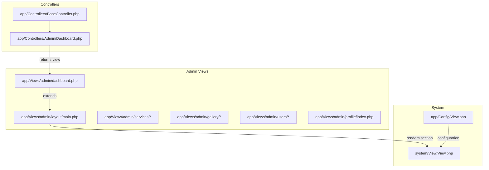
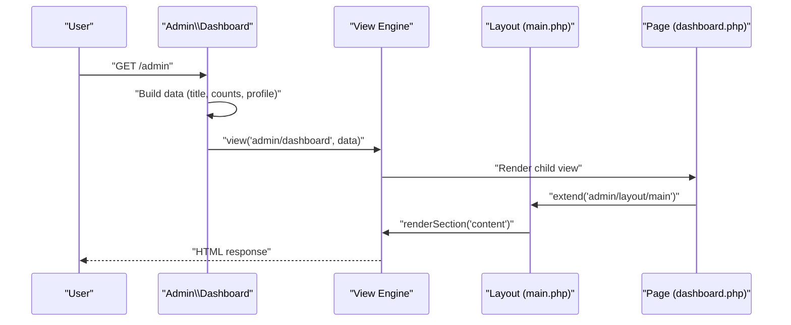
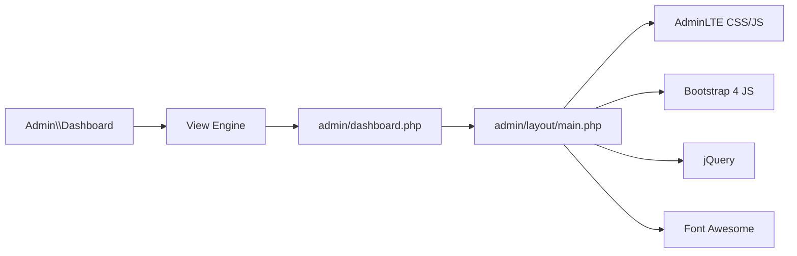

# Admin Layout & Template

<cite>
**Referenced Files in This Document**
- [main.php](file://app/Views/admin/layout/main.php)
- [dashboard.php](file://app/Views/admin/dashboard.php)
- [Dashboard.php](file://app/Controllers/Admin/Dashboard.php)
- [BaseController.php](file://app/Controllers/BaseController.php)
- [View.php](file://system/View/View.php)
- [View.php](file://app/Config/View.php)
</cite>

## Table of Contents
1. [Introduction](#introduction)
2. [Project Structure](#project-structure)
3. [Core Components](#core-components)
4. [Architecture Overview](#architecture-overview)
5. [Detailed Component Analysis](#detailed-component-analysis)
6. [Dependency Analysis](#dependency-analysis)
7. [Performance Considerations](#performance-considerations)
8. [Troubleshooting Guide](#troubleshooting-guide)
9. [Conclusion](#conclusion)

## Introduction
This document explains the admin interface layout and template system built with CodeIgniter 4 and AdminLTE 3.2.0. It covers the main layout structure, responsive design, header navigation, sidebar menu, content wrapper, flash messages, and footer. It also documents template inheritance, CSS and JavaScript integration, customization options, theme variations, mobile responsiveness, component reusability, template variables, and guidelines for extending the admin interface.

## Project Structure
The admin layout and templates are organized under app/Views/admin. The main layout defines the HTML shell and AdminLTE integration. Individual admin pages extend the main layout and inject content via named sections.

**Diagram sources**
- [main.php:1-198](file://app/Views/admin/layout/main.php#L1-L198)
- [dashboard.php:1-133](file://app/Views/admin/dashboard.php#L1-L133)
- [Dashboard.php:1-25](file://app/Controllers/Admin/Dashboard.php#L1-L25)
- [BaseController.php:1-26](file://app/Controllers/BaseController.php#L1-L26)
- [View.php:1-80](file://app/Config/View.php#L1-L80)
- [View.php:418-527](file://system/View/View.php#L418-L527)

**Section sources**
- [main.php:1-198](file://app/Views/admin/layout/main.php#L1-L198)
- [dashboard.php:1-133](file://app/Views/admin/dashboard.php#L1-L133)
- [Dashboard.php:1-25](file://app/Controllers/Admin/Dashboard.php#L1-L25)
- [BaseController.php:1-26](file://app/Controllers/BaseController.php#L1-L26)
- [View.php:1-80](file://app/Config/View.php#L1-L80)
- [View.php:418-527](file://system/View/View.php#L418-L527)

## Core Components
- Main Layout (AdminLTE Shell)
  - Defines the HTML skeleton, viewport meta, AdminLTE and Font Awesome assets, custom styles, and the wrapper structure.
  - Provides header navigation, sidebar menu, content wrapper, flash messages area, and footer.
  - Includes jQuery, Bootstrap 4, and AdminLTE JavaScript bundles.

- Template Inheritance
  - Child views extend the main layout using the framework’s extend/section/endSection mechanism.
  - The main layout renders the named content section injected by child views.

- Data Passing
  - Controllers prepare data arrays and pass them to views.
  - The main layout reads template variables (e.g., title) and renders dynamic content (e.g., session data in the header and sidebar).

- Flash Messages
  - The layout renders success, error, and grouped error flash messages from the session.

**Section sources**
- [main.php:1-198](file://app/Views/admin/layout/main.php#L1-L198)
- [dashboard.php:1-133](file://app/Views/admin/dashboard.php#L1-L133)
- [Dashboard.php:1-25](file://app/Controllers/Admin/Dashboard.php#L1-L25)
- [View.php:418-527](file://system/View/View.php#L418-L527)

## Architecture Overview
The admin template system follows a layered pattern:
- Controllers prepare data and select a view.
- Views extend the main layout and define content sections.
- The layout composes the final HTML, injecting content and managing assets.

**Diagram sources**
- [Dashboard.php:13-23](file://app/Controllers/Admin/Dashboard.php#L13-L23)
- [dashboard.php:1-133](file://app/Views/admin/dashboard.php#L1-L133)
- [main.php:175-175](file://app/Views/admin/layout/main.php#L175-L175)
- [View.php:418-527](file://system/View/View.php#L418-L527)

## Detailed Component Analysis

### Main Layout (AdminLTE Shell)
Responsibilities:
- Sets up the HTML document, viewport, and AdminLTE CSS/JS bundles.
- Renders the top navigation bar with branding and user dropdown.
- Builds the sidebar with user panel and navigation menu.
- Wraps the content area with header breadcrumbs and containerized content.
- Displays flash messages and renders the yielded content section.
- Adds a persistent footer.

Key elements:
- Asset links for AdminLTE, Font Awesome, and Google Fonts.
- Inline custom styles for typography, colors, shadows, and rounded corners.
- Responsive classes and AdminLTE classes for layout behavior.
- Active-state logic for sidebar items based on current URL.
- Session-driven user info in header and sidebar.

Customization hooks:
- Modify inline styles for brand colors, shadows, and radii.
- Adjust asset URLs or versions for AdminLTE and Font Awesome.
- Extend or replace the breadcrumb and flash message blocks.

**Section sources**
- [main.php:1-198](file://app/Views/admin/layout/main.php#L1-L198)

### Header Navigation
- Contains the pushmenu toggle, internal links, and a “View Website” external link.
- Right-side user dropdown displays session-provided name, email, role, and logout action.
- Uses AdminLTE navbar classes and Font Awesome icons.

Responsive behavior:
- Hides certain items on small screens using responsive display utilities.

**Section sources**
- [main.php:34-65](file://app/Views/admin/layout/main.php#L34-L65)

### Sidebar Menu System
- Brand link with icon and text.
- User panel with avatar fallback and role badges.
- Navigation tree with headers and menu items.
- Active item highlighting based on current URL checks.
- Uses AdminLTE sidebar classes and treeview behavior.

Extensibility:
- Add new menu items by appending li.nav-item nodes.
- Use Font Awesome icons and appropriate URLs.
- Keep active state logic consistent with URL patterns.

**Section sources**
- [main.php:68-131](file://app/Views/admin/layout/main.php#L68-L131)

### Content Wrapper
- Breadcrumb header with container and dynamic title.
- Containerized content area where child views inject their content.
- Flash message block rendered before content injection.

Content injection:
- Child views call extend and section/endSection to populate the content area.

**Section sources**
- [main.php:134-179](file://app/Views/admin/layout/main.php#L134-L179)
- [dashboard.php:1-133](file://app/Views/admin/dashboard.php#L1-L133)

### Footer
- Displays copyright and version information.
- Right-aligned version badge.

**Section sources**
- [main.php:182-187](file://app/Views/admin/layout/main.php#L182-L187)

### Template Inheritance and Sections
- Child views extend the main layout and define a content section.
- The layout renders the content section via renderSection.
- The view engine manages section stacks and concatenation.

Configuration:
- app/Config/View controls whether data persists between view calls.

**Section sources**
- [dashboard.php:1-133](file://app/Views/admin/dashboard.php#L1-L133)
- [main.php:175-175](file://app/Views/admin/layout/main.php#L175-L175)
- [View.php:418-527](file://system/View/View.php#L418-L527)
- [View.php:24-24](file://app/Config/View.php#L24-L24)

### CSS Frameworks and JavaScript Integration
- AdminLTE 3.2.0 CSS and JS loaded from CDN.
- Bootstrap 4 JS bundle included for component support.
- jQuery included for AdminLTE interactions.
- Font Awesome 6.x icons and Google Fonts Poppins for typography.

Custom styles:
- Inline style block adjusts fonts, colors, shadows, and corner radii.

**Section sources**
- [main.php:8-28](file://app/Views/admin/layout/main.php#L8-L28)
- [main.php:191-195](file://app/Views/admin/layout/main.php#L191-L195)

### Responsive Design Implementation
- Uses AdminLTE layout classes (e.g., sidebar-mini, layout-fixed) and Bootstrap grid utilities.
- Viewport meta tag enables device-width scaling.
- Responsive visibility utilities hide items on smaller screens.
- Sidebar treeview behavior collapses on small screens.

**Section sources**
- [main.php:5-30](file://app/Views/admin/layout/main.php#L5-L30)
- [main.php:34-65](file://app/Views/admin/layout/main.php#L34-L65)
- [main.php:68-131](file://app/Views/admin/layout/main.php#L68-L131)

### Layout Customization Options and Theme Variations
- Brand color and sidebar background: adjust inline styles targeting brand and sidebar elements.
- Card and button styling: modify inline radius and shadow values.
- Typography: change font family in the inline style block.
- Asset versions: update CDN URLs for AdminLTE, Bootstrap, and Font Awesome.
- Layout skin: switch AdminLTE skin classes on the body element if desired.

**Section sources**
- [main.php:13-28](file://app/Views/admin/layout/main.php#L13-L28)
- [main.php:30-30](file://app/Views/admin/layout/main.php#L30-L30)

### Mobile Responsiveness Features
- Sidebar mini mode reduces sidebar width on larger screens.
- Treeview menus collapse on smaller screens.
- Navbar items use responsive display utilities.
- Grid classes (e.g., col-lg-, col-md-) adapt content columns.

**Section sources**
- [main.php:30-30](file://app/Views/admin/layout/main.php#L30-L30)
- [main.php:34-65](file://app/Views/admin/layout/main.php#L34-L65)
- [main.php:68-131](file://app/Views/admin/layout/main.php#L68-L131)
- [dashboard.php:5-46](file://app/Views/admin/dashboard.php#L5-L46)

### Component Reusability and Template Variables
- Reusable layout: all admin pages share the same main layout.
- Template variables: title and other data passed from controllers to views.
- Flash messages: centralized rendering in the layout simplifies error/success feedback across pages.
- Session-driven UI: user info and role displayed consistently.

**Section sources**
- [dashboard.php:15-21](file://app/Views/admin/dashboard.php#L15-L21)
- [main.php:47-63](file://app/Views/admin/layout/main.php#L47-L63)
- [main.php:154-173](file://app/Views/admin/layout/main.php#L154-L173)

### Layout Modification Guidelines
- Keep extend/section patterns consistent across child views.
- Centralize shared UI elements in the main layout (header, sidebar, footer).
- Use session helpers safely and guard against missing keys.
- Maintain active-state logic for sidebar items to reflect current route.
- Preserve AdminLTE class names and structure for JavaScript interactions.
- Prefer CDN updates for AdminLTE and Font Awesome; pin versions if needed.
- Add new menu items by following existing li.nav-item patterns.

**Section sources**
- [dashboard.php:1-133](file://app/Views/admin/dashboard.php#L1-L133)
- [main.php:88-129](file://app/Views/admin/layout/main.php#L88-L129)

## Dependency Analysis
The admin template system depends on:
- AdminLTE 3.2.0 for UI components and layout behavior.
- Bootstrap 4 for grid and JS components.
- jQuery for AdminLTE interactions.
- CodeIgniter View engine for template rendering and section management.
- Session data for user context in header and sidebar.

**Diagram sources**
- [Dashboard.php:13-23](file://app/Controllers/Admin/Dashboard.php#L13-L23)
- [dashboard.php:1-133](file://app/Views/admin/dashboard.php#L1-L133)
- [main.php:8-28](file://app/Views/admin/layout/main.php#L8-L28)
- [main.php:191-195](file://app/Views/admin/layout/main.php#L191-L195)

**Section sources**
- [Dashboard.php:1-25](file://app/Controllers/Admin/Dashboard.php#L1-L25)
- [View.php:418-527](file://system/View/View.php#L418-L527)
- [main.php:1-198](file://app/Views/admin/layout/main.php#L1-L198)

## Performance Considerations
- Asset delivery: serving AdminLTE, Bootstrap, and Font Awesome from CDNs reduces server load but relies on network availability.
- Minimize inline styles: consider extracting custom styles to external CSS for caching benefits.
- Reduce DOM: keep the sidebar menu concise to avoid heavy treeview rendering on low-powered devices.
- Lazy loading: defer non-critical images inside content areas.

## Troubleshooting Guide
Common issues and resolutions:
- Missing assets (AdminLTE, Font Awesome): verify CDN URLs and network connectivity; optionally self-host assets.
- Active menu highlighting not working: ensure URL patterns match the active-state logic in the sidebar.
- Flash messages not visible: confirm session flash data is set before rendering the layout.
- Layout shifts or misalignment: check custom inline styles and AdminLTE class usage.
- Session data missing: verify session initialization and presence of required keys (e.g., admin_nama, admin_email, admin_role).

**Section sources**
- [main.php:47-63](file://app/Views/admin/layout/main.php#L47-L63)
- [main.php:88-129](file://app/Views/admin/layout/main.php#L88-L129)
- [main.php:154-173](file://app/Views/admin/layout/main.php#L154-L173)

## Conclusion
The admin interface leverages AdminLTE 3.2.0 within a clean CodeIgniter 4 template system. The main layout centralizes navigation, sidebar, content wrapper, and footer, while child views focus on page-specific content. The system supports customization through inline styles, asset versions, and layout classes, and remains responsive across devices. Following the established patterns ensures maintainability and extensibility for future enhancements.