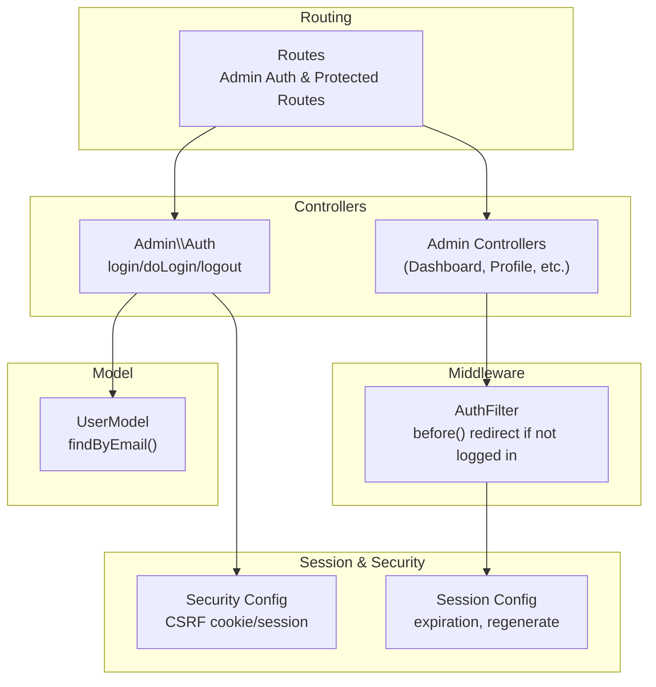
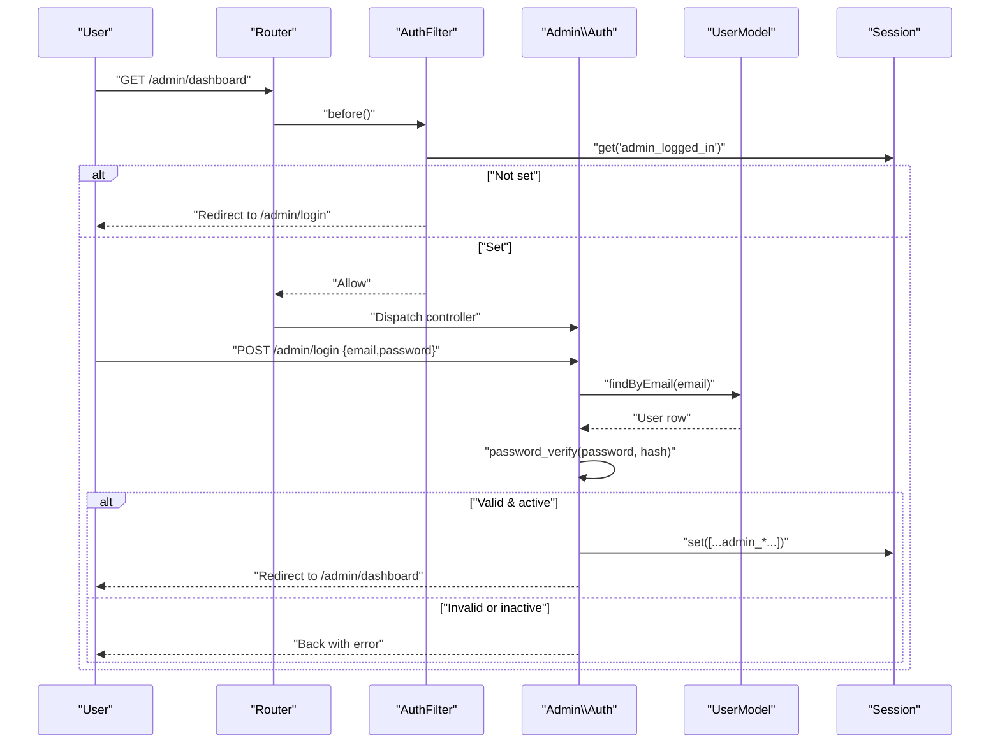
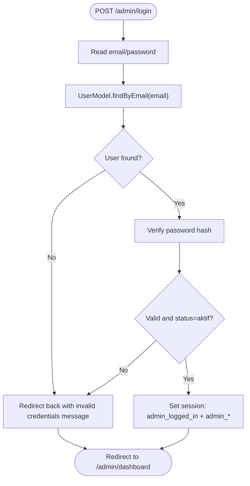
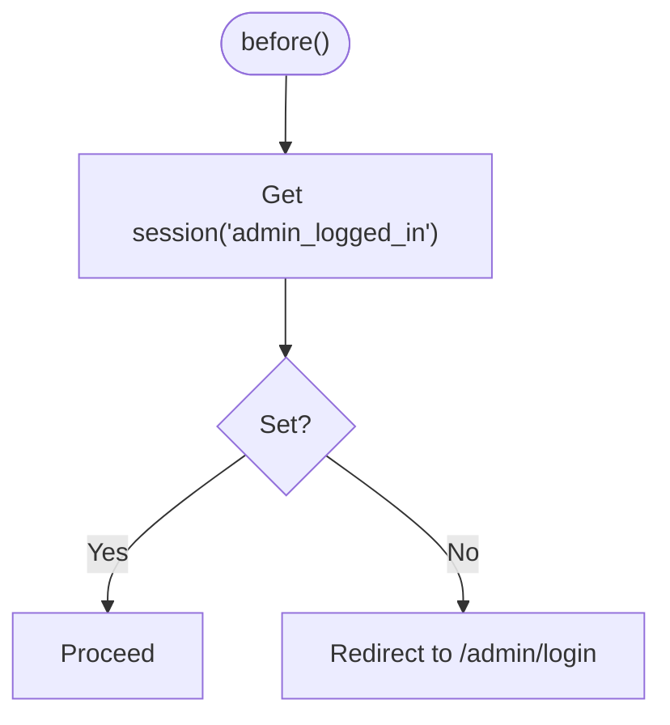
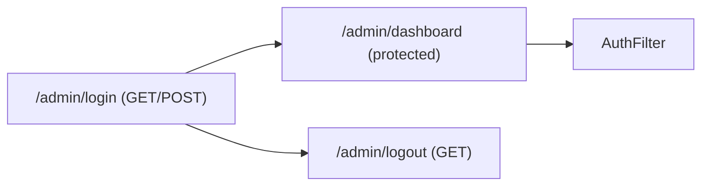
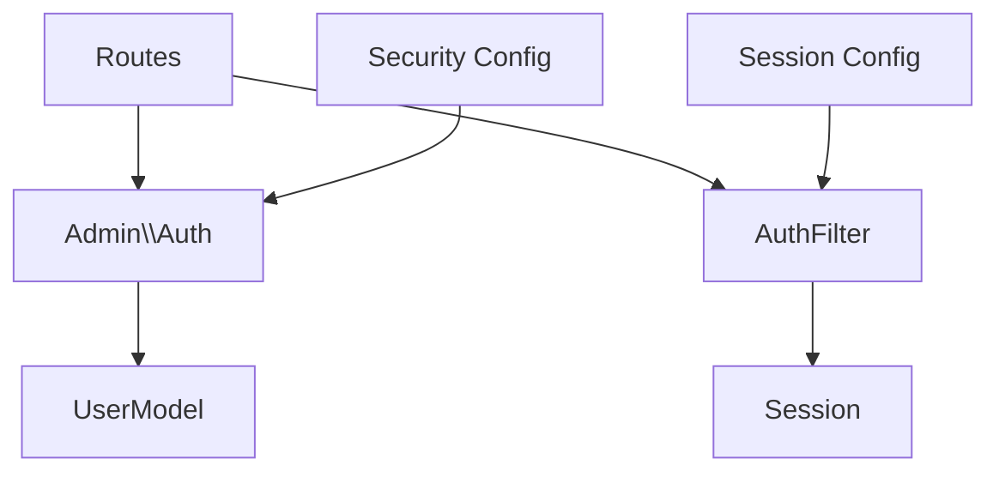

# Authentication System

<cite>
**Referenced Files in This Document**
- [Auth.php](file://app/Controllers/Admin/Auth.php)
- [AuthFilter.php](file://app/Filters/AuthFilter.php)
- [UserModel.php](file://app/Models/UserModel.php)
- [Routes.php](file://app/Config/Routes.php)
- [Filters.php](file://app/Config/Filters.php)
- [Session.php](file://app/Config/Session.php)
- [Security.php](file://app/Config/Security.php)
- [BaseController.php](file://app/Controllers/BaseController.php)
- [CreateUsersTable.php](file://app/Database/Migrations/2024-01-01-000004_CreateUsersTable.php)
- [App.php](file://app/Config/App.php)
- [Exceptions.php](file://app/Config/Exceptions.php)
- [Database.php](file://app/Config/Database.php)
</cite>

## Table of Contents
1. [Introduction](#introduction)
2. [Project Structure](#project-structure)
3. [Core Components](#core-components)
4. [Architecture Overview](#architecture-overview)
5. [Detailed Component Analysis](#detailed-component-analysis)
6. [Dependency Analysis](#dependency-analysis)
7. [Performance Considerations](#performance-considerations)
8. [Troubleshooting Guide](#troubleshooting-guide)
9. [Conclusion](#conclusion)

## Introduction
This document describes the admin authentication system built with CodeIgniter 4. It covers session-based authentication, login/logout flows, credential validation, route protection via a custom filter, and access control patterns. It also outlines password security measures, session timeout handling, and recommended improvements for brute force protection and user experience.

## Project Structure
The authentication system spans controllers, filters, models, routing, and configuration files. The admin area is protected by a filter applied to a route group, while credentials are validated against a database-backed user model.

**Diagram sources**
- [Routes.php:17-54](file://app/Config/Routes.php#L17-L54)
- [Auth.php:10-48](file://app/Controllers/Admin/Auth.php#L10-L48)
- [AuthFilter.php:11-16](file://app/Filters/AuthFilter.php#L11-L16)
- [UserModel.php:15-18](file://app/Models/UserModel.php#L15-L18)
- [Session.php:44](file://app/Config/Session.php#L44)
- [Security.php:18](file://app/Config/Security.php#L18)

**Section sources**
- [Routes.php:17-54](file://app/Config/Routes.php#L17-L54)
- [Auth.php:10-48](file://app/Controllers/Admin/Auth.php#L10-L48)
- [AuthFilter.php:11-16](file://app/Filters/AuthFilter.php#L11-L16)
- [UserModel.php:15-18](file://app/Models/UserModel.php#L15-L18)
- [Session.php:44](file://app/Config/Session.php#L44)
- [Security.php:18](file://app/Config/Security.php#L18)

## Core Components
- Admin authentication controller: handles login view, credential validation, session creation, and logout.
- Auth filter: protects admin routes by checking session state.
- User model: retrieves user records by email for authentication.
- Routing: defines admin login/logout endpoints and groups protected routes under a filter.
- Session configuration: controls session lifetime and regeneration behavior.
- Security configuration: configures CSRF protection.

**Section sources**
- [Auth.php:10-48](file://app/Controllers/Admin/Auth.php#L10-L48)
- [AuthFilter.php:11-16](file://app/Filters/AuthFilter.php#L11-L16)
- [UserModel.php:15-18](file://app/Models/UserModel.php#L15-L18)
- [Routes.php:17-54](file://app/Config/Routes.php#L17-L54)
- [Session.php:44](file://app/Config/Session.php#L44)
- [Security.php:18](file://app/Config/Security.php#L18)

## Architecture Overview
The system uses a simple session-based authentication pattern:
- Unauthenticated users accessing protected admin routes are redirected to the login page.
- On successful credential verification, a session is created with admin attributes.
- Subsequent requests are allowed because the filter checks the session flag.
- Logout destroys the session and redirects to the login page.

**Diagram sources**
- [Routes.php:23-25](file://app/Config/Routes.php#L23-L25)
- [AuthFilter.php:11-16](file://app/Filters/AuthFilter.php#L11-L16)
- [Auth.php:18-42](file://app/Controllers/Admin/Auth.php#L18-L42)
- [UserModel.php:15-18](file://app/Models/UserModel.php#L15-L18)
- [Session.php:44](file://app/Config/Session.php#L44)

## Detailed Component Analysis

### Admin Authentication Controller
Responsibilities:
- Render login page if not already logged in.
- Validate credentials against the user model.
- Enforce account status (active/inactive).
- Create admin session upon successful login.
- Destroy session on logout.

Key behaviors:
- Login view rendering prevents redundant re-authentication.
- Credential validation uses hashed passwords verified by the framework’s password verification function.
- Account status check blocks inactive accounts.
- Session stores multiple admin attributes for downstream use in protected controllers.

**Diagram sources**
- [Auth.php:18-42](file://app/Controllers/Admin/Auth.php#L18-L42)
- [UserModel.php:15-18](file://app/Models/UserModel.php#L15-L18)

**Section sources**
- [Auth.php:10-48](file://app/Controllers/Admin/Auth.php#L10-L48)
- [UserModel.php:15-18](file://app/Models/UserModel.php#L15-L18)

### AuthFilter Middleware
Responsibilities:
- Enforce session-based access control for admin routes.
- Redirect unauthenticated requests to the login page.

Behavior:
- Checks a single session flag indicating admin login state.
- No-op on success; redirect on missing flag.

**Diagram sources**
- [AuthFilter.php:11-16](file://app/Filters/AuthFilter.php#L11-L16)

**Section sources**
- [AuthFilter.php:11-16](file://app/Filters/AuthFilter.php#L11-L16)
- [Filters.php:20](file://app/Config/Filters.php#L20)

### User Model Integration
Responsibilities:
- Provide a method to fetch a user by email.
- Define allowed fields and hidden sensitive data.

Notes:
- The model exposes a simple finder for email-based lookup.
- Password is intentionally hidden from serialization.

**Section sources**
- [UserModel.php:15-18](file://app/Models/UserModel.php#L15-L18)
- [CreateUsersTable.php:11-24](file://app/Database/Migrations/2024-01-01-000004_CreateUsersTable.php#L11-L24)

### Route Protection Mechanisms
- Admin authentication routes: GET/POST login and GET logout.
- Protected admin route group with filter alias “auth” applied globally to all nested routes.
- Filter alias registered in the filters configuration.

**Diagram sources**
- [Routes.php:17-21](file://app/Config/Routes.php#L17-L21)
- [Routes.php:23-54](file://app/Config/Routes.php#L23-L54)
- [Filters.php:20](file://app/Config/Filters.php#L20)

**Section sources**
- [Routes.php:17-54](file://app/Config/Routes.php#L17-L54)
- [Filters.php:20](file://app/Config/Filters.php#L20)

### Session Management
- Session expiration is set to a fixed duration.
- Sessions are regenerated periodically to mitigate session fixation.
- Session storage defaults to file-based persistence.

Recommendations:
- Consider enabling IP matching for stronger session binding.
- Implement idle timeout handling in application logic if needed.
- For production, consider database or Redis handlers for scalability and shared sessions.

**Section sources**
- [Session.php:44](file://app/Config/Session.php#L44)
- [Session.php:82](file://app/Config/Session.php#L82)
- [Session.php:73](file://app/Config/Session.php#L73)

### Password Security Measures
- Passwords are stored as hashes and verified using a constant-time comparison function.
- The user table schema supports long hash fields.
- CSRF protection is enabled to guard login submissions.

Recommendations:
- Enforce strong password policies at registration/validation.
- Add rate limiting and temporary account lockout after failed attempts.
- Rotate CSRF tokens per submission and consider stricter cookie flags.

**Section sources**
- [Auth.php:26](file://app/Controllers/Admin/Auth.php#L26)
- [CreateUsersTable.php:15](file://app/Database/Migrations/2024-01-01-000004_CreateUsersTable.php#L15)
- [Security.php:18](file://app/Config/Security.php#L18)
- [Security.php:74](file://app/Config/Security.php#L74)

### Access Control Patterns
- Centralized filter checks a single session flag for admin access.
- Admin attributes stored in session enable role-aware UI and feature gating in controllers/views.
- Status field prevents access for deactivated accounts.

Recommendations:
- Introduce granular roles and permissions for fine-grained access control.
- Add audit logging for login/logout events.

**Section sources**
- [AuthFilter.php:11-16](file://app/Filters/AuthFilter.php#L11-L16)
- [Auth.php:30-37](file://app/Controllers/Admin/Auth.php#L30-L37)
- [CreateUsersTable.php:16](file://app/Database/Migrations/2024-01-01-000004_CreateUsersTable.php#L16)

## Dependency Analysis
The authentication system exhibits clear separation of concerns:
- Controllers depend on the model for user lookup.
- Filter depends on session state.
- Routing binds controllers and applies filters.
- Configuration influences session and CSRF behavior.

**Diagram sources**
- [Auth.php:23-24](file://app/Controllers/Admin/Auth.php#L23-L24)
- [AuthFilter.php:11-16](file://app/Filters/AuthFilter.php#L11-L16)
- [Routes.php:17-21](file://app/Config/Routes.php#L17-L21)
- [Security.php:18](file://app/Config/Security.php#L18)
- [Session.php:44](file://app/Config/Session.php#L44)

**Section sources**
- [Auth.php:23-24](file://app/Controllers/Admin/Auth.php#L23-L24)
- [AuthFilter.php:11-16](file://app/Filters/AuthFilter.php#L11-L16)
- [Routes.php:17-21](file://app/Config/Routes.php#L17-L21)
- [Security.php:18](file://app/Config/Security.php#L18)
- [Session.php:44](file://app/Config/Session.php#L44)

## Performance Considerations
- Session storage choice impacts scalability; file-based sessions are fine for development but consider database or Redis for production.
- Constant-time password verification avoids timing attacks.
- CSRF token regeneration per submission adds overhead; balance security vs. performance.
- Keep session data minimal to reduce serialization costs.

## Troubleshooting Guide
Common issues and resolutions:
- Redirect loop to login despite being logged in:
  - Verify the session flag is present and not prematurely cleared.
  - Confirm the filter runs before protected routes.
- Invalid credentials error persists:
  - Ensure the user exists and status is active.
  - Confirm password hashing and verification logic.
- Session expires unexpectedly:
  - Review session expiration and regeneration intervals.
  - Consider enabling IP matching for stronger binding.
- CSRF failures on login:
  - Ensure CSRF cookies/session tokens are present and not blocked.
  - Confirm token regeneration is enabled.

Operational diagnostics:
- Inspect configuration for session and security settings.
- Check database connectivity and user table schema.
- Review exception logging for unhandled errors.

**Section sources**
- [AuthFilter.php:11-16](file://app/Filters/AuthFilter.php#L11-L16)
- [Auth.php:26-41](file://app/Controllers/Admin/Auth.php#L26-L41)
- [Session.php:44](file://app/Config/Session.php#L44)
- [Security.php:18](file://app/Config/Security.php#L18)
- [Exceptions.php:25](file://app/Config/Exceptions.php#L25)
- [Database.php:27-52](file://app/Config/Database.php#L27-L52)

## Conclusion
The admin authentication system implements a straightforward, effective session-based mechanism with a dedicated filter protecting admin routes. It leverages hashed passwords and CSRF protection for basic security. To enhance robustness, consider adding rate limiting, stronger session binding, role-based access control, and improved session lifecycle management tailored to production needs.