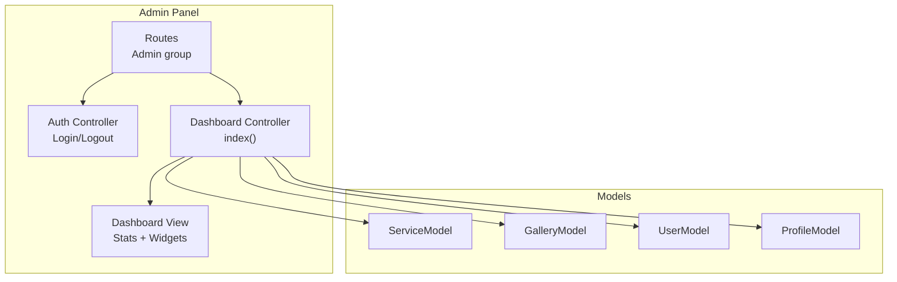
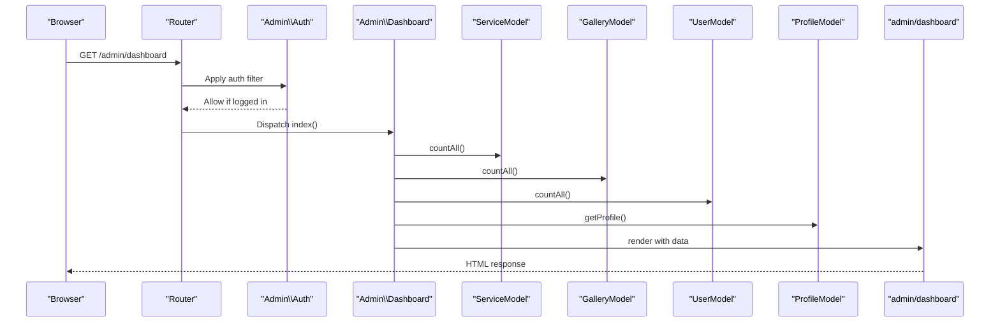
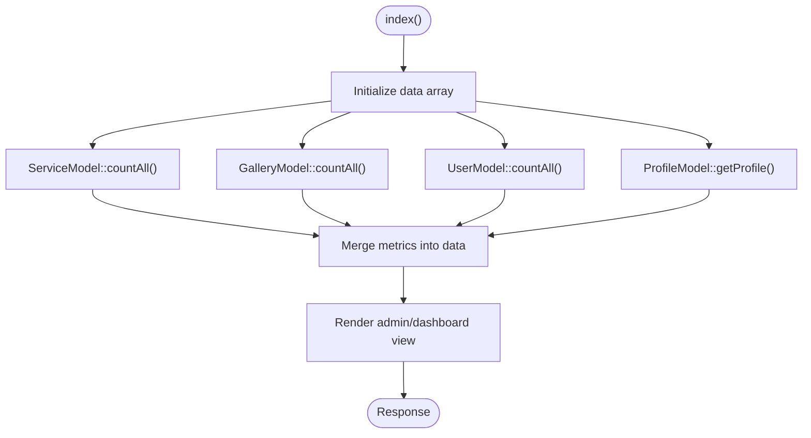
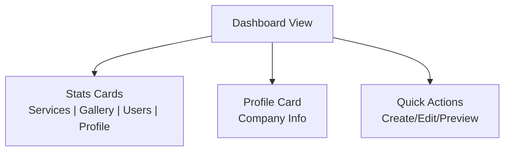
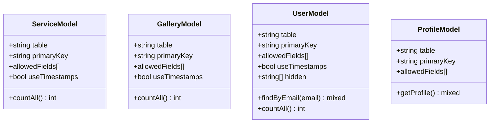
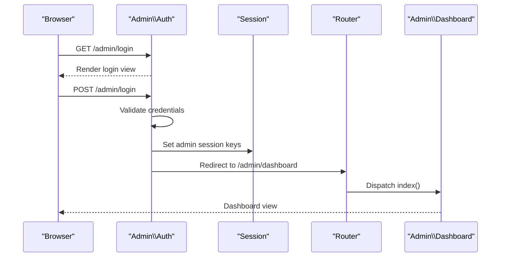
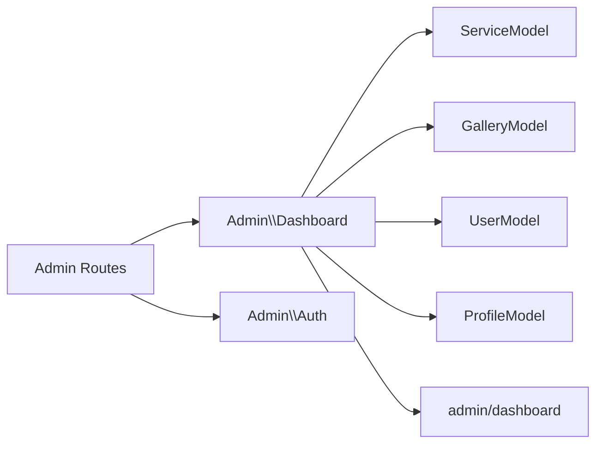
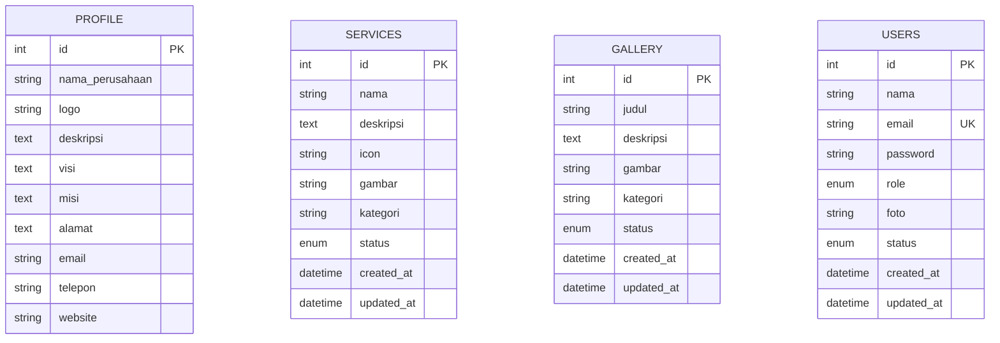

# Dashboard & Analytics

<cite>
**Referenced Files in This Document**
- [Dashboard.php](file://app/Controllers/Admin/Dashboard.php)
- [dashboard.php](file://app/Views/admin/dashboard.php)
- [BaseController.php](file://app/Controllers/BaseController.php)
- [ServiceModel.php](file://app/Models/ServiceModel.php)
- [GalleryModel.php](file://app/Models/GalleryModel.php)
- [UserModel.php](file://app/Models/UserModel.php)
- [ProfileModel.php](file://app/Models/ProfileModel.php)
- [Routes.php](file://app/Config/Routes.php)
- [Auth.php](file://app/Controllers/Admin/Auth.php)
- [2024-01-01-000001_CreateProfileTable.php](file://app/Database/Migrations/2024-01-01-000001_CreateProfileTable.php)
- [2024-01-01-000002_CreateServicesTable.php](file://app/Database/Migrations/2024-01-01-000002_CreateServicesTable.php)
- [2024-01-01-000003_CreateGalleryTable.php](file://app/Database/Migrations/2024-01-01-000003_CreateGalleryTable.php)
- [2024-01-01-000004_CreateUsersTable.php](file://app/Database/Migrations/2024-01-01-000004_CreateUsersTable.php)
</cite>

## Table of Contents
1. [Introduction](#introduction)
2. [Project Structure](#project-structure)
3. [Core Components](#core-components)
4. [Architecture Overview](#architecture-overview)
5. [Detailed Component Analysis](#detailed-component-analysis)
6. [Dependency Analysis](#dependency-analysis)
7. [Performance Considerations](#performance-considerations)
8. [Troubleshooting Guide](#troubleshooting-guide)
9. [Conclusion](#conclusion)
10. [Appendices](#appendices)

## Introduction
This document describes the administrative dashboard and analytics overview of the company profile application. It focuses on the dashboard controller implementation, data aggregation functions, and statistics display. It explains how the dashboard integrates with ServiceModel, GalleryModel, UserModel, and ProfileModel for data retrieval, details the dashboard layout and widget organization, and outlines real-time data presentation capabilities. It also covers analytics metrics calculation, data visualization components, performance indicators, customization options, data refresh mechanisms, and administrative reporting features.

## Project Structure
The dashboard is part of the admin panel and is routed under the /admin namespace. The admin routes are protected by an authentication filter. The dashboard controller fetches counts and profile data and renders a Blade-style view that organizes statistics cards, profile information, and quick action buttons.

**Diagram sources**
- [Routes.php:23-25](file://app/Config/Routes.php#L23-L25)
- [Auth.php:10-16](file://app/Controllers/Admin/Auth.php#L10-L16)
- [Dashboard.php:13-23](file://app/Controllers/Admin/Dashboard.php#L13-L23)
- [dashboard.php:1-133](file://app/Views/admin/dashboard.php#L1-L133)
- [ServiceModel.php:7-13](file://app/Models/ServiceModel.php#L7-L13)
- [GalleryModel.php:7-13](file://app/Models/GalleryModel.php#L7-L13)
- [UserModel.php:7-19](file://app/Models/UserModel.php#L7-L19)
- [ProfileModel.php:7-17](file://app/Models/ProfileModel.php#L7-L17)

**Section sources**
- [Routes.php:17-25](file://app/Config/Routes.php#L17-L25)
- [BaseController.php:12-25](file://app/Controllers/BaseController.php#L12-L25)

## Core Components
- Dashboard Controller: Orchestrates data retrieval and view rendering for the admin dashboard.
- Data Models: ServiceModel, GalleryModel, UserModel, and ProfileModel encapsulate data access for services, gallery items, users, and company profile respectively.
- Dashboard View: Renders statistics cards, profile info, and quick actions.
- Authentication and Routing: Protects admin routes and manages login/logout flows.

Key responsibilities:
- Aggregation: Count total records for services, gallery, and users; fetch current company profile.
- Presentation: Render stats widgets and profile table with quick links.
- Navigation: Provide contextual navigation to manage services, gallery, users, and profile.

**Section sources**
- [Dashboard.php:13-23](file://app/Controllers/Admin/Dashboard.php#L13-L23)
- [ServiceModel.php:7-13](file://app/Models/ServiceModel.php#L7-L13)
- [GalleryModel.php:7-13](file://app/Models/GalleryModel.php#L7-L13)
- [UserModel.php:7-19](file://app/Models/UserModel.php#L7-L19)
- [ProfileModel.php:7-17](file://app/Models/ProfileModel.php#L7-L17)
- [dashboard.php:4-130](file://app/Views/admin/dashboard.php#L4-L130)

## Architecture Overview
The dashboard follows a layered MVC pattern:
- Controller: Admin/Dashboard handles requests and prepares data.
- Model: Each model corresponds to a domain entity and exposes simple queries.
- View: Dashboard view composes widgets and renders aggregated data.
- Routing: Admin routes are grouped and filtered for authentication.

**Diagram sources**
- [Routes.php:23-25](file://app/Config/Routes.php#L23-L25)
- [Auth.php:10-16](file://app/Controllers/Admin/Auth.php#L10-L16)
- [Dashboard.php:13-23](file://app/Controllers/Admin/Dashboard.php#L13-L23)
- [ServiceModel.php:7-13](file://app/Models/ServiceModel.php#L7-L13)
- [GalleryModel.php:7-13](file://app/Models/GalleryModel.php#L7-L13)
- [UserModel.php:7-19](file://app/Models/UserModel.php#L7-L19)
- [ProfileModel.php:7-17](file://app/Models/ProfileModel.php#L7-L17)
- [dashboard.php:1-133](file://app/Views/admin/dashboard.php#L1-L133)

## Detailed Component Analysis

### Dashboard Controller
- Purpose: Build dashboard payload and render the view.
- Data aggregation:
  - Total services via ServiceModel::countAll().
  - Total gallery items via GalleryModel::countAll().
  - Total users via UserModel::countAll().
  - Company profile via ProfileModel::getProfile().
- Rendering: Passes title and aggregated metrics to the admin/dashboard view.

**Diagram sources**
- [Dashboard.php:13-23](file://app/Controllers/Admin/Dashboard.php#L13-L23)
- [ServiceModel.php:7-13](file://app/Models/ServiceModel.php#L7-L13)
- [GalleryModel.php:7-13](file://app/Models/GalleryModel.php#L7-L13)
- [UserModel.php:7-19](file://app/Models/UserModel.php#L7-L19)
- [ProfileModel.php:7-17](file://app/Models/ProfileModel.php#L7-L17)

**Section sources**
- [Dashboard.php:13-23](file://app/Controllers/Admin/Dashboard.php#L13-L23)

### Dashboard View (Widgets and Layout)
- Stats cards: Four small boxes displaying total services, gallery, users, and company profile.
- Profile info card: Displays company details retrieved from the profile model; includes a fallback message when profile is missing.
- Quick actions: Buttons to create new services, upload gallery images, add admins, and preview the website.
- Navigation: Links to manage services, gallery, users, and profile.

**Diagram sources**
- [dashboard.php:4-46](file://app/Views/admin/dashboard.php#L4-L46)
- [dashboard.php:48-92](file://app/Views/admin/dashboard.php#L48-L92)
- [dashboard.php:94-130](file://app/Views/admin/dashboard.php#L94-L130)

**Section sources**
- [dashboard.php:4-130](file://app/Views/admin/dashboard.php#L4-L130)

### Data Models and Aggregation Functions
- ServiceModel: Manages service entries with timestamps and status enumeration.
- GalleryModel: Manages gallery entries with timestamps and status enumeration.
- UserModel: Manages admin users with role and status enumerations; includes an email lookup helper.
- ProfileModel: Manages company profile with company details and contact information.

Aggregation functions used by the dashboard:
- ServiceModel::countAll(): Total number of services.
- GalleryModel::countAll(): Total number of gallery items.
- UserModel::countAll(): Total number of users.
- ProfileModel::getProfile(): Single row representing current company profile.

**Diagram sources**
- [ServiceModel.php:7-13](file://app/Models/ServiceModel.php#L7-L13)
- [GalleryModel.php:7-13](file://app/Models/GalleryModel.php#L7-L13)
- [UserModel.php:7-19](file://app/Models/UserModel.php#L7-L19)
- [ProfileModel.php:7-17](file://app/Models/ProfileModel.php#L7-L17)

**Section sources**
- [ServiceModel.php:7-13](file://app/Models/ServiceModel.php#L7-L13)
- [GalleryModel.php:7-13](file://app/Models/GalleryModel.php#L7-L13)
- [UserModel.php:7-19](file://app/Models/UserModel.php#L7-L19)
- [ProfileModel.php:7-17](file://app/Models/ProfileModel.php#L7-L17)

### Authentication and Access Control
- Login page and submission handled by Admin/Auth.
- Admin routes are protected by an auth filter applied to the admin group.
- Successful login stores user session data and redirects to the dashboard.

**Diagram sources**
- [Auth.php:10-16](file://app/Controllers/Admin/Auth.php#L10-L16)
- [Auth.php:18-42](file://app/Controllers/Admin/Auth.php#L18-L42)
- [Routes.php:23-25](file://app/Config/Routes.php#L23-L25)
- [Dashboard.php:13-23](file://app/Controllers/Admin/Dashboard.php#L13-L23)

**Section sources**
- [Auth.php:10-42](file://app/Controllers/Admin/Auth.php#L10-L42)
- [Routes.php:23-25](file://app/Config/Routes.php#L23-L25)

### Analytics Metrics and Visualization
- Current implementation displays static counts and profile details.
- Visualization: Uses small box widgets and a simple table for profile data.
- Real-time presentation: No dynamic updates are implemented; counts reflect the moment the controller executes.

Potential enhancements:
- Add chart libraries for trend visualization.
- Implement periodic refresh via AJAX for live counters.
- Introduce filters for date ranges and categories.

[No sources needed since this section provides general guidance]

### Administrative Reporting Features
- Quick action buttons enable immediate navigation to create/edit pages for services, gallery, and users.
- Profile management link allows editing company information directly from the dashboard.
- Preview button opens the frontend site in a new tab.

**Section sources**
- [dashboard.php:94-130](file://app/Views/admin/dashboard.php#L94-L130)

## Dependency Analysis
The dashboard controller depends on four models for data aggregation and on the view for rendering. The view depends on the controller’s data payload. Routing ensures access control and dispatch.

**Diagram sources**
- [Dashboard.php:13-23](file://app/Controllers/Admin/Dashboard.php#L13-L23)
- [ServiceModel.php:7-13](file://app/Models/ServiceModel.php#L7-L13)
- [GalleryModel.php:7-13](file://app/Models/GalleryModel.php#L7-L13)
- [UserModel.php:7-19](file://app/Models/UserModel.php#L7-L19)
- [ProfileModel.php:7-17](file://app/Models/ProfileModel.php#L7-L17)
- [dashboard.php:1-133](file://app/Views/admin/dashboard.php#L1-L133)
- [Routes.php:23-25](file://app/Config/Routes.php#L23-L25)
- [Auth.php:10-16](file://app/Controllers/Admin/Auth.php#L10-L16)

**Section sources**
- [Dashboard.php:13-23](file://app/Controllers/Admin/Dashboard.php#L13-L23)
- [dashboard.php:1-133](file://app/Views/admin/dashboard.php#L1-L133)
- [Routes.php:23-25](file://app/Config/Routes.php#L23-L25)

## Performance Considerations
- Query cost: Each countAll() executes a lightweight COUNT query against respective tables.
- View rendering: The dashboard view is simple and does not perform heavy computations.
- Recommendations:
  - Cache counts for frequently accessed dashboards using framework cache facilities.
  - Paginate or limit counts if datasets grow large.
  - Defer non-critical widgets to load asynchronously after initial page render.

[No sources needed since this section provides general guidance]

## Troubleshooting Guide
Common issues and resolutions:
- Missing counts: Verify that the corresponding tables exist and contain data. Confirm migrations were run.
- Empty profile section: Ensure a single profile record exists; otherwise, the view displays a prompt to fill in the profile.
- Authentication errors: Confirm login credentials and session state; ensure the auth filter is applied to admin routes.
- Route access denied: Check that the admin routes group is properly configured with the auth filter.

**Section sources**
- [2024-01-01-000001_CreateProfileTable.php:9-24](file://app/Database/Migrations/2024-01-01-000001_CreateProfileTable.php#L9-L24)
- [2024-01-01-000002_CreateServicesTable.php:9-23](file://app/Database/Migrations/2024-01-01-000002_CreateServicesTable.php#L9-L23)
- [2024-01-01-000003_CreateGalleryTable.php:9-22](file://app/Database/Migrations/2024-01-01-000003_CreateGalleryTable.php#L9-L22)
- [2024-01-01-000004_CreateUsersTable.php:9-24](file://app/Database/Migrations/2024-01-01-000004_CreateUsersTable.php#L9-L24)
- [dashboard.php:83-89](file://app/Views/admin/dashboard.php#L83-L89)
- [Auth.php:18-42](file://app/Controllers/Admin/Auth.php#L18-L42)
- [Routes.php:23-25](file://app/Config/Routes.php#L23-L25)

## Conclusion
The dashboard provides a concise overview of key content areas and enables quick navigation to administrative tasks. Its controller-driven design cleanly separates concerns, while models encapsulate straightforward data access patterns. The view presents essential metrics and profile information in an organized layout. Future enhancements can introduce caching, asynchronous refresh, and richer visualizations to improve responsiveness and insight.

[No sources needed since this section summarizes without analyzing specific files]

## Appendices

### Database Schema Overview
- Profile table: Stores company identity and contact details.
- Services table: Stores product/service entries with status and timestamps.
- Gallery table: Stores media entries with status and timestamps.
- Users table: Stores admin accounts with roles and statuses.

**Diagram sources**
- [2024-01-01-000001_CreateProfileTable.php:11-21](file://app/Database/Migrations/2024-01-01-000001_CreateProfileTable.php#L11-L21)
- [2024-01-01-000002_CreateServicesTable.php:11-20](file://app/Database/Migrations/2024-01-01-000002_CreateServicesTable.php#L11-L20)
- [2024-01-01-000003_CreateGalleryTable.php:11-19](file://app/Database/Migrations/2024-01-01-000003_CreateGalleryTable.php#L11-L19)
- [2024-01-01-000004_CreateUsersTable.php:11-20](file://app/Database/Migrations/2024-01-01-000004_CreateUsersTable.php#L11-L20)