# Architecture Overview

<cite>
**Referenced Files in This Document**
- [BaseController.php](file://app/Controllers/BaseController.php)
- [Home.php](file://app/Controllers/Home.php)
- [Dashboard.php](file://app/Controllers/Admin/Dashboard.php)
- [AuthFilter.php](file://app/Filters/AuthFilter.php)
- [Routes.php](file://app/Config/Routes.php)
- [Autoload.php](file://app/Config/Autoload.php)
- [Services.php](file://app/Config/Services.php)
- [Filters.php](file://app/Config/Filters.php)
- [ProfileModel.php](file://app/Models/ProfileModel.php)
- [UserModel.php](file://app/Models/UserModel.php)
- [dashboard.php](file://app/Views/admin/dashboard.php)
- [home.php](file://app/Views/frontend/home.php)
- [App.php](file://app/Config/App.php)
- [Security.php](file://app/Config/Security.php)
- [CodeIgniter.php](file://system/CodeIgniter.php)
</cite>

## Table of Contents
1. [Introduction](#introduction)
2. [Project Structure](#project-structure)
3. [Core Components](#core-components)
4. [Architecture Overview](#architecture-overview)
5. [Detailed Component Analysis](#detailed-component-analysis)
6. [Dependency Analysis](#dependency-analysis)
7. [Performance Considerations](#performance-considerations)
8. [Troubleshooting Guide](#troubleshooting-guide)
9. [Conclusion](#conclusion)

## Introduction
This document presents an architectural overview of the CodeIgniter 4 application. It explains the MVC implementation, directory organization, and component relationships. It documents the dual-controller approach separating frontend and admin controllers, routing configuration patterns, autoloading mechanisms, base controller inheritance, filter-based authentication, and the service container usage. It also covers system boundaries, the request-response flow, and integration points, and identifies design patterns such as Repository-like model usage, Filter pattern for security, and Template pattern in views.

## Project Structure
The application follows a layered MVC structure typical of CodeIgniter 4:
- app/Controllers: Contains frontend and admin controllers organized by namespace folders.
- app/Models: Data access classes extending the framework’s Model base class.
- app/Views: Twig-style template files grouped into frontend and admin sections.
- app/Config: Application configuration files for routes, filters, autoload, services, and security.
- app/Filters: Custom filters for cross-cutting concerns like authentication.
- system/: Core framework runtime and router.

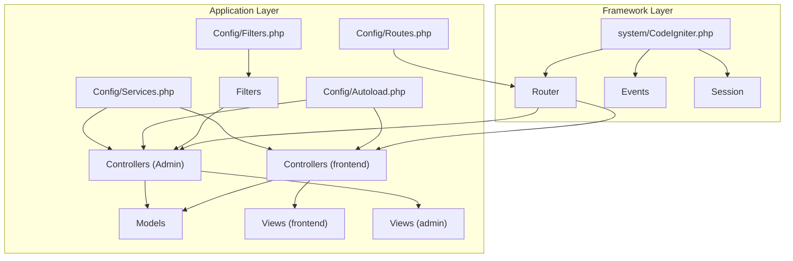

**Diagram sources**
- [Routes.php:1-55](file://app/Config/Routes.php#L1-L55)
- [Autoload.php:1-93](file://app/Config/Autoload.php#L1-L93)
- [Services.php:1-33](file://app/Config/Services.php#L1-L33)
- [Filters.php:1-31](file://app/Config/Filters.php#L1-L31)
- [CodeIgniter.php:1-200](file://system/CodeIgniter.php#L1-L200)

**Section sources**
- [Routes.php:1-55](file://app/Config/Routes.php#L1-L55)
- [Autoload.php:1-93](file://app/Config/Autoload.php#L1-L93)
- [Filters.php:1-31](file://app/Config/Filters.php#L1-L31)
- [Services.php:1-33](file://app/Config/Services.php#L1-L33)

## Core Components
- Base Controller: Provides shared initialization and helper loading for all controllers.
- Controllers:
  - Frontend controllers (e.g., Home) render public pages.
  - Admin controllers (e.g., Admin\Dashboard) manage backend operations.
- Models: Encapsulate data access and queries (Repository-like usage).
- Views: Rendered templates for frontend and admin areas.
- Filters: Apply cross-cutting concerns like authentication.
- Routing: Declares routes and groups with filters.
- Autoloading: Maps namespaces and loads helpers.
- Services: Extensible service container for framework and app services.
- Security: CSRF and request security configuration.

**Section sources**
- [BaseController.php:1-26](file://app/Controllers/BaseController.php#L1-L26)
- [Home.php:1-27](file://app/Controllers/Home.php#L1-L27)
- [Dashboard.php:1-25](file://app/Controllers/Admin/Dashboard.php#L1-L25)
- [ProfileModel.php:1-18](file://app/Models/ProfileModel.php#L1-L18)
- [UserModel.php:1-20](file://app/Models/UserModel.php#L1-L20)
- [dashboard.php:1-133](file://app/Views/admin/dashboard.php#L1-L133)
- [home.php:1-196](file://app/Views/frontend/home.php#L1-L196)
- [AuthFilter.php:1-23](file://app/Filters/AuthFilter.php#L1-L23)
- [Routes.php:1-55](file://app/Config/Routes.php#L1-L55)
- [Autoload.php:1-93](file://app/Config/Autoload.php#L1-L93)
- [Services.php:1-33](file://app/Config/Services.php#L1-L33)
- [Security.php:1-87](file://app/Config/Security.php#L1-L87)

## Architecture Overview
The system follows a classic MVC flow:
- The front controller initializes the framework and delegates to the router.
- The router resolves the incoming request to a controller method.
- The controller interacts with models for data retrieval and updates.
- The controller renders views with prepared data.
- Filters run before/after requests for cross-cutting concerns.
- The response is returned to the client.

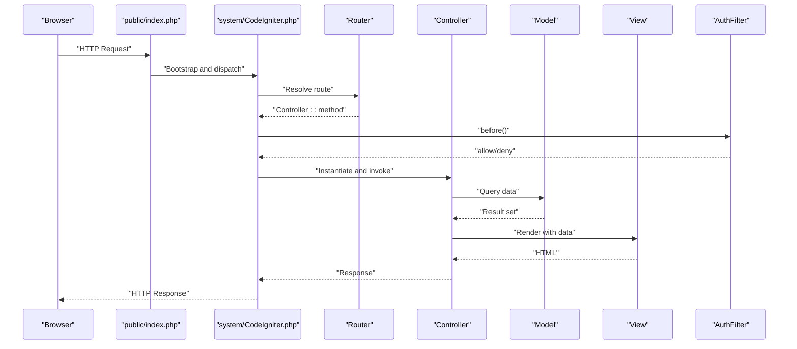

**Diagram sources**
- [CodeIgniter.php:1-200](file://system/CodeIgniter.php#L1-L200)
- [Routes.php:1-55](file://app/Config/Routes.php#L1-L55)
- [AuthFilter.php:1-23](file://app/Filters/AuthFilter.php#L1-L23)

## Detailed Component Analysis

### MVC Implementation and Dual Controller Approach
- Frontend Controllers:
  - Home controller fetches profile, services, and gallery data and renders the frontend home view.
- Admin Controllers:
  - Admin\Dashboard controller aggregates counts and profile data and renders the admin dashboard view.
- Base Controller:
  - Provides shared initialization and helper loading for all controllers.

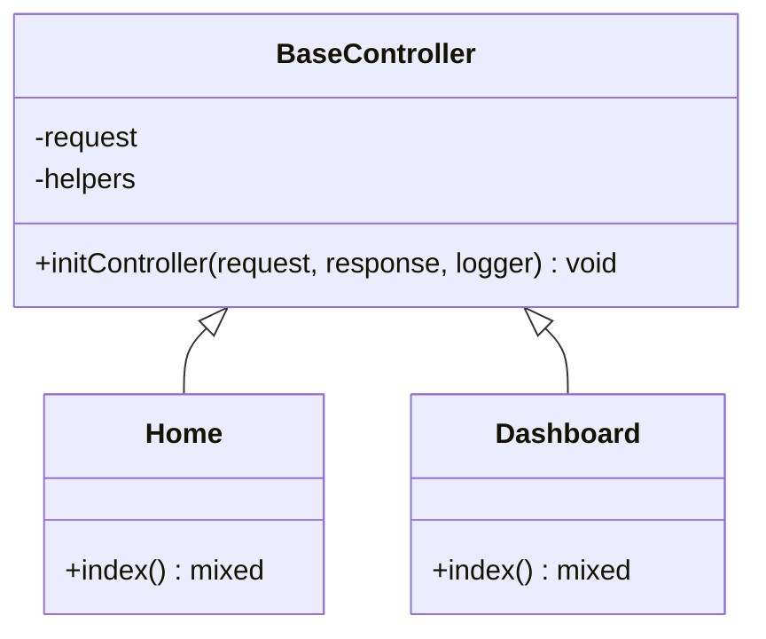

**Diagram sources**
- [BaseController.php:1-26](file://app/Controllers/BaseController.php#L1-L26)
- [Home.php:1-27](file://app/Controllers/Home.php#L1-L27)
- [Dashboard.php:1-25](file://app/Controllers/Admin/Dashboard.php#L1-L25)

**Section sources**
- [BaseController.php:1-26](file://app/Controllers/BaseController.php#L1-L26)
- [Home.php:1-27](file://app/Controllers/Home.php#L1-L27)
- [Dashboard.php:1-25](file://app/Controllers/Admin/Dashboard.php#L1-L25)

### Routing Configuration Patterns
- Frontend routes define GET endpoints for home, about, services, gallery, and contact.
- Admin authentication routes handle login, doLogin, and logout.
- Admin resource routes are grouped under an admin prefix with a filter applied to enforce authentication.
- Route placeholders capture numeric IDs for edit/update/delete actions.

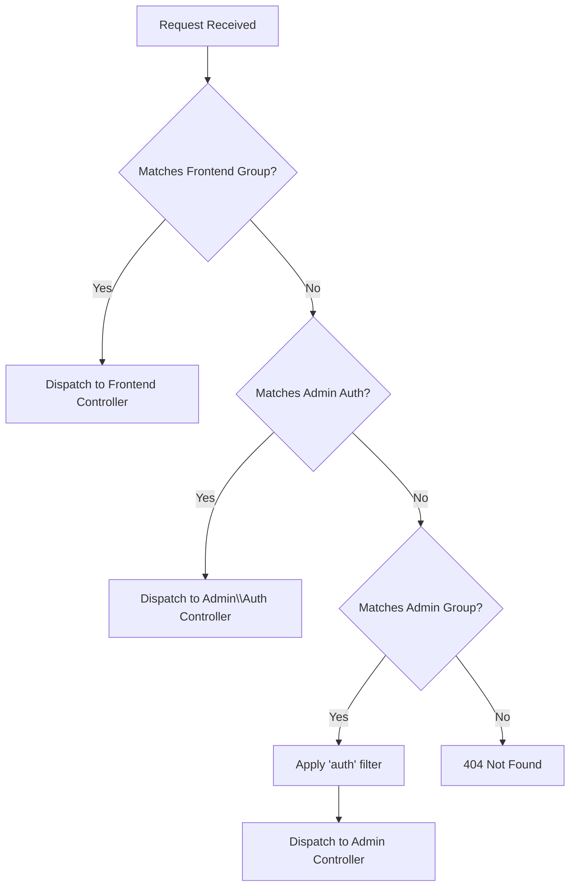

**Diagram sources**
- [Routes.php:1-55](file://app/Config/Routes.php#L1-L55)

**Section sources**
- [Routes.php:1-55](file://app/Config/Routes.php#L1-L55)

### Autoloading Mechanisms
- PSR-4 mapping registers the application namespace to the app directory.
- Helper loading is centralized in the base controller; additional helpers can be autoloaded via configuration.

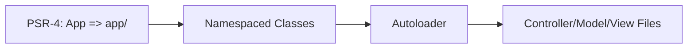

**Diagram sources**
- [Autoload.php:1-93](file://app/Config/Autoload.php#L1-L93)
- [BaseController.php:1-26](file://app/Controllers/BaseController.php#L1-L26)

**Section sources**
- [Autoload.php:1-93](file://app/Config/Autoload.php#L1-L93)
- [BaseController.php:1-26](file://app/Controllers/BaseController.php#L1-L26)

### Filter System for Authentication
- A custom AuthFilter checks session presence for admin routes.
- The filter is registered under the alias 'auth' and applied to the admin route group.
- The filter runs before the controller action executes.

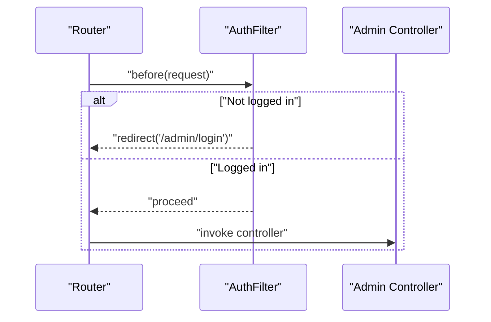

**Diagram sources**
- [AuthFilter.php:1-23](file://app/Filters/AuthFilter.php#L1-L23)
- [Filters.php:1-31](file://app/Config/Filters.php#L1-L31)
- [Routes.php:23-54](file://app/Config/Routes.php#L23-L54)

**Section sources**
- [AuthFilter.php:1-23](file://app/Filters/AuthFilter.php#L1-L23)
- [Filters.php:1-31](file://app/Config/Filters.php#L1-L31)
- [Routes.php:23-54](file://app/Config/Routes.php#L23-L54)

### Service Container Usage
- The application-level Services configuration extends the framework’s BaseService to override or register application-specific services.
- The framework’s CodeIgniter kernel integrates services during bootstrapping.

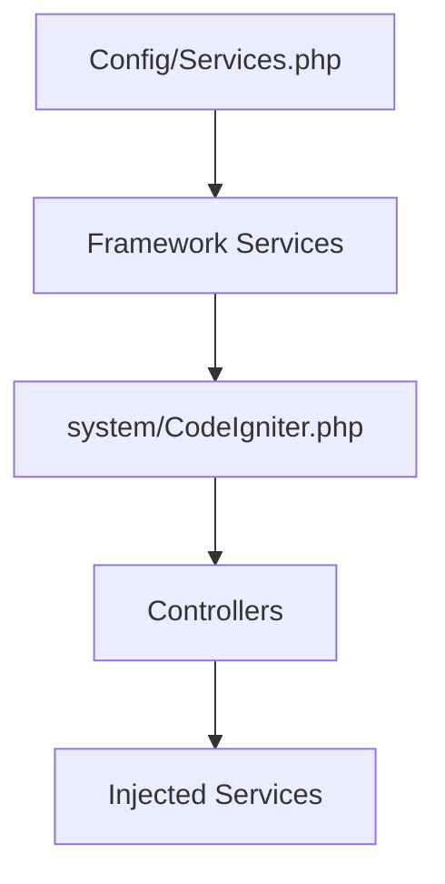

**Diagram sources**
- [Services.php:1-33](file://app/Config/Services.php#L1-L33)
- [CodeIgniter.php:1-200](file://system/CodeIgniter.php#L1-L200)

**Section sources**
- [Services.php:1-33](file://app/Config/Services.php#L1-L33)
- [CodeIgniter.php:1-200](file://system/CodeIgniter.php#L1-L200)

### Data Access and Repository Pattern
- Models encapsulate table metadata and query methods, acting as repositories for domain data.
- Example methods include fetching a single record and lookup by field.

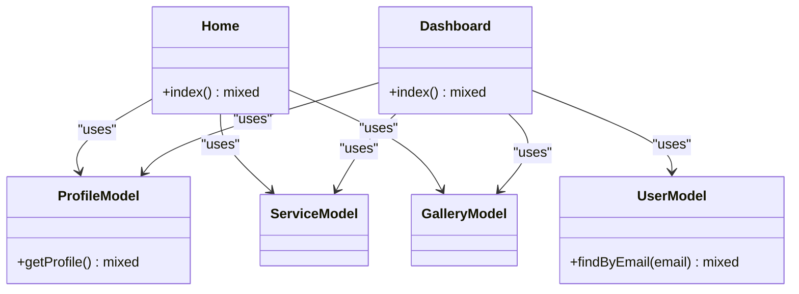

**Diagram sources**
- [ProfileModel.php:1-18](file://app/Models/ProfileModel.php#L1-L18)
- [UserModel.php:1-20](file://app/Models/UserModel.php#L1-L20)
- [Home.php:1-27](file://app/Controllers/Home.php#L1-L27)
- [Dashboard.php:1-25](file://app/Controllers/Admin/Dashboard.php#L1-L25)

**Section sources**
- [ProfileModel.php:1-18](file://app/Models/ProfileModel.php#L1-L18)
- [UserModel.php:1-20](file://app/Models/UserModel.php#L1-L20)
- [Home.php:1-27](file://app/Controllers/Home.php#L1-L27)
- [Dashboard.php:1-25](file://app/Controllers/Admin/Dashboard.php#L1-L25)

### Views and Template Pattern
- Views use a template composition pattern with sections and layouts.
- Admin dashboard extends a main layout and injects content sections.
- Frontend home composes header and footer partials.

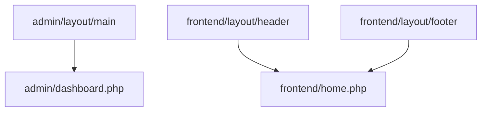

**Diagram sources**
- [dashboard.php:1-133](file://app/Views/admin/dashboard.php#L1-L133)
- [home.php:1-196](file://app/Views/frontend/home.php#L1-L196)

**Section sources**
- [dashboard.php:1-133](file://app/Views/admin/dashboard.php#L1-L133)
- [home.php:1-196](file://app/Views/frontend/home.php#L1-L196)

### Security and CSRF
- Security configuration controls CSRF protection method, token names, cookie settings, and redirection behavior.
- Global filters include CSRF, Honeypot, and others; the custom 'auth' filter is applied to admin routes.

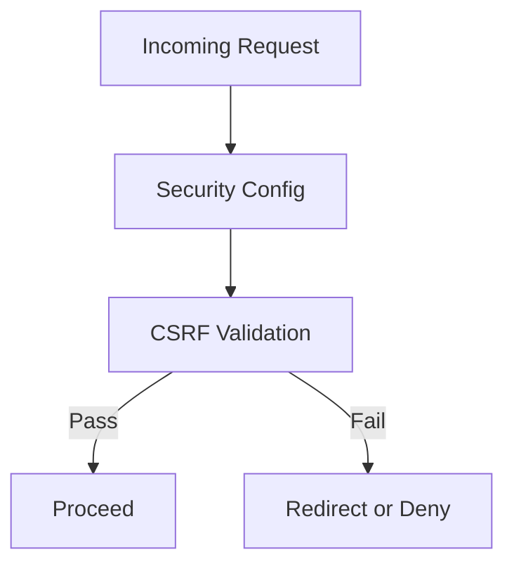

**Diagram sources**
- [Security.php:1-87](file://app/Config/Security.php#L1-L87)
- [Filters.php:1-31](file://app/Config/Filters.php#L1-L31)

**Section sources**
- [Security.php:1-87](file://app/Config/Security.php#L1-L87)
- [Filters.php:1-31](file://app/Config/Filters.php#L1-L31)

## Dependency Analysis
- Controllers depend on Models for data access and on Views for rendering.
- Admin controllers depend on the AuthFilter for access control.
- Routing depends on the route collection to resolve controllers and methods.
- Autoloading depends on PSR-4 mapping for namespace resolution.
- Services integrate with the framework’s service container.

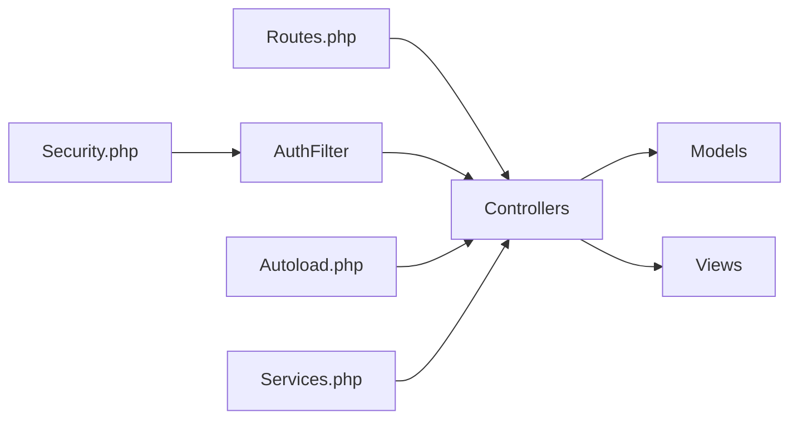

**Diagram sources**
- [Routes.php:1-55](file://app/Config/Routes.php#L1-L55)
- [Autoload.php:1-93](file://app/Config/Autoload.php#L1-L93)
- [Services.php:1-33](file://app/Config/Services.php#L1-L33)
- [AuthFilter.php:1-23](file://app/Filters/AuthFilter.php#L1-L23)
- [Security.php:1-87](file://app/Config/Security.php#L1-L87)

**Section sources**
- [Routes.php:1-55](file://app/Config/Routes.php#L1-L55)
- [Autoload.php:1-93](file://app/Config/Autoload.php#L1-L93)
- [Services.php:1-33](file://app/Config/Services.php#L1-L33)
- [AuthFilter.php:1-23](file://app/Filters/AuthFilter.php#L1-L23)
- [Security.php:1-87](file://app/Config/Security.php#L1-L87)

## Performance Considerations
- Minimize heavy queries inside controllers; offload to models and use pagination where appropriate.
- Use caching strategies for frequently accessed data.
- Keep view logic minimal; pass preprocessed data to reduce rendering overhead.
- Limit the number of helpers loaded globally to reduce bootstrap overhead.

## Troubleshooting Guide
- Authentication failures: Verify session keys and filter registration for admin routes.
- Routing issues: Confirm route patterns and group filters; ensure correct controller namespaces.
- Autoloading problems: Validate PSR-4 mappings and class file locations.
- CSRF errors: Check token configuration and ensure forms include tokens.

**Section sources**
- [AuthFilter.php:1-23](file://app/Filters/AuthFilter.php#L1-L23)
- [Routes.php:1-55](file://app/Config/Routes.php#L1-L55)
- [Autoload.php:1-93](file://app/Config/Autoload.php#L1-L93)
- [Security.php:1-87](file://app/Config/Security.php#L1-L87)

## Conclusion
The application employs a clean MVC architecture with a clear separation between frontend and admin concerns. Routing groups and filters enforce access control for admin endpoints, while models encapsulate data access. The base controller centralizes common functionality, and the service container supports extensibility. Views leverage a template pattern for consistent layouts. Together, these components deliver a maintainable and scalable structure aligned with CodeIgniter 4 best practices.