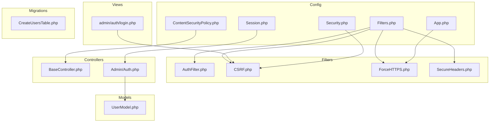
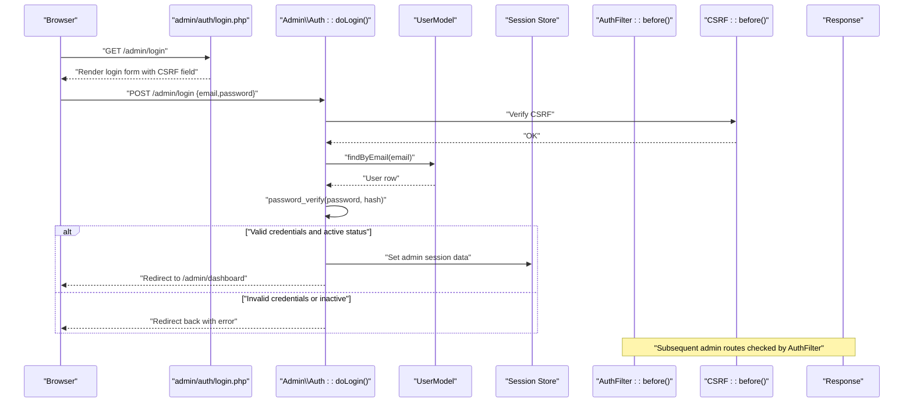
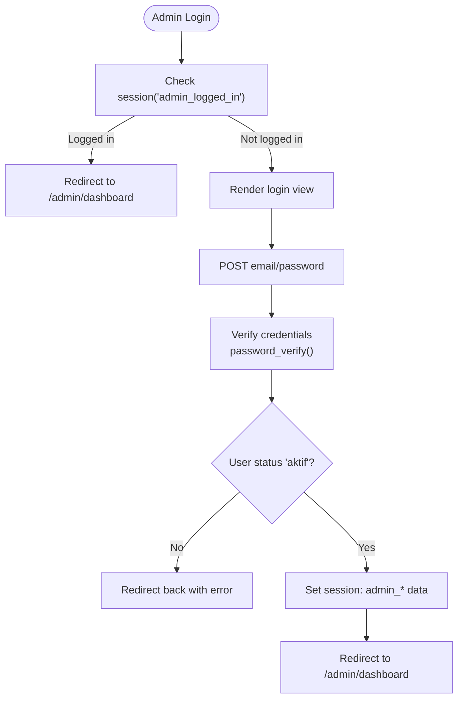
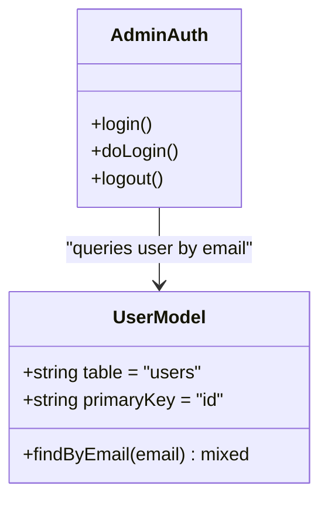
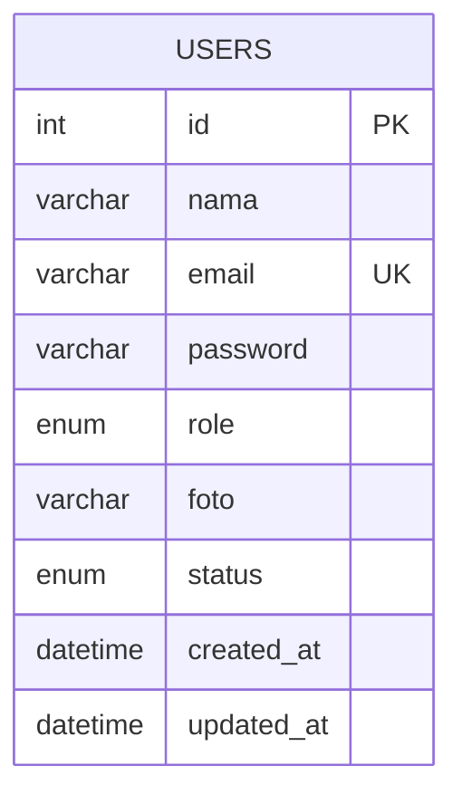
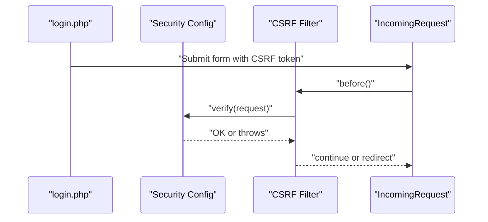
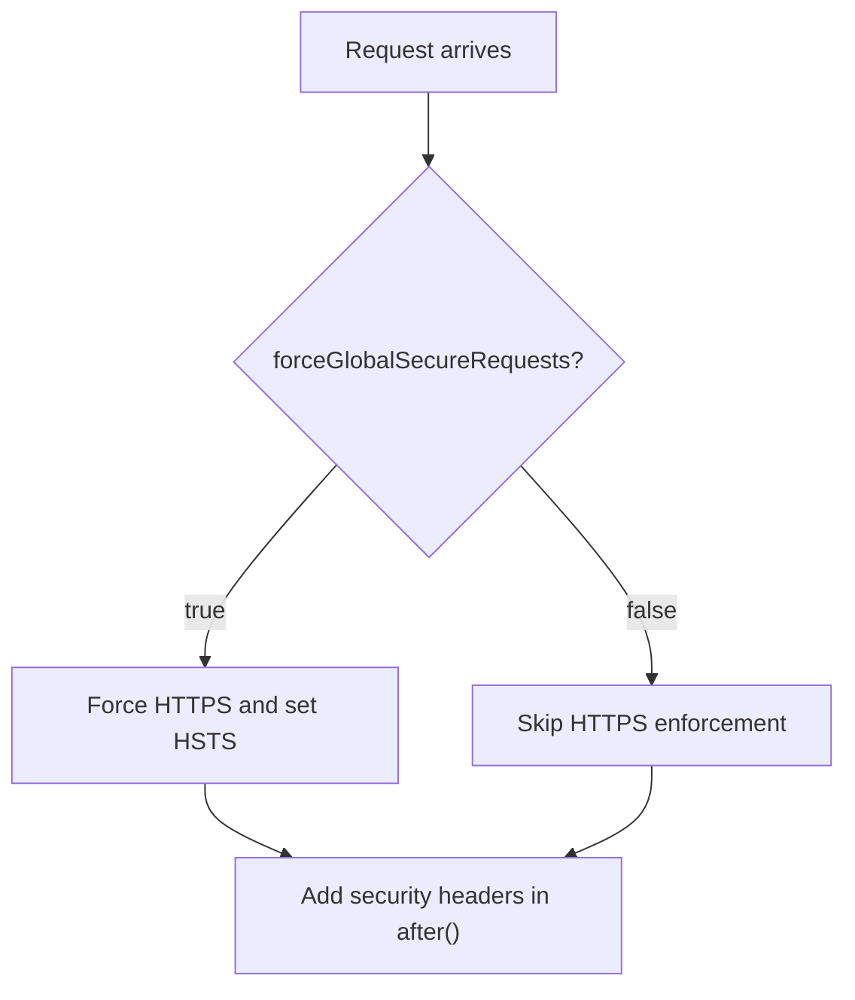
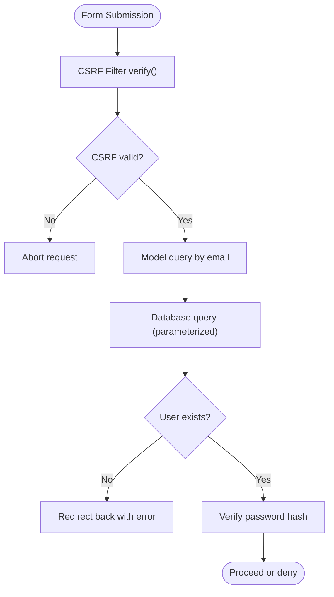
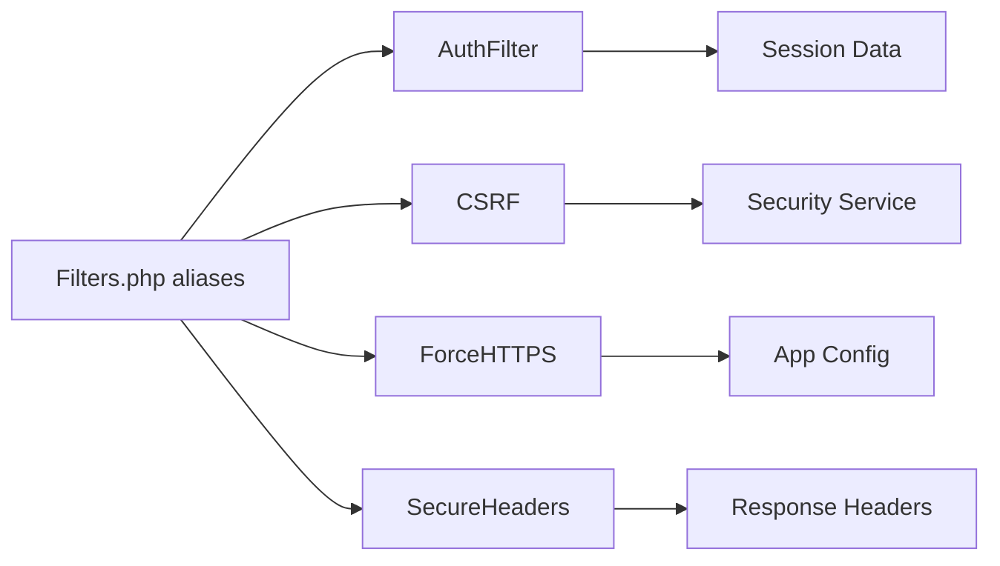

# Authentication & Security

<cite>
**Referenced Files in This Document**
- [Security.php](file://app/Config/Security.php)
- [Session.php](file://app/Config/Session.php)
- [Filters.php](file://app/Config/Filters.php)
- [App.php](file://app/Config/App.php)
- [ContentSecurityPolicy.php](file://app/Config/ContentSecurityPolicy.php)
- [AuthFilter.php](file://app/Filters/AuthFilter.php)
- [Auth.php](file://app/Controllers/Admin/Auth.php)
- [BaseController.php](file://app/Controllers/BaseController.php)
- [UserModel.php](file://app/Models/UserModel.php)
- [2024-01-01-000004_CreateUsersTable.php](file://app/Database/Migrations/2024-01-01-000004_CreateUsersTable.php)
- [login.php](file://app/Views/admin/auth/login.php)
- [CSRF.php](file://system/Filters/CSRF.php)
- [ForceHTTPS.php](file://system/Filters/ForceHTTPS.php)
- [SecureHeaders.php](file://system/Filters/SecureHeaders.php)
</cite>

## Table of Contents
1. [Introduction](#introduction)
2. [Project Structure](#project-structure)
3. [Core Components](#core-components)
4. [Architecture Overview](#architecture-overview)
5. [Detailed Component Analysis](#detailed-component-analysis)
6. [Dependency Analysis](#dependency-analysis)
7. [Performance Considerations](#performance-considerations)
8. [Troubleshooting Guide](#troubleshooting-guide)
9. [Conclusion](#conclusion)

## Introduction
This document explains the authentication and security system of the application. It covers session-based authentication, password hashing, CSRF protection, HTTPS enforcement, security headers, input validation, SQL injection prevention, and audit logging practices. It also details the AuthFilter implementation, route protection, and middleware integration, along with user roles and permission hierarchies.

## Project Structure
The security subsystem spans configuration, filters, controllers, models, views, and migrations:
- Configuration: Security, Session, Filters, App, ContentSecurityPolicy
- Filters: AuthFilter, CSRF, ForceHTTPS, SecureHeaders
- Controllers: Admin\Auth (login/logout), BaseController
- Models: UserModel
- Views: Admin login page with CSRF field
- Migrations: CreateUsersTable (roles and status)

**Diagram sources**
- [Security.php:1-87](file://app/Config/Security.php#L1-L87)
- [Session.php:1-129](file://app/Config/Session.php#L1-L129)
- [Filters.php:1-31](file://app/Config/Filters.php#L1-L31)
- [App.php:1-203](file://app/Config/App.php#L1-L203)
- [ContentSecurityPolicy.php:1-217](file://app/Config/ContentSecurityPolicy.php#L1-L217)
- [AuthFilter.php:1-23](file://app/Filters/AuthFilter.php#L1-L23)
- [CSRF.php:1-74](file://system/Filters/CSRF.php#L1-L74)
- [ForceHTTPS.php:1-66](file://system/Filters/ForceHTTPS.php#L1-L66)
- [SecureHeaders.php:1-75](file://system/Filters/SecureHeaders.php#L1-L75)
- [BaseController.php:1-26](file://app/Controllers/BaseController.php#L1-L26)
- [Auth.php:1-50](file://app/Controllers/Admin/Auth.php#L1-L50)
- [UserModel.php:1-20](file://app/Models/UserModel.php#L1-L20)
- [2024-01-01-000004_CreateUsersTable.php:1-32](file://app/Database/Migrations/2024-01-01-000004_CreateUsersTable.php#L1-L32)
- [login.php:1-157](file://app/Views/admin/auth/login.php#L1-L157)

**Section sources**
- [Security.php:1-87](file://app/Config/Security.php#L1-L87)
- [Session.php:1-129](file://app/Config/Session.php#L1-L129)
- [Filters.php:1-31](file://app/Config/Filters.php#L1-L31)
- [App.php:1-203](file://app/Config/App.php#L1-L203)
- [ContentSecurityPolicy.php:1-217](file://app/Config/ContentSecurityPolicy.php#L1-L217)
- [AuthFilter.php:1-23](file://app/Filters/AuthFilter.php#L1-L23)
- [CSRF.php:1-74](file://system/Filters/CSRF.php#L1-L74)
- [ForceHTTPS.php:1-66](file://system/Filters/ForceHTTPS.php#L1-L66)
- [SecureHeaders.php:1-75](file://system/Filters/SecureHeaders.php#L1-L75)
- [BaseController.php:1-26](file://app/Controllers/BaseController.php#L1-L26)
- [Auth.php:1-50](file://app/Controllers/Admin/Auth.php#L1-L50)
- [UserModel.php:1-20](file://app/Models/UserModel.php#L1-L20)
- [2024-01-01-000004_CreateUsersTable.php:1-32](file://app/Database/Migrations/2024-01-01-000004_CreateUsersTable.php#L1-L32)
- [login.php:1-157](file://app/Views/admin/auth/login.php#L1-L157)

## Core Components
- Session-based authentication: Admin login sets session flags and user metadata upon successful password verification.
- Password hashing: Passwords are verified using a verified hashing function.
- CSRF protection: Enabled via configuration and filter; form includes CSRF field.
- HTTPS enforcement: Optional global enforcement via filter.
- Security headers: Standard headers added by filter after response.
- Input validation: Basic HTML5 validation on login form; CSRF filter validates tokens.
- SQL injection prevention: Model uses active record pattern with parameterized queries.
- Roles and permissions: ENUM role column supports superadmin and admin; AuthFilter guards admin routes.

**Section sources**
- [Auth.php:18-48](file://app/Controllers/Admin/Auth.php#L18-L48)
- [UserModel.php:15-18](file://app/Models/UserModel.php#L15-L18)
- [Security.php:18-85](file://app/Config/Security.php#L18-L85)
- [login.php:111-112](file://app/Views/admin/auth/login.php#L111-L112)
- [App.php:155-160](file://app/Config/App.php#L155-L160)
- [ForceHTTPS.php:37-53](file://system/Filters/ForceHTTPS.php#L37-L53)
- [SecureHeaders.php:29-49](file://system/Filters/SecureHeaders.php#L29-L49)
- [CSRF.php:42-62](file://system/Filters/CSRF.php#L42-L62)
- [2024-01-01-000004_CreateUsersTable.php:16-18](file://app/Database/Migrations/2024-01-01-000004_CreateUsersTable.php#L16-L18)

## Architecture Overview
The authentication flow integrates controller actions, model queries, session management, and middleware filters.

**Diagram sources**
- [login.php:111-112](file://app/Views/admin/auth/login.php#L111-L112)
- [Auth.php:18-48](file://app/Controllers/Admin/Auth.php#L18-L48)
- [UserModel.php:15-18](file://app/Models/UserModel.php#L15-L18)
- [CSRF.php:42-62](file://system/Filters/CSRF.php#L42-L62)
- [AuthFilter.php:11-16](file://app/Filters/AuthFilter.php#L11-L16)

## Detailed Component Analysis

### Session-Based Authentication
- Login controller checks credentials and sets session keys including role and status.
- Logout destroys the session and redirects to login.
- AuthFilter checks a session flag to protect admin routes.

**Diagram sources**
- [Auth.php:10-48](file://app/Controllers/Admin/Auth.php#L10-L48)
- [login.php:111-112](file://app/Views/admin/auth/login.php#L111-L112)

**Section sources**
- [Auth.php:10-48](file://app/Controllers/Admin/Auth.php#L10-L48)
- [AuthFilter.php:11-16](file://app/Filters/AuthFilter.php#L11-L16)
- [login.php:111-112](file://app/Views/admin/auth/login.php#L111-L112)

### Password Hashing Mechanisms
- Passwords are stored as hashes; verification uses a verified hashing function during login.
- Model hides the password field from serialization.

**Diagram sources**
- [UserModel.php:7-18](file://app/Models/UserModel.php#L7-L18)
- [Auth.php:18-48](file://app/Controllers/Admin/Auth.php#L18-L48)

**Section sources**
- [UserModel.php:11-13](file://app/Models/UserModel.php#L11-L13)
- [Auth.php:26-29](file://app/Controllers/Admin/Auth.php#L26-L29)

### Access Control Patterns and Roles
- Role column supports superadmin and admin.
- AuthFilter protects admin routes by checking session flag.
- No explicit permission matrix is implemented; role can be used to gate features in controllers.

**Diagram sources**
- [2024-01-01-000004_CreateUsersTable.php:11-24](file://app/Database/Migrations/2024-01-01-000004_CreateUsersTable.php#L11-L24)

**Section sources**
- [2024-01-01-000004_CreateUsersTable.php:16-18](file://app/Database/Migrations/2024-01-01-000004_CreateUsersTable.php#L16-L18)
- [AuthFilter.php:11-16](file://app/Filters/AuthFilter.php#L11-L16)
- [Auth.php:30-37](file://app/Controllers/Admin/Auth.php#L30-L37)

### CSRF Protection
- Enabled via configuration and enforced by CSRF filter.
- Forms include CSRF field generated by helper.
- On failure, filter redirects back with error when configured to redirect.

**Diagram sources**
- [login.php:111-112](file://app/Views/admin/auth/login.php#L111-L112)
- [Security.php:18-85](file://app/Config/Security.php#L18-L85)
- [CSRF.php:42-62](file://system/Filters/CSRF.php#L42-L62)

**Section sources**
- [Security.php:18-85](file://app/Config/Security.php#L18-L85)
- [login.php:111-112](file://app/Views/admin/auth/login.php#L111-L112)
- [CSRF.php:42-62](file://system/Filters/CSRF.php#L42-L62)

### HTTPS Enforcement and Security Headers
- HTTPS enforcement can be globally forced via configuration and enforced by filter.
- Security headers are added to responses by filter.

**Diagram sources**
- [App.php:155-160](file://app/Config/App.php#L155-L160)
- [ForceHTTPS.php:37-53](file://system/Filters/ForceHTTPS.php#L37-L53)
- [SecureHeaders.php:66-73](file://system/Filters/SecureHeaders.php#L66-L73)

**Section sources**
- [App.php:155-160](file://app/Config/App.php#L155-L160)
- [ForceHTTPS.php:37-53](file://system/Filters/ForceHTTPS.php#L37-L53)
- [SecureHeaders.php:29-49](file://system/Filters/SecureHeaders.php#L29-L49)

### Input Validation and SQL Injection Prevention
- HTML5 input types and required attributes on login form.
- CSRF filter validates tokens.
- Model uses active record pattern; queries are parameterized by default.

**Diagram sources**
- [login.php:117-124](file://app/Views/admin/auth/login.php#L117-L124)
- [CSRF.php:52-59](file://system/Filters/CSRF.php#L52-L59)
- [UserModel.php:15-18](file://app/Models/UserModel.php#L15-L18)
- [Auth.php:24-29](file://app/Controllers/Admin/Auth.php#L24-L29)

**Section sources**
- [login.php:117-124](file://app/Views/admin/auth/login.php#L117-L124)
- [CSRF.php:52-59](file://system/Filters/CSRF.php#L52-L59)
- [UserModel.php:15-18](file://app/Models/UserModel.php#L15-L18)
- [Auth.php:24-29](file://app/Controllers/Admin/Auth.php#L24-L29)

### Audit Logging for Security Events
- No dedicated security audit logger is configured in the examined files.
- Recommended practice: log authentication attempts, failed logins, role changes, and privileged actions to a structured log file with timestamps and user identifiers.

[No sources needed since this section provides general guidance]

## Dependency Analysis
- Filters aliasing ties middleware to named filters.
- AuthFilter depends on session state.
- CSRF filter depends on Security service and configuration.
- ForceHTTPS depends on App configuration.
- SecureHeaders modifies response headers after routing.

**Diagram sources**
- [Filters.php:14-21](file://app/Config/Filters.php#L14-L21)
- [AuthFilter.php:11-16](file://app/Filters/AuthFilter.php#L11-L16)
- [CSRF.php:48-52](file://system/Filters/CSRF.php#L48-L52)
- [ForceHTTPS.php:39-48](file://system/Filters/ForceHTTPS.php#L39-L48)
- [SecureHeaders.php:66-73](file://system/Filters/SecureHeaders.php#L66-L73)

**Section sources**
- [Filters.php:14-21](file://app/Config/Filters.php#L14-L21)
- [AuthFilter.php:11-16](file://app/Filters/AuthFilter.php#L11-L16)
- [CSRF.php:48-52](file://system/Filters/CSRF.php#L48-L52)
- [ForceHTTPS.php:39-48](file://system/Filters/ForceHTTPS.php#L39-L48)
- [SecureHeaders.php:66-73](file://system/Filters/SecureHeaders.php#L66-L73)

## Performance Considerations
- Session expiration and regeneration intervals should balance security and user experience.
- CSRF token regeneration on every submission adds overhead; evaluate trade-offs against security requirements.
- Keep CSP directives minimal to reduce parsing overhead while maintaining safety.

[No sources needed since this section provides general guidance]

## Troubleshooting Guide
- CSRF failures: Ensure forms include CSRF field and cookies are accepted. Review redirect behavior on failure.
- HTTPS redirection loops: Confirm proxy settings and trusted proxy configuration if behind load balancers.
- Session not persisting: Verify session save path and driver configuration.
- Login still fails: Confirm password hash matches stored hash and user status is active.

**Section sources**
- [login.php:111-112](file://app/Views/admin/auth/login.php#L111-L112)
- [CSRF.php:52-59](file://system/Filters/CSRF.php#L52-L59)
- [App.php:175-183](file://app/Config/App.php#L175-L183)
- [Session.php:61-61](file://app/Config/Session.php#L61-L61)
- [Auth.php:27-29](file://app/Controllers/Admin/Auth.php#L27-L29)

## Conclusion
The application implements a straightforward session-based admin authentication with CSRF protection, optional HTTPS enforcement, and standard security headers. Passwords are hashed and verified securely, and SQL injection is mitigated through parameterized queries. To strengthen the system, consider adding role-based authorization checks, centralized audit logging, and stricter CSP policies tailored to assets and CDN usage.