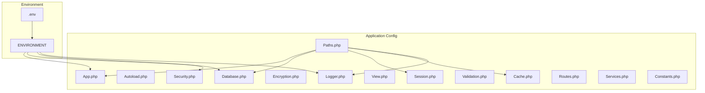
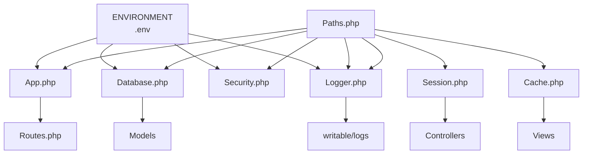
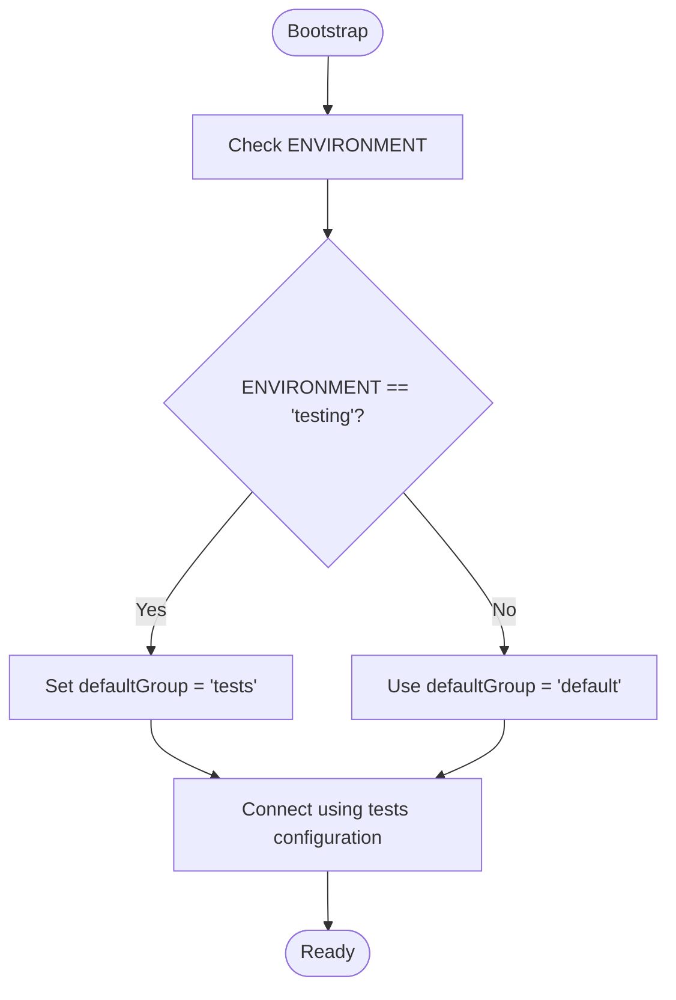
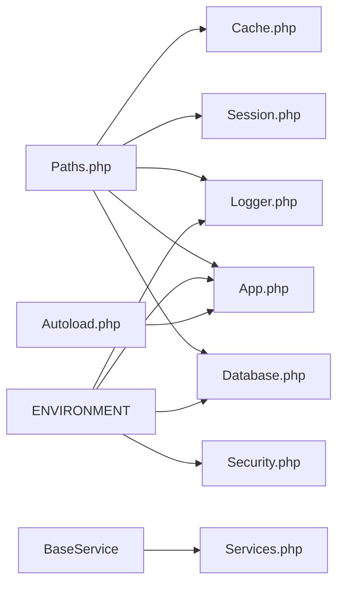

# Configuration Management

<cite>
**Referenced Files in This Document**
- [App.php](file://app/Config/App.php)
- [Paths.php](file://app/Config/Paths.php)
- [Autoload.php](file://app/Config/Autoload.php)
- [Database.php](file://app/Config/Database.php)
- [Session.php](file://app/Config/Session.php)
- [Encryption.php](file://app/Config/Encryption.php)
- [Logger.php](file://app/Config/Logger.php)
- [View.php](file://app/Config/View.php)
- [Cache.php](file://app/Config/Cache.php)
- [Validation.php](file://app/Config/Validation.php)
- [Security.php](file://app/Config/Security.php)
- [Routes.php](file://app/Config/Routes.php)
- [Services.php](file://app/Config/Services.php)
- [Constants.php](file://app/Config/Constants.php)
</cite>

## Table of Contents
1. [Introduction](#introduction)
2. [Project Structure](#project-structure)
3. [Core Components](#core-components)
4. [Architecture Overview](#architecture-overview)
5. [Detailed Component Analysis](#detailed-component-analysis)
6. [Dependency Analysis](#dependency-analysis)
7. [Performance Considerations](#performance-considerations)
8. [Troubleshooting Guide](#troubleshooting-guide)
9. [Conclusion](#conclusion)
10. [Appendices](#appendices)

## Introduction
This document explains the configuration management system across the application. It covers environment-based configuration, .env usage, sensitive data handling, application settings, database connections, session configuration, validation rules, view configuration, caching settings, logging preferences, environment-specific behaviors, deployment considerations, configuration validation, security considerations for configuration files, backup strategies, and configuration versioning.

## Project Structure
The application’s configuration is primarily defined in the app/Config directory, with environment-specific behavior controlled by environment variables and the .env file. Paths and autoload configuration define how the framework locates directories and loads classes. Routes define URL-to-controller mappings.

**Diagram sources**
- [App.php](file://app/Config/App.php)
- [Paths.php](file://app/Config/Paths.php)
- [Autoload.php](file://app/Config/Autoload.php)
- [Database.php](file://app/Config/Database.php)
- [Session.php](file://app/Config/Session.php)
- [Encryption.php](file://app/Config/Encryption.php)
- [Logger.php](file://app/Config/Logger.php)
- [View.php](file://app/Config/View.php)
- [Cache.php](file://app/Config/Cache.php)
- [Validation.php](file://app/Config/Validation.php)
- [Security.php](file://app/Config/Security.php)
- [Routes.php](file://app/Config/Routes.php)
- [Services.php](file://app/Config/Services.php)
- [Constants.php](file://app/Config/Constants.php)

**Section sources**
- [Paths.php](file://app/Config/Paths.php)
- [Autoload.php](file://app/Config/Autoload.php)
- [Routes.php](file://app/Config/Routes.php)

## Core Components
- Environment and Paths: Paths.php defines system, app, writable, tests, and view directories, and the environment directory. App.php centralizes application-wide settings like baseURL, default locale, timezone, charset, and CSP.
- Database: Database.php defines the default connection and a separate tests connection. It switches to the tests group during ENVIRONMENT === 'testing'.
- Sessions: Session.php configures driver, cookie name, expiration, save path, IP matching, regeneration behavior, and Redis lock settings.
- Encryption: Encryption.php sets the primary key, previous keys, driver, digest, cipher, and related compatibility options.
- Logging: Logger.php sets threshold based on environment, date format, and handlers (e.g., FileHandler), including permissions and path customization.
- Views: View.php controls data persistence between view calls, parser filters/plugins, decorators, and namespaced view overrides.
- Cache: Cache.php selects primary and backup handlers, key prefix, TTL, reserved characters, and driver-specific settings for file, memcached, and redis.
- Validation: Validation.php aggregates rule sets and template views for validation errors.
- Security: Security.php configures CSRF protection method, token/header names, cookie name, expiration, regeneration, and redirect behavior per environment.
- Services: Services.php is a placeholder for application-specific service overrides.
- Constants: Constants.php defines application-level constants including timing and exit status codes.

**Section sources**
- [App.php](file://app/Config/App.php)
- [Paths.php](file://app/Config/Paths.php)
- [Database.php](file://app/Config/Database.php)
- [Session.php](file://app/Config/Session.php)
- [Encryption.php](file://app/Config/Encryption.php)
- [Logger.php](file://app/Config/Logger.php)
- [View.php](file://app/Config/View.php)
- [Cache.php](file://app/Config/Cache.php)
- [Validation.php](file://app/Config/Validation.php)
- [Security.php](file://app/Config/Security.php)
- [Services.php](file://app/Config/Services.php)
- [Constants.php](file://app/Config/Constants.php)

## Architecture Overview
The configuration system integrates environment variables (.env) with PHP configuration classes. The environment variable ENVIRONMENT drives conditional behavior across App, Database, Security, and Logger configurations. Paths.php anchors directory locations, ensuring consistent resolution of app, system, writable, and environment directories.

**Diagram sources**
- [App.php](file://app/Config/App.php)
- [Paths.php](file://app/Config/Paths.php)
- [Database.php](file://app/Config/Database.php)
- [Session.php](file://app/Config/Session.php)
- [Encryption.php](file://app/Config/Encryption.php)
- [Logger.php](file://app/Config/Logger.php)
- [View.php](file://app/Config/View.php)
- [Cache.php](file://app/Config/Cache.php)
- [Validation.php](file://app/Config/Validation.php)
- [Security.php](file://app/Config/Security.php)
- [Routes.php](file://app/Config/Routes.php)

## Detailed Component Analysis

### Environment-Based Configuration and .env Usage
- The environment is determined by the ENVIRONMENT variable, commonly set in .env. This variable influences:
  - Logger threshold selection.
  - Database default group switching to tests during testing.
  - Security redirect behavior.
  - App CSPEnabled flag and other environment-sensitive toggles.
- The environment directory is defined in Paths.php, ensuring .env is loaded from a non-publicly accessible location by default.

**Section sources**
- [Logger.php](file://app/Config/Logger.php)
- [Database.php](file://app/Config/Database.php)
- [Security.php](file://app/Config/Security.php)
- [Paths.php](file://app/Config/Paths.php)

### Application Settings (App.php)
- Base URL and index page behavior.
- URI protocol selection and permitted URI characters.
- Default and supported locales, negotiation settings, and timezone.
- Charset and global secure request enforcement.
- Reverse proxy trusted IPs and Content Security Policy toggle.

**Section sources**
- [App.php](file://app/Config/App.php)

### Database Connections (Database.php)
- Default connection parameters for MySQLi, including charset, collation, strictness, and date formats.
- Tests connection optimized for SQLite3 memory database for isolated testing.
- Automatic switch to tests group when ENVIRONMENT === 'testing'.

**Diagram sources**
- [Database.php](file://app/Config/Database.php)

**Section sources**
- [Database.php](file://app/Config/Database.php)

### Session Configuration (Session.php)
- Driver selection among file, database, APCu, Memcached, and Redis.
- Cookie naming, expiration, and regeneration intervals.
- Save path for file driver and database group for database driver.
- IP matching and garbage collection behavior flags.
- Redis-specific lock retry interval and max retries.

**Section sources**
- [Session.php](file://app/Config/Session.php)

### Encryption Settings (Encryption.php)
- Primary encryption key and support for previous keys to enable key rotation.
- Driver selection (OpenSSL/Sodium) and digest algorithm.
- Cipher selection and compatibility options for legacy data.
- Block size and key info settings for specific drivers.

**Section sources**
- [Encryption.php](file://app/Config/Encryption.php)

### Logging Preferences (Logger.php)
- Threshold dynamically set based on environment (e.g., production vs development).
- Handler configuration for file logging, including permissions and optional path override.
- Date format and handler-level customization.

**Section sources**
- [Logger.php](file://app/Config/Logger.php)

### View Configuration (View.php)
- Data persistence between view calls.
- Parser filters and plugins registration.
- View decorators pipeline and namespaced view overrides directory.

**Section sources**
- [View.php](file://app/Config/View.php)

### Caching Settings (Cache.php)
- Primary and backup cache handlers selection.
- Key prefix, default TTL, and reserved characters for PSR-6 compliance.
- Driver-specific settings for file, memcached, and redis.
- Web page caching options for query string inclusion and status codes.

**Section sources**
- [Cache.php](file://app/Config/Cache.php)

### Validation Rules (Validation.php)
- Aggregated rule sets for validation: core, format, file, and credit card rules.
- Template views for list and single error displays.

**Section sources**
- [Validation.php](file://app/Config/Validation.php)

### Security Configuration (Security.php)
- CSRF protection method (cookie/session), token/header names, cookie name, and expiration.
- Regeneration behavior and redirect on failure depending on environment.

**Section sources**
- [Security.php](file://app/Config/Security.php)

### Routes Configuration (Routes.php)
- Frontend routes for home, about, services, gallery, and contact.
- Admin authentication routes and protected admin routes grouped with an auth filter.

**Section sources**
- [Routes.php](file://app/Config/Routes.php)

### Services Overrides (Services.php)
- Placeholder for registering application-specific service overrides.

**Section sources**
- [Services.php](file://app/Config/Services.php)

### Constants (Constants.php)
- Application namespace definition.
- Composer autoload path.
- Timing constants and standardized exit status codes.

**Section sources**
- [Constants.php](file://app/Config/Constants.php)

## Dependency Analysis
Configuration classes depend on:
- Paths.php for directory resolution.
- ENVIRONMENT for conditional behavior.
- Autoload.php for namespace/class discovery.
- Framework base classes (BaseConfig, BaseService) for configuration inheritance.

**Diagram sources**
- [Paths.php](file://app/Config/Paths.php)
- [App.php](file://app/Config/App.php)
- [Database.php](file://app/Config/Database.php)
- [Session.php](file://app/Config/Session.php)
- [Cache.php](file://app/Config/Cache.php)
- [Logger.php](file://app/Config/Logger.php)
- [Security.php](file://app/Config/Security.php)
- [Autoload.php](file://app/Config/Autoload.php)
- [Services.php](file://app/Config/Services.php)

**Section sources**
- [Paths.php](file://app/Config/Paths.php)
- [Autoload.php](file://app/Config/Autoload.php)

## Performance Considerations
- Choose appropriate cache handlers: file for simplicity, memcached/redis for distributed environments.
- Tune TTL and reserved characters to balance performance and correctness.
- Limit logger handlers and thresholds in production to reduce I/O overhead.
- Select a performant session handler (e.g., Redis/Memcached) for high-traffic deployments.
- Use strict validation rule sets and minimal parser filters to reduce view rendering overhead.

## Troubleshooting Guide
- Database connectivity failures:
  - Verify credentials and port in Database.php.
  - Confirm ENVIRONMENT and defaultGroup switching for tests.
- Session issues:
  - Ensure savePath exists and is writable for file driver.
  - Validate cookie domain/path and expiration settings.
- Logging not capturing expected levels:
  - Confirm threshold value and handler configuration in Logger.php.
  - Check writable/logs permissions.
- CSRF failures:
  - Align token/header names and cookie settings with frontend expectations.
  - Review redirect behavior in production.
- View rendering anomalies:
  - Check parser filters/plugins and decorator pipeline in View.php.
- Validation errors:
  - Confirm rule sets and template paths in Validation.php.

**Section sources**
- [Database.php](file://app/Config/Database.php)
- [Session.php](file://app/Config/Session.php)
- [Logger.php](file://app/Config/Logger.php)
- [Security.php](file://app/Config/Security.php)
- [View.php](file://app/Config/View.php)
- [Validation.php](file://app/Config/Validation.php)

## Conclusion
The application’s configuration system leverages environment variables and centralized PHP classes to manage application behavior, data access, sessions, encryption, logging, views, caching, validation, and security. Proper environment separation, secure handling of sensitive data, and thoughtful performance tuning are essential for reliable operation across development, staging, and production environments.

## Appendices

### Environment-Specific Behaviors
- Logger threshold adapts to environment.
- Database default group switches to tests during testing.
- Security redirect behavior depends on environment.
- App CSPEnabled toggle is configurable.

**Section sources**
- [Logger.php](file://app/Config/Logger.php)
- [Database.php](file://app/Config/Database.php)
- [Security.php](file://app/Config/Security.php)
- [App.php](file://app/Config/App.php)

### Deployment Considerations
- Ensure .env resides outside the web root and is readable only by the application process.
- Set proper permissions for writable/logs, writable/cache, and writable/session.
- Configure reverse proxy trusted IPs in App.php for accurate client IP detection.
- Validate database credentials and network accessibility for production.

**Section sources**
- [Paths.php](file://app/Config/Paths.php)
- [App.php](file://app/Config/App.php)
- [Database.php](file://app/Config/Database.php)

### Security Considerations for Configuration Files
- Restrict access to app/Config and .env directories.
- Avoid committing secrets to version control; use .env for local overrides.
- Rotate encryption keys using previousKeys and update configurations accordingly.
- Enforce HTTPS and HSTS where applicable.

**Section sources**
- [Encryption.php](file://app/Config/Encryption.php)
- [App.php](file://app/Config/App.php)

### Backup Strategies
- Back up app/Config files and .env separately from application code.
- Include database schema and seed data snapshots for reproducible environments.
- Version control app/Config templates without secrets; maintain .env locally.

**Section sources**
- [Database.php](file://app/Config/Database.php)

### Configuration Versioning
- Track configuration changes alongside application code.
- Use feature flags and environment-specific groups for gradual rollouts.
- Maintain backward-compatible defaults to minimize breaking changes.