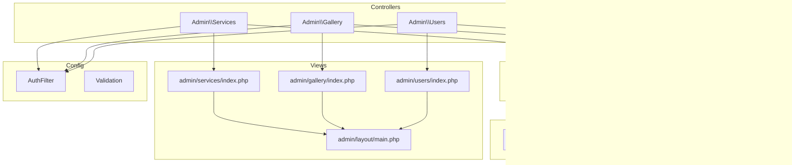
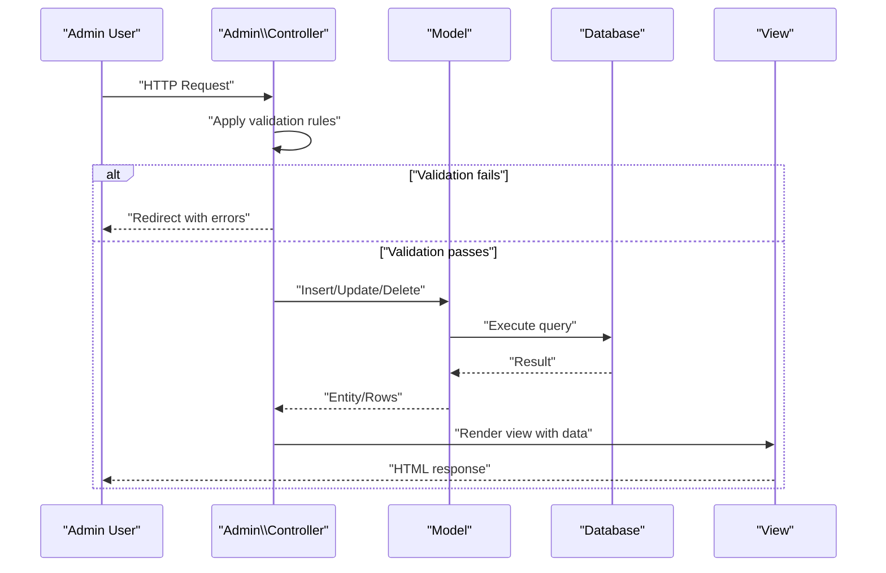
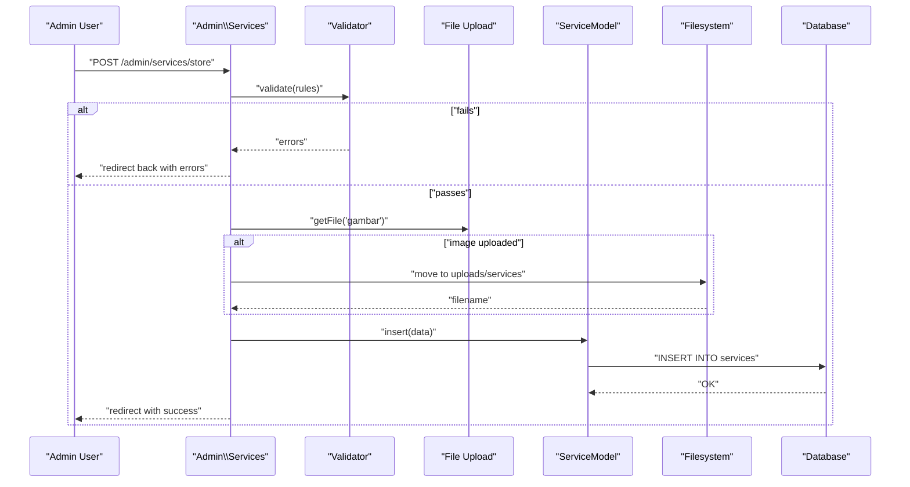
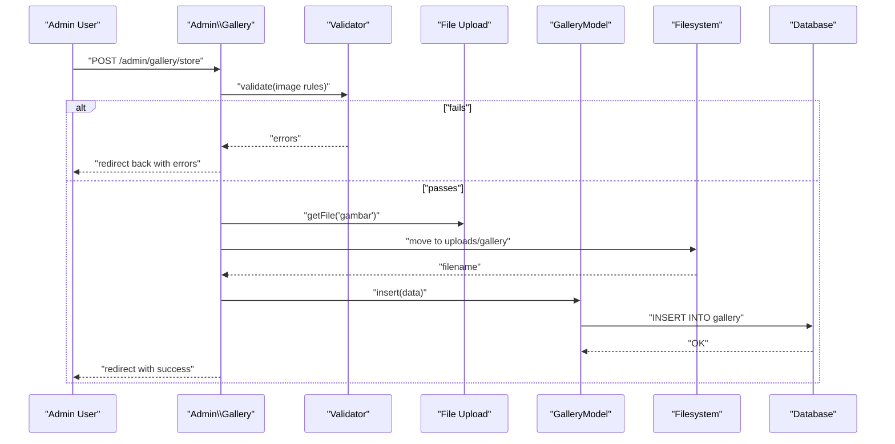
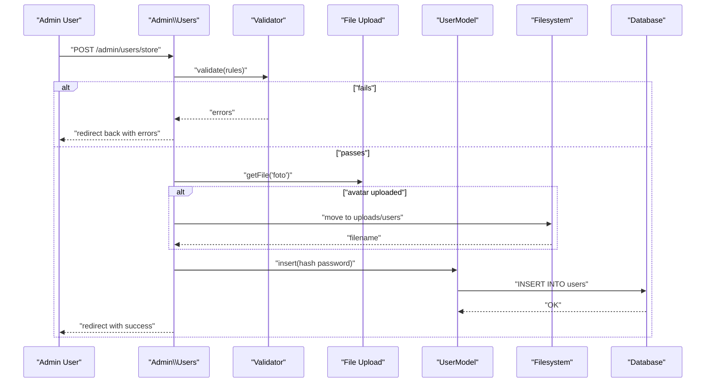
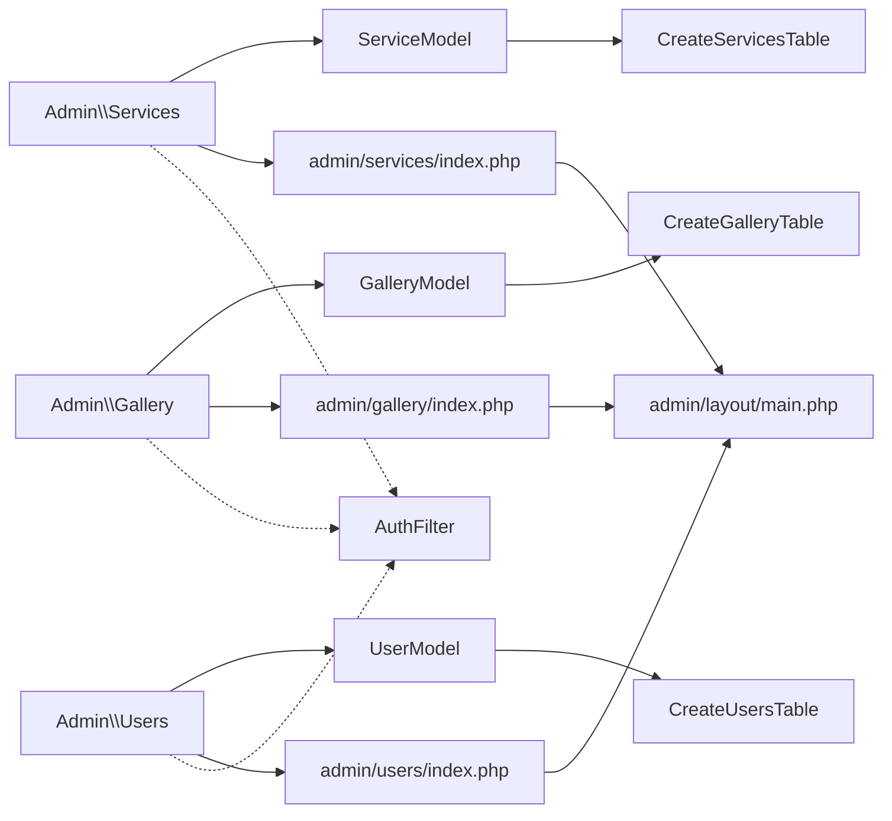

# Content Management

<cite>
**Referenced Files in This Document**
- [ServiceModel.php](file://app/Models/ServiceModel.php)
- [GalleryModel.php](file://app/Models/GalleryModel.php)
- [UserModel.php](file://app/Models/UserModel.php)
- [Services.php](file://app/Controllers/Admin/Services.php)
- [Gallery.php](file://app/Controllers/Admin/Gallery.php)
- [Users.php](file://app/Controllers/Admin/Users.php)
- [CreateServicesTable.php](file://app/Database/Migrations/2024-01-01-000002_CreateServicesTable.php)
- [CreateGalleryTable.php](file://app/Database/Migrations/2024-01-000003_CreateGalleryTable.php)
- [CreateUsersTable.php](file://app/Database/Migrations/2024-01-000004_CreateUsersTable.php)
- [index.php (Admin Services)](file://app/Views/admin/services/index.php)
- [index.php (Admin Gallery)](file://app/Views/admin/gallery/index.php)
- [index.php (Admin Users)](file://app/Views/admin/users/index.php)
- [Validation.php](file://app/Config/Validation.php)
- [AuthFilter.php](file://app/Filters/AuthFilter.php)
- [BaseController.php](file://app/Controllers/BaseController.php)
- [main.php (Admin Layout)](file://app/Views/admin/layout/main.php)
</cite>

## Table of Contents
1. [Introduction](#introduction)
2. [Project Structure](#project-structure)
3. [Core Components](#core-components)
4. [Architecture Overview](#architecture-overview)
5. [Detailed Component Analysis](#detailed-component-analysis)
6. [Dependency Analysis](#dependency-analysis)
7. [Performance Considerations](#performance-considerations)
8. [Troubleshooting Guide](#troubleshooting-guide)
9. [Conclusion](#conclusion)
10. [Appendices](#appendices)

## Introduction
This document describes the content management system for managing services, gallery images, and administrator users. It covers CRUD operations, model implementations, validation rules, database interactions, form handling, status management, categories, approval workflows, file upload handling, image processing, security validations, data sanitization, bulk operations, search functionality, pagination, export capabilities, role-based permissions, audit logging, and content scheduling features. The system is built on CodeIgniter 4 and uses AdminLTE for the administrative interface.

## Project Structure
The CMS follows a layered MVC structure:
- Controllers under app/Controllers/Admin handle HTTP requests and orchestrate responses.
- Models under app/Models encapsulate database interactions.
- Migrations under app/Database/Migrations define and evolve the schema.
- Views under app/Views/admin provide the admin UI.
- Filters and configuration manage authentication and validation behavior.

**Diagram sources**
- [Services.php:1-121](file://app/Controllers/Admin/Services.php#L1-L121)
- [Gallery.php:1-114](file://app/Controllers/Admin/Gallery.php#L1-L114)
- [Users.php:1-132](file://app/Controllers/Admin/Users.php#L1-L132)
- [ServiceModel.php:1-14](file://app/Models/ServiceModel.php#L1-L14)
- [GalleryModel.php:1-14](file://app/Models/GalleryModel.php#L1-L14)
- [UserModel.php:1-20](file://app/Models/UserModel.php#L1-L20)
- [index.php (Admin Services):1-69](file://app/Views/admin/services/index.php#L1-L69)
- [index.php (Admin Gallery):1-54](file://app/Views/admin/gallery/index.php#L1-L54)
- [index.php (Admin Users):1-81](file://app/Views/admin/users/index.php#L1-L81)
- [main.php (Admin Layout):1-198](file://app/Views/admin/layout/main.php#L1-L198)
- [CreateServicesTable.php:1-31](file://app/Database/Migrations/2024-01-01-000002_CreateServicesTable.php#L1-L31)
- [CreateGalleryTable.php:1-30](file://app/Database/Migrations/2024-01-01-000003_CreateGalleryTable.php#L1-L30)
- [CreateUsersTable.php:1-32](file://app/Database/Migrations/2024-01-01-000004_CreateUsersTable.php#L1-L32)
- [AuthFilter.php:1-23](file://app/Filters/AuthFilter.php#L1-L23)
- [Validation.php:1-45](file://app/Config/Validation.php#L1-L45)

**Section sources**
- [Services.php:1-121](file://app/Controllers/Admin/Services.php#L1-L121)
- [Gallery.php:1-114](file://app/Controllers/Admin/Gallery.php#L1-L114)
- [Users.php:1-132](file://app/Controllers/Admin/Users.php#L1-L132)
- [ServiceModel.php:1-14](file://app/Models/ServiceModel.php#L1-L14)
- [GalleryModel.php:1-14](file://app/Models/GalleryModel.php#L1-L14)
- [UserModel.php:1-20](file://app/Models/UserModel.php#L1-L20)
- [index.php (Admin Services):1-69](file://app/Views/admin/services/index.php#L1-L69)
- [index.php (Admin Gallery):1-54](file://app/Views/admin/gallery/index.php#L1-L54)
- [index.php (Admin Users):1-81](file://app/Views/admin/users/index.php#L1-L81)
- [main.php (Admin Layout):1-198](file://app/Views/admin/layout/main.php#L1-L198)
- [CreateServicesTable.php:1-31](file://app/Database/Migrations/2024-01-01-000002_CreateServicesTable.php#L1-L31)
- [CreateGalleryTable.php:1-30](file://app/Database/Migrations/2024-01-01-000003_CreateGalleryTable.php#L1-L30)
- [CreateUsersTable.php:1-32](file://app/Database/Migrations/2024-01-01-000004_CreateUsersTable.php#L1-L32)
- [AuthFilter.php:1-23](file://app/Filters/AuthFilter.php#L1-L23)
- [Validation.php:1-45](file://app/Config/Validation.php#L1-L45)

## Core Components
- Service Management
  - Model: ServiceModel defines table, primary key, allowed fields, and timestamps.
  - Controller: Admin\Services handles listing, creation, updates, deletion, and file uploads.
  - View: Admin services index displays service rows with status badges and action buttons.
  - Status: ENUM with values aktif and nonaktif; default aktif.
  - Category: kategori field supports categorization.
  - Approval: No explicit approval workflow; status toggles visibility.

- Gallery Management
  - Model: GalleryModel mirrors service structure with image storage and status.
  - Controller: Admin\Gallery manages CRUD with strict image validation.
  - View: Admin gallery grid displays thumbnails with metadata and actions.
  - Validation: uploaded, is_image, max_size rules enforced.

- User Administration
  - Model: UserModel stores roles (superadmin, admin), status, and hidden password.
  - Controller: Admin\Users manages CRUD, password hashing, and self-protection against self-deletion.
  - Role-based permissions: superadmin vs admin via role field.
  - Status: ENUM aktif/nonaktif; default aktif.

- Validation and Security
  - Validation configuration aggregates rule sets and templates.
  - Authentication filter enforces admin session presence.
  - Data sanitization: HTML escaping in views; input validated via controller rulesets.

**Section sources**
- [ServiceModel.php:1-14](file://app/Models/ServiceModel.php#L1-L14)
- [GalleryModel.php:1-14](file://app/Models/GalleryModel.php#L1-L14)
- [UserModel.php:1-20](file://app/Models/UserModel.php#L1-L20)
- [Services.php:1-121](file://app/Controllers/Admin/Services.php#L1-L121)
- [Gallery.php:1-114](file://app/Controllers/Admin/Gallery.php#L1-L114)
- [Users.php:1-132](file://app/Controllers/Admin/Users.php#L1-L132)
- [index.php (Admin Services):1-69](file://app/Views/admin/services/index.php#L1-L69)
- [index.php (Admin Gallery):1-54](file://app/Views/admin/gallery/index.php#L1-L54)
- [index.php (Admin Users):1-81](file://app/Views/admin/users/index.php#L1-L81)
- [Validation.php:1-45](file://app/Config/Validation.php#L1-L45)
- [AuthFilter.php:1-23](file://app/Filters/AuthFilter.php#L1-L23)

## Architecture Overview
The admin controllers depend on their respective models and render views within the shared admin layout. Authentication is enforced globally via a filter. Validation is centralized in configuration and applied per controller action.

**Diagram sources**
- [Services.php:31-60](file://app/Controllers/Admin/Services.php#L31-L60)
- [Gallery.php:31-56](file://app/Controllers/Admin/Gallery.php#L31-L56)
- [Users.php:31-61](file://app/Controllers/Admin/Users.php#L31-L61)
- [ServiceModel.php:1-14](file://app/Models/ServiceModel.php#L1-L14)
- [GalleryModel.php:1-14](file://app/Models/GalleryModel.php#L1-L14)
- [UserModel.php:1-20](file://app/Models/UserModel.php#L1-L20)
- [index.php (Admin Services):1-69](file://app/Views/admin/services/index.php#L1-L69)
- [index.php (Admin Gallery):1-54](file://app/Views/admin/gallery/index.php#L1-L54)
- [index.php (Admin Users):1-81](file://app/Views/admin/users/index.php#L1-L81)

## Detailed Component Analysis

### Service Management
- CRUD Operations
  - Index lists services ordered by creation date.
  - Create renders a form; Store validates required fields and optional image upload.
  - Edit loads existing record; Update validates and optionally replaces image.
  - Delete removes associated file if present and deletes the record.
- Validation Rules
  - Required fields: nama, deskripsi, kategori.
  - Optional icon and image fields; defaults applied when absent.
- Status and Categories
  - Status stored as ENUM with default aktif.
  - Category stored as VARCHAR for grouping.
- File Upload Handling
  - Uses random filename generation and moves to public/uploads/services.
  - On update, old file is deleted before replacing.
- Security and Sanitization
  - HTML escaped in views.
  - Timestamps enabled for created_at/updated_at.

**Diagram sources**
- [Services.php:31-60](file://app/Controllers/Admin/Services.php#L31-L60)
- [ServiceModel.php:1-14](file://app/Models/ServiceModel.php#L1-L14)

**Section sources**
- [Services.php:17-121](file://app/Controllers/Admin/Services.php#L17-L121)
- [ServiceModel.php:1-14](file://app/Models/ServiceModel.php#L1-L14)
- [index.php (Admin Services):1-69](file://app/Views/admin/services/index.php#L1-L69)
- [CreateServicesTable.php:9-23](file://app/Database/Migrations/2024-01-01-000002_CreateServicesTable.php#L9-L23)

### Gallery Management
- CRUD Operations
  - Index lists items in a responsive grid.
  - Store enforces image upload rules and inserts metadata.
  - Update optionally replaces image and updates status/category.
  - Delete removes associated file and record.
- Validation Rules
  - Required: judul, kategori.
  - Image: uploaded, is_image, max_size 2MB.
- Status and Categories
  - Status ENUM with default aktif.
  - Category grouping supported.
- File Upload Handling
  - Random filename generation and move to public/uploads/gallery.
  - Old file removal on update.

**Diagram sources**
- [Gallery.php:31-56](file://app/Controllers/Admin/Gallery.php#L31-L56)
- [GalleryModel.php:1-14](file://app/Models/GalleryModel.php#L1-L14)

**Section sources**
- [Gallery.php:17-114](file://app/Controllers/Admin/Gallery.php#L17-L114)
- [GalleryModel.php:1-14](file://app/Models/GalleryModel.php#L1-L14)
- [index.php (Admin Gallery):1-54](file://app/Views/admin/gallery/index.php#L1-L54)
- [CreateGalleryTable.php:9-23](file://app/Database/Migrations/2024-01-01-000003_CreateGalleryTable.php#L9-L23)

### User Administration
- CRUD Operations
  - Index lists administrators with roles and status.
  - Store validates uniqueness of email, minimum password length, and role.
  - Update optionally hashes new password; preserves existing hashed password otherwise.
  - Delete prevents self-deletion and cleans up avatar file.
- Validation Rules
  - Email: required, valid format, unique (with exclusion for updates).
  - Password: required minimum length; hashed before persisting.
  - Role: required ENUM (superadmin, admin).
- Roles and Permissions
  - superadmin has elevated privileges compared to admin.
  - Self-protection prevents accidental self-removal.
- Status and Avatar
  - Status ENUM with default aktif.
  - Avatar stored as filename; optional.

**Diagram sources**
- [Users.php:31-61](file://app/Controllers/Admin/Users.php#L31-L61)
- [UserModel.php:1-20](file://app/Models/UserModel.php#L1-L20)

**Section sources**
- [Users.php:17-132](file://app/Controllers/Admin/Users.php#L17-L132)
- [UserModel.php:1-20](file://app/Models/UserModel.php#L1-L20)
- [index.php (Admin Users):1-81](file://app/Views/admin/users/index.php#L1-L81)
- [CreateUsersTable.php:9-24](file://app/Database/Migrations/2024-01-01-000004_CreateUsersTable.php#L9-L24)

### Status Management, Categories, and Approval Workflows
- Status Management
  - ENUM fields for services and gallery default to aktif.
  - Status toggled via admin forms; reflected immediately in listings.
- Categories
  - kategori field used for grouping across services and gallery.
- Approval Workflow
  - No explicit approval steps; status controls publication.
  - Consider adding draft/pending states and publish transitions for future enhancements.

**Section sources**
- [CreateServicesTable.php:17-18](file://app/Database/Migrations/2024-01-01-000002_CreateServicesTable.php#L17-L18)
- [CreateGalleryTable.php:16-17](file://app/Database/Migrations/2024-01-01-000003_CreateGalleryTable.php#L16-L17)
- [Services.php:56-57](file://app/Controllers/Admin/Services.php#L56-L57)
- [Gallery.php:51-53](file://app/Controllers/Admin/Gallery.php#L51-L53)

### File Upload Handling and Image Processing
- Upload Handling
  - getFile retrieves uploaded file; getRandomName ensures unique filenames.
  - move writes to public/uploads/<resource> with generated names.
  - On update, old file is removed before replacing.
- Image Processing
  - Gallery enforces is_image and max_size rules.
  - No server-side image transformation implemented; thumbnails rendered client-side.
- Security
  - Uploaded file validation prevents non-image uploads where applicable.
  - Filenames randomized to avoid conflicts and preserve privacy.

**Section sources**
- [Services.php:43-48](file://app/Controllers/Admin/Services.php#L43-L48)
- [Services.php:85-94](file://app/Controllers/Admin/Services.php#L85-L94)
- [Gallery.php:33-45](file://app/Controllers/Admin/Gallery.php#L33-L45)
- [Gallery.php:80-88](file://app/Controllers/Admin/Gallery.php#L80-L88)

### Validation Rules and Data Sanitization
- Validation Rules
  - Services: required nama, deskripsi, kategori.
  - Gallery: required judul, kategori; uploaded image with size limits.
  - Users: required nama, email (unique), password min length, role.
- Data Sanitization
  - HTML escaping in views via esc().
  - Timestamps automatically managed by models.

**Section sources**
- [Services.php:33-41](file://app/Controllers/Admin/Services.php#L33-L41)
- [Gallery.php:33-41](file://app/Controllers/Admin/Gallery.php#L33-L41)
- [Users.php:33-42](file://app/Controllers/Admin/Users.php#L33-L42)
- [index.php (Admin Services):38-47](file://app/Views/admin/services/index.php#L38-L47)
- [index.php (Admin Gallery):24-29](file://app/Views/admin/gallery/index.php#L24-L29)
- [index.php (Admin Users):45-57](file://app/Views/admin/users/index.php#L45-L57)

### Bulk Operations, Search, Pagination, and Export
- Bulk Operations
  - Not implemented in current controllers; could be added via checkbox selection and batch actions.
- Search
  - No dedicated search endpoints; filtering can be extended to queries.
- Pagination
  - Not implemented; consider adding pager support to controllers and views.
- Export
  - Not implemented; CSV export can be added via a new controller action.

**Section sources**
- [Services.php:17-23](file://app/Controllers/Admin/Services.php#L17-L23)
- [Gallery.php:17-23](file://app/Controllers/Admin/Gallery.php#L17-L23)
- [Users.php:17-23](file://app/Controllers/Admin/Users.php#L17-L23)

### Role-Based Permissions and Audit Logging
- Role-Based Permissions
  - Users have role ENUM (superadmin, admin); UI reflects role badges.
  - Super admin role implies higher privileges; enforcement depends on route-level checks.
- Audit Logging
  - Not implemented; consider adding a log table and middleware to track admin actions.

**Section sources**
- [CreateUsersTable.php:16-16](file://app/Database/Migrations/2024-01-01-000004_CreateUsersTable.php#L16-L16)
- [index.php (Admin Users):46-50](file://app/Views/admin/users/index.php#L46-L50)

### Content Scheduling Features
- Not implemented; scheduling can be introduced by adding scheduled_at/due_at fields and a scheduler job to toggle status.

**Section sources**
- [CreateServicesTable.php:18-18](file://app/Database/Migrations/2024-01-01-000002_CreateServicesTable.php#L18-L18)
- [CreateGalleryTable.php:17-17](file://app/Database/Migrations/2024-01-01-000003_CreateGalleryTable.php#L17-L17)

## Dependency Analysis
- Controllers depend on Models and Views.
- Models depend on database schema defined by migrations.
- Views depend on shared layout and helpers.
- Authentication filter applies to admin routes.

**Diagram sources**
- [Services.php:1-121](file://app/Controllers/Admin/Services.php#L1-L121)
- [Gallery.php:1-114](file://app/Controllers/Admin/Gallery.php#L1-L114)
- [Users.php:1-132](file://app/Controllers/Admin/Users.php#L1-L132)
- [ServiceModel.php:1-14](file://app/Models/ServiceModel.php#L1-L14)
- [GalleryModel.php:1-14](file://app/Models/GalleryModel.php#L1-L14)
- [UserModel.php:1-20](file://app/Models/UserModel.php#L1-L20)
- [CreateServicesTable.php:1-31](file://app/Database/Migrations/2024-01-01-000002_CreateServicesTable.php#L1-L31)
- [CreateGalleryTable.php:1-30](file://app/Database/Migrations/2024-01-01-000003_CreateGalleryTable.php#L1-L30)
- [CreateUsersTable.php:1-32](file://app/Database/Migrations/2024-01-01-000004_CreateUsersTable.php#L1-L32)
- [index.php (Admin Services):1-69](file://app/Views/admin/services/index.php#L1-L69)
- [index.php (Admin Gallery):1-54](file://app/Views/admin/gallery/index.php#L1-L54)
- [index.php (Admin Users):1-81](file://app/Views/admin/users/index.php#L1-L81)
- [main.php (Admin Layout):1-198](file://app/Views/admin/layout/main.php#L1-L198)
- [AuthFilter.php:1-23](file://app/Filters/AuthFilter.php#L1-L23)

**Section sources**
- [Services.php:1-121](file://app/Controllers/Admin/Services.php#L1-L121)
- [Gallery.php:1-114](file://app/Controllers/Admin/Gallery.php#L1-L114)
- [Users.php:1-132](file://app/Controllers/Admin/Users.php#L1-L132)
- [ServiceModel.php:1-14](file://app/Models/ServiceModel.php#L1-L14)
- [GalleryModel.php:1-14](file://app/Models/GalleryModel.php#L1-L14)
- [UserModel.php:1-20](file://app/Models/UserModel.php#L1-L20)
- [CreateServicesTable.php:1-31](file://app/Database/Migrations/2024-01-01-000002_CreateServicesTable.php#L1-L31)
- [CreateGalleryTable.php:1-30](file://app/Database/Migrations/2024-01-01-000003_CreateGalleryTable.php#L1-L30)
- [CreateUsersTable.php:1-32](file://app/Database/Migrations/2024-01-01-000004_CreateUsersTable.php#L1-L32)
- [index.php (Admin Services):1-69](file://app/Views/admin/services/index.php#L1-L69)
- [index.php (Admin Gallery):1-54](file://app/Views/admin/gallery/index.php#L1-L54)
- [index.php (Admin Users):1-81](file://app/Views/admin/users/index.php#L1-L81)
- [main.php (Admin Layout):1-198](file://app/Views/admin/layout/main.php#L1-L198)
- [AuthFilter.php:1-23](file://app/Filters/AuthFilter.php#L1-L23)

## Performance Considerations
- Image Size Limits: Gallery enforces max_size; consider optimizing image dimensions server-side for faster rendering.
- Filesystem I/O: Frequent file moves/deletes can impact performance; batch operations and async cleanup can help.
- Pagination: Implement pagination to reduce memory usage for large datasets.
- Validation Overhead: Keep validation rules minimal and targeted to avoid unnecessary overhead.

## Troubleshooting Guide
- Validation Failures
  - Check flash errors in views; ensure rule keys match request keys.
- File Upload Issues
  - Verify upload directory permissions and max post size limits.
  - Confirm is_image and max_size rules for gallery.
- Authentication Errors
  - Ensure session flags are set upon login; AuthFilter redirects unauthenticated requests.
- Self-Deletion Protection
  - Users cannot delete themselves; verify admin_id session value.

**Section sources**
- [index.php (Admin Services):154-173](file://app/Views/admin/services/index.php#L154-L173)
- [index.php (Admin Gallery):154-173](file://app/Views/admin/gallery/index.php#L154-L173)
- [index.php (Admin Users):154-173](file://app/Views/admin/users/index.php#L154-L173)
- [Gallery.php:33-41](file://app/Controllers/Admin/Gallery.php#L33-L41)
- [AuthFilter.php:11-16](file://app/Filters/AuthFilter.php#L11-L16)
- [Users.php:114-130](file://app/Controllers/Admin/Users.php#L114-L130)

## Conclusion
The content management system provides robust CRUD operations for services, gallery, and users with strong validation, secure file handling, and role-aware UI. Enhancements such as bulk operations, search, pagination, export, audit logging, and content scheduling would further strengthen the platform.

## Appendices
- Database Schema Highlights
  - services: id, nama, deskripsi, icon, gambar, kategori, status, timestamps.
  - gallery: id, judul, deskripsi, gambar, kategori, status, timestamps.
  - users: id, nama, email, password, role, foto, status, timestamps.

**Section sources**
- [CreateServicesTable.php:11-21](file://app/Database/Migrations/2024-01-01-000002_CreateServicesTable.php#L11-L21)
- [CreateGalleryTable.php:11-19](file://app/Database/Migrations/2024-01-01-000003_CreateGalleryTable.php#L11-L19)
- [CreateUsersTable.php:11-20](file://app/Database/Migrations/2024-01-01-000004_CreateUsersTable.php#L11-L20)