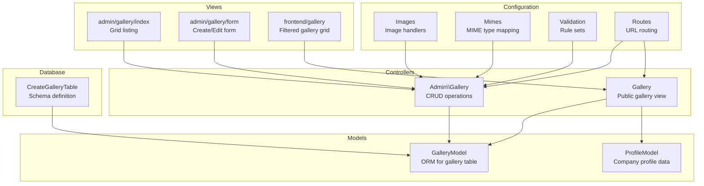
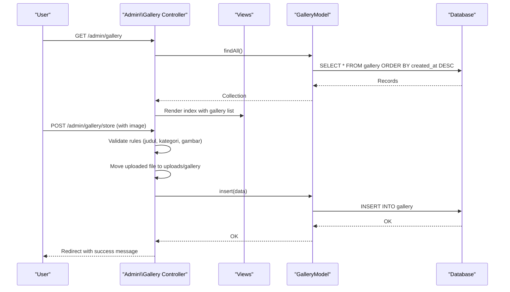
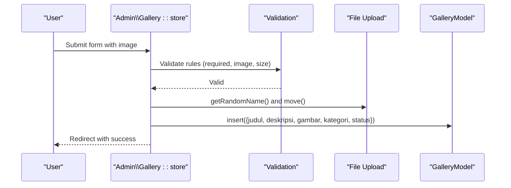
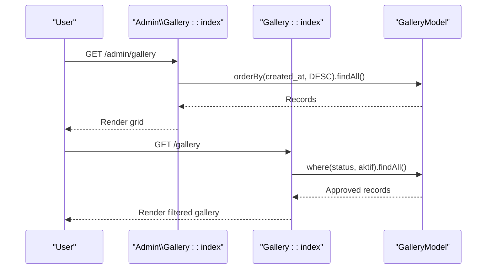
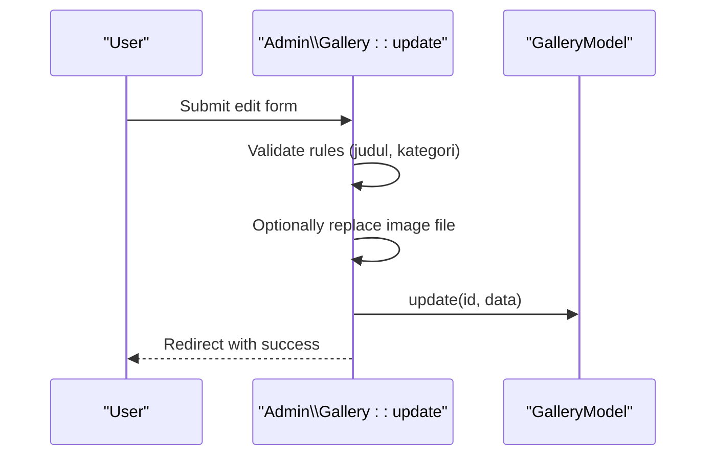
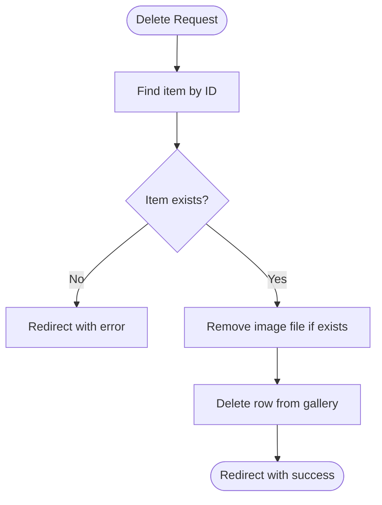
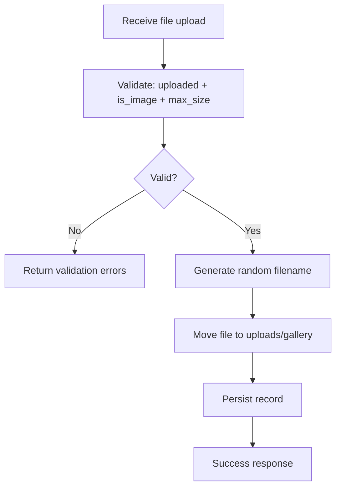
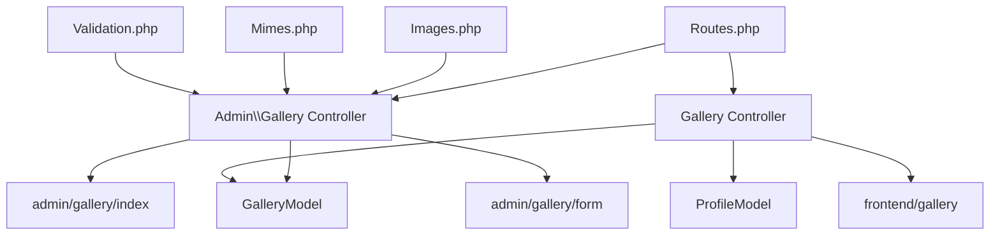

# Gallery Management

<cite>
**Referenced Files in This Document**
- [GalleryModel.php](file://app/Models/GalleryModel.php)
- [Gallery.php](file://app/Controllers/Admin/Gallery.php)
- [Gallery.php](file://app/Controllers/Gallery.php)
- [2024-01-01-000003_CreateGalleryTable.php](file://app/Database/Migrations/2024-01-01-000003_CreateGalleryTable.php)
- [index.php](file://app/Views/admin/gallery/index.php)
- [form.php](file://app/Views/admin/gallery/form.php)
- [gallery.php](file://app/Views/frontend/gallery.php)
- [Images.php](file://app/Config/Images.php)
- [Mimes.php](file://app/Config/Mimes.php)
- [Validation.php](file://app/Config/Validation.php)
- [FileRules.php](file://system/Validation/StrictRules/FileRules.php)
- [Routes.php](file://app/Config/Routes.php)
- [ProfileModel.php](file://app/Models/ProfileModel.php)
</cite>

## Table of Contents
1. [Introduction](#introduction)
2. [Project Structure](#project-structure)
3. [Core Components](#core-components)
4. [Architecture Overview](#architecture-overview)
5. [Detailed Component Analysis](#detailed-component-analysis)
6. [Dependency Analysis](#dependency-analysis)
7. [Performance Considerations](#performance-considerations)
8. [Troubleshooting Guide](#troubleshooting-guide)
9. [Conclusion](#conclusion)

## Introduction
This document provides comprehensive documentation for the gallery management system. It covers the GalleryModel implementation, CRUD operations for photo gallery items, status management, categories, approval workflows, image upload handling, form processing, data sanitization, and the admin interface templates. It also outlines the frontend gallery presentation, filtering, and user experience patterns.

## Project Structure
The gallery system spans models, controllers, migrations, views, and configuration files. The backend uses CodeIgniter 4 with a dedicated admin controller for CRUD operations and a separate frontend controller for displaying approved gallery content. The database schema is defined via a migration, and image handling is configured through framework settings.

**Diagram sources**
- [Gallery.php:1-114](file://app/Controllers/Admin/Gallery.php#L1-114)
- [Gallery.php:1-22](file://app/Controllers/Gallery.php#L1-22)
- [GalleryModel.php:1-14](file://app/Models/GalleryModel.php#L1-14)
- [ProfileModel.php:1-18](file://app/Models/ProfileModel.php#L1-18)
- [2024-01-01-000003_CreateGalleryTable.php:1-30](file://app/Database/Migrations/2024-01-01-000003_CreateGalleryTable.php#L1-30)
- [index.php:1-54](file://app/Views/admin/gallery/index.php#L1-54)
- [form.php:1-99](file://app/Views/admin/gallery/form.php#L1-99)
- [gallery.php:1-84](file://app/Views/frontend/gallery.php#L1-84)
- [Images.php:1-34](file://app/Config/Images.php#L1-34)
- [Mimes.php:1-535](file://app/Config/Mimes.php#L1-535)
- [Validation.php:1-45](file://app/Config/Validation.php#L1-45)
- [Routes.php](file://app/Config/Routes.php#L12)

**Section sources**
- [Gallery.php:1-114](file://app/Controllers/Admin/Gallery.php#L1-114)
- [Gallery.php:1-22](file://app/Controllers/Gallery.php#L1-22)
- [GalleryModel.php:1-14](file://app/Models/GalleryModel.php#L1-14)
- [2024-01-01-000003_CreateGalleryTable.php:1-30](file://app/Database/Migrations/2024-01-01-000003_CreateGalleryTable.php#L1-30)
- [index.php:1-54](file://app/Views/admin/gallery/index.php#L1-54)
- [form.php:1-99](file://app/Views/admin/gallery/form.php#L1-99)
- [gallery.php:1-84](file://app/Views/frontend/gallery.php#L1-84)
- [Images.php:1-34](file://app/Config/Images.php#L1-34)
- [Mimes.php:1-535](file://app/Config/Mimes.php#L1-535)
- [Validation.php:1-45](file://app/Config/Validation.php#L1-45)
- [Routes.php](file://app/Config/Routes.php#L12)

## Core Components
- GalleryModel: Defines the gallery table schema, allowed fields, and timestamps. It serves as the ORM interface for CRUD operations.
- Admin Gallery Controller: Implements create, read, update, and delete operations with validation, file handling, and redirects.
- Frontend Gallery Controller: Retrieves approved gallery items for public display.
- Views: Admin listing and form templates, plus the public gallery page with filtering.
- Database Migration: Creates the gallery table with fields for title, description, image filename, category, status, and timestamps.
- Configuration: Image handlers, MIME type mapping, validation rule sets, and routes.

**Section sources**
- [GalleryModel.php:1-14](file://app/Models/GalleryModel.php#L1-14)
- [Gallery.php:1-114](file://app/Controllers/Admin/Gallery.php#L1-114)
- [Gallery.php:1-22](file://app/Controllers/Gallery.php#L1-22)
- [2024-01-01-000003_CreateGalleryTable.php:1-30](file://app/Database/Migrations/2024-01-01-000003_CreateGalleryTable.php#L1-30)
- [index.php:1-54](file://app/Views/admin/gallery/index.php#L1-54)
- [form.php:1-99](file://app/Views/admin/gallery/form.php#L1-99)
- [gallery.php:1-84](file://app/Views/frontend/gallery.php#L1-84)
- [Images.php:1-34](file://app/Config/Images.php#L1-34)
- [Mimes.php:1-535](file://app/Config/Mimes.php#L1-535)
- [Validation.php:1-45](file://app/Config/Validation.php#L1-45)
- [Routes.php](file://app/Config/Routes.php#L12)

## Architecture Overview
The system follows a layered architecture:
- Presentation Layer: Admin and frontend views render data and collect user input.
- Application Layer: Controllers orchestrate requests, apply validation, manage uploads, and delegate to models.
- Domain Layer: Models encapsulate data access and business rules.
- Infrastructure Layer: Database migration defines schema; configuration files define behavior for images, validation, and routing.

**Diagram sources**
- [Gallery.php:17-56](file://app/Controllers/Admin/Gallery.php#L17-L56)
- [GalleryModel.php:1-14](file://app/Models/GalleryModel.php#L1-14)
- [index.php:1-54](file://app/Views/admin/gallery/index.php#L1-54)
- [form.php:1-99](file://app/Views/admin/gallery/form.php#L1-99)

## Detailed Component Analysis

### GalleryModel Implementation
- Table: gallery
- Primary Key: id
- Allowed Fields: judul, deskripsi, gambar, kategori, status
- Timestamps: enabled (created_at, updated_at managed automatically)

Field definitions and constraints are defined in the migration, including ENUM status with default value and optional fields for description and image filename.

**Section sources**
- [GalleryModel.php:1-14](file://app/Models/GalleryModel.php#L1-14)
- [2024-01-01-000003_CreateGalleryTable.php:11-22](file://app/Database/Migrations/2024-01-01-000003_CreateGalleryTable.php#L11-L22)

### Status Management and Categories
- Status: ENUM with values aktif and nonaktif; default is aktif.
- Category: VARCHAR field supporting predefined categories such as Event, Kegiatan, Prestasi, Fasilitas, Kerjasama, Lainnya.

These fields enable approval workflows and content organization. The admin form exposes status selection, while the frontend gallery displays only items with status aktif.

**Section sources**
- [2024-01-01-000003_CreateGalleryTable.php](file://app/Database/Migrations/2024-01-01-000003_CreateGalleryTable.php#L17)
- [form.php:42-46](file://app/Views/admin/gallery/form.php#L42-L46)
- [gallery.php:38-58](file://app/Views/frontend/gallery.php#L38-L58)

### CRUD Operations for Photo Gallery Items

#### Create (Admin)
- Endpoint: GET /admin/gallery/create → renders form
- Submission: POST /admin/gallery/store
- Validation:
  - Required: judul, kategori
  - Image validation: uploaded, is_image, max_size 2MB
- Processing:
  - Generate random filename
  - Move uploaded file to public/uploads/gallery
  - Insert record with judul, deskripsi, gambar, kategori, status (default aktif)
- Response: Redirect to admin gallery with success message

**Diagram sources**
- [Gallery.php:31-56](file://app/Controllers/Admin/Gallery.php#L31-L56)
- [FileRules.php:125-153](file://system/Validation/StrictRules/FileRules.php#L125-L153)

**Section sources**
- [Gallery.php:26-56](file://app/Controllers/Admin/Gallery.php#L26-L56)

#### Read (Admin and Public)
- Admin listing: GET /admin/gallery orders by created_at DESC
- Public gallery: GET /gallery filters by status = aktif

**Diagram sources**
- [Gallery.php:17-24](file://app/Controllers/Admin/Gallery.php#L17-L24)
- [Gallery.php:10-21](file://app/Controllers/Gallery.php#L10-L21)

**Section sources**
- [Gallery.php:17-24](file://app/Controllers/Admin/Gallery.php#L17-L24)
- [Gallery.php:10-21](file://app/Controllers/Gallery.php#L10-L21)

#### Update (Admin)
- Endpoint: GET /admin/gallery/edit/{id} → renders form with existing data
- Submission: POST /admin/gallery/update/{id}
- Validation:
  - Required: judul, kategori
- Processing:
  - Optional image replacement: remove old file if present, upload new, update filename
  - Update record with judul, deskripsi, gambar, kategori, status
- Response: Redirect to admin gallery with success message

**Diagram sources**
- [Gallery.php:66-99](file://app/Controllers/Admin/Gallery.php#L66-L99)

**Section sources**
- [Gallery.php:58-99](file://app/Controllers/Admin/Gallery.php#L58-L99)

#### Delete (Admin)
- Endpoint: GET /admin/gallery/delete/{id}
- Processing:
  - Locate item by id
  - Remove associated image file if present
  - Delete record from database
- Response: Redirect to admin gallery with success message

**Diagram sources**
- [Gallery.php:101-112](file://app/Controllers/Admin/Gallery.php#L101-L112)

**Section sources**
- [Gallery.php:101-112](file://app/Controllers/Admin/Gallery.php#L101-L112)

### Approval Workflows
- Status field controls visibility:
  - aktif: visible on frontend gallery
  - nonaktif: hidden from public view
- Admin can toggle status via the form’s status dropdown.

**Section sources**
- [2024-01-01-000003_CreateGalleryTable.php](file://app/Database/Migrations/2024-01-01-000003_CreateGalleryTable.php#L17)
- [form.php:42-46](file://app/Views/admin/gallery/form.php#L42-L46)
- [gallery.php:38-58](file://app/Views/frontend/gallery.php#L38-L58)

### Image Upload Handling
- Validation rules enforced by the framework:
  - uploaded: ensures a file was submitted
  - is_image: verifies MIME type starts with image/*
  - max_size: restricts file size to 2MB
- File handling:
  - Randomized filename generated to avoid conflicts
  - File moved to public/uploads/gallery
  - On update, old file is removed before replacing with a new one
- Security measures:
  - MIME type checked against image types
  - File size validated server-side
  - CSRF protection via form field

**Diagram sources**
- [Gallery.php:33-45](file://app/Controllers/Admin/Gallery.php#L33-L45)
- [FileRules.php:125-153](file://system/Validation/StrictRules/FileRules.php#L125-L153)

**Section sources**
- [Gallery.php:33-45](file://app/Controllers/Admin/Gallery.php#L33-L45)
- [FileRules.php:125-153](file://system/Validation/StrictRules/FileRules.php#L125-L153)

### Form Processing Workflow and Data Sanitization
- Admin form collects judul, deskripsi, kategori, status, and gambar.
- Old values preserved on validation failure for user convenience.
- Escaping applied in views to prevent XSS when rendering titles and categories.
- CSRF protection included in forms.

**Section sources**
- [form.php:11-78](file://app/Views/admin/gallery/form.php#L11-L78)
- [index.php:14-29](file://app/Views/admin/gallery/index.php#L14-L29)

### Thumbnail Generation
- The current implementation stores original images and renders them directly in both admin and frontend views.
- No explicit thumbnail generation is implemented in the provided code.

**Section sources**
- [index.php:17-23](file://app/Views/admin/gallery/index.php#L17-L23)
- [gallery.php:42-49](file://app/Views/frontend/gallery.php#L42-L49)

### Search, Pagination, and Bulk Operations
- Search: Not implemented in the provided code.
- Pagination: Not implemented in the provided code.
- Bulk operations: Not implemented in the provided code.

**Section sources**
- [Gallery.php:17-24](file://app/Controllers/Admin/Gallery.php#L17-L24)
- [Gallery.php:10-21](file://app/Controllers/Gallery.php#L10-L21)

### Admin Interface Templates and UX Patterns
- Admin listing:
  - Grid layout with responsive cards
  - Inline status badges and category tags
  - Edit and delete actions per item
  - Empty state guidance
- Admin form:
  - Dual-column layout (form fields + preview)
  - Image preview with placeholder
  - Category dropdown with predefined values
  - Status dropdown with defaults
  - Client-side preview script for selected image
- Frontend gallery:
  - Category filter buttons
  - Masonry-style grid with lightbox support
  - Empty state messaging

**Section sources**
- [index.php:1-54](file://app/Views/admin/gallery/index.php#L1-L54)
- [form.php:1-99](file://app/Views/admin/gallery/form.php#L1-L99)
- [gallery.php:1-84](file://app/Views/frontend/gallery.php#L1-L84)

## Dependency Analysis
The following diagram shows key dependencies among components:

**Diagram sources**
- [Routes.php](file://app/Config/Routes.php#L12)
- [Gallery.php:1-114](file://app/Controllers/Admin/Gallery.php#L1-114)
- [Gallery.php:1-22](file://app/Controllers/Gallery.php#L1-22)
- [GalleryModel.php:1-14](file://app/Models/GalleryModel.php#L1-14)
- [ProfileModel.php:1-18](file://app/Models/ProfileModel.php#L1-18)
- [index.php:1-54](file://app/Views/admin/gallery/index.php#L1-54)
- [form.php:1-99](file://app/Views/admin/gallery/form.php#L1-99)
- [gallery.php:1-84](file://app/Views/frontend/gallery.php#L1-84)
- [Images.php:1-34](file://app/Config/Images.php#L1-34)
- [Mimes.php:1-535](file://app/Config/Mimes.php#L1-535)
- [Validation.php:1-45](file://app/Config/Validation.php#L1-45)

**Section sources**
- [Routes.php](file://app/Config/Routes.php#L12)
- [Gallery.php:1-114](file://app/Controllers/Admin/Gallery.php#L1-114)
- [Gallery.php:1-22](file://app/Controllers/Gallery.php#L1-22)
- [GalleryModel.php:1-14](file://app/Models/GalleryModel.php#L1-14)
- [ProfileModel.php:1-18](file://app/Models/ProfileModel.php#L1-18)
- [index.php:1-54](file://app/Views/admin/gallery/index.php#L1-54)
- [form.php:1-99](file://app/Views/admin/gallery/form.php#L1-99)
- [gallery.php:1-84](file://app/Views/frontend/gallery.php#L1-84)
- [Images.php:1-34](file://app/Config/Images.php#L1-34)
- [Mimes.php:1-535](file://app/Config/Mimes.php#L1-535)
- [Validation.php:1-45](file://app/Config/Validation.php#L1-45)

## Performance Considerations
- Image size: Current max size is 2MB. Consider adding dimension checks (width/height) to prevent oversized images from consuming bandwidth and storage.
- Indexes: Add database indexes on status and kategori for faster filtering and sorting.
- Thumbnails: Generate thumbnails to reduce bandwidth and improve loading times.
- Pagination: Implement pagination for large galleries to limit memory usage and improve responsiveness.
- Caching: Cache frequently accessed gallery lists where appropriate.

## Troubleshooting Guide
- Validation errors:
  - Ensure required fields (judul, kategori) and image constraints are met.
  - Confirm file type is an image and under 2MB.
- File upload failures:
  - Verify uploads directory permissions and existence.
  - Check PHP upload_max_filesize and post_max_size settings.
- Missing images:
  - Confirm filenames stored in the database match actual files in uploads/gallery.
  - Ensure old files are removed during updates to prevent orphaned files.
- CSRF protection:
  - Ensure CSRF field is present in forms.

**Section sources**
- [Gallery.php:33-41](file://app/Controllers/Admin/Gallery.php#L33-L41)
- [Gallery.php:82-88](file://app/Controllers/Admin/Gallery.php#L82-L88)
- [form.php:11-12](file://app/Views/admin/gallery/form.php#L11-L12)

## Conclusion
The gallery management system provides a robust foundation for managing visual content with clear separation between admin and public interfaces. It supports essential CRUD operations, status-based approval, category organization, and secure image uploads with validation. Future enhancements could include search, pagination, bulk operations, and thumbnail generation to further improve performance and user experience.