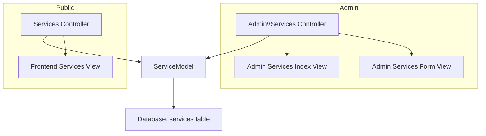
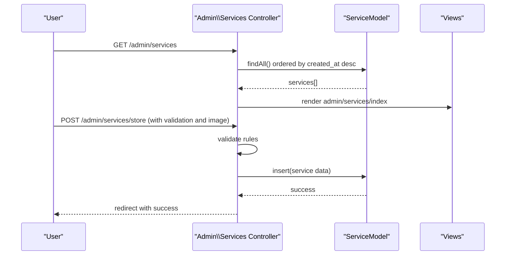
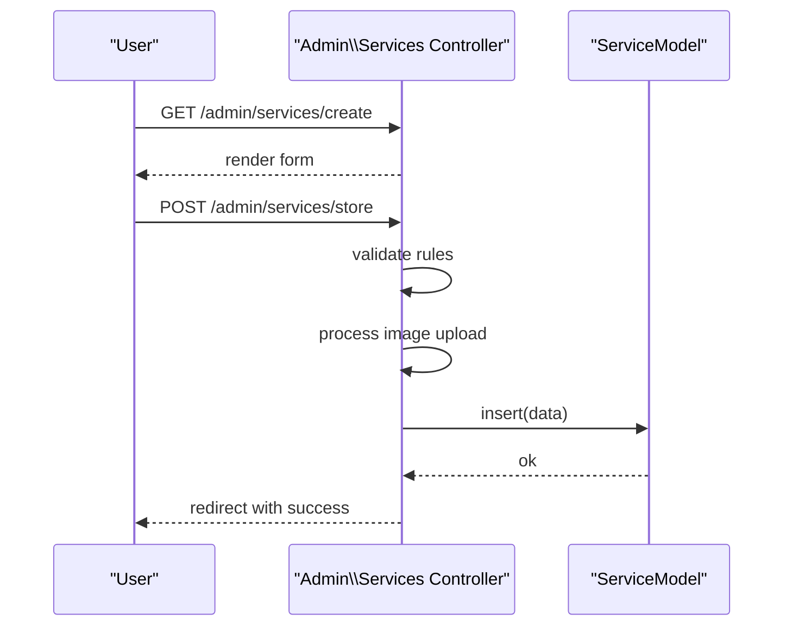
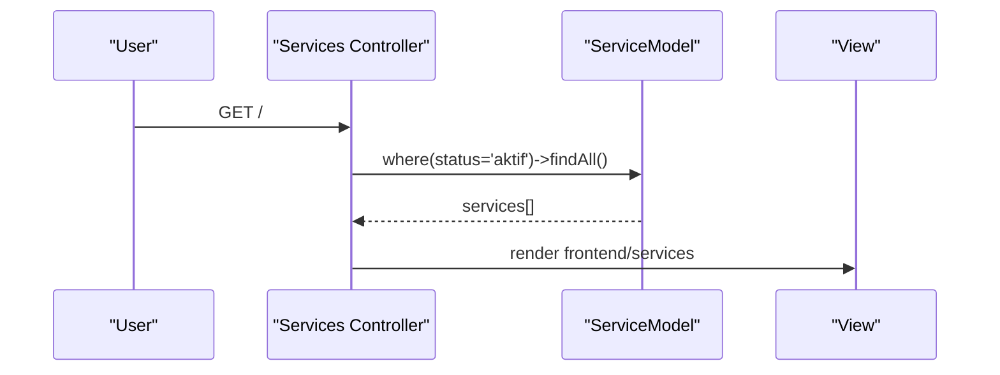
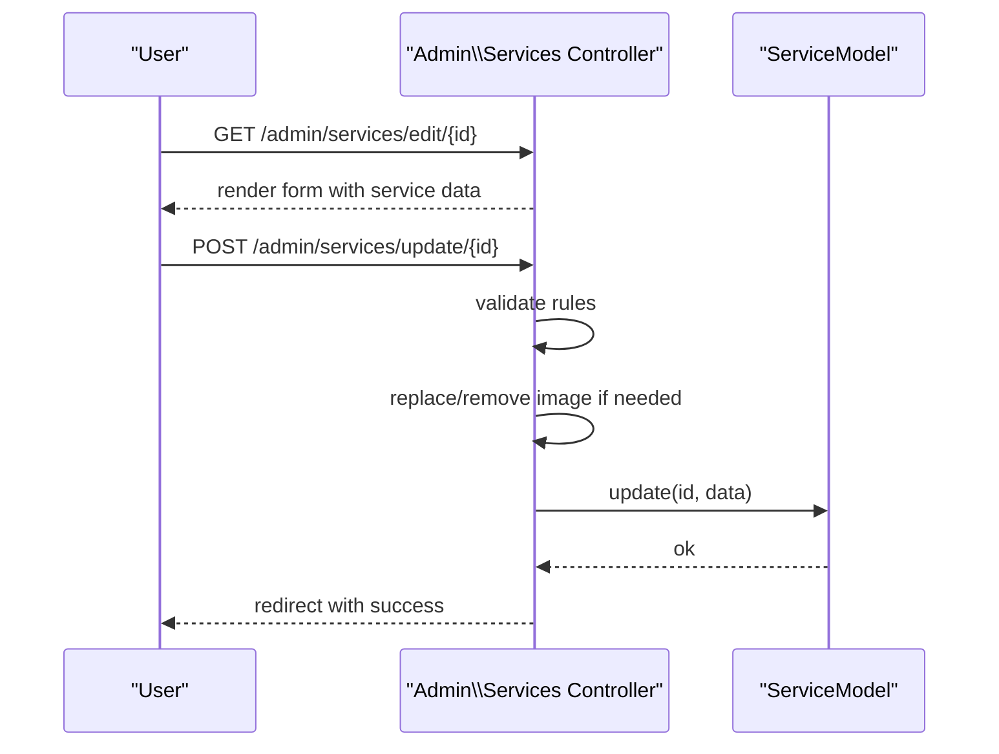
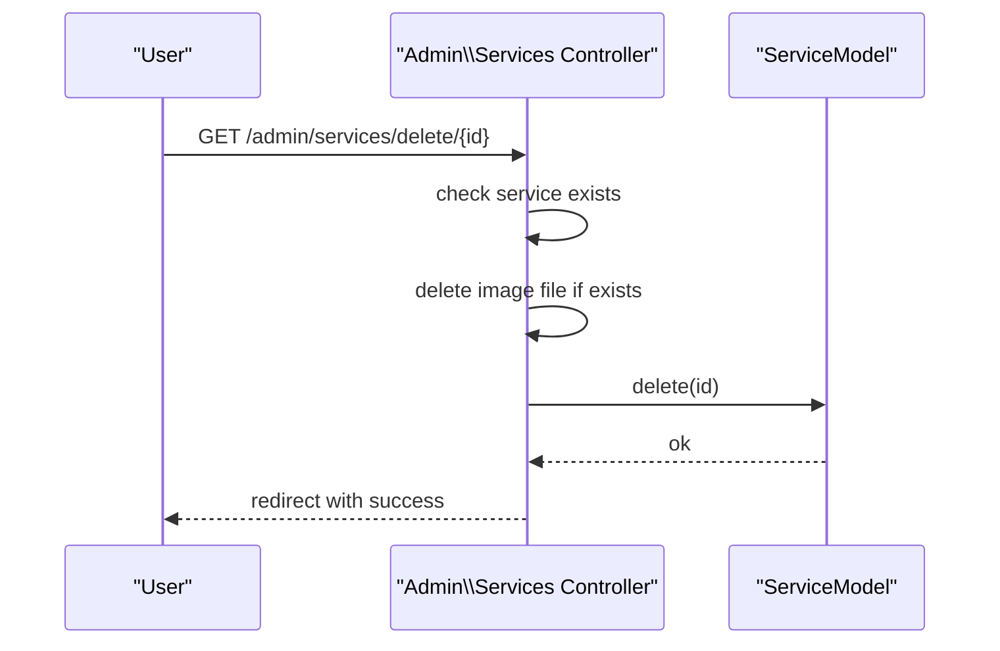
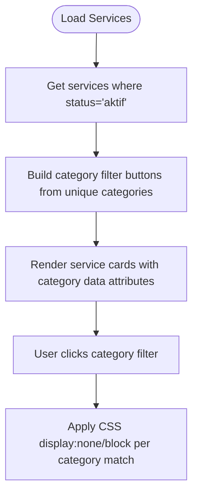
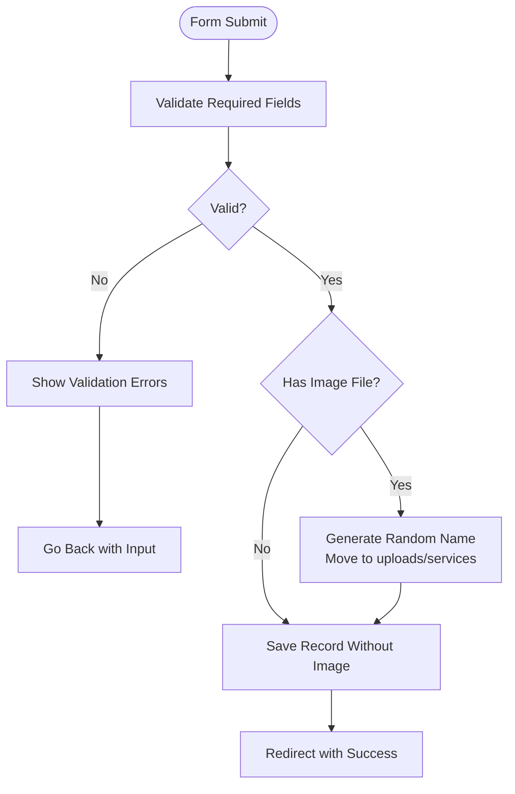
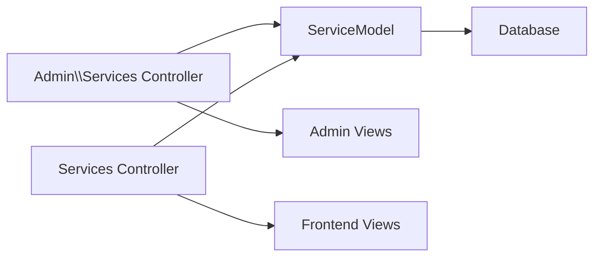

# Services Management

<cite>
**Referenced Files in This Document**
- [ServiceModel.php](file://app/Models/ServiceModel.php)
- [Services.php (Admin)](file://app/Controllers/Admin/Services.php)
- [Services.php (Public)](file://app/Controllers/Services.php)
- [CreateServicesTable.php](file://app/Database/Migrations/2024-01-01-000002_CreateServicesTable.php)
- [admin_services_index.php](file://app/Views/admin/services/index.php)
- [admin_services_form.php](file://app/Views/admin/services/form.php)
- [frontend_services.php](file://app/Views/frontend/services.php)
- [validation_list_view.php](file://system/Validation/Views/list.php)
</cite>

## Table of Contents
1. [Introduction](#introduction)
2. [Project Structure](#project-structure)
3. [Core Components](#core-components)
4. [Architecture Overview](#architecture-overview)
5. [Detailed Component Analysis](#detailed-component-analysis)
6. [Dependency Analysis](#dependency-analysis)
7. [Performance Considerations](#performance-considerations)
8. [Troubleshooting Guide](#troubleshooting-guide)
9. [Conclusion](#conclusion)

## Introduction
This document describes the Services Management system, focusing on the ServiceModel implementation, CRUD operations, status management, categories, approval workflows, form handling, validation, file uploads, search/filtering, pagination, and admin/user experiences. It consolidates backend model/controller logic with frontend presentation and admin templates to provide a complete operational picture.

## Project Structure
The Services Management system spans three primary areas:
- Backend model and controller for admin operations
- Public-facing controller and view for customer-facing service listings
- Database migration defining the services table schema

**Diagram sources**
- [Services.php (Admin):1-121](file://app/Controllers/Admin/Services.php#L1-L121)
- [Services.php (Public):1-22](file://app/Controllers/Services.php#L1-L22)
- [ServiceModel.php:1-14](file://app/Models/ServiceModel.php#L1-L14)
- [CreateServicesTable.php:1-31](file://app/Database/Migrations/2024-01-01-000002_CreateServicesTable.php#L1-L31)

**Section sources**
- [Services.php (Admin):1-121](file://app/Controllers/Admin/Services.php#L1-L121)
- [Services.php (Public):1-22](file://app/Controllers/Services.php#L1-L22)
- [ServiceModel.php:1-14](file://app/Models/ServiceModel.php#L1-L14)
- [CreateServicesTable.php:1-31](file://app/Database/Migrations/2024-01-01-000002_CreateServicesTable.php#L1-L31)

## Core Components
- ServiceModel: Defines table mapping, allowed fields, timestamps, and basic ORM behavior.
- Admin Services Controller: Implements CRUD routes for managing services, including validation, image upload handling, and status updates.
- Public Services Controller and View: Renders active services for customers with category filtering.
- Database Migration: Creates the services table with fields for name, description, icon, image, category, status, and timestamps.

Key responsibilities:
- Data persistence via ServiceModel
- Admin CRUD operations with validation and file handling
- Public read-only listing filtered by status
- Category-based client-side filtering

**Section sources**
- [ServiceModel.php:1-14](file://app/Models/ServiceModel.php#L1-L14)
- [Services.php (Admin):1-121](file://app/Controllers/Admin/Services.php#L1-L121)
- [Services.php (Public):1-22](file://app/Controllers/Services.php#L1-L22)
- [CreateServicesTable.php:1-31](file://app/Database/Migrations/2024-01-01-000002_CreateServicesTable.php#L1-L31)

## Architecture Overview
The system follows a layered MVC pattern:
- Controllers handle HTTP requests and orchestrate data retrieval/persistence.
- Models encapsulate data access and schema mapping.
- Views render admin and public pages with minimal logic.
- Validation integrates with built-in helpers for error rendering.

**Diagram sources**
- [Services.php (Admin):17-60](file://app/Controllers/Admin/Services.php#L17-L60)
- [ServiceModel.php:7-13](file://app/Models/ServiceModel.php#L7-L13)

## Detailed Component Analysis

### ServiceModel Implementation
- Table mapping: services table
- Primary key: id
- Allowed fields: nama, deskripsi, icon, gambar, kategori, status
- Timestamps enabled: created_at, updated_at managed automatically

Field definitions and constraints:
- nama: VARCHAR(255)
- deskripsi: TEXT (nullable)
- icon: VARCHAR(100) (nullable)
- gambar: VARCHAR(255) (nullable)
- kategori: VARCHAR(100) (nullable)
- status: ENUM ['aktif','nonaktif'] with default 'aktif'
- created_at, updated_at: DATETIME (nullable)

Validation rules enforced at controller level:
- nama: required
- deskripsi: required
- kategori: required

Status management:
- Default status is 'aktif'
- Admin can set 'nonaktif' via update form submission

Category organization:
- kategori stored as string; frontend filters by unique categories

Approval workflow:
- No explicit approval flag; status controls visibility in public view

File upload handling:
- Image uploaded via multipart form
- Stored under public/uploads/services with randomized filename
- Old image removed on update if replaced

Search and filtering:
- Admin listing: order by created_at DESC
- Public listing: filter by status = 'aktif'
- Frontend category filtering: client-side JavaScript toggling

Pagination:
- Not implemented in current code; full lists are returned

Bulk operations:
- Not implemented in current code

Data sanitization:
- Uses CodeIgniter's form validation and escaping in views (e.g., esc() in frontend view)

Admin interface forms and UX:
- Admin form supports create and edit modes
- Confirmation dialog for delete actions
- Success/error notifications via flash messages

**Section sources**
- [ServiceModel.php:1-14](file://app/Models/ServiceModel.php#L1-L14)
- [CreateServicesTable.php:9-24](file://app/Database/Migrations/2024-01-01-000002_CreateServicesTable.php#L9-L24)
- [Services.php (Admin):31-119](file://app/Controllers/Admin/Services.php#L31-L119)
- [frontend_services.php:18-84](file://app/Views/frontend/services.php#L18-L84)

### CRUD Operations

#### Create (Admin)
- Route: GET /admin/services/create → renders form
- Action: POST /admin/services/store
- Validation: nama, deskripsi, kategori required
- Upload: image optional; saved to public/uploads/services with randomized name
- Persistence: inserts record with defaults and provided values

**Diagram sources**
- [Services.php (Admin):26-60](file://app/Controllers/Admin/Services.php#L26-L60)

**Section sources**
- [Services.php (Admin):26-60](file://app/Controllers/Admin/Services.php#L26-L60)

#### Read (Admin and Public)
- Admin listing: fetches all services ordered by created_at DESC
- Public listing: fetches only services where status = 'aktif'

**Diagram sources**
- [Services.php (Public):10-21](file://app/Controllers/Services.php#L10-L21)

**Section sources**
- [Services.php (Admin):17-24](file://app/Controllers/Admin/Services.php#L17-L24)
- [Services.php (Public):10-21](file://app/Controllers/Services.php#L10-L21)

#### Update (Admin)
- Route: GET /admin/services/edit/{id} → renders pre-filled form
- Action: POST /admin/services/update/{id}
- Validation: same required rules as create
- Upload: replaces existing image if new file provided; removes old file
- Persistence: updates record fields

**Diagram sources**
- [Services.php (Admin):62-106](file://app/Controllers/Admin/Services.php#L62-L106)

**Section sources**
- [Services.php (Admin):62-106](file://app/Controllers/Admin/Services.php#L62-L106)

#### Delete (Admin)
- Route: GET /admin/services/delete/{id}
- Behavior: deletes associated image file if present, then removes record

**Diagram sources**
- [Services.php (Admin):108-119](file://app/Controllers/Admin/Services.php#L108-L119)

**Section sources**
- [Services.php (Admin):108-119](file://app/Controllers/Admin/Services.php#L108-L119)

### Status Management
- Status column is ENUM with values 'aktif' and 'nonaktif'
- Default value is 'aktif'
- Public view filters to show only 'aktif' services
- Admin can toggle status via update form submission

**Section sources**
- [CreateServicesTable.php:18-18](file://app/Database/Migrations/2024-01-01-000002_CreateServicesTable.php#L18-L18)
- [Services.php (Public):17-17](file://app/Controllers/Services.php#L17-L17)
- [Services.php (Admin):102-102](file://app/Controllers/Admin/Services.php#L102-L102)

### Categories and Filtering
- Category stored as string in kategori field
- Admin listing shows all records; no category filter in admin
- Public view builds category filter buttons dynamically from existing categories
- Client-side JavaScript filters service cards by category

**Diagram sources**
- [Services.php (Public):17-17](file://app/Controllers/Services.php#L17-L17)
- [frontend_services.php:22-84](file://app/Views/frontend/services.php#L22-L84)

**Section sources**
- [frontend_services.php:18-84](file://app/Views/frontend/services.php#L18-L84)

### Approval Workflows
- No dedicated approval flag or workflow; visibility controlled by status field
- Admin sets status to 'nonaktif' to hide services from public view

**Section sources**
- [CreateServicesTable.php:18-18](file://app/Database/Migrations/2024-01-01-000002_CreateServicesTable.php#L18-L18)
- [Services.php (Admin):102-102](file://app/Controllers/Admin/Services.php#L102-L102)

### Form Handling, Validation, and File Upload
- Validation rules applied on create and update
- Error rendering via built-in validation list view
- File upload handling:
  - Validates file, checks for valid move, generates random name, moves to uploads/services
  - On update, removes previous image if replacement is provided

**Diagram sources**
- [Services.php (Admin):33-41](file://app/Controllers/Admin/Services.php#L33-L41)
- [Services.php (Admin):43-48](file://app/Controllers/Admin/Services.php#L43-L48)
- [Services.php (Admin):85-94](file://app/Controllers/Admin/Services.php#L85-L94)

**Section sources**
- [Services.php (Admin):33-41](file://app/Controllers/Admin/Services.php#L33-L41)
- [Services.php (Admin):43-48](file://app/Controllers/Admin/Services.php#L43-L48)
- [Services.php (Admin):85-94](file://app/Controllers/Admin/Services.php#L85-L94)
- [validation_list_view.php:1-9](file://system/Validation/Views/list.php#L1-L9)

### Data Presentation Templates
- Admin index view lists services with action links
- Admin form view handles create/edit with multipart form and image preview
- Frontend services view renders responsive cards with category filtering and fallback icons/images

**Section sources**
- [admin_services_index.php:6-60](file://app/Views/admin/services/index.php#L6-L60)
- [admin_services_form.php:10-80](file://app/Views/admin/services/form.php#L10-L80)
- [frontend_services.php:41-87](file://app/Views/frontend/services.php#L41-L87)

## Dependency Analysis
- Admin Services Controller depends on ServiceModel for data operations
- Public Services Controller depends on ServiceModel for read operations
- Views depend on controller-provided data arrays
- Validation integrates with CodeIgniter’s Validation library and list view renderer

**Diagram sources**
- [Services.php (Admin):1-121](file://app/Controllers/Admin/Services.php#L1-L121)
- [Services.php (Public):1-22](file://app/Controllers/Services.php#L1-L22)
- [ServiceModel.php:1-14](file://app/Models/ServiceModel.php#L1-L14)

**Section sources**
- [Services.php (Admin):1-121](file://app/Controllers/Admin/Services.php#L1-L121)
- [Services.php (Public):1-22](file://app/Controllers/Services.php#L1-L22)
- [ServiceModel.php:1-14](file://app/Models/ServiceModel.php#L1-L14)

## Performance Considerations
- Current implementation returns full lists without pagination; consider adding limit/offset or server-side filtering for large datasets
- Image storage uses randomized filenames; ensure disk cleanup policies for orphaned files
- Frontend filtering is client-side; consider server-side category filtering for better performance with large lists

## Troubleshooting Guide
Common issues and resolutions:
- Validation errors on submit: ensure required fields (nama, deskripsi, kategori) are filled; review validation list output
- Image upload failures: verify uploads/services directory permissions and file size/mime constraints
- Missing service after delete: confirm image removal and database record deletion occurred
- Status not changing: verify status value submitted in update form

**Section sources**
- [Services.php (Admin):39-41](file://app/Controllers/Admin/Services.php#L39-L41)
- [Services.php (Admin):81-83](file://app/Controllers/Admin/Services.php#L81-L83)
- [Services.php (Admin):113-115](file://app/Controllers/Admin/Services.php#L113-L115)
- [validation_list_view.php:1-9](file://system/Validation/Views/list.php#L1-L9)

## Conclusion
The Services Management system provides a straightforward admin interface for creating, editing, and deleting services with validation and image handling, while exposing only active services to the public with category-based filtering. Enhancements such as pagination, server-side filtering, and bulk operations would improve scalability and usability for larger datasets.