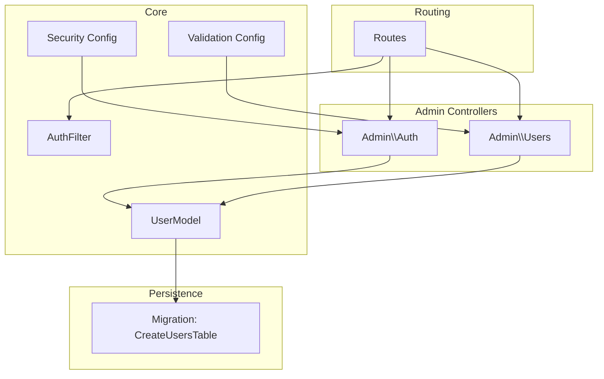
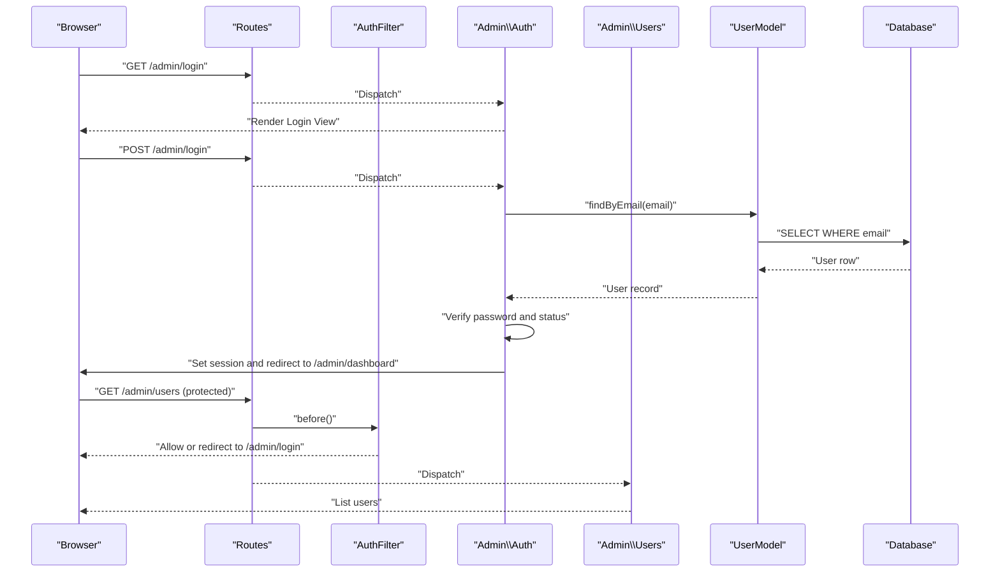
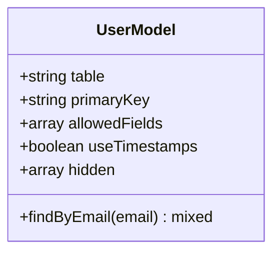
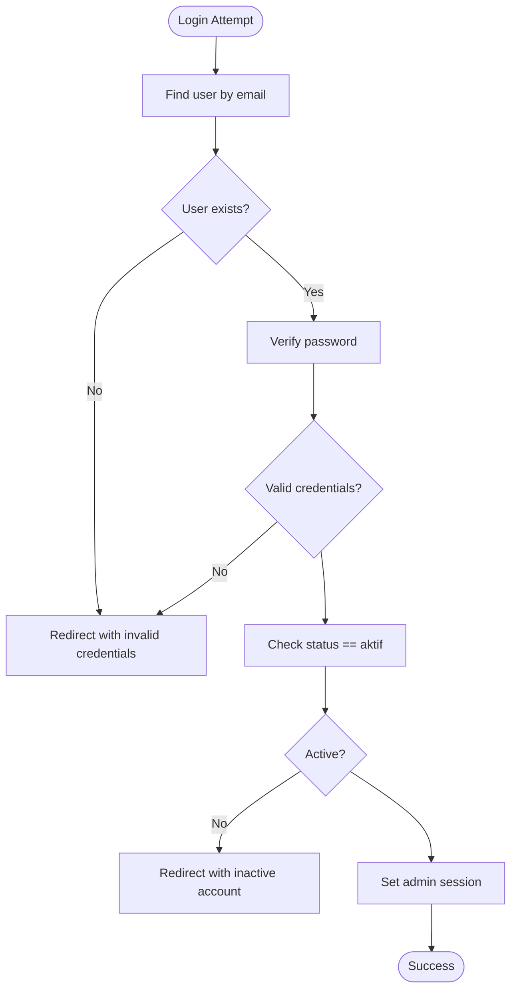
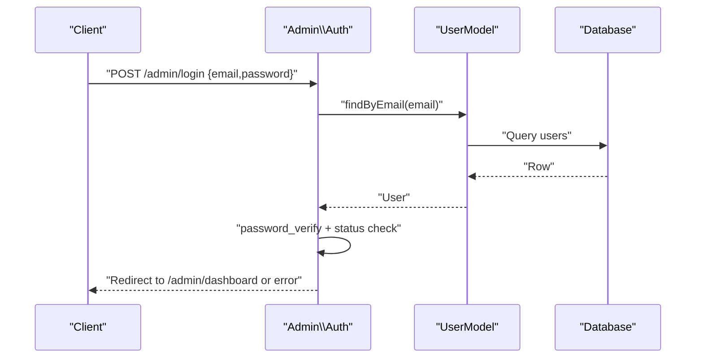
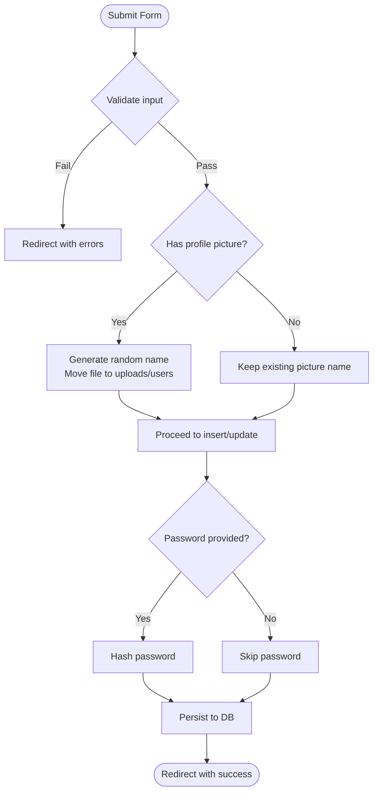
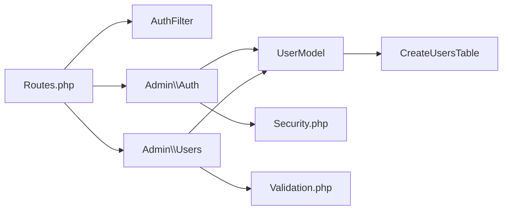

# User Administration

<cite>
**Referenced Files in This Document**
- [UserModel.php](file://app/Models/UserModel.php)
- [Users.php](file://app/Controllers/Admin/Users.php)
- [Auth.php](file://app/Controllers/Admin/Auth.php)
- [AuthFilter.php](file://app/Filters/AuthFilter.php)
- [CreateUsersTable.php](file://app/Database/Migrations/2024-01-01-000004_CreateUsersTable.php)
- [Routes.php](file://app/Config/Routes.php)
- [Validation.php](file://app/Config/Validation.php)
- [Security.php](file://app/Config/Security.php)
- [security_helper.php](file://system/Helpers/security_helper.php)
</cite>

## Table of Contents
1. [Introduction](#introduction)
2. [Project Structure](#project-structure)
3. [Core Components](#core-components)
4. [Architecture Overview](#architecture-overview)
5. [Detailed Component Analysis](#detailed-component-analysis)
6. [Dependency Analysis](#dependency-analysis)
7. [Performance Considerations](#performance-considerations)
8. [Troubleshooting Guide](#troubleshooting-guide)
9. [Conclusion](#conclusion)

## Introduction
This document describes the user administration system for the company profile website built on CodeIgniter 4. It focuses on the UserModel implementation, role-based permissions, authentication and session handling, CRUD operations for user accounts, profile picture management, user status control, form validation and data sanitization, security measures, and the admin interface integration. It also outlines the current capabilities and highlights areas for enhancement such as advanced search/filtering, bulk operations, and audit logging.

## Project Structure
The user administration system spans models, controllers, filters, migrations, routing, and configuration. The following diagram maps the primary components involved in user management and admin access control.

**Diagram sources**
- [Auth.php:1-50](file://app/Controllers/Admin/Auth.php#L1-L50)
- [Users.php:1-132](file://app/Controllers/Admin/Users.php#L1-L132)
- [UserModel.php:1-20](file://app/Models/UserModel.php#L1-L20)
- [AuthFilter.php:1-23](file://app/Filters/AuthFilter.php#L1-L23)
- [CreateUsersTable.php:1-32](file://app/Database/Migrations/2024-01-01-000004_CreateUsersTable.php#L1-L32)
- [Routes.php:1-55](file://app/Config/Routes.php#L1-L55)
- [Security.php:1-87](file://app/Config/Security.php#L1-L87)
- [Validation.php:1-45](file://app/Config/Validation.php#L1-L45)

**Section sources**
- [Routes.php:17-54](file://app/Config/Routes.php#L17-L54)
- [AuthFilter.php:9-22](file://app/Filters/AuthFilter.php#L9-L22)

## Core Components
- UserModel: Defines the users table schema, allowed fields, timestamps, and a lookup method by email.
- Admin\Auth: Handles admin login, logout, and session creation upon successful authentication.
- Admin\Users: Implements CRUD operations for users, including creation, editing, updating, and deletion, with validation and file upload handling.
- AuthFilter: Enforces admin session-based access control for protected routes.
- CreateUsersTable migration: Defines the users table structure, roles, statuses, and keys.
- Security and Validation configs: Configure CSRF protection and validation rule sets.

**Section sources**
- [UserModel.php:7-19](file://app/Models/UserModel.php#L7-L19)
- [Auth.php:10-48](file://app/Controllers/Admin/Auth.php#L10-L48)
- [Users.php:17-130](file://app/Controllers/Admin/Users.php#L17-L130)
- [AuthFilter.php:11-16](file://app/Filters/AuthFilter.php#L11-L16)
- [CreateUsersTable.php:9-24](file://app/Database/Migrations/2024-01-01-000004_CreateUsersTable.php#L9-L24)
- [Security.php:18-85](file://app/Config/Security.php#L18-L85)
- [Validation.php:23-39](file://app/Config/Validation.php#L23-L39)

## Architecture Overview
The admin user administration flow integrates routing, filters, controllers, model, and persistence. Authentication occurs via the Auth controller, protected routes enforce session checks, and the Users controller manages user CRUD operations backed by UserModel.

**Diagram sources**
- [Routes.php:17-54](file://app/Config/Routes.php#L17-L54)
- [AuthFilter.php:11-16](file://app/Filters/AuthFilter.php#L11-L16)
- [Auth.php:18-42](file://app/Controllers/Admin/Auth.php#L18-L42)
- [Users.php:17-24](file://app/Controllers/Admin/Users.php#L17-L24)
- [UserModel.php:15-18](file://app/Models/UserModel.php#L15-L18)
- [CreateUsersTable.php:11-20](file://app/Database/Migrations/2024-01-01-000004_CreateUsersTable.php#L11-L20)

## Detailed Component Analysis

### UserModel Implementation
- Table and primary key: users table with auto-incremented id.
- Allowed fields: nama, email, password, role, foto, status.
- Timestamps: created_at and updated_at are managed automatically.
- Hidden field: password is excluded from serialization.
- Lookup: findByEmail returns the first user by email.

**Diagram sources**
- [UserModel.php:7-19](file://app/Models/UserModel.php#L7-L19)

**Section sources**
- [UserModel.php:9-13](file://app/Models/UserModel.php#L9-L13)
- [UserModel.php:15-18](file://app/Models/UserModel.php#L15-L18)

### Role-Based Permissions and Status Control
- Roles: ENUM with values superadmin and admin, default admin.
- Status: ENUM with values aktif and nonaktif, default aktif.
- Access control: AuthFilter redirects unauthenticated requests to /admin/login.
- Active status enforcement: Login rejects inactive users.

**Diagram sources**
- [Auth.php:23-39](file://app/Controllers/Admin/Auth.php#L23-L39)
- [CreateUsersTable.php:16-18](file://app/Database/Migrations/2024-01-01-000004_CreateUsersTable.php#L16-L18)

**Section sources**
- [CreateUsersTable.php:16-18](file://app/Database/Migrations/2024-01-01-000004_CreateUsersTable.php#L16-L18)
- [Auth.php:26-39](file://app/Controllers/Admin/Auth.php#L26-L39)
- [AuthFilter.php:13-15](file://app/Filters/AuthFilter.php#L13-L15)

### Authentication Handling
- Login: Validates credentials against hashed passwords and ensures active status; stores admin metadata in session.
- Logout: Destroys session and redirects to login.
- Protected routes: Grouped under admin with filter auth applied.

**Diagram sources**
- [Auth.php:18-42](file://app/Controllers/Admin/Auth.php#L18-L42)
- [UserModel.php:15-18](file://app/Models/UserModel.php#L15-L18)

**Section sources**
- [Auth.php:10-48](file://app/Controllers/Admin/Auth.php#L10-L48)
- [Routes.php:23-25](file://app/Config/Routes.php#L23-L25)

### CRUD Operations for User Accounts
- Index: Lists users ordered by creation date.
- Create: Renders form for adding a new user with validation rules.
- Store: Inserts validated user data, hashes password, handles profile picture upload, defaults status to aktif.
- Edit: Loads existing user for editing.
- Update: Validates updates, conditionally replaces profile picture, conditionally updates password if provided, persists changes.
- Delete: Prevents self-deletion, removes profile picture file if present, deletes user record.

**Diagram sources**
- [Users.php:31-61](file://app/Controllers/Admin/Users.php#L31-L61)
- [Users.php:71-112](file://app/Controllers/Admin/Users.php#L71-L112)
- [Users.php:114-130](file://app/Controllers/Admin/Users.php#L114-L130)

**Section sources**
- [Users.php:17-24](file://app/Controllers/Admin/Users.php#L17-L24)
- [Users.php:31-61](file://app/Controllers/Admin/Users.php#L31-L61)
- [Users.php:71-112](file://app/Controllers/Admin/Users.php#L71-L112)
- [Users.php:114-130](file://app/Controllers/Admin/Users.php#L114-L130)

### Password Management
- Storage: Passwords are hashed using the default algorithm before persisting.
- Update: Password is only updated when a new value is provided; otherwise, existing password remains unchanged.
- Verification: Login compares submitted password against stored hash.

**Section sources**
- [Users.php:54-108](file://app/Controllers/Admin/Users.php#L54-L108)
- [Auth.php:26-39](file://app/Controllers/Admin/Auth.php#L26-L39)

### Profile Picture Handling
- Upload: New images are saved with randomized names under public/uploads/users.
- Replace: Updating a user replaces the old image file if a new one is uploaded.
- Deletion: Deleting a user removes the associated image file if present.
- Security: Uses the framework’s file handling and sanitization helpers.

**Section sources**
- [Users.php:44-49](file://app/Controllers/Admin/Users.php#L44-L49)
- [Users.php:86-94](file://app/Controllers/Admin/Users.php#L86-L94)
- [Users.php:124-126](file://app/Controllers/Admin/Users.php#L124-L126)
- [security_helper.php:31-81](file://system/Helpers/security_helper.php#L31-L81)

### User Search and Filtering
- Current capability: Listing users ordered by creation date; no explicit search or filter endpoints are defined in the routes or controller.
- Recommendation: Add query parameters (e.g., status, role) and implement builder-based filtering in the controller index action.

**Section sources**
- [Users.php:17-24](file://app/Controllers/Admin/Users.php#L17-L24)
- [Routes.php:47-53](file://app/Config/Routes.php#L47-L53)

### Bulk Operations
- Current capability: No bulk delete or bulk status change endpoints are implemented.
- Recommendation: Introduce batch endpoints and controller actions to handle arrays of IDs with atomic transactions.

**Section sources**
- [Users.php:114-130](file://app/Controllers/Admin/Users.php#L114-L130)
- [Routes.php:53-53](file://app/Config/Routes.php#L53-L53)

### Audit Logging
- Current capability: No dedicated audit trail is implemented for user CRUD actions.
- Recommendation: Add an audit log table and middleware/controller hooks to record user actions with timestamps and actor metadata.

**Section sources**
- [CreateUsersTable.php:11-20](file://app/Database/Migrations/2024-01-01-000004_CreateUsersTable.php#L11-L20)

### Admin Interface Forms and Templates
- The Users controller renders views for listing and editing users. While the controller references admin/users templates, the actual view files are not present in the workspace snapshot.
- Recommendation: Implement admin/users/index and admin/users/form views to render the user list and the creation/editing forms respectively.

**Section sources**
- [Users.php:17-29](file://app/Controllers/Admin/Users.php#L17-L29)

### Role-Based Access Control Implementation
- Roles: superadmin and admin are defined in the database schema.
- Access control: AuthFilter enforces session presence for admin routes.
- Recommendation: Extend access control to enforce role-based permissions for sensitive operations (e.g., deleting superadmin or modifying certain fields).

**Section sources**
- [CreateUsersTable.php:16-16](file://app/Database/Migrations/2024-01-01-000004_CreateUsersTable.php#L16-L16)
- [AuthFilter.php:11-16](file://app/Filters/AuthFilter.php#L11-L16)

### User Registration Workflows
- Current capability: No public-facing user registration endpoint is exposed in the admin routes.
- Recommendation: Add a public registration flow with validation, email verification, and default role assignment.

**Section sources**
- [Routes.php:17-20](file://app/Config/Routes.php#L17-L20)

### Password Reset Functionality
- Current capability: No password reset endpoint or mechanism is implemented.
- Recommendation: Implement reset initiation (email/token) and secure reset flow with expiration and rate limiting.

**Section sources**
- [Auth.php:10-16](file://app/Controllers/Admin/Auth.php#L10-L16)

### Account Security Features
- CSRF protection: Enabled via Security config with cookie-based tokens.
- Validation: Centralized rule sets configured in Validation config.
- File sanitization: Filename sanitization helper prevents directory traversal.
- Session security: AuthFilter relies on session presence; consider adding IP binding or user agent checks for stronger session security.

**Section sources**
- [Security.php:18-85](file://app/Config/Security.php#L18-L85)
- [Validation.php:23-39](file://app/Config/Validation.php#L23-L39)
- [security_helper.php:31-81](file://system/Helpers/security_helper.php#L31-L81)
- [AuthFilter.php:13-15](file://app/Filters/AuthFilter.php#L13-L15)

## Dependency Analysis
The following diagram shows the dependencies among the main components involved in user administration.

**Diagram sources**
- [Routes.php:17-54](file://app/Config/Routes.php#L17-L54)
- [AuthFilter.php:11-16](file://app/Filters/AuthFilter.php#L11-L16)
- [Auth.php:23-39](file://app/Controllers/Admin/Auth.php#L23-L39)
- [Users.php:14-14](file://app/Controllers/Admin/Users.php#L14-L14)
- [UserModel.php:7-19](file://app/Models/UserModel.php#L7-L19)
- [CreateUsersTable.php:11-20](file://app/Database/Migrations/2024-01-01-000004_CreateUsersTable.php#L11-L20)
- [Security.php:18-85](file://app/Config/Security.php#L18-L85)
- [Validation.php:23-39](file://app/Config/Validation.php#L23-L39)

**Section sources**
- [Routes.php:23-53](file://app/Config/Routes.php#L23-L53)
- [Users.php:10-15](file://app/Controllers/Admin/Users.php#L10-L15)
- [UserModel.php:7-19](file://app/Models/UserModel.php#L7-L19)

## Performance Considerations
- Database queries: The findByEmail method performs a simple lookup; ensure an index exists on the email column (unique key is defined in migration).
- File operations: Profile picture uploads use random names and basic move operations; consider asynchronous processing and disk quotas.
- Sessions: Ensure session storage backend is appropriate for deployment scale.
- Validation: Keep validation rules minimal and efficient; avoid heavy regex where simple rules suffice.

## Troubleshooting Guide
- Login fails: Verify email exists, password matches hash, and user status is aktif.
- Cannot access admin pages: Confirm session flag admin_logged_in is set; check AuthFilter behavior.
- Upload issues: Ensure uploads/users directory is writable and file size/type constraints are met.
- Validation errors: Review rule violations returned by validator and adjust form accordingly.
- CSRF failures: Confirm CSRF cookie/header is present and not blocked by browser policies.

**Section sources**
- [Auth.php:26-42](file://app/Controllers/Admin/Auth.php#L26-L42)
- [AuthFilter.php:13-15](file://app/Filters/AuthFilter.php#L13-L15)
- [Users.php:40-42](file://app/Controllers/Admin/Users.php#L40-L42)
- [Security.php:18-85](file://app/Config/Security.php#L18-L85)

## Conclusion
The user administration system provides a solid foundation with a clear separation of concerns: UserModel encapsulates persistence, Admin\Auth handles session-based authentication, Admin\Users implements CRUD with validation and file handling, and AuthFilter protects admin routes. Enhancements such as role-based authorization enforcement, search/filter endpoints, bulk operations, audit logging, and expanded admin templates would further strengthen the system’s usability and security.