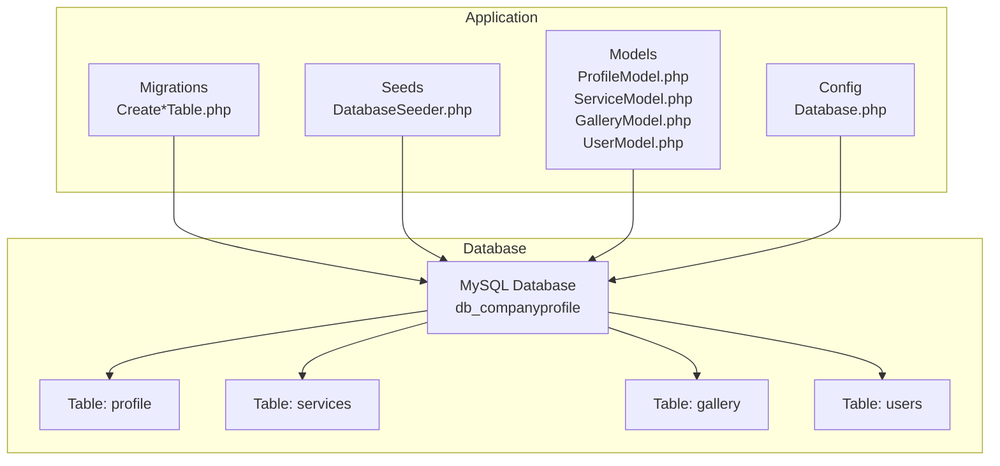
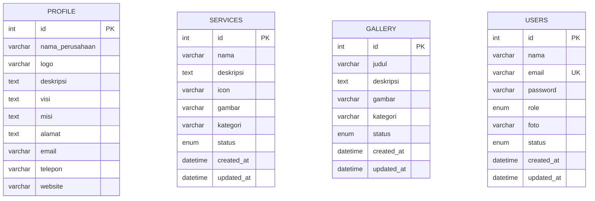
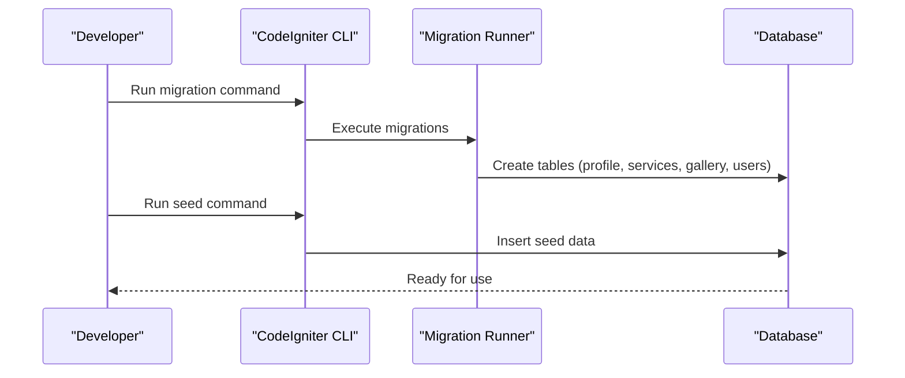
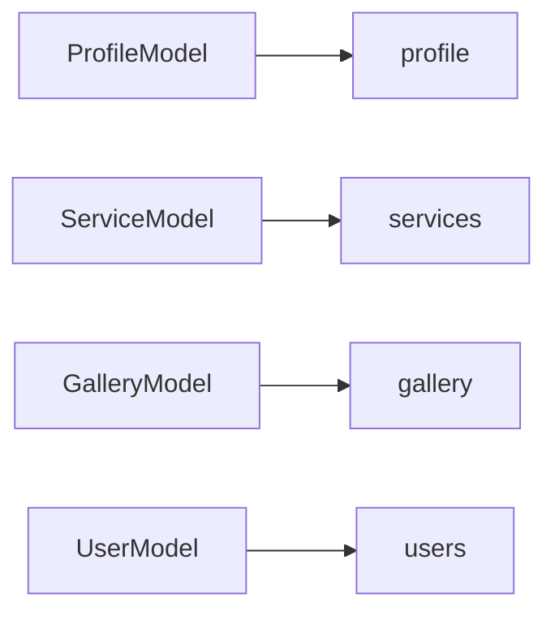

# Database Design

<cite>
**Referenced Files in This Document**
- [2024-01-01-000001_CreateProfileTable.php](file://app/Database/Migrations/2024-01-01-000001_CreateProfileTable.php)
- [2024-01-01-000002_CreateServicesTable.php](file://app/Database/Migrations/2024-01-01-000002_CreateServicesTable.php)
- [2024-01-01-000003_CreateGalleryTable.php](file://app/Database/Migrations/2024-01-01-000003_CreateGalleryTable.php)
- [2024-01-01-000004_CreateUsersTable.php](file://app/Database/Migrations/2024-01-01-000004_CreateUsersTable.php)
- [DatabaseSeeder.php](file://app/Database/Seeds/DatabaseSeeder.php)
- [ProfileModel.php](file://app/Models/ProfileModel.php)
- [ServiceModel.php](file://app/Models/ServiceModel.php)
- [GalleryModel.php](file://app/Models/GalleryModel.php)
- [UserModel.php](file://app/Models/UserModel.php)
- [Database.php](file://app/Config/Database.php)
- [db_company.sql](file://db_company.sql)
</cite>

## Table of Contents
1. [Introduction](#introduction)
2. [Project Structure](#project-structure)
3. [Core Components](#core-components)
4. [Architecture Overview](#architecture-overview)
5. [Detailed Component Analysis](#detailed-component-analysis)
6. [Dependency Analysis](#dependency-analysis)
7. [Performance Considerations](#performance-considerations)
8. [Troubleshooting Guide](#troubleshooting-guide)
9. [Conclusion](#conclusion)
10. [Appendices](#appendices)

## Introduction
This document provides comprehensive data model documentation for the company profile application’s database schema. It details the four main tables: profile, services, gallery, and users. For each table, we specify field definitions, data types, constraints, primary and unique keys, indexes, and validation rules enforced at the application level. We explain the data lifecycle, business rules, referential integrity, database initialization, seed data structure, migration management, data security considerations, backup strategies, and performance optimization via indexing. Entity relationship diagrams and sample data examples are included to aid understanding.

## Project Structure
The database schema is defined through CodeIgniter 4 migrations and seeds under the application’s Database directory. The models encapsulate CRUD operations and define allowed fields and timestamps behavior. The database configuration sets the connection parameters and charset/collation for UTF-8 multibyte support.

**Diagram sources**
- [2024-01-01-000001_CreateProfileTable.php:1-32](file://app/Database/Migrations/2024-01-01-000001_CreateProfileTable.php#L1-L32)
- [2024-01-01-000002_CreateServicesTable.php:1-31](file://app/Database/Migrations/2024-01-01-000002_CreateServicesTable.php#L1-L31)
- [2024-01-01-000003_CreateGalleryTable.php:1-30](file://app/Database/Migrations/2024-01-01-000003_CreateGalleryTable.php#L1-L30)
- [2024-01-01-000004_CreateUsersTable.php:1-32](file://app/Database/Migrations/2024-01-01-000004_CreateUsersTable.php#L1-L32)
- [DatabaseSeeder.php:1-66](file://app/Database/Seeds/DatabaseSeeder.php#L1-L66)
- [Database.php:1-205](file://app/Config/Database.php#L1-L205)

**Section sources**
- [Database.php:27-52](file://app/Config/Database.php#L27-L52)
- [2024-01-01-000001_CreateProfileTable.php:1-32](file://app/Database/Migrations/2024-01-01-000001_CreateProfileTable.php#L1-L32)
- [2024-01-01-000002_CreateServicesTable.php:1-31](file://app/Database/Migrations/2024-01-01-000002_CreateServicesTable.php#L1-L31)
- [2024-01-01-000003_CreateGalleryTable.php:1-30](file://app/Database/Migrations/2024-01-01-000003_CreateGalleryTable.php#L1-L30)
- [2024-01-01-000004_CreateUsersTable.php:1-32](file://app/Database/Migrations/2024-01-01-000004_CreateUsersTable.php#L1-L32)
- [DatabaseSeeder.php:1-66](file://app/Database/Seeds/DatabaseSeeder.php#L1-L66)

## Core Components
This section defines each table’s schema, constraints, and application-level behaviors.

- profile
  - Purpose: Stores company identity and contact information.
  - Primary key: id (auto-increment, unsigned INT)
  - Fields:
    - id: INT(11) UNSIGNED, PK, auto_increment
    - nama_perusahaan: VARCHAR(255), NOT NULL
    - logo: VARCHAR(255), NULL
    - deskripsi: TEXT, NULL
    - visi: TEXT, NULL
    - misi: TEXT, NULL
    - alamat: TEXT, NULL
    - email: VARCHAR(100), NULL
    - telepon: VARCHAR(20), NULL
    - website: VARCHAR(100), NULL
  - Indexes: None (only PK)
  - Application behavior: Model allows listed fields; retrieval via first() method.

- services
  - Purpose: Lists offered services with metadata and status.
  - Primary key: id (auto-increment, unsigned INT)
  - Fields:
    - id: INT(11) UNSIGNED, PK, auto_increment
    - nama: VARCHAR(255), NOT NULL
    - deskripsi: TEXT, NULL
    - icon: VARCHAR(100), NULL
    - gambar: VARCHAR(255), NULL
    - kategori: VARCHAR(100), NULL
    - status: ENUM('aktif','nonaktif'), NOT NULL, default 'aktif'
    - created_at: DATETIME, NULL
    - updated_at: DATETIME, NULL
  - Indexes: None (only PK)
  - Application behavior: Model allows listed fields; timestamps enabled.

- gallery
  - Purpose: Stores media entries (e.g., events, facilities) with categorization.
  - Primary key: id (auto-increment, unsigned INT)
  - Fields:
    - id: INT(11) UNSIGNED, PK, auto_increment
    - judul: VARCHAR(255), NOT NULL
    - deskripsi: TEXT, NULL
    - gambar: VARCHAR(255), NULL
    - kategori: VARCHAR(100), NULL
    - status: ENUM('aktif','nonaktif'), NOT NULL, default 'aktif'
    - created_at: DATETIME, NULL
    - updated_at: DATETIME, NULL
  - Indexes: None (only PK)
  - Application behavior: Model allows listed fields; timestamps enabled.

- users
  - Purpose: Authentication and authorization records for administrators.
  - Primary key: id (auto-increment, unsigned INT)
  - Unique key: email (unique)
  - Fields:
    - id: INT(11) UNSIGNED, PK, auto_increment
    - nama: VARCHAR(100), NOT NULL
    - email: VARCHAR(100), NOT NULL
    - password: VARCHAR(255), NOT NULL
    - role: ENUM('superadmin','admin'), NOT NULL, default 'admin'
    - foto: VARCHAR(255), NULL
    - status: ENUM('aktif','nonaktif'), NOT NULL, default 'aktif'
    - created_at: DATETIME, NULL
    - updated_at: DATETIME, NULL
  - Indexes: email (unique)
  - Application behavior: Model allows listed fields; timestamps enabled; password hidden from serialization.

Constraints summary:
- NOT NULL constraints apply to primary identifiers and mandatory fields (e.g., nama_perusahaan, nama, email, password).
- ENUM constraints restrict status and role values to predefined sets.
- Unique constraint on email ensures single registration per email address.

**Section sources**
- [2024-01-01-000001_CreateProfileTable.php:11-24](file://app/Database/Migrations/2024-01-01-000001_CreateProfileTable.php#L11-L24)
- [2024-01-01-000002_CreateServicesTable.php:11-23](file://app/Database/Migrations/2024-01-01-000002_CreateServicesTable.php#L11-L23)
- [2024-01-01-000003_CreateGalleryTable.php:11-22](file://app/Database/Migrations/2024-01-01-000003_CreateGalleryTable.php#L11-L22)
- [2024-01-01-000004_CreateUsersTable.php:11-24](file://app/Database/Migrations/2024-01-01-000004_CreateUsersTable.php#L11-L24)
- [ProfileModel.php:9-16](file://app/Models/ProfileModel.php#L9-L16)
- [ServiceModel.php:9-13](file://app/Models/ServiceModel.php#L9-L13)
- [GalleryModel.php:9-13](file://app/Models/GalleryModel.php#L9-L13)
- [UserModel.php:9-19](file://app/Models/UserModel.php#L9-L19)

## Architecture Overview
The database architecture follows a straightforward relational design with no explicit foreign keys between tables. Business logic and referential integrity are primarily enforced at the application layer via models and validation.

**Diagram sources**
- [2024-01-01-000001_CreateProfileTable.php:11-24](file://app/Database/Migrations/2024-01-01-000001_CreateProfileTable.php#L11-L24)
- [2024-01-01-000002_CreateServicesTable.php:11-23](file://app/Database/Migrations/2024-01-01-000002_CreateServicesTable.php#L11-L23)
- [2024-01-01-000003_CreateGalleryTable.php:11-22](file://app/Database/Migrations/2024-01-01-000003_CreateGalleryTable.php#L11-L22)
- [2024-01-01-000004_CreateUsersTable.php:11-24](file://app/Database/Migrations/2024-01-01-000004_CreateUsersTable.php#L11-L24)

## Detailed Component Analysis

### profile
- Schema and constraints:
  - PK: id
  - Mandatory: nama_perusahaan
  - Optional: logo, deskripsi, visi, misi, alamat, email, telepon, website
- Application behavior:
  - Model restricts allowed fields to company identity attributes.
  - Retrieval uses first() to fetch the single company profile record.
- Data lifecycle:
  - Typically inserted once via seed or admin panel; updated periodically.
- Business rules:
  - Company name must be present.
  - Contact fields are optional; presence depends on completeness.
- Referential integrity:
  - No foreign keys; self-contained table.

**Section sources**
- [2024-01-01-000001_CreateProfileTable.php:11-24](file://app/Database/Migrations/2024-01-01-000001_CreateProfileTable.php#L11-L24)
- [ProfileModel.php:9-16](file://app/Models/ProfileModel.php#L9-L16)

### services
- Schema and constraints:
  - PK: id
  - Mandatory: nama
  - Optional: deskripsi, icon, gambar, kategori
  - Status constrained to ENUM('aktif','nonaktif')
- Application behavior:
  - Model allows service metadata and status; timestamps enabled.
- Data lifecycle:
  - Inserted via seed; updated on edits; soft-like filtering can be applied by status.
- Business rules:
  - Status defaults to 'aktif'; categorization supports grouping.
- Referential integrity:
  - No foreign keys; self-contained table.

**Section sources**
- [2024-01-01-000002_CreateServicesTable.php:11-23](file://app/Database/Migrations/2024-01-01-000002_CreateServicesTable.php#L11-L23)
- [ServiceModel.php:9-13](file://app/Models/ServiceModel.php#L9-L13)

### gallery
- Schema and constraints:
  - PK: id
  - Mandatory: judul
  - Optional: deskripsi, gambar, kategori
  - Status constrained to ENUM('aktif','nonaktif')
- Application behavior:
  - Model allows gallery metadata and status; timestamps enabled.
- Data lifecycle:
  - Inserted via seed; updated on edits; filtered by status.
- Business rules:
  - Status defaults to 'aktif'; categorization supports browsing.
- Referential integrity:
  - No foreign keys; self-contained table.

**Section sources**
- [2024-01-01-000003_CreateGalleryTable.php:11-22](file://app/Database/Migrations/2024-01-01-000003_CreateGalleryTable.php#L11-L22)
- [GalleryModel.php:9-13](file://app/Models/GalleryModel.php#L9-L13)

### users
- Schema and constraints:
  - PK: id
  - Unique: email
  - Mandatory: nama, email, password
  - Role constrained to ENUM('superadmin','admin')
  - Status constrained to ENUM('aktif','nonaktif')
- Application behavior:
  - Model allows user attributes; timestamps enabled; password is hidden.
  - Lookup by email supported via dedicated method.
- Data lifecycle:
  - Inserted via seed; updated on profile changes; password hashed before storage.
- Business rules:
  - Unique email requirement; role and status enums enforce authorization and activation policies.
- Referential integrity:
  - No foreign keys; self-contained table.

**Section sources**
- [2024-01-01-000004_CreateUsersTable.php:11-24](file://app/Database/Migrations/2024-01-01-000004_CreateUsersTable.php#L11-L24)
- [UserModel.php:9-19](file://app/Models/UserModel.php#L9-L19)
- [DatabaseSeeder.php:54-63](file://app/Database/Seeds/DatabaseSeeder.php#L54-L63)

### Data Lifecycle and Business Rules Enforcement
- Creation:
  - profile: seeded once with company details.
  - services: seeded with initial service catalog; timestamps populated.
  - gallery: seeded with initial gallery items; timestamps populated.
  - users: seeded with admin credentials; password hashed.
- Updates:
  - All tables support updates via models; services and gallery include status toggling.
- Deletion:
  - No explicit deletion logic observed in migrations or seeds; consider implementing soft deletes or cascade rules if needed.
- Validation:
  - Database-level constraints (NOT NULL, ENUM, UNIQUE) are defined in migrations/seeds.
  - Application-level validation rules are configured but not table-specific in the provided files; business validations are enforced in controllers and services.

**Section sources**
- [DatabaseSeeder.php:11-63](file://app/Database/Seeds/DatabaseSeeder.php#L11-L63)
- [2024-01-01-000001_CreateProfileTable.php:11-24](file://app/Database/Migrations/2024-01-01-000001_CreateProfileTable.php#L11-L24)
- [2024-01-01-000002_CreateServicesTable.php:11-23](file://app/Database/Migrations/2024-01-01-000002_CreateServicesTable.php#L11-L23)
- [2024-01-01-000003_CreateGalleryTable.php:11-22](file://app/Database/Migrations/2024-01-01-000003_CreateGalleryTable.php#L11-L22)
- [2024-01-01-000004_CreateUsersTable.php:11-24](file://app/Database/Migrations/2024-01-01-000004_CreateUsersTable.php#L11-L24)

### Database Initialization and Migration Management
- Initialization script:
  - Creates database with utf8mb4 character set and collation.
  - Creates tables with identical schema to migrations.
  - Inserts seed data for profile, services, gallery, and users.
- Migrations:
  - Four migration files create the four tables with primary keys and indexes as documented.
  - Down methods drop tables for rollback.
- Seeding:
  - Single seeder inserts initial data for profile, services, gallery, and a superadmin user.
- Migration commands:
  - Use CodeIgniter CLI commands to migrate and seed (e.g., migrate, migrate:refresh, db:seed).

**Diagram sources**
- [db_company.sql:6-75](file://db_company.sql#L6-L75)
- [DatabaseSeeder.php:9-64](file://app/Database/Seeds/DatabaseSeeder.php#L9-L64)
- [2024-01-01-000001_CreateProfileTable.php:9-30](file://app/Database/Migrations/2024-01-01-000001_CreateProfileTable.php#L9-L30)
- [2024-01-01-000002_CreateServicesTable.php:9-29](file://app/Database/Migrations/2024-01-01-000002_CreateServicesTable.php#L9-L29)
- [2024-01-01-000003_CreateGalleryTable.php:9-28](file://app/Database/Migrations/2024-01-01-000003_CreateGalleryTable.php#L9-L28)
- [2024-01-01-000004_CreateUsersTable.php:9-30](file://app/Database/Migrations/2024-01-01-000004_CreateUsersTable.php#L9-L30)

**Section sources**
- [db_company.sql:6-75](file://db_company.sql#L6-L75)
- [DatabaseSeeder.php:9-64](file://app/Database/Seeds/DatabaseSeeder.php#L9-L64)
- [2024-01-01-000001_CreateProfileTable.php:9-30](file://app/Database/Migrations/2024-01-01-000001_CreateProfileTable.php#L9-L30)
- [2024-01-01-000002_CreateServicesTable.php:9-29](file://app/Database/Migrations/2024-01-01-000002_CreateServicesTable.php#L9-L29)
- [2024-01-01-000003_CreateGalleryTable.php:9-28](file://app/Database/Migrations/2024-01-01-000003_CreateGalleryTable.php#L9-L28)
- [2024-01-01-000004_CreateUsersTable.php:9-30](file://app/Database/Migrations/2024-01-01-000004_CreateUsersTable.php#L9-L30)

### Data Security Considerations
- Authentication:
  - Passwords are stored as bcrypt hashes; never plaintext.
  - Email uniqueness prevents duplicate accounts.
- Authorization:
  - Role ENUM limits administrative capabilities to superadmin and admin.
- Data exposure:
  - Password field is intentionally hidden in the UserModel.
- Transport and storage:
  - Database charset utf8mb4 and collation utf8mb4_unicode_ci ensure proper Unicode handling.
  - Consider enabling SSL/TLS for database connections in production.

**Section sources**
- [UserModel.php:13-19](file://app/Models/UserModel.php#L13-L19)
- [2024-01-01-000004_CreateUsersTable.php:16-18](file://app/Database/Migrations/2024-01-01-000004_CreateUsersTable.php#L16-L18)
- [DatabaseSeeder.php:58-58](file://app/Database/Seeds/DatabaseSeeder.php#L58-L58)
- [Database.php:37-38](file://app/Config/Database.php#L37-L38)

### Backup Strategies
- Logical backups:
  - Export schema and data using mysqldump or equivalent tools.
- Incremental backups:
  - Schedule periodic snapshots of the database.
- Point-in-time recovery:
  - Enable binary logging and configure retention policies.
- Testing isolation:
  - Use the separate test database configuration for automated testing.

**Section sources**
- [Database.php:165-191](file://app/Config/Database.php#L165-L191)

## Dependency Analysis
There are no explicit foreign keys among the four tables. The models do not declare relationships. Business dependencies are handled by application logic (e.g., controllers and services) rather than database-level referential constraints.

**Diagram sources**
- [ProfileModel.php:9-16](file://app/Models/ProfileModel.php#L9-L16)
- [ServiceModel.php:9-13](file://app/Models/ServiceModel.php#L9-L13)
- [GalleryModel.php:9-13](file://app/Models/GalleryModel.php#L9-L13)
- [UserModel.php:9-19](file://app/Models/UserModel.php#L9-L19)

**Section sources**
- [ProfileModel.php:9-16](file://app/Models/ProfileModel.php#L9-L16)
- [ServiceModel.php:9-13](file://app/Models/ServiceModel.php#L9-L13)
- [GalleryModel.php:9-13](file://app/Models/GalleryModel.php#L9-L13)
- [UserModel.php:9-19](file://app/Models/UserModel.php#L9-L19)

## Performance Considerations
- Indexes:
  - Current schema lacks secondary indexes. Add indexes on frequently queried columns:
    - users.email (already unique; consider covering queries)
    - services.kategori, services.status
    - gallery.kategori, gallery.status
- Storage engine:
  - Tables use InnoDB; ensure appropriate buffer pool sizing and file-per-table configuration.
- Character set and collation:
  - utf8mb4 is suitable for international text; ensure client connections use the same charset.
- Timestamps:
  - created_at/updated_at enable efficient sorting and filtering without additional indexes.

[No sources needed since this section provides general guidance]

## Troubleshooting Guide
- Migration failures:
  - Verify database connectivity and credentials in the database configuration.
  - Ensure the target database exists and is accessible.
- Seed errors:
  - Confirm that the seed data does not violate NOT NULL or ENUM constraints.
  - Check password hashing and email uniqueness.
- Model access issues:
  - Ensure allowedFields lists align with the schema.
  - Confirm timestamps are enabled when applicable.

**Section sources**
- [Database.php:27-52](file://app/Config/Database.php#L27-L52)
- [DatabaseSeeder.php:54-63](file://app/Database/Seeds/DatabaseSeeder.php#L54-L63)
- [ServiceModel.php:12-12](file://app/Models/ServiceModel.php#L12-L12)
- [GalleryModel.php:12-12](file://app/Models/GalleryModel.php#L12-L12)
- [UserModel.php:12-12](file://app/Models/UserModel.php#L12-L12)

## Conclusion
The database schema for the company profile application is a clean, normalized design with explicit constraints and a straightforward initialization process. While there are no foreign keys, application-level models and validation ensure data integrity and business rule enforcement. The provided migrations, seeds, and configuration support reproducible deployments and secure administration. For production, consider adding secondary indexes, establishing robust backup procedures, and enhancing referential integrity through foreign keys if relationships evolve.

## Appendices

### Appendix A: Field Reference and Types
- profile
  - id: INT(11) UNSIGNED, PK
  - nama_perusahaan: VARCHAR(255), NOT NULL
  - logo: VARCHAR(255), NULL
  - deskripsi: TEXT, NULL
  - visi: TEXT, NULL
  - misi: TEXT, NULL
  - alamat: TEXT, NULL
  - email: VARCHAR(100), NULL
  - telepon: VARCHAR(20), NULL
  - website: VARCHAR(100), NULL
- services
  - id: INT(11) UNSIGNED, PK
  - nama: VARCHAR(255), NOT NULL
  - deskripsi: TEXT, NULL
  - icon: VARCHAR(100), NULL
  - gambar: VARCHAR(255), NULL
  - kategori: VARCHAR(100), NULL
  - status: ENUM('aktif','nonaktif'), NOT NULL, default 'aktif'
  - created_at: DATETIME, NULL
  - updated_at: DATETIME, NULL
- gallery
  - id: INT(11) UNSIGNED, PK
  - judul: VARCHAR(255), NOT NULL
  - deskripsi: TEXT, NULL
  - gambar: VARCHAR(255), NULL
  - kategori: VARCHAR(100), NULL
  - status: ENUM('aktif','nonaktif'), NOT NULL, default 'aktif'
  - created_at: DATETIME, NULL
  - updated_at: DATETIME, NULL
- users
  - id: INT(11) UNSIGNED, PK
  - nama: VARCHAR(100), NOT NULL
  - email: VARCHAR(100), NOT NULL
  - password: VARCHAR(255), NOT NULL
  - role: ENUM('superadmin','admin'), NOT NULL, default 'admin'
  - foto: VARCHAR(255), NULL
  - status: ENUM('aktif','nonaktif'), NOT NULL, default 'aktif'
  - created_at: DATETIME, NULL
  - updated_at: DATETIME, NULL

**Section sources**
- [2024-01-01-000001_CreateProfileTable.php:11-24](file://app/Database/Migrations/2024-01-01-000001_CreateProfileTable.php#L11-L24)
- [2024-01-01-000002_CreateServicesTable.php:11-23](file://app/Database/Migrations/2024-01-01-000002_CreateServicesTable.php#L11-L23)
- [2024-01-01-000003_CreateGalleryTable.php:11-22](file://app/Database/Migrations/2024-01-01-000003_CreateGalleryTable.php#L11-L22)
- [2024-01-01-000004_CreateUsersTable.php:11-24](file://app/Database/Migrations/2024-01-01-000004_CreateUsersTable.php#L11-L24)

### Appendix B: Sample Data Examples
- profile
  - Example: Company name, description, vision, mission, address, email, phone, website.
- services
  - Example: Service name, description, icon, category, status.
- gallery
  - Example: Title, description, category, status.
- users
  - Example: Name, email, hashed password, role, status.

These examples are derived from the seed data and initialization script.

**Section sources**
- [DatabaseSeeder.php:12-63](file://app/Database/Seeds/DatabaseSeeder.php#L12-L63)
- [db_company.sql:91-138](file://db_company.sql#L91-L138)