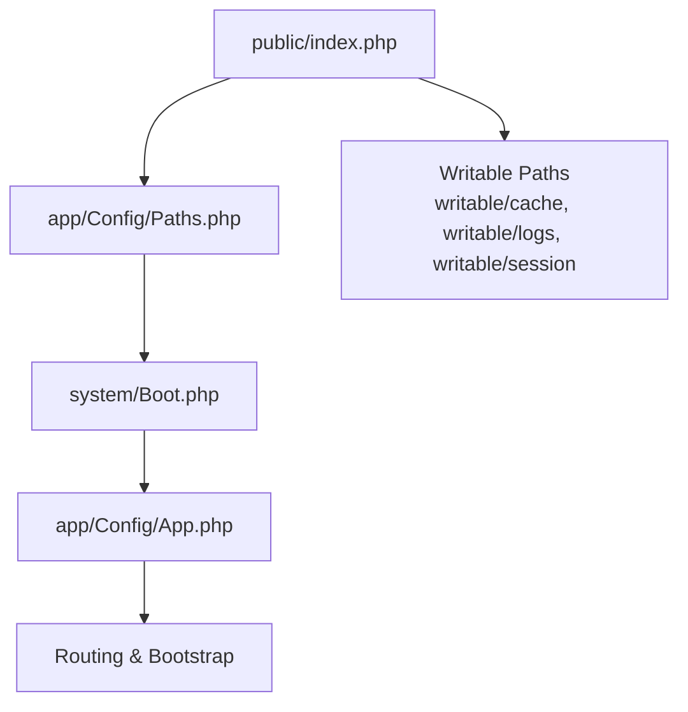
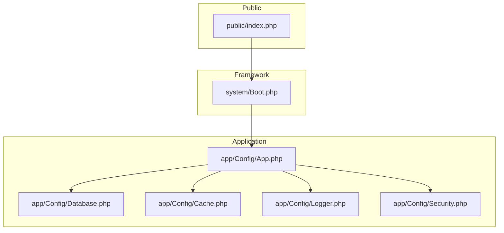
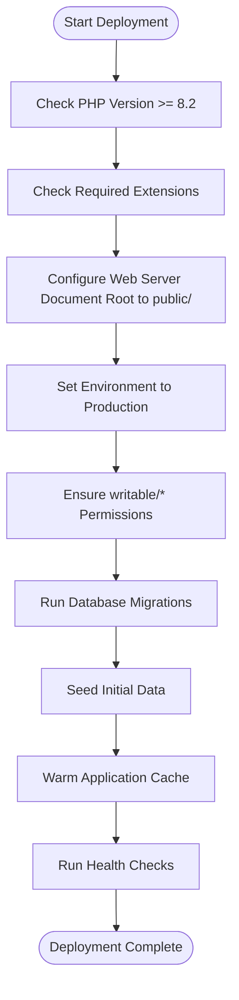
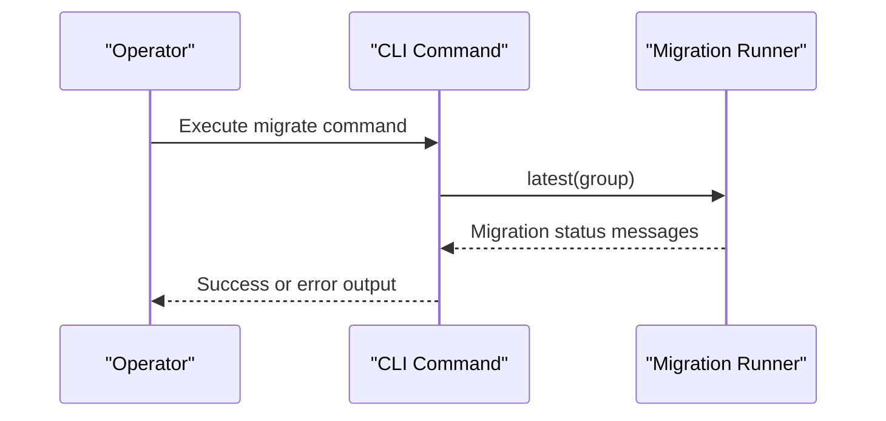
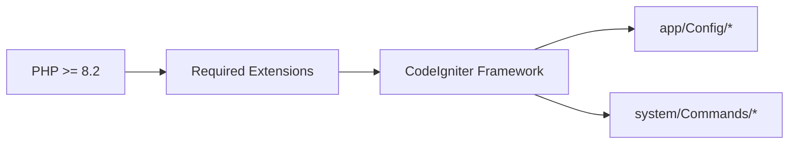
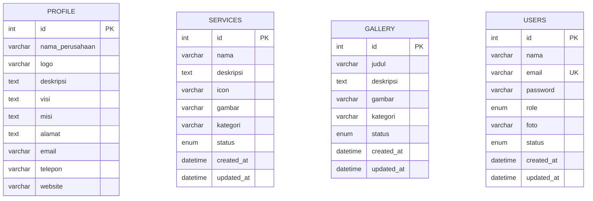

# Deployment & Maintenance

<cite>
**Referenced Files in This Document**
- [App.php](file://app/Config/App.php)
- [Database.php](file://app/Config/Database.php)
- [Cache.php](file://app/Config/Cache.php)
- [Logger.php](file://app/Config/Logger.php)
- [Security.php](file://app/Config/Security.php)
- [2024-01-01-000001_CreateProfileTable.php](file://app/Database/Migrations/2024-01-01-000001_CreateProfileTable.php)
- [2024-01-01-000002_CreateServicesTable.php](file://app/Database/Migrations/2024-01-01-000002_CreateServicesTable.php)
- [2024-01-01-000003_CreateGalleryTable.php](file://app/Database/Migrations/2024-01-01-000003_CreateGalleryTable.php)
- [2024-01-01-000004_CreateUsersTable.php](file://app/Database/Migrations/2024-01-01-000004_CreateUsersTable.php)
- [DatabaseSeeder.php](file://app/Database/Seeds/DatabaseSeeder.php)
- [Migrate.php](file://system/Commands/Database/Migrate.php)
- [composer.json](file://composer.json)
- [index.php](file://public/index.php)
- [Common.php](file://app/Common.php)
- [db_company.sql](file://db_company.sql)
</cite>

## Table of Contents
1. [Introduction](#introduction)
2. [Project Structure](#project-structure)
3. [Core Components](#core-components)
4. [Architecture Overview](#architecture-overview)
5. [Detailed Component Analysis](#detailed-component-analysis)
6. [Dependency Analysis](#dependency-analysis)
7. [Performance Considerations](#performance-considerations)
8. [Troubleshooting Guide](#troubleshooting-guide)
9. [Conclusion](#conclusion)
10. [Appendices](#appendices)

## Introduction
This document provides comprehensive guidance for deploying and maintaining the Company Profile application built on CodeIgniter 4. It covers production deployment steps, environment configuration, server requirements, database migration and seeding procedures, backup and restore strategies, performance optimization, caching, monitoring, security hardening, log rotation, error handling, update and rollback procedures, disaster recovery planning, maintenance schedules, health checks, and troubleshooting.

## Project Structure
The application follows a standard CodeIgniter 4 structure with application code under app/, framework under system/, and public-facing entry point under public/. Environment-specific configuration is managed via config classes under app/Config/*. Database migrations and seeds are located under app/Database/.

**Diagram sources**
- [index.php:57-67](file://public/index.php#L57-L67)
- [App.php:19-20](file://app/Config/App.php#L19-L20)

**Section sources**
- [index.php:1-68](file://public/index.php#L1-L68)
- [composer.json:53-60](file://composer.json#L53-L60)

## Core Components
- Application configuration: base URL, index page, URI protocol, charset, time zone, CSP, and reverse proxy settings.
- Database configuration: default connection settings, test connection, and environment-aware selection.
- Cache configuration: primary and backup handlers, TTL, reserved characters, and page caching options.
- Logging configuration: threshold level and handlers for production vs development.
- Security configuration: CSRF protection method, token names, expiration, regeneration, and redirect behavior.
- Migrations and seeds: structured schema creation and initial dataset population.

**Section sources**
- [App.php:19-20](file://app/Config/App.php#L19-L20)
- [Database.php:27-52](file://app/Config/Database.php#L27-L52)
- [Cache.php:25-36](file://app/Config/Cache.php#L25-L36)
- [Logger.php:42-42](file://app/Config/Logger.php#L42-L42)
- [Security.php:18-86](file://app/Config/Security.php#L18-L86)

## Architecture Overview
The runtime architecture starts at the public entry point, which validates PHP version and required extensions, defines the front controller path, loads application paths, boots the framework, and dispatches requests. Configuration classes define behavior for routing, database connections, caching, logging, and security.

**Diagram sources**
- [index.php:57-67](file://public/index.php#L57-L67)
- [App.php:19-20](file://app/Config/App.php#L19-L20)
- [Database.php:27-52](file://app/Config/Database.php#L27-L52)
- [Cache.php:25-36](file://app/Config/Cache.php#L25-L36)
- [Logger.php:42-42](file://app/Config/Logger.php#L42-L42)
- [Security.php:18-86](file://app/Config/Security.php#L18-L86)

## Detailed Component Analysis

### Production Deployment Steps
- Prepare server environment with PHP 8.2+ and required extensions (mbstring, json, mysqlnd).
- Configure web server to point document root to public/.
- Set application environment to production and configure base URL accordingly.
- Ensure writable/* directories are writable by the web server.
- Run database migrations and seed initial data.
- Warm caches and verify application health.

**Section sources**
- [index.php:12-32](file://public/index.php#L12-L32)
- [composer.json:12-18](file://composer.json#L12-L18)
- [App.php:19-20](file://app/Config/App.php#L19-L20)
- [Database.php:27-52](file://app/Config/Database.php#L27-L52)
- [DatabaseSeeder.php:9-64](file://app/Database/Seeds/DatabaseSeeder.php#L9-L64)

### Environment Configuration
- Base URL must reflect the production domain and public subdirectory.
- Reverse proxy IPs should be configured if behind load balancers or CDNs.
- Force secure requests can be enabled for HTTPS-only deployments.
- Logging threshold is set to a production-appropriate level.

**Section sources**
- [App.php:19-20](file://app/Config/App.php#L19-L20)
- [App.php:160-183](file://app/Config/App.php#L160-L183)
- [App.php:160-161](file://app/Config/App.php#L160-L161)
- [Logger.php:42-42](file://app/Config/Logger.php#L42-L42)

### Server Requirements
- PHP 8.2 or higher.
- Required extensions: mbstring, json, mysqlnd.
- Composer for dependency management.
- Web server configured to serve from public/ with clean URLs.

**Section sources**
- [index.php:12-32](file://public/index.php#L12-L32)
- [composer.json:12-18](file://composer.json#L12-L18)

### Database Migration Procedures
- Migrations are organized under app/Database/Migrations with timestamped filenames.
- Use the framework’s migration command to apply pending migrations.
- The migration runner supports namespace and group selection.

**Diagram sources**
- [Migrate.php:71-107](file://system/Commands/Database/Migrate.php#L71-L107)

**Section sources**
- [2024-01-01-000001_CreateProfileTable.php:9-31](file://app/Database/Migrations/2024-01-01-000001_CreateProfileTable.php#L9-L31)
- [2024-01-01-000002_CreateServicesTable.php:9-30](file://app/Database/Migrations/2024-01-01-000002_CreateServicesTable.php#L9-L30)
- [2024-01-01-000003_CreateGalleryTable.php:9-29](file://app/Database/Migrations/2024-01-01-000003_CreateGalleryTable.php#L9-L29)
- [2024-01-01-000004_CreateUsersTable.php:9-31](file://app/Database/Migrations/2024-01-01-000004_CreateUsersTable.php#L9-L31)
- [Database.php:27-52](file://app/Config/Database.php#L27-L52)
- [Migrate.php:71-107](file://system/Commands/Database/Migrate.php#L71-L107)

### Backup Strategies
- Export database schema and data using mysqldump or equivalent.
- Include application code and writable/* contents for full recovery.
- Store backups offsite and encrypt sensitive data.

**Section sources**
- [db_company.sql](file://db_company.sql)

### Restore Processes
- Restore database dump to target environment.
- Deploy application code and ensure writable/* permissions.
- Re-run migrations and re-seed if necessary.

**Section sources**
- [db_company.sql](file://db_company.sql)

### Performance Optimization Techniques
- Enable and configure appropriate cache handlers (file, memcached, redis).
- Set cache TTL and page caching status codes for production.
- Tune database connection settings and charset collation.
- Minimize unnecessary logging in production.

**Section sources**
- [Cache.php:25-36](file://app/Config/Cache.php#L25-L36)
- [Cache.php:59-59](file://app/Config/Cache.php#L59-L59)
- [Cache.php:173-197](file://app/Config/Cache.php#L173-L197)
- [Database.php:27-52](file://app/Config/Database.php#L27-L52)
- [Logger.php:42-42](file://app/Config/Logger.php#L42-L42)

### Caching Strategies
- Primary handler: file recommended for simplicity; alternatives include memcached or redis.
- Backup handler: dummy ensures resilience if primary fails.
- Page caching: restrict to successful responses in production.

**Section sources**
- [Cache.php:25-36](file://app/Config/Cache.php#L25-L36)
- [Cache.php:146-154](file://app/Config/Cache.php#L146-L154)
- [Cache.php:173-197](file://app/Config/Cache.php#L173-L197)

### Monitoring Setup
- Enable logging with appropriate thresholds.
- Use file handler for persistent logs; ensure writable/logs is writable.
- Monitor log sizes and rotate logs regularly.

**Section sources**
- [Logger.php:42-42](file://app/Config/Logger.php#L42-L42)
- [Logger.php:85-122](file://app/Config/Logger.php#L85-L122)

### Security Hardening Measures
- CSRF protection enabled with cookie method and token regeneration.
- Redirect on CSRF failure in production.
- Enforce HTTPS and HSTS where applicable.
- Restrict allowed URI characters and negotiate locale if needed.

**Section sources**
- [Security.php:18-86](file://app/Config/Security.php#L18-L86)
- [App.php:160-161](file://app/Config/App.php#L160-L161)
- [App.php:84-84](file://app/Config/App.php#L84-L84)

### Log Rotation and Error Handling
- Use file handler with controlled permissions and optional extension.
- Adjust threshold to reduce noise in production.
- Implement external log aggregation if available.

**Section sources**
- [Logger.php:85-122](file://app/Config/Logger.php#L85-L122)
- [Logger.php:42-42](file://app/Config/Logger.php#L42-L42)

### Update Procedures
- Pull latest code and run composer install/update.
- Execute database migrations.
- Clear and warm caches.
- Verify application health.

**Section sources**
- [composer.json:66-68](file://composer.json#L66-L68)
- [Migrate.php:71-107](file://system/Commands/Database/Migrate.php#L71-L107)
- [Cache.php:25-36](file://app/Config/Cache.php#L25-L36)

### Rollback Strategies
- Keep previous database dumps and application versions.
- Revert to prior code version and roll back migrations to target version.
- Restore database to pre-update snapshot.

**Section sources**
- [db_company.sql](file://db_company.sql)

### Disaster Recovery Planning
- Maintain hot or warm standby environments.
- Automate backups with retention policies.
- Document recovery playbooks and test regularly.

[No sources needed since this section provides general guidance]

### Maintenance Schedules
- Daily: monitor logs and disk usage.
- Weekly: review cache health and prune old entries.
- Monthly: rotate logs, update dependencies, and re-run migrations if needed.

[No sources needed since this section provides general guidance]

### Health Check Procedures
- Verify database connectivity and migration status.
- Confirm cache availability and response caching behavior.
- Validate CSRF and security headers.
- Check writable/* accessibility.

**Section sources**
- [Database.php:27-52](file://app/Config/Database.php#L27-L52)
- [Cache.php:25-36](file://app/Config/Cache.php#L25-L36)
- [Security.php:18-86](file://app/Config/Security.php#L18-L86)

## Dependency Analysis
The application depends on PHP 8.2+, specific extensions, and Composer-managed packages. The public entry point enforces minimum PHP version and required extensions before bootstrapping the framework.

**Diagram sources**
- [index.php:12-32](file://public/index.php#L12-L32)
- [composer.json:12-18](file://composer.json#L12-L18)

**Section sources**
- [index.php:12-32](file://public/index.php#L12-L32)
- [composer.json:12-18](file://composer.json#L12-L18)

## Performance Considerations
- Choose a production-grade cache backend (e.g., Redis or Memcached) for high traffic.
- Limit cached status codes to successful responses to avoid caching transient errors.
- Ensure database charset and collation align with content requirements.
- Reduce logging verbosity in production to minimize I/O overhead.

[No sources needed since this section provides general guidance]

## Troubleshooting Guide
- PHP version or extension errors: verify minimum PHP version and presence of required extensions.
- Database connection failures: confirm credentials and network access; check default group selection.
- Cache write failures: verify writable/cache permissions and available storage.
- CSRF failures: ensure tokens are present and cookies are accepted; check redirect behavior in production.
- Excessive logs: adjust threshold and handler configuration.

**Section sources**
- [index.php:12-32](file://public/index.php#L12-L32)
- [Database.php:27-52](file://app/Config/Database.php#L27-L52)
- [Cache.php:84-87](file://app/Config/Cache.php#L84-L87)
- [Security.php:18-86](file://app/Config/Security.php#L18-L86)
- [Logger.php:42-42](file://app/Config/Logger.php#L42-L42)

## Conclusion
By following the deployment and maintenance procedures outlined—ensuring proper environment configuration, applying migrations and seeds, configuring caching and logging, enforcing security controls, and establishing robust backup and recovery processes—you can operate a reliable and secure production instance of the Company Profile application.

[No sources needed since this section summarizes without analyzing specific files]

## Appendices

### Database Schema Overview
- profile: company information and contact details.
- services: service offerings with categories and status.
- gallery: media assets with categorization and status.
- users: administrative accounts with roles and status.

**Diagram sources**
- [2024-01-01-000001_CreateProfileTable.php:11-24](file://app/Database/Migrations/2024-01-01-000001_CreateProfileTable.php#L11-L24)
- [2024-01-01-000002_CreateServicesTable.php:11-23](file://app/Database/Migrations/2024-01-01-000002_CreateServicesTable.php#L11-L23)
- [2024-01-01-000003_CreateGalleryTable.php:11-22](file://app/Database/Migrations/2024-01-01-000003_CreateGalleryTable.php#L11-L22)
- [2024-01-01-000004_CreateUsersTable.php:11-24](file://app/Database/Migrations/2024-01-01-000004_CreateUsersTable.php#L11-L24)

### Initial Data Seeding
- Inserts default company profile, sample services, gallery items, and a superadmin user.

**Section sources**
- [DatabaseSeeder.php:9-64](file://app/Database/Seeds/DatabaseSeeder.php#L9-L64)