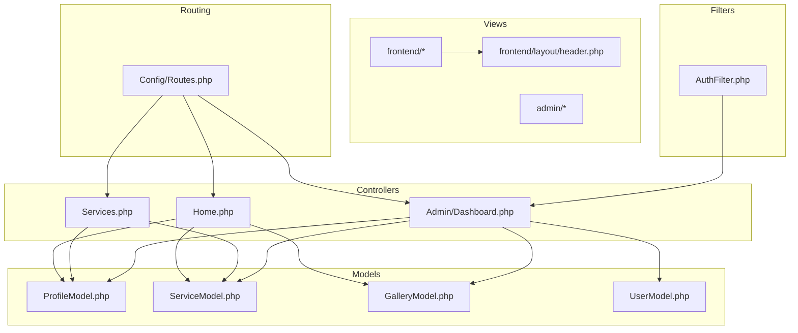
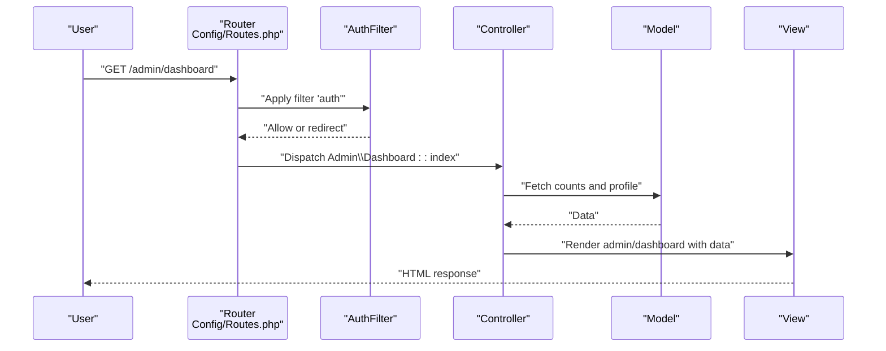
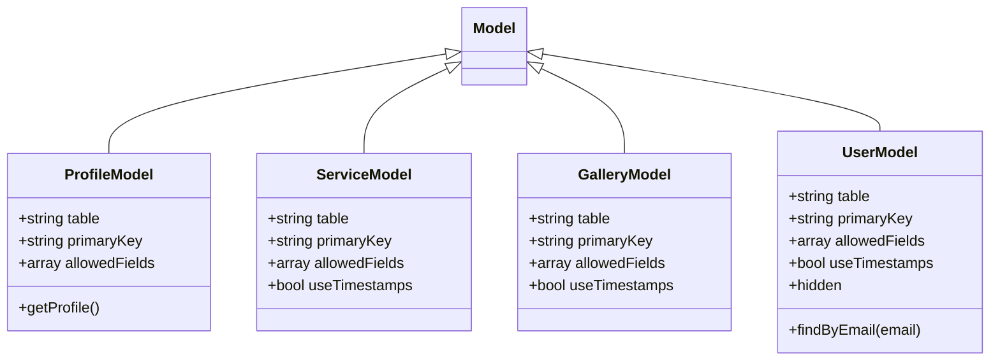
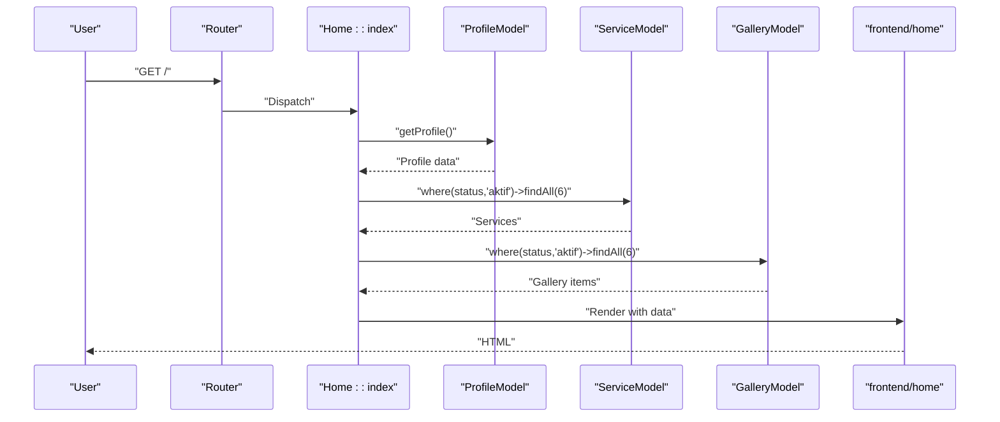
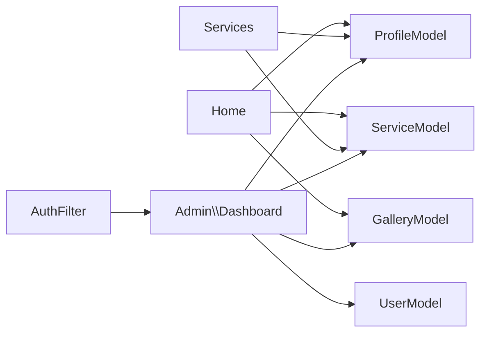
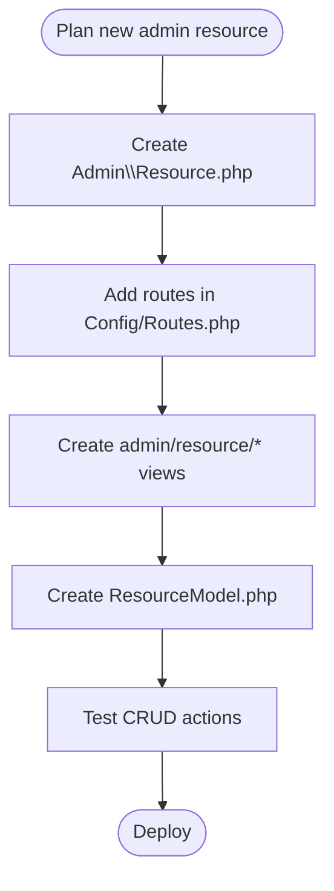

# Development Guidelines

<cite>
**Referenced Files in This Document**
- [BaseController.php](file://app/Controllers/BaseController.php)
- [Home.php](file://app/Controllers/Home.php)
- [Services.php](file://app/Controllers/Services.php)
- [Dashboard.php](file://app/Controllers/Admin/Dashboard.php)
- [AuthFilter.php](file://app/Filters/AuthFilter.php)
- [Routes.php](file://app/Config/Routes.php)
- [Validation.php](file://app/Config/Validation.php)
- [Autoload.php](file://app/Config/Autoload.php)
- [UserModel.php](file://app/Models/UserModel.php)
- [ProfileModel.php](file://app/Models/ProfileModel.php)
- [GalleryModel.php](file://app/Models/GalleryModel.php)
- [ServiceModel.php](file://app/Models/ServiceModel.php)
- [header.php](file://app/Views/frontend/layout/header.php)
</cite>

## Table of Contents
1. [Introduction](#introduction)
2. [Project Structure](#project-structure)
3. [Core Components](#core-components)
4. [Architecture Overview](#architecture-overview)
5. [Detailed Component Analysis](#detailed-component-analysis)
6. [Dependency Analysis](#dependency-analysis)
7. [Performance Considerations](#performance-considerations)
8. [Security Coding Practices](#security-coding-practices)
9. [Testing Strategies](#testing-strategies)
10. [Debugging Approaches](#debugging-approaches)
11. [Code Review Guidelines](#code-review-guidelines)
12. [Maintainability Principles](#maintainability-principles)
13. [Common Development Tasks and Extension Patterns](#common-development-tasks-and-extension-patterns)
14. [Conclusion](#conclusion)

## Introduction
This document provides comprehensive development guidelines for extending and maintaining the CodeIgniter 4 company profile application. It consolidates coding standards, naming conventions, architectural patterns, model development, validation, controller best practices, view organization, helper usage, and library integration. It also covers testing, debugging, performance optimization, security, and maintainability, with practical examples mapped to the existing codebase.

## Project Structure
The application follows a layered MVC structure typical of CodeIgniter 4:
- Controllers under app/Controllers and app/Controllers/Admin
- Models under app/Models
- Views under app/Views grouped by frontend and admin areas
- Filters under app/Filters
- Configuration under app/Config
- Autoload configuration under app/Config/Autoload.php

**Diagram sources**
- [Home.php:1-27](file://app/Controllers/Home.php#L1-L27)
- [Services.php:1-22](file://app/Controllers/Services.php#L1-L22)
- [Dashboard.php:1-25](file://app/Controllers/Admin/Dashboard.php#L1-L25)
- [ProfileModel.php:1-18](file://app/Models/ProfileModel.php#L1-L18)
- [ServiceModel.php:1-14](file://app/Models/ServiceModel.php#L1-L14)
- [GalleryModel.php:1-14](file://app/Models/GalleryModel.php#L1-L14)
- [UserModel.php:1-20](file://app/Models/UserModel.php#L1-L20)
- [header.php:1-359](file://app/Views/frontend/layout/header.php#L1-L359)
- [Routes.php:1-55](file://app/Config/Routes.php#L1-L55)
- [AuthFilter.php:1-23](file://app/Filters/AuthFilter.php#L1-L23)

**Section sources**
- [Routes.php:1-55](file://app/Config/Routes.php#L1-L55)
- [Autoload.php:1-93](file://app/Config/Autoload.php#L1-L93)

## Core Components
- BaseController: Centralizes shared initialization and helper loading for all controllers.
- Models: Encapsulate table metadata, allowed fields, timestamps, and convenience methods.
- Controllers: Coordinate data retrieval via models and render views with prepared data.
- Filters: Enforce access control for admin routes.
- Routing: Defines frontend and admin routes, including grouped protected routes.

Key implementation patterns:
- Controllers extend BaseController and load helpers declared in the base class.
- Models define table, primary key, allowed fields, timestamps, and custom finder methods.
- Admin routes are grouped with a filter to enforce authentication.

**Section sources**
- [BaseController.php:1-26](file://app/Controllers/BaseController.php#L1-L26)
- [UserModel.php:1-20](file://app/Models/UserModel.php#L1-L20)
- [ProfileModel.php:1-18](file://app/Models/ProfileModel.php#L1-L18)
- [GalleryModel.php:1-14](file://app/Models/GalleryModel.php#L1-L14)
- [ServiceModel.php:1-14](file://app/Models/ServiceModel.php#L1-L14)
- [Dashboard.php:1-25](file://app/Controllers/Admin/Dashboard.php#L1-L25)
- [AuthFilter.php:1-23](file://app/Filters/AuthFilter.php#L1-L23)
- [Routes.php:1-55](file://app/Config/Routes.php#L1-L55)

## Architecture Overview
The application uses a clean separation of concerns:
- HTTP requests enter via routing and filters.
- Controllers orchestrate data fetching from Models.
- Views render the response, leveraging shared layouts and helpers.

**Diagram sources**
- [Routes.php:23-25](file://app/Config/Routes.php#L23-L25)
- [AuthFilter.php:11-16](file://app/Filters/AuthFilter.php#L11-L16)
- [Dashboard.php:13-23](file://app/Controllers/Admin/Dashboard.php#L13-L23)
- [ProfileModel.php:13-16](file://app/Models/ProfileModel.php#L13-L16)
- [ServiceModel.php:1-14](file://app/Models/ServiceModel.php#L1-L14)
- [GalleryModel.php:1-14](file://app/Models/GalleryModel.php#L1-L14)
- [UserModel.php:1-20](file://app/Models/UserModel.php#L1-L20)

## Detailed Component Analysis

### BaseController
- Purpose: Initialize controller with request/response/logger and declare commonly used helpers.
- Best practices:
  - Keep shared logic here (e.g., helper loading) to avoid duplication.
  - Avoid heavy operations in initController to minimize overhead.

**Section sources**
- [BaseController.php:12-24](file://app/Controllers/BaseController.php#L12-L24)

### Models
- Naming and conventions:
  - Singular class names ending with Model (e.g., ProfileModel).
  - Table names derived from pluralized class names unless overridden.
- Configuration:
  - Define $table, $primaryKey, $allowedFields, $useTimestamps, and $hidden as appropriate.
- Finder methods:
  - Add domain-specific methods (e.g., ProfileModel::getProfile, UserModel::findByEmail) to encapsulate queries.

**Diagram sources**
- [ProfileModel.php:7-17](file://app/Models/ProfileModel.php#L7-L17)
- [ServiceModel.php:7-13](file://app/Models/ServiceModel.php#L7-L13)
- [GalleryModel.php:7-13](file://app/Models/GalleryModel.php#L7-L13)
- [UserModel.php:7-19](file://app/Models/UserModel.php#L7-L19)

**Section sources**
- [ProfileModel.php:1-18](file://app/Models/ProfileModel.php#L1-L18)
- [ServiceModel.php:1-14](file://app/Models/ServiceModel.php#L1-L14)
- [GalleryModel.php:1-14](file://app/Models/GalleryModel.php#L1-L14)
- [UserModel.php:1-20](file://app/Models/UserModel.php#L1-L20)

### Controllers
- Home controller:
  - Loads ProfileModel, ServiceModel, and GalleryModel.
  - Prepares data for frontend/home view.
- Services controller:
  - Loads ProfileModel and ServiceModel.
  - Filters services by status for display.
- Admin Dashboard controller:
  - Uses countAll and getProfile to build summary metrics.
- Best practices:
  - Keep controllers thin; delegate data access to models.
  - Use helper arrays from BaseController consistently.
  - Avoid embedding business logic in views.

**Diagram sources**
- [Home.php:11-25](file://app/Controllers/Home.php#L11-L25)
- [ProfileModel.php:13-16](file://app/Models/ProfileModel.php#L13-L16)
- [ServiceModel.php:1-14](file://app/Models/ServiceModel.php#L1-L14)
- [GalleryModel.php:1-14](file://app/Models/GalleryModel.php#L1-L14)

**Section sources**
- [Home.php:1-27](file://app/Controllers/Home.php#L1-L27)
- [Services.php:1-22](file://app/Controllers/Services.php#L1-L22)
- [Dashboard.php:1-25](file://app/Controllers/Admin/Dashboard.php#L1-L25)

### Filters
- AuthFilter:
  - Checks session flag to protect admin routes.
  - Redirects unauthenticated users to login.
- Best practices:
  - Keep filter logic minimal and fast.
  - Use route groups to apply filters consistently.

**Section sources**
- [AuthFilter.php:1-23](file://app/Filters/AuthFilter.php#L1-L23)
- [Routes.php:23-25](file://app/Config/Routes.php#L23-L25)

### Validation
- Validation configuration:
  - Rule sets include strict rules for common validations.
  - Templates specify list and single error rendering views.
- Best practices:
  - Use strict rule sets for robust validation.
  - Centralize validation messages in language files.
  - Apply validation in controllers before model operations.

**Section sources**
- [Validation.php:1-45](file://app/Config/Validation.php#L1-L45)

### Views and Layout Organization
- Shared layout:
  - header.php includes meta tags, styles, navigation, and scripts.
  - Uses profile data and helper functions for safe output.
- Frontend templates:
  - Organized under frontend/ with dedicated pages (home, services, gallery, contact).
- Best practices:
  - Escape dynamic content with esc().
  - Reuse layout fragments to reduce duplication.
  - Keep presentation logic in views minimal; pass structured data from controllers.

**Section sources**
- [header.php:1-359](file://app/Views/frontend/layout/header.php#L1-L359)

### Autoload and Helper Usage
- Autoload configuration:
  - PSR-4 mapping for the App namespace.
  - Optional classmap and files autoload entries.
- Helpers:
  - BaseController declares url, form, and text helpers for all controllers.
- Best practices:
  - Prefer PSR-4 autoload; avoid manual classmaps unless necessary.
  - Load helpers at the base controller level to ensure availability.

**Section sources**
- [Autoload.php:40-92](file://app/Config/Autoload.php#L40-L92)
- [BaseController.php:16-16](file://app/Controllers/BaseController.php#L16-L16)

## Dependency Analysis
- Controllers depend on Models for data access.
- Admin controllers depend on multiple models for dashboards.
- Filters depend on session state to gate routes.
- Views depend on data passed by controllers and shared layout.

**Diagram sources**
- [Home.php:1-27](file://app/Controllers/Home.php#L1-L27)
- [Services.php:1-22](file://app/Controllers/Services.php#L1-L22)
- [Dashboard.php:1-25](file://app/Controllers/Admin/Dashboard.php#L1-L25)
- [AuthFilter.php:1-23](file://app/Filters/AuthFilter.php#L1-L23)
- [ProfileModel.php:1-18](file://app/Models/ProfileModel.php#L1-L18)
- [ServiceModel.php:1-14](file://app/Models/ServiceModel.php#L1-L14)
- [GalleryModel.php:1-14](file://app/Models/GalleryModel.php#L1-L14)
- [UserModel.php:1-20](file://app/Models/UserModel.php#L1-L20)

**Section sources**
- [Routes.php:1-55](file://app/Config/Routes.php#L1-L55)

## Performance Considerations
- Minimize N+1 queries by batching model calls in controllers.
- Use limit clauses for paginated lists (as seen with findAll(6)).
- Enable caching for expensive computations or frequently accessed data.
- Avoid heavy logic in views; compute early in controllers.
- Use database indexes on frequently filtered columns (e.g., status).

[No sources needed since this section provides general guidance]

## Security Coding Practices
- Authentication:
  - Enforce session-based checks in AuthFilter for admin routes.
- Input validation:
  - Use strict validation rules and centralized templates.
- Output escaping:
  - Always escape dynamic content in views (esc()).
- CSRF protection:
  - Ensure CSRF filter is enabled via filters configuration.
- Least privilege:
  - Restrict admin actions behind session checks.

**Section sources**
- [AuthFilter.php:11-16](file://app/Filters/AuthFilter.php#L11-L16)
- [Validation.php:23-39](file://app/Config/Validation.php#L23-L39)

## Testing Strategies
- Unit tests:
  - Test model methods (finders, CRUD) in isolation.
- Feature tests:
  - Simulate controller actions and route flows.
- Database tests:
  - Use migrations and seeders to prepare test data.
- Mock external dependencies:
  - Mock sessions, helpers, and third-party integrations during tests.

[No sources needed since this section provides general guidance]

## Debugging Approaches
- Logging:
  - Use CodeIgniter’s logger to record contextual information.
- Profiling:
  - Utilize built-in toolbar and performance metrics.
- Error pages:
  - Customize error views for better diagnostics.
- Step-through debugging:
  - Use IDE breakpoints in controllers and models.

[No sources needed since this section provides general guidance]

## Code Review Guidelines
- Consistency:
  - Follow PSR-4 namespaces and singular Model naming.
- Separation of concerns:
  - Keep controllers thin; move logic to models or services.
- Validation:
  - Validate inputs before processing; surface meaningful errors.
- Security:
  - Escape output; enforce authentication for admin routes.
- Readability:
  - Use descriptive variable names; keep methods focused.

[No sources needed since this section provides general guidance]

## Maintainability Principles
- Modularization:
  - Group related controllers and views under admin/ and frontend/.
- Configuration centralization:
  - Manage routes, filters, and validation in dedicated config files.
- Documentation:
  - Comment complex logic; update README with setup steps.
- Refactoring:
  - Extract repeated patterns into base classes or services.

[No sources needed since this section provides general guidance]

## Common Development Tasks and Extension Patterns

### Extend a New Admin Section
- Create a new controller under Admin with CRUD actions.
- Add routes grouped with the auth filter.
- Build views under admin/<resource>/ with shared layout.
- Implement model methods for data access.

**Diagram sources**
- [Routes.php:23-54](file://app/Config/Routes.php#L23-L54)
- [Dashboard.php:1-25](file://app/Controllers/Admin/Dashboard.php#L1-L25)

### Add a New Validation Rule Set
- Define rule set classes and register them in Validation config.
- Configure error templates for consistent UX.
- Apply rules in controllers before model writes.

**Section sources**
- [Validation.php:23-39](file://app/Config/Validation.php#L23-L39)

### Introduce a Shared Helper Function
- Place helper function in app/Helpers/<name>_helper.php.
- Register helper in BaseController::$helpers or Autoload::$helpers.
- Use consistently across controllers and views.

**Section sources**
- [BaseController.php:16-16](file://app/Controllers/BaseController.php#L16-L16)
- [Autoload.php:82-92](file://app/Config/Autoload.php#L82-L92)

### Implement Pagination
- Use Pager service to paginate model results.
- Pass page number via route segments or query parameters.
- Render pager links in views.

[No sources needed since this section provides general guidance]

### Optimize a Slow Controller Action
- Analyze queries and add indexes.
- Limit result sets and eager-load relations.
- Cache computed data.

[No sources needed since this section provides general guidance]

## Conclusion
By adhering to the established patterns—thin controllers, expressive models, shared base classes, strict validation, and secure routing—you can reliably extend and maintain the application. Use the provided diagrams and references to align new features with existing conventions and ensure long-term maintainability.