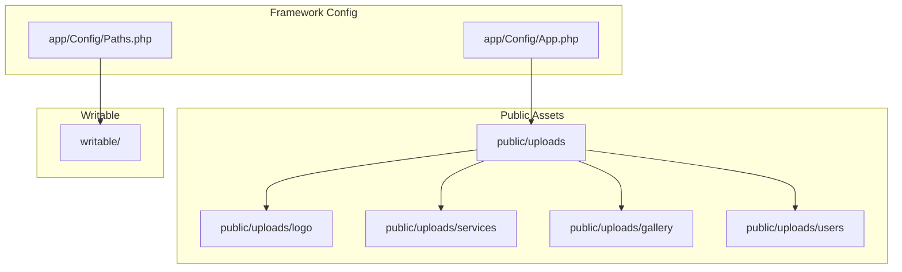
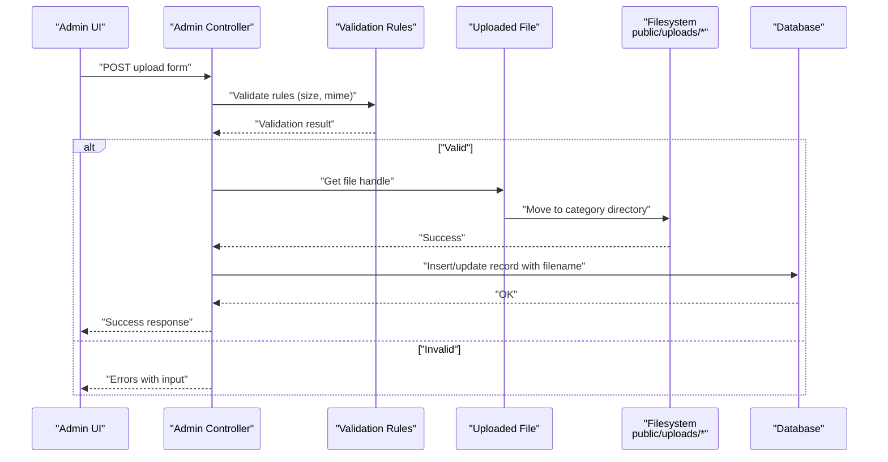
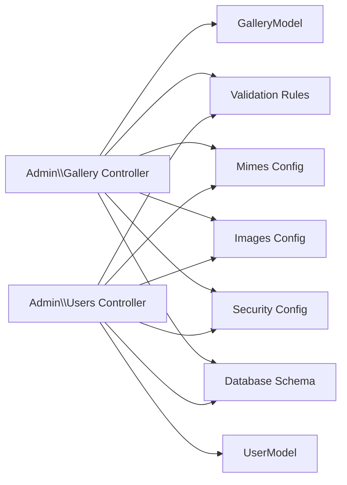

# File Upload System

<cite>
**Referenced Files in This Document**
- [Images.php](file://app/Config/Images.php)
- [Mimes.php](file://app/Config/Mimes.php)
- [Validation.php](file://app/Config/Validation.php)
- [App.php](file://app/Config/App.php)
- [Paths.php](file://app/Config/Paths.php)
- [Security.php](file://app/Config/Security.php)
- [Gallery.php](file://app/Controllers/Admin/Gallery.php)
- [Users.php](file://app/Controllers/Admin/Users.php)
- [GalleryModel.php](file://app/Models/GalleryModel.php)
- [UserModel.php](file://app/Models/UserModel.php)
- [ServiceModel.php](file://app/Models/ServiceModel.php)
- [ProfileModel.php](file://app/Models/ProfileModel.php)
- [db_company.sql](file://db_company.sql)
- [public/uploads](file://public/uploads)
</cite>

## Table of Contents
1. [Introduction](#introduction)
2. [Project Structure](#project-structure)
3. [Core Components](#core-components)
4. [Architecture Overview](#architecture-overview)
5. [Detailed Component Analysis](#detailed-component-analysis)
6. [Dependency Analysis](#dependency-analysis)
7. [Performance Considerations](#performance-considerations)
8. [Troubleshooting Guide](#troubleshooting-guide)
9. [Conclusion](#conclusion)
10. [Appendices](#appendices)

## Introduction
This document describes the file upload and management system for the company profile application built on CodeIgniter 4. It covers the directory structure for uploads, validation and security rules, image processing capabilities, thumbnail generation, file size limits, model handling, path management, and URL generation for uploaded assets. It also addresses security considerations, virus scanning, malicious file detection, storage optimization, CDN integration possibilities, and backup strategies.

## Project Structure
The upload system organizes assets into category-specific directories under the public uploads path. The writable and public directories are managed by the framework’s configuration and deployment structure.

**Diagram sources**
- [Paths.php:56](file://app/Config/Paths.php#L56)
- [App.php:19](file://app/Config/App.php#L19)
- [public/uploads](file://public/uploads)

**Section sources**
- [Paths.php:56](file://app/Config/Paths.php#L56)
- [App.php:19](file://app/Config/App.php#L19)
- [public/uploads](file://public/uploads)

## Core Components
- Upload controllers handle form submissions, validation, and file movement to category directories.
- Models define allowed fields and database schema for profile, services, gallery, and users.
- Configuration files define image handlers, MIME types, validation rule sets, and security policies.
- Database schema stores filenames and metadata for uploaded assets.

Key responsibilities:
- Validate file types and sizes.
- Move uploaded files to category-specific directories with randomized names.
- Persist filenames and metadata to the database.
- Provide safe retrieval paths for frontend rendering.

**Section sources**
- [Gallery.php:31-56](file://app/Controllers/Admin/Gallery.php#L31-L56)
- [Users.php:31-61](file://app/Controllers/Admin/Users.php#L31-L61)
- [GalleryModel.php:11](file://app/Models/GalleryModel.php#L11)
- [UserModel.php:11](file://app/Models/UserModel.php#L11)
- [ServiceModel.php:11](file://app/Models/ServiceModel.php#L11)
- [ProfileModel.php:11](file://app/Models/ProfileModel.php#L11)

## Architecture Overview
The upload pipeline follows a predictable flow: request validation, file acceptance, secure storage, and persistence.

**Diagram sources**
- [Gallery.php:31-56](file://app/Controllers/Admin/Gallery.php#L31-L56)
- [Users.php:31-61](file://app/Controllers/Admin/Users.php#L31-L61)
- [Validation.php:23-28](file://app/Config/Validation.php#L23-L28)
- [Mimes.php:491-500](file://app/Config/Mimes.php#L491-L500)

## Detailed Component Analysis

### Upload Directory Structure and Categories
- logo: reserved for company logo uploads.
- services: icon and banner images for service entries.
- gallery: photo gallery images.
- users: administrator profile pictures.

Each category has its own subdirectory under public/uploads. Controllers move files into the appropriate directory and store only the randomized filename in the database.

**Section sources**
- [Gallery.php:43-45](file://app/Controllers/Admin/Gallery.php#L43-L45)
- [Users.php:45-49](file://app/Controllers/Admin/Users.php#L45-L49)
- [public/uploads](file://public/uploads)

### File Validation Rules
- Required fields for titles and categories.
- Image validation ensures the uploaded input is a valid image.
- Maximum file size enforced per category:
  - Gallery uploads limit set to 2048 KB.
  - Users uploads do not enforce a size limit in the controller.

Validation rule sets are provided by the framework’s strict validation classes.

**Section sources**
- [Gallery.php:33-37](file://app/Controllers/Admin/Gallery.php#L33-L37)
- [Users.php:33-39](file://app/Controllers/Admin/Users.php#L33-L39)
- [Validation.php:23-28](file://app/Config/Validation.php#L23-L28)

### Security Restrictions and CSRF
- CSRF protection is enabled and configured to use cookies with regeneration on submission.
- Redirect on CSRF failure is enabled in production environments.
- Controllers validate requests before processing uploads.

These settings reduce the risk of cross-site request forgery attacks targeting upload endpoints.

**Section sources**
- [Security.php:18](file://app/Config/Security.php#L18)
- [Security.php:74](file://app/Config/Security.php#L74)
- [Security.php:85](file://app/Config/Security.php#L85)

### Image Processing Capabilities and Thumbnail Generation
- The application configures image handlers for processing images.
- Available handlers include GD and ImageMagick.
- Thumbnail generation is not implemented in the current codebase; any resizing would need to be added in controllers or libraries.

Recommendation: Integrate a dedicated image processing library or extend the upload controllers to generate thumbnails and optimized variants after moving files.

**Section sources**
- [Images.php:14](file://app/Config/Images.php#L14)
- [Images.php:29-32](file://app/Config/Images.php#L29-L32)

### File Size Limitations
- Gallery uploads enforce a 2048 KB maximum size.
- Users uploads do not apply a size constraint in the controller logic.

Operational note: Consider applying consistent size limits across all upload categories to prevent resource exhaustion.

**Section sources**
- [Gallery.php:36](file://app/Controllers/Admin/Gallery.php#L36)

### Upload Handling in Models and Path Management
- Models define allowed fields and timestamps for gallery, users, services, and profile tables.
- Controllers manage file movement and persistence:
  - Retrieve uploaded file handles.
  - Generate randomized filenames to avoid conflicts.
  - Move files to category directories.
  - Store filenames in the database alongside other metadata.

Path management relies on ROOTPATH constants and the configured writable/public directories.

**Section sources**
- [GalleryModel.php:11](file://app/Models/GalleryModel.php#L11)
- [UserModel.php:11](file://app/Models/UserModel.php#L11)
- [ServiceModel.php:11](file://app/Models/ServiceModel.php#L11)
- [ProfileModel.php:11](file://app/Models/ProfileModel.php#L11)
- [Gallery.php:43-53](file://app/Controllers/Admin/Gallery.php#L43-L53)
- [Users.php:44-59](file://app/Controllers/Admin/Users.php#L44-L59)

### URL Generation for Uploaded Assets
- Public assets are served from public/uploads/<category>/<filename>.
- The base URL is configured in the application configuration.
- Frontend templates should construct asset URLs using the base URL plus the stored filename.

Best practice: Avoid exposing internal filesystem paths; always serve assets via the public web root.

**Section sources**
- [App.php:19](file://app/Config/App.php#L19)
- [public/uploads](file://public/uploads)

### Database Schema for Uploads
- profile: logo column stores the filename for the company logo.
- services: icon and gambar columns store filenames for icons and banners.
- gallery: gambar column stores filenames for gallery photos.
- users: foto column stores administrator profile picture filenames.

Constraints and defaults:
- Unique constraints and enums ensure data integrity.
- Status fields use enumerated values for activation states.

**Section sources**
- [db_company.sql:15-27](file://db_company.sql#L15-L27)
- [db_company.sql:32-43](file://db_company.sql#L32-L43)
- [db_company.sql:48-58](file://db_company.sql#L48-L58)
- [db_company.sql:63-75](file://db_company.sql#L63-L75)

## Dependency Analysis
The upload system depends on several framework components and configurations.

**Diagram sources**
- [Gallery.php:6](file://app/Controllers/Admin/Gallery.php#L6)
- [Users.php:6](file://app/Controllers/Admin/Users.php#L6)
- [GalleryModel.php:5](file://app/Models/GalleryModel.php#L5)
- [UserModel.php:5](file://app/Models/UserModel.php#L5)
- [Validation.php:23-28](file://app/Config/Validation.php#L23-L28)
- [Mimes.php:491-500](file://app/Config/Mimes.php#L491-L500)
- [Images.php:14](file://app/Config/Images.php#L14)
- [Security.php:18](file://app/Config/Security.php#L18)
- [db_company.sql:15-75](file://db_company.sql#L15-L75)

**Section sources**
- [Gallery.php:6](file://app/Controllers/Admin/Gallery.php#L6)
- [Users.php:6](file://app/Controllers/Admin/Users.php#L6)
- [GalleryModel.php:5](file://app/Models/GalleryModel.php#L5)
- [UserModel.php:5](file://app/Models/UserModel.php#L5)
- [Validation.php:23-28](file://app/Config/Validation.php#L23-L28)
- [Mimes.php:491-500](file://app/Config/Mimes.php#L491-L500)
- [Images.php:14](file://app/Config/Images.php#L14)
- [Security.php:18](file://app/Config/Security.php#L18)
- [db_company.sql:15-75](file://db_company.sql#L15-L75)

## Performance Considerations
- Enforce consistent file size limits across all upload categories to prevent memory and disk pressure.
- Consider asynchronous processing for heavy image transformations to avoid blocking request threads.
- Implement caching for frequently accessed assets and leverage browser caching headers.
- Monitor disk usage and rotation of log files to maintain system stability.

[No sources needed since this section provides general guidance]

## Troubleshooting Guide
Common issues and resolutions:
- File not moving to destination:
  - Verify writable permissions for public/uploads and subdirectories.
  - Confirm the upload input name matches the controller’s getFile call.
- Validation failures:
  - Ensure the uploaded file meets MIME type expectations and size limits.
  - Review validation rule messages returned by the validator.
- CSRF errors:
  - Ensure forms include the CSRF token and method is POST.
  - Check cookie settings and referer policies if using AJAX.

**Section sources**
- [Gallery.php:39-41](file://app/Controllers/Admin/Gallery.php#L39-L41)
- [Users.php:40-42](file://app/Controllers/Admin/Users.php#L40-L42)
- [Security.php:18](file://app/Config/Security.php#L18)
- [Security.php:74](file://app/Config/Security.php#L74)

## Conclusion
The upload system organizes assets by category, validates inputs, and persists filenames to the database while serving files from the public web root. Security is strengthened by CSRF protection and strict validation rules. To enhance robustness, integrate explicit image processing for thumbnails, enforce consistent file size limits, and adopt CDN and backup strategies for scalability and reliability.

[No sources needed since this section summarizes without analyzing specific files]

## Appendices

### MIME Type Handling
- MIME detection supports a wide range of image and document types.
- Use the provided helpers to infer types from filenames and vice versa.

**Section sources**
- [Mimes.php:491-500](file://app/Config/Mimes.php#L491-L500)
- [Mimes.php:509-533](file://app/Config/Mimes.php#L509-L533)

### Image Handler Configuration
- Configure default handler and available handlers for image processing tasks.
- Ensure required binaries are installed if using ImageMagick.

**Section sources**
- [Images.php:14](file://app/Config/Images.php#L14)
- [Images.php:29-32](file://app/Config/Images.php#L29-L32)

### Database Fields for Uploads
- profile.logo
- services.icon, services.gambar
- gallery.gambar
- users.foto

**Section sources**
- [db_company.sql:15-27](file://db_company.sql#L15-L27)
- [db_company.sql:32-43](file://db_company.sql#L32-L43)
- [db_company.sql:48-58](file://db_company.sql#L48-L58)
- [db_company.sql:63-75](file://db_company.sql#L63-L75)