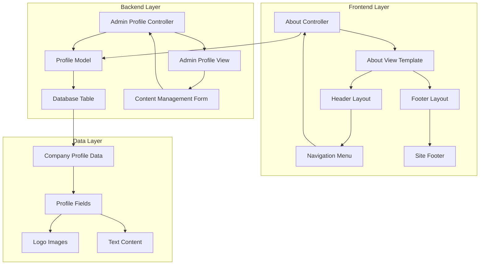
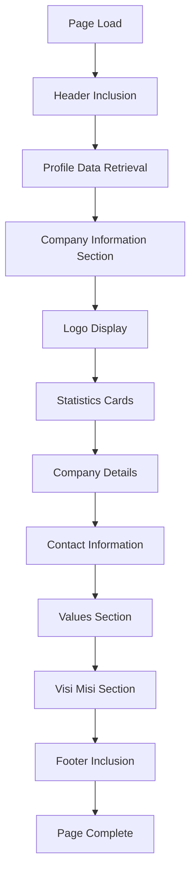
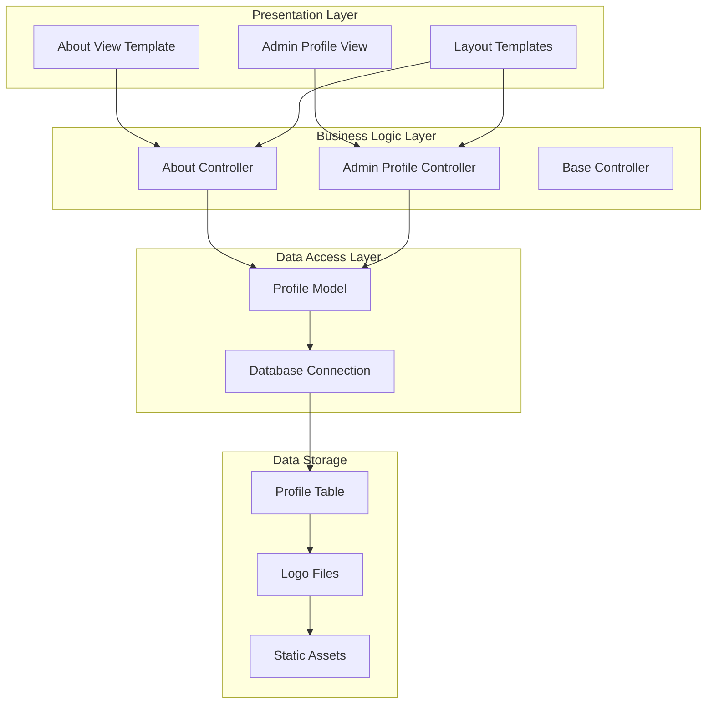
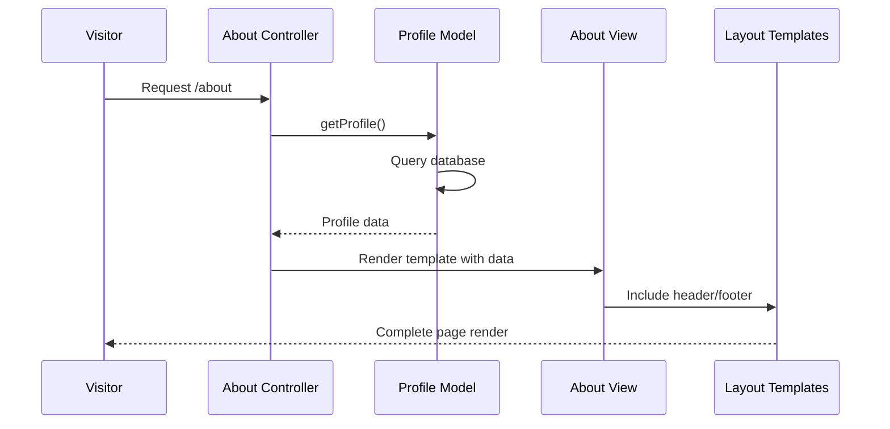
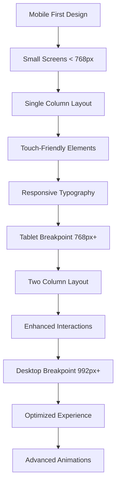
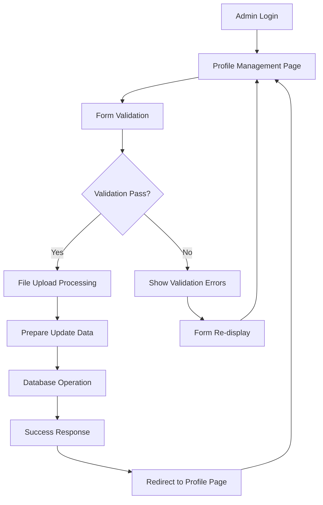
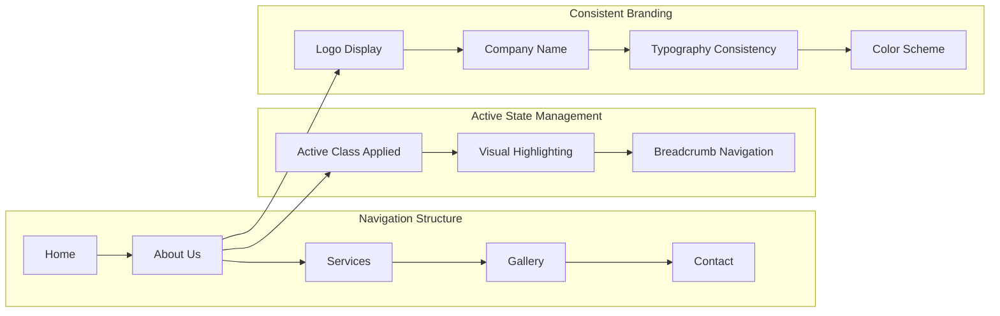
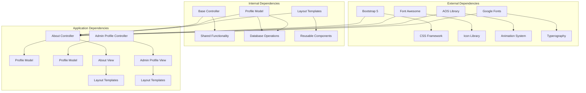

# About Us Page

<cite>
**Referenced Files in This Document**
- [About.php](file://app/Controllers/About.php)
- [about.php](file://app/Views/frontend/about.php)
- [ProfileModel.php](file://app/Models/ProfileModel.php)
- [CreateProfileTable.php](file://app/Database/Migrations/2024-01-01-000001_CreateProfileTable.php)
- [header.php](file://app/Views/frontend/layout/header.php)
- [footer.php](file://app/Views/frontend/layout/footer.php)
- [Profile.php](file://app/Controllers/Admin/Profile.php)
- [index.php](file://app/Views/admin/profile/index.php)
- [Routes.php](file://app/Config/Routes.php)
- [DatabaseSeeder.php](file://app/Database/Seeds/DatabaseSeeder.php)
</cite>

## Table of Contents
1. [Introduction](#introduction)
2. [Project Structure](#project-structure)
3. [Core Components](#core-components)
4. [Architecture Overview](#architecture-overview)
5. [Detailed Component Analysis](#detailed-component-analysis)
6. [Dependency Analysis](#dependency-analysis)
7. [Performance Considerations](#performance-considerations)
8. [Troubleshooting Guide](#troubleshooting-guide)
9. [Conclusion](#conclusion)

## Introduction

The About Us page implementation is a comprehensive component of the company profile website built with CodeIgniter 4. This page serves as the primary vehicle for displaying company information, values, vision, and mission to visitors. The implementation follows MVC architecture principles with clean separation of concerns between presentation, business logic, and data access layers.

The page showcases professional company branding through carefully crafted typography, responsive design patterns, and interactive animations. It integrates seamlessly with the overall site navigation while providing content management capabilities through an administrative interface.

## Project Structure

The About Us page implementation follows a structured MVC architecture with clear separation between frontend presentation and backend data management:



**Diagram sources**
- [About.php:1-19](file://app/Controllers/About.php#L1-L19)
- [about.php:1-152](file://app/Views/frontend/about.php#L1-L152)
- [ProfileModel.php:1-18](file://app/Models/ProfileModel.php#L1-L18)

**Section sources**
- [About.php:1-19](file://app/Controllers/About.php#L1-L19)
- [about.php:1-152](file://app/Views/frontend/about.php#L1-L152)
- [header.php:1-359](file://app/Views/frontend/layout/header.php#L1-L359)
- [footer.php:1-103](file://app/Views/frontend/layout/footer.php#L1-L103)

## Core Components

### Controller Implementation

The About controller serves as the central orchestrator for the About Us page, managing data flow between the model and view layers:

```mermaid
classDiagram
class AboutController {
+index() Response
-profileModel ProfileModel
+title string
+profile array
}
class ProfileModel {
+table string
+primaryKey string
+allowedFields array
+getProfile() array
}
class BaseController {
+controller Controller
+response Response
+request Request
}
AboutController --|> BaseController
AboutController --> ProfileModel : "uses"
ProfileModel --> "profile table" : "accesses"
```

**Diagram sources**
- [About.php:7-18](file://app/Controllers/About.php#L7-L18)
- [ProfileModel.php:7-17](file://app/Models/ProfileModel.php#L7-L17)

### Data Model Structure

The ProfileModel provides a streamlined interface for accessing company profile information with comprehensive field support:

| Field Name | Data Type | Description | Nullable |
|------------|-----------|-------------|----------|
| id | INT | Primary key identifier | No |
| nama_perusahaan | VARCHAR(255) | Company name | No |
| logo | VARCHAR(255) | Logo filename | Yes |
| deskripsi | TEXT | Company description | Yes |
| visi | TEXT | Vision statement | Yes |
| misi | TEXT | Mission statement | Yes |
| alamat | TEXT | Company address | Yes |
| email | VARCHAR(100) | Contact email | Yes |
| telepon | VARCHAR(20) | Phone number | Yes |
| website | VARCHAR(100) | Website URL | Yes |

**Section sources**
- [ProfileModel.php:9-16](file://app/Models/ProfileModel.php#L9-L16)
- [CreateProfileTable.php:11-22](file://app/Database/Migrations/2024-01-01-000001_CreateProfileTable.php#L11-L22)

### View Template Architecture

The About view template implements a sophisticated two-column layout with responsive design patterns:



**Diagram sources**
- [about.php:19-117](file://app/Views/frontend/about.php#L19-L117)

**Section sources**
- [about.php:1-152](file://app/Views/frontend/about.php#L1-L152)

## Architecture Overview

The About Us page follows a layered architecture pattern that ensures maintainability and scalability:



**Diagram sources**
- [About.php:7-18](file://app/Controllers/About.php#L7-L18)
- [Profile.php:8-71](file://app/Controllers/Admin/Profile.php#L8-L71)
- [ProfileModel.php:7-17](file://app/Models/ProfileModel.php#L7-L17)

The architecture ensures loose coupling between components while maintaining clear separation of concerns. The controller handles HTTP requests and responses, the model manages data access patterns, and the view templates handle presentation logic.

**Section sources**
- [Routes.php:9-15](file://app/Config/Routes.php#L9-L15)
- [Routes.php:23-29](file://app/Config/Routes.php#L23-L29)

## Detailed Component Analysis

### Company Profile Display Logic

The company profile display logic implements a comprehensive information architecture designed to present corporate identity effectively:

#### Hero Section Implementation

The hero section establishes visual hierarchy and brand recognition through strategic content placement:



**Diagram sources**
- [About.php:9-17](file://app/Controllers/About.php#L9-L17)
- [ProfileModel.php:13-16](file://app/Models/ProfileModel.php#L13-L16)

#### Content Formatting and Typography

The implementation employs sophisticated typography systems with responsive design considerations:

| Element | Typography Settings | Responsive Behavior |
|---------|-------------------|-------------------|
| Page Titles | 2.5rem, 800 weight, -0.5px spacing | Clamp 1.6rem-3.8rem |
| Section Labels | 0.8rem, 700 weight, uppercase | Fixed sizing |
| Company Names | 1.3rem, 800 weight | Responsive scaling |
| Descriptions | 0.95rem, 1.9 line height | Fluid typography |
| Statistics | 1.4rem, 800 weight | Fixed sizing |

#### Responsive Design Patterns

The page implements mobile-first responsive design with progressive enhancement:



**Section sources**
- [about.php:20-117](file://app/Views/frontend/about.php#L20-L117)
- [header.php:16-321](file://app/Views/frontend/layout/header.php#L16-L321)

### Content Management Capabilities

The administrative interface provides comprehensive content management functionality:

#### Profile Update Workflow



**Diagram sources**
- [Profile.php:26-70](file://app/Controllers/Admin/Profile.php#L26-L70)

#### Validation Rules and Data Integrity

The content management system implements robust validation mechanisms:

| Field | Validation Rule | Purpose |
|-------|----------------|---------|
| nama_perusahaan | required | Ensures company name presence |
| deskripsi | required | Validates company description |
| alamat | required | Requires complete address |
| email | required, valid_email | Ensures valid contact email |
| telepon | required | Validates phone number format |
| logo | file upload | Processes image files |

**Section sources**
- [Profile.php:30-40](file://app/Controllers/Admin/Profile.php#L30-L40)
- [index.php:13-50](file://app/Views/admin/profile/index.php#L13-L50)

### Navigation Integration

The About Us page integrates seamlessly with the overall site navigation structure:



**Diagram sources**
- [header.php:342-350](file://app/Views/frontend/layout/header.php#L342-L350)

**Section sources**
- [Routes.php:11](file://app/Config/Routes.php#L11)
- [header.php:326-352](file://app/Views/frontend/layout/header.php#L326-L352)

## Dependency Analysis

The About Us page implementation demonstrates clean dependency management with minimal coupling between components:



**Diagram sources**
- [header.php:8-15](file://app/Views/frontend/layout/header.php#L8-L15)
- [About.php:5](file://app/Controllers/About.php#L5)
- [Profile.php:6](file://app/Controllers/Admin/Profile.php#L6)

### Coupling and Cohesion Analysis

The implementation maintains excellent cohesion within each component while minimizing external dependencies. The controller depends only on the ProfileModel, which encapsulates all database access logic. The view templates depend on layout components but remain decoupled from business logic.

**Section sources**
- [ProfileModel.php:1-18](file://app/Models/ProfileModel.php#L1-L18)
- [About.php:1-19](file://app/Controllers/About.php#L1-L19)

## Performance Considerations

### Database Optimization

The ProfileModel implements efficient data retrieval patterns optimized for single-record access:

- **Single Query Pattern**: Uses `first()` method for optimal single-record retrieval
- **Field Selection**: Limits data transfer to only required fields
- **Caching Opportunities**: Potential for implementing lightweight caching strategies

### Asset Management

The implementation optimizes asset delivery through strategic CDN usage and local hosting:

- **CDN Resources**: Bootstrap, Font Awesome, Google Fonts served via CDN
- **Local Assets**: Custom CSS and JavaScript maintained locally
- **Image Optimization**: Logo images processed through CodeIgniter's file handling

### Rendering Performance

The view templates employ performance-conscious rendering patterns:

- **Conditional Loading**: Images and content loaded conditionally based on data availability
- **Minimal JavaScript**: Essential scripts loaded only when needed
- **Responsive Images**: Properly sized images for different viewport sizes

## Troubleshooting Guide

### Common Issues and Solutions

#### Profile Data Not Displaying

**Symptoms**: Blank company information on About Us page
**Causes**: 
- Missing profile record in database
- Incorrect database connection
- Model field mapping issues

**Solutions**:
1. Verify database connectivity and table existence
2. Check if profile record exists with `SELECT * FROM profile`
3. Validate model field definitions match database schema

#### Logo Image Display Issues

**Symptoms**: Missing or broken logo images
**Causes**:
- Missing logo file in uploads directory
- Incorrect file permissions
- Broken file paths

**Solutions**:
1. Verify logo file exists in `public/uploads/logo/`
2. Check file permissions (should be readable)
3. Confirm file extension matches uploaded format

#### Navigation Active State Problems

**Symptoms**: About Us menu item not highlighting as active
**Causes**:
- Incorrect URL matching logic
- Navigation template caching issues

**Solutions**:
1. Review navigation URL patterns in header template
2. Clear browser cache and refresh page
3. Verify route configuration in Routes.php

#### Admin Profile Update Failures

**Symptoms**: Profile updates not persisting to database
**Causes**:
- Validation errors not handled properly
- File upload failures
- Database write permissions

**Solutions**:
1. Check validation error messages in response
2. Verify file upload directory permissions
3. Confirm database write access for profile table

**Section sources**
- [DatabaseSeeder.php:12-22](file://app/Database/Seeds/DatabaseSeeder.php#L12-L22)
- [Profile.php:38-40](file://app/Controllers/Admin/Profile.php#L38-L40)

## Conclusion

The About Us page implementation represents a well-architected solution that successfully balances functionality, maintainability, and user experience. The implementation demonstrates strong adherence to MVC principles while providing comprehensive content management capabilities.

Key strengths of the implementation include:

- **Clean Architecture**: Clear separation of concerns with well-defined component boundaries
- **Responsive Design**: Mobile-first approach with progressive enhancement for desktop experiences
- **Content Management**: Comprehensive administrative interface for easy content updates
- **Performance Optimization**: Efficient data access patterns and asset delivery strategies
- **Scalability**: Modular design that facilitates future enhancements and feature additions

The implementation serves as an excellent foundation for corporate websites, providing a robust framework that can accommodate various business requirements while maintaining high standards for code quality and user experience.

Future enhancement opportunities include implementing content caching strategies, adding multilingual support, and incorporating advanced analytics tracking for content performance monitoring.