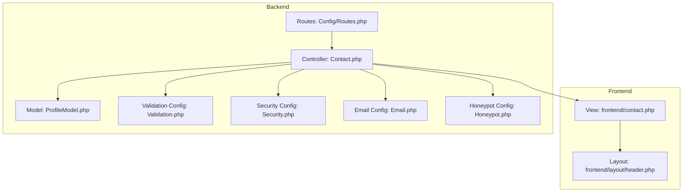
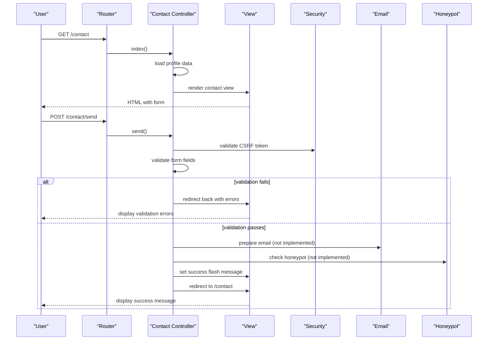
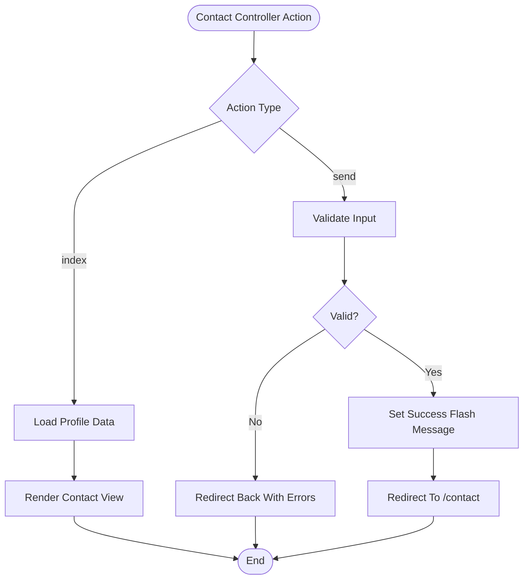
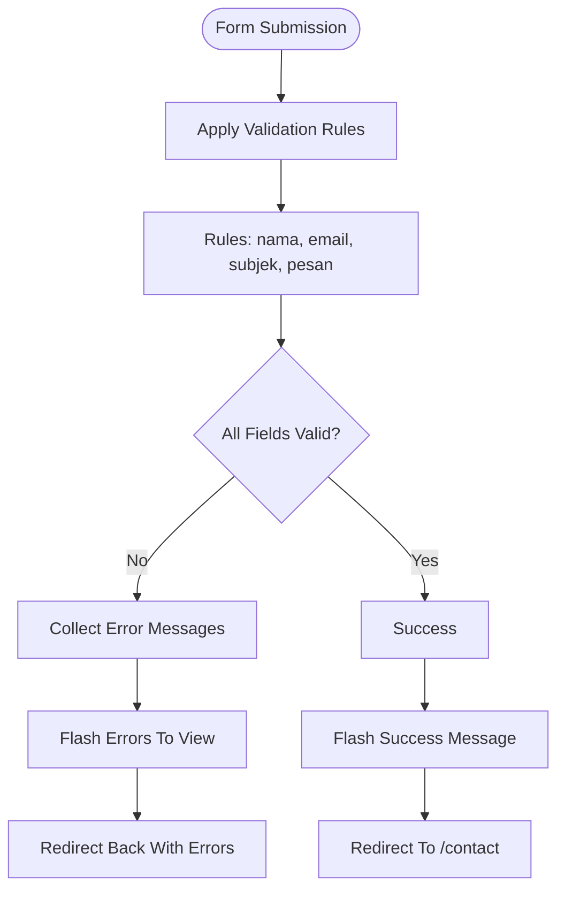
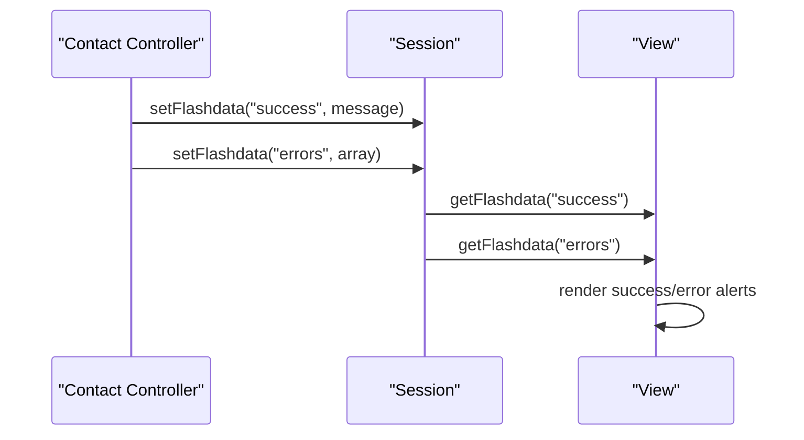
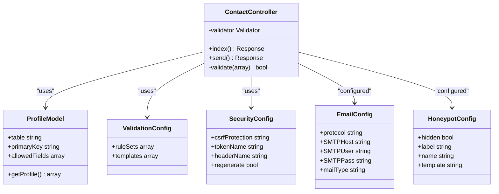

# Contact Form

<cite>
**Referenced Files in This Document**
- [Contact.php](file://app/Controllers/Contact.php)
- [Routes.php](file://app/Config/Routes.php)
- [Validation.php](file://app/Config/Validation.php)
- [Security.php](file://app/Config/Security.php)
- [Email.php](file://app/Config/Email.php)
- [Honeypot.php](file://app/Config/Honeypot.php)
- [BaseController.php](file://app/Controllers/BaseController.php)
- [ProfileModel.php](file://app/Models/ProfileModel.php)
- [contact.php](file://app/Views/frontend/contact.php)
- [header.php](file://app/Views/frontend/layout/header.php)
</cite>

## Table of Contents
1. [Introduction](#introduction)
2. [Project Structure](#project-structure)
3. [Core Components](#core-components)
4. [Architecture Overview](#architecture-overview)
5. [Detailed Component Analysis](#detailed-component-analysis)
6. [Dependency Analysis](#dependency-analysis)
7. [Performance Considerations](#performance-considerations)
8. [Troubleshooting Guide](#troubleshooting-guide)
9. [Conclusion](#conclusion)

## Introduction
This document provides comprehensive documentation for the contact form implementation in the company profile website built with CodeIgniter 4. It covers the controller processing, form validation logic, user feedback mechanisms, anti-spam measures, email configuration, view template structure, styling, error handling, and success message display. It also addresses security considerations, data validation, and user experience optimization.

## Project Structure
The contact form spans several layers:
- Controller: handles GET/POST requests and validation
- Model: retrieves company profile information for display
- View: renders the contact page with form and contact information
- Configuration: defines validation rules, security policies, and email settings
- Routes: maps URLs to controller actions

**Diagram sources**
- [Routes.php:14-15](file://app/Config/Routes.php#L14-L15)
- [Contact.php:9-17](file://app/Controllers/Contact.php#L9-L17)
- [ProfileModel.php:13-16](file://app/Models/ProfileModel.php#L13-L16)
- [contact.php:1-124](file://app/Views/frontend/contact.php#L1-L124)
- [header.php:1-359](file://app/Views/frontend/layout/header.php#L1-L359)
- [Validation.php:23-39](file://app/Config/Validation.php#L23-L39)
- [Security.php:18](file://app/Config/Security.php#L18)
- [Email.php:21](file://app/Config/Email.php#L21)
- [Honeypot.php:12](file://app/Config/Honeypot.php#L12)

**Section sources**
- [Routes.php:14-15](file://app/Config/Routes.php#L14-L15)
- [Contact.php:9-17](file://app/Controllers/Contact.php#L9-L17)
- [ProfileModel.php:13-16](file://app/Models/ProfileModel.php#L13-L16)
- [contact.php:1-124](file://app/Views/frontend/contact.php#L1-L124)
- [header.php:1-359](file://app/Views/frontend/layout/header.php#L1-L359)
- [Validation.php:23-39](file://app/Config/Validation.php#L23-L39)
- [Security.php:18](file://app/Config/Security.php#L18)
- [Email.php:21](file://app/Config/Email.php#L21)
- [Honeypot.php:12](file://app/Config/Honeypot.php#L12)

## Core Components
- Controller: Implements GET and POST handlers for the contact page and message submission
- Validation: Defines strict validation rules for required fields and formats
- Security: Enforces CSRF protection and secure token handling
- Email: Provides configurable email transport settings
- Honeypot: Anti-spam measure using invisible form fields
- Model: Supplies company profile data for contact information display
- View: Renders the contact page with form, success/error messages, and contact details

**Section sources**
- [Contact.php:19-36](file://app/Controllers/Contact.php#L19-L36)
- [Validation.php:23-39](file://app/Config/Validation.php#L23-L39)
- [Security.php:18](file://app/Config/Security.php#L18)
- [Email.php:21](file://app/Config/Email.php#L21)
- [Honeypot.php:12](file://app/Config/Honeypot.php#L12)
- [ProfileModel.php:13-16](file://app/Models/ProfileModel.php#L13-L16)
- [contact.php:84-109](file://app/Views/frontend/contact.php#L84-L109)

## Architecture Overview
The contact form follows a standard MVC flow:
- Routes map /contact to the Contact controller index action
- The index action loads profile data and renders the contact view
- The view posts to /contact/send handled by the Contact controller send action
- The send action validates input, sets flash messages, and redirects back to the contact page

**Diagram sources**
- [Routes.php:14-15](file://app/Config/Routes.php#L14-L15)
- [Contact.php:19-36](file://app/Controllers/Contact.php#L19-L36)
- [Security.php:18](file://app/Config/Security.php#L18)
- [contact.php:84-109](file://app/Views/frontend/contact.php#L84-L109)

## Detailed Component Analysis

### Controller Processing
The Contact controller manages two primary actions:
- index(): Loads company profile data and renders the contact view
- send(): Validates form input, stores success notification, and redirects

Key behaviors:
- Uses ProfileModel to fetch company profile information
- Applies validation rules for required fields and formats
- Sets flash data for success and error notifications
- Redirects to the contact page after processing

**Diagram sources**
- [Contact.php:9-17](file://app/Controllers/Contact.php#L9-L17)
- [Contact.php:19-36](file://app/Controllers/Contact.php#L19-L36)
- [ProfileModel.php:13-16](file://app/Models/ProfileModel.php#L13-L16)

**Section sources**
- [Contact.php:9-17](file://app/Controllers/Contact.php#L9-L17)
- [Contact.php:19-36](file://app/Controllers/Contact.php#L19-L36)
- [ProfileModel.php:13-16](file://app/Models/ProfileModel.php#L13-L16)

### Form Validation Logic
Validation rules are defined in the Contact controller send action:
- nama: required, minimum length 3
- email: required, valid email format
- subjek: required, minimum length 5
- pesan: required, minimum length 10

The framework automatically generates error messages based on the validation rule sets configured in Validation.php. The controller captures errors and passes them to the view via flash data.

**Diagram sources**
- [Contact.php:22-31](file://app/Controllers/Contact.php#L22-L31)
- [Validation.php:23-39](file://app/Config/Validation.php#L23-L39)

**Section sources**
- [Contact.php:22-31](file://app/Controllers/Contact.php#L22-L31)
- [Validation.php:23-39](file://app/Config/Validation.php#L23-L39)

### Email Sending Functionality
Current implementation:
- The send action does not actually send emails
- It sets a success flash message indicating successful delivery
- Email configuration exists but is not utilized in the controller

Recommended enhancements:
- Integrate CodeIgniter’s Email library in the send action
- Configure SMTP credentials in Email.php
- Implement email templates for notifications
- Add recipient configuration and subject formatting

**Section sources**
- [Contact.php:33-35](file://app/Controllers/Contact.php#L33-L35)
- [Email.php:9-126](file://app/Config/Email.php#L9-L126)

### User Feedback Mechanisms
The view displays two types of feedback:
- Success messages: Green alert with check icon and dismiss button
- Error messages: Red alert with individual error items and dismiss button

Feedback is controlled by flash data set in the controller:
- Success: "Pesan Anda berhasil dikirim. Kami akan segera menghubungi Anda."
- Errors: Collected validation errors passed from the validator

**Diagram sources**
- [Contact.php:33-35](file://app/Controllers/Contact.php#L33-L35)
- [contact.php:20-34](file://app/Views/frontend/contact.php#L20-L34)

**Section sources**
- [Contact.php:33-35](file://app/Controllers/Contact.php#L33-L35)
- [contact.php:20-34](file://app/Views/frontend/contact.php#L20-L34)

### Spam Prevention Measures
Available anti-spam configurations:
- Honeypot: Invisible field configuration for bot detection
- CSRF Protection: Cookie-based token validation
- Security Settings: Token regeneration and redirect behavior

Current limitations:
- Honeypot is configured but not actively used in the form
- No CAPTCHA integration is present
- Additional throttling or rate limiting is not implemented

Recommended improvements:
- Add honeypot field to the contact form
- Implement CAPTCHA verification
- Add rate limiting for form submissions
- Consider IP-based blocking for suspicious activity

**Section sources**
- [Honeypot.php:12](file://app/Config/Honeypot.php#L12)
- [Security.php:18](file://app/Config/Security.php#L18)

### Email Configuration
The Email configuration provides:
- Protocol selection (mail, sendmail, smtp)
- SMTP settings (host, user, pass, port, crypto)
- Mail parameters (type, charset, priority)
- Transport options (word wrap, CRLF/newline)

Current state:
- Protocol defaults to 'mail'
- SMTP fields are empty
- Mail type is 'text'

Implementation notes:
- Update SMTP credentials for production
- Consider switching to 'html' mail type for styled emails
- Configure DSN and BCC batch settings as needed

**Section sources**
- [Email.php:21](file://app/Config/Email.php#L21)
- [Email.php:31-46](file://app/Config/Email.php#L31-L46)
- [Email.php:85](file://app/Config/Email.php#L85)

### View Template Structure
The contact view is organized into three main sections:
- Header with breadcrumbs and page title
- Contact information panel with icons and social links
- Contact form with responsive grid layout
- Google Maps embed for location display

Key structural elements:
- Bootstrap grid system for responsive layout
- FontAwesome icons for visual cues
- AOS animations for entrance effects
- Form uses POST method with CSRF protection

**Section sources**
- [contact.php:1-124](file://app/Views/frontend/contact.php#L1-L124)
- [header.php:1-359](file://app/Views/frontend/layout/header.php#L1-L359)

### Form Styling and User Experience
Styling characteristics:
- Modern gradient color scheme with primary/secondary/accent colors
- Card-based design with shadows and rounded corners
- Responsive breakpoints for mobile/tablet/desktop
- Consistent spacing and typography scales
- Interactive hover states and transitions

User experience features:
- Form validation feedback with inline icons
- Old input restoration for user convenience
- Success/error alerts with dismiss buttons
- Social media integration in contact panel
- Smooth scrolling navigation

**Section sources**
- [contact.php:84-109](file://app/Views/frontend/contact.php#L84-L109)
- [contact.php:44-76](file://app/Views/frontend/contact.php#L44-L76)
- [header.php:16-321](file://app/Views/frontend/layout/header.php#L16-L321)

### Error Handling and Success Display
Error handling mechanism:
- Validation errors collected and passed via flash data
- Success messages displayed in green alert with check icon
- Error messages displayed in red alert with individual items
- Dismissible alert buttons for user control

Display logic:
- Success messages use a dedicated success flash key
- Error messages use an errors flash key containing an array
- Both use Bootstrap alert classes with custom styling

**Section sources**
- [Contact.php:30](file://app/Controllers/Contact.php#L30)
- [contact.php:20-34](file://app/Views/frontend/contact.php#L20-L34)

### Contact Information Display
The contact information panel dynamically renders:
- Company address, phone, email, and website
- Color-coded icons with background circles
- Social media buttons with hover effects
- Responsive card layout with consistent spacing

Data source:
- ProfileModel provides company information
- Website field conditionally included if present
- Values are escaped for security

**Section sources**
- [contact.php:44-76](file://app/Views/frontend/contact.php#L44-L76)
- [ProfileModel.php:11](file://app/Models/ProfileModel.php#L11)

## Dependency Analysis
The contact form implementation exhibits clean separation of concerns with minimal coupling between components.

**Diagram sources**
- [Contact.php:9-36](file://app/Controllers/Contact.php#L9-L36)
- [ProfileModel.php:7-16](file://app/Models/ProfileModel.php#L7-L16)
- [Validation.php:23-39](file://app/Config/Validation.php#L23-L39)
- [Security.php:18](file://app/Config/Security.php#L18)
- [Email.php:21](file://app/Config/Email.php#L21)
- [Honeypot.php:12](file://app/Config/Honeypot.php#L12)

**Section sources**
- [Contact.php:9-36](file://app/Controllers/Contact.php#L9-L36)
- [ProfileModel.php:7-16](file://app/Models/ProfileModel.php#L7-L16)
- [Validation.php:23-39](file://app/Config/Validation.php#L23-L39)
- [Security.php:18](file://app/Config/Security.php#L18)
- [Email.php:21](file://app/Config/Email.php#L21)
- [Honeypot.php:12](file://app/Config/Honeypot.php#L12)

## Performance Considerations
- Database queries: ProfileModel performs a single row fetch operation
- Validation overhead: Minimal impact with basic string validation rules
- Memory usage: Flash data stored temporarily in session storage
- Network considerations: Email sending would introduce latency if implemented
- Caching opportunities: Consider caching frequently accessed profile data

## Troubleshooting Guide
Common issues and resolutions:

### Form Validation Failures
- Symptoms: Immediate redirect back with error messages
- Causes: Missing required fields or invalid formats
- Resolution: Ensure all fields meet minimum length requirements and email format

### CSRF Protection Errors
- Symptoms: Form submission blocked with security error
- Causes: Missing or expired CSRF token
- Resolution: Verify csrf_field() is present in form and cookies are enabled

### Email Delivery Issues
- Symptoms: Success message displayed despite no email received
- Causes: Email configuration not set up or not implemented
- Resolution: Configure SMTP settings in Email.php and implement email sending logic

### Honeypot Misconfiguration
- Symptoms: Bot submissions still processed
- Causes: Honeypot field not added to form or validation not implemented
- Resolution: Add honeypot field to form and implement validation check

**Section sources**
- [Contact.php:30](file://app/Controllers/Contact.php#L30)
- [Security.php:18](file://app/Config/Security.php#L18)
- [Email.php:21](file://app/Config/Email.php#L21)
- [Honeypot.php:12](file://app/Config/Honeypot.php#L12)

## Conclusion
The contact form implementation demonstrates a solid foundation with clear separation of concerns and good user experience design. While the current implementation focuses on client-side validation and presentation, it provides a strong base for enhancement. Key areas for improvement include implementing actual email sending functionality, integrating anti-spam measures like CAPTCHA and honeypot, and adding rate limiting. The existing validation, security, and styling infrastructure supports these enhancements effectively.