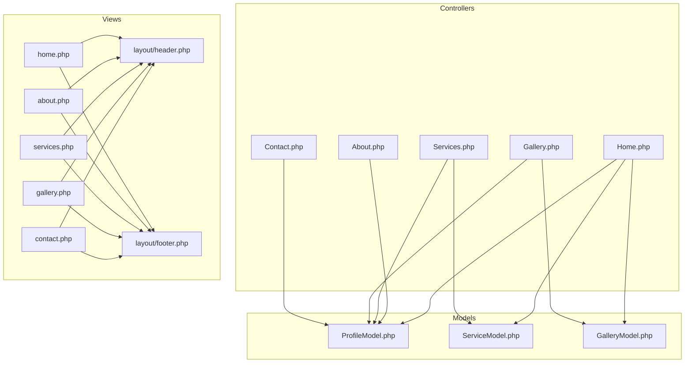
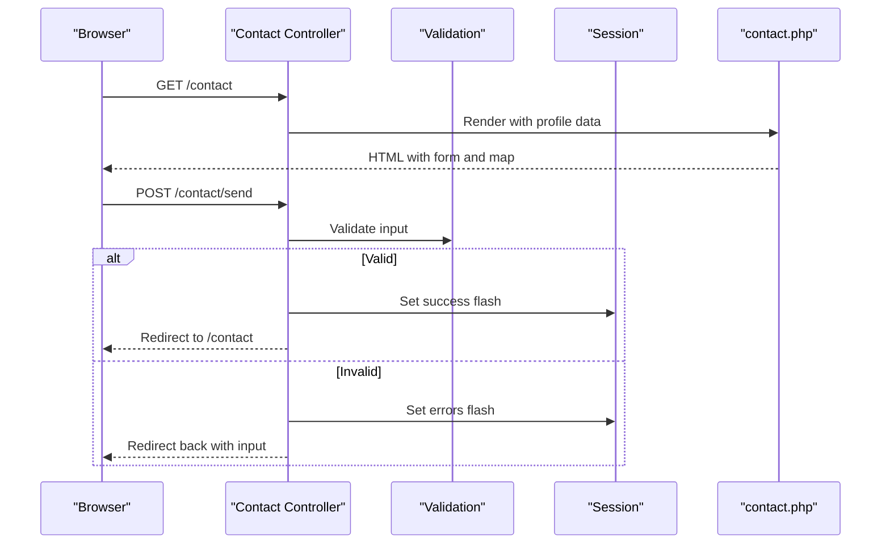
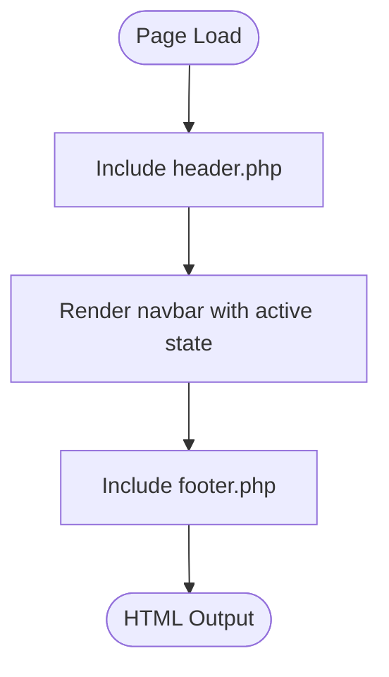
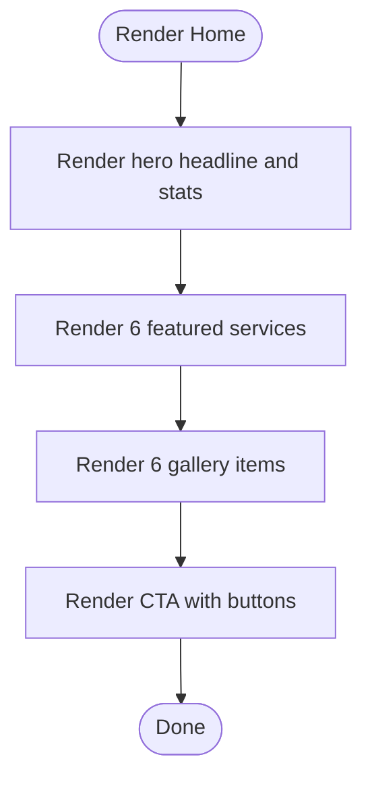
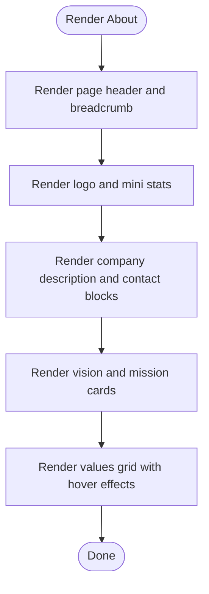
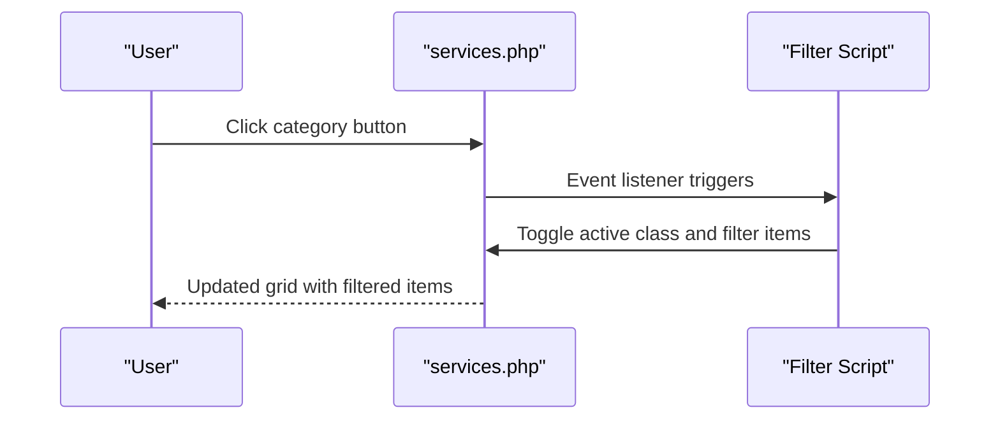
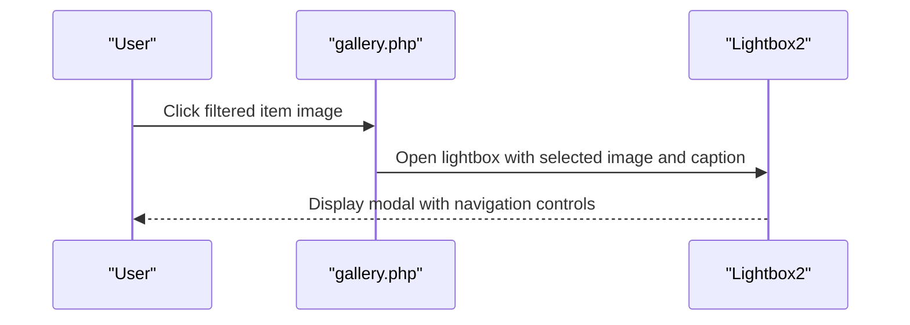
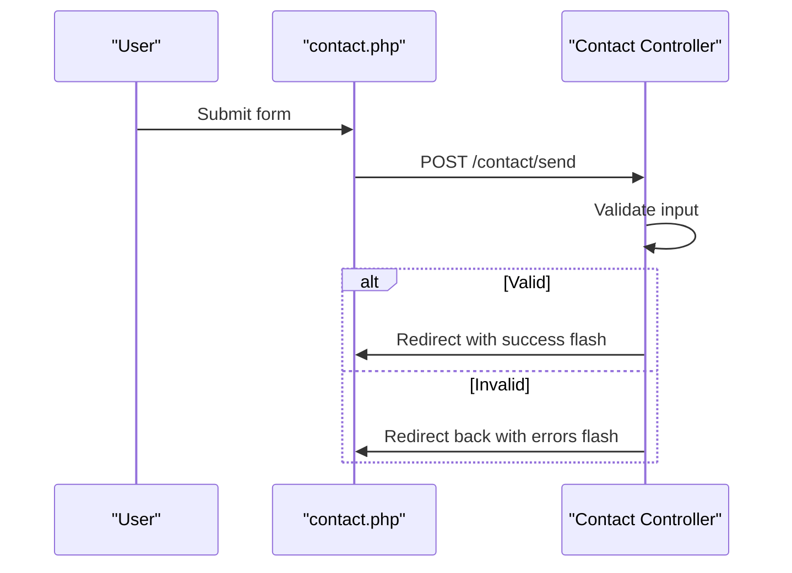
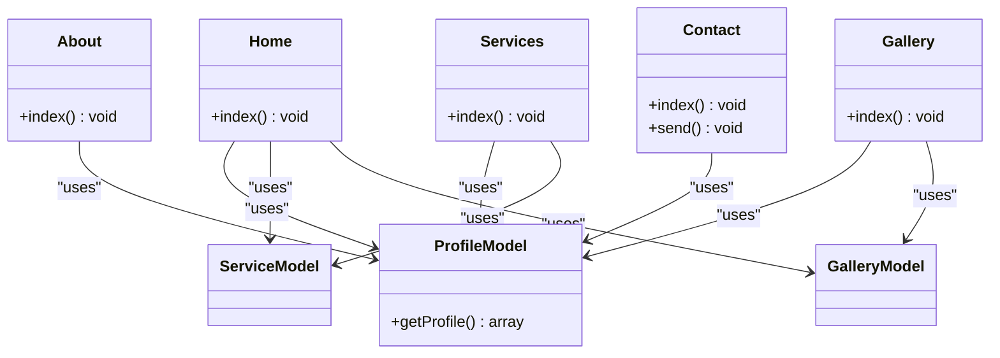
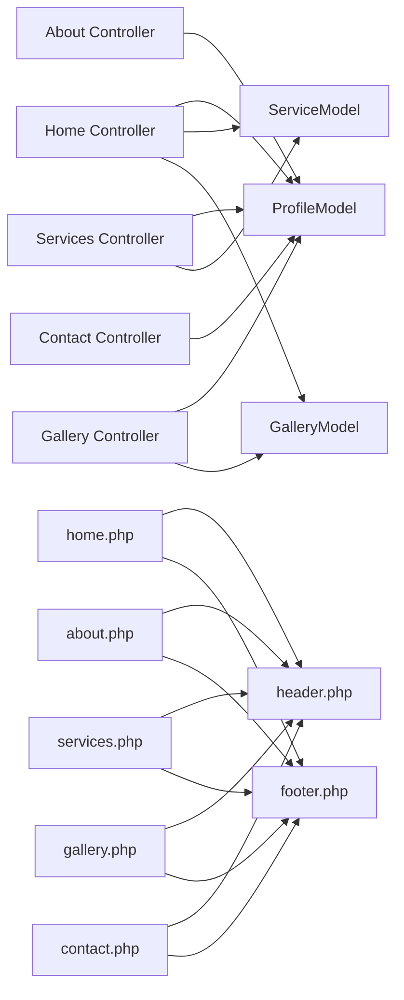

# Frontend Components

<cite>
**Referenced Files in This Document**
- [home.php](file://app/Views/frontend/home.php)
- [about.php](file://app/Views/frontend/about.php)
- [services.php](file://app/Views/frontend/services.php)
- [gallery.php](file://app/Views/frontend/gallery.php)
- [contact.php](file://app/Views/frontend/contact.php)
- [header.php](file://app/Views/frontend/layout/header.php)
- [footer.php](file://app/Views/frontend/layout/footer.php)
- [Home.php](file://app/Controllers/Home.php)
- [About.php](file://app/Controllers/About.php)
- [Services.php](file://app/Controllers/Services.php)
- [Gallery.php](file://app/Controllers/Gallery.php)
- [Contact.php](file://app/Controllers/Contact.php)
- [ProfileModel.php](file://app/Models/ProfileModel.php)
- [ServiceModel.php](file://app/Models/ServiceModel.php)
- [GalleryModel.php](file://app/Models/GalleryModel.php)
</cite>

## Table of Contents
1. [Introduction](#introduction)
2. [Project Structure](#project-structure)
3. [Core Components](#core-components)
4. [Architecture Overview](#architecture-overview)
5. [Detailed Component Analysis](#detailed-component-analysis)
6. [Dependency Analysis](#dependency-analysis)
7. [Performance Considerations](#performance-considerations)
8. [Troubleshooting Guide](#troubleshooting-guide)
9. [Conclusion](#conclusion)

## Introduction
This document explains the frontend website components built with CodeIgniter 4. It focuses on the responsive company website implementation covering:
- Homepage hero section with statistics and call-to-action
- About Us page with company profile, vision/mission, and values
- Services catalog with category filtering
- Photo gallery with lightbox functionality
- Contact form with map integration
It also documents view template organization, layout inheritance via header/footer partials, dynamic content rendering, navigation structure, SEO considerations, mobile responsiveness, user interaction patterns, performance optimization, caching strategies, and accessibility compliance.

## Project Structure
The frontend templates are organized under app/Views/frontend, grouped by page and shared layout partials under app/Views/frontend/layout. Controllers in app/Controllers fetch data from models and pass it to views. Assets and third-party libraries are loaded via CDN links in the header partial.

**Diagram sources**
- [Home.php:9-25](file://app/Controllers/Home.php#L9-L25)
- [About.php:7-17](file://app/Controllers/About.php#L7-L17)
- [Services.php:8-19](file://app/Controllers/Services.php#L8-L19)
- [Gallery.php:8-19](file://app/Controllers/Gallery.php#L8-L19)
- [Contact.php:7-16](file://app/Controllers/Contact.php#L7-L16)
- [ProfileModel.php:7-16](file://app/Models/ProfileModel.php#L7-L16)
- [ServiceModel.php:7-13](file://app/Models/ServiceModel.php#L7-L13)
- [GalleryModel.php:7-13](file://app/Models/GalleryModel.php#L7-L13)
- [home.php](file://app/Views/frontend/home.php#L1)
- [about.php](file://app/Views/frontend/about.php#L1)
- [services.php](file://app/Views/frontend/services.php#L1)
- [gallery.php](file://app/Views/frontend/gallery.php#L1)
- [contact.php](file://app/Views/frontend/contact.php#L1)
- [header.php:1-359](file://app/Views/frontend/layout/header.php#L1-L359)
- [footer.php:1-103](file://app/Views/frontend/layout/footer.php#L1-L103)

**Section sources**
- [Home.php:9-25](file://app/Controllers/Home.php#L9-L25)
- [About.php:7-17](file://app/Controllers/About.php#L7-L17)
- [Services.php:8-19](file://app/Controllers/Services.php#L8-L19)
- [Gallery.php:8-19](file://app/Controllers/Gallery.php#L8-L19)
- [Contact.php:7-16](file://app/Controllers/Contact.php#L7-L16)
- [ProfileModel.php:7-16](file://app/Models/ProfileModel.php#L7-L16)
- [ServiceModel.php:7-13](file://app/Models/ServiceModel.php#L7-L13)
- [GalleryModel.php:7-13](file://app/Models/GalleryModel.php#L7-L13)
- [home.php](file://app/Views/frontend/home.php#L1)
- [about.php](file://app/Views/frontend/about.php#L1)
- [services.php](file://app/Views/frontend/services.php#L1)
- [gallery.php](file://app/Views/frontend/gallery.php#L1)
- [contact.php](file://app/Views/frontend/contact.php#L1)
- [header.php:1-359](file://app/Views/frontend/layout/header.php#L1-L359)
- [footer.php:1-103](file://app/Views/frontend/layout/footer.php#L1-L103)

## Core Components
- Layout Partials
  - Header: Provides SEO meta tags, theme CSS variables, navigation bar, and global styles. It also sets the active state for navigation items based on current URL.
  - Footer: Provides site information, navigation links, contact details, operating hours, and social links.
- Pages
  - Home: Hero section with headline, badges, and stats; featured services; statistics; gallery preview; and CTA.
  - About: Company profile with logo, description, address, phone, and contact info; vision/mission; values grid.
  - Services: Category filter bar and service cards grid with images/icons/descriptions/tags.
  - Gallery: Category filter bar and image grid with lightbox integration.
  - Contact: Contact info panel, validation feedback, contact form with CSRF protection, and embedded map.

Dynamic content rendering is achieved by passing controller-provided data (title, profile, services, gallery) into views. Views render lists, conditionals, and fallbacks when media assets are missing.

**Section sources**
- [header.php:326-352](file://app/Views/frontend/layout/header.php#L326-L352)
- [footer.php:1-103](file://app/Views/frontend/layout/footer.php#L1-L103)
- [home.php:1-196](file://app/Views/frontend/home.php#L1-L196)
- [about.php:1-152](file://app/Views/frontend/about.php#L1-L152)
- [services.php:1-87](file://app/Views/frontend/services.php#L1-L87)
- [gallery.php:1-84](file://app/Views/frontend/gallery.php#L1-L84)
- [contact.php:1-124](file://app/Views/frontend/contact.php#L1-L124)

## Architecture Overview
The frontend follows a layered MVC pattern:
- Controllers prepare data and select the appropriate view.
- Models encapsulate data access for profile, services, and gallery.
- Views render HTML with layout partials and dynamic data.

**Diagram sources**
- [Contact.php:9-36](file://app/Controllers/Contact.php#L9-L36)
- [contact.php:84-109](file://app/Views/frontend/contact.php#L84-L109)

**Section sources**
- [Contact.php:9-36](file://app/Controllers/Contact.php#L9-L36)
- [contact.php:84-109](file://app/Views/frontend/contact.php#L84-L109)

## Detailed Component Analysis

### Navigation and Layout Inheritance
- Active navigation is determined by matching the current URL against route segments in the header partial.
- Layout inheritance is implemented by including header and footer partials in each page view.
- Theme variables and responsive styles are centralized in the header partial’s inline CSS.

**Diagram sources**
- [header.php:326-352](file://app/Views/frontend/layout/header.php#L326-L352)
- [footer.php:1-103](file://app/Views/frontend/layout/footer.php#L1-L103)
- [home.php](file://app/Views/frontend/home.php#L1)
- [about.php](file://app/Views/frontend/about.php#L1)
- [services.php](file://app/Views/frontend/services.php#L1)
- [gallery.php](file://app/Views/frontend/gallery.php#L1)
- [contact.php](file://app/Views/frontend/contact.php#L1)

**Section sources**
- [header.php:326-352](file://app/Views/frontend/layout/header.php#L326-L352)
- [footer.php:1-103](file://app/Views/frontend/layout/footer.php#L1-L103)
- [home.php](file://app/Views/frontend/home.php#L1)
- [about.php](file://app/Views/frontend/about.php#L1)
- [services.php](file://app/Views/frontend/services.php#L1)
- [gallery.php](file://app/Views/frontend/gallery.php#L1)
- [contact.php](file://app/Views/frontend/contact.php#L1)

### Homepage Hero Section
- Hero section displays company badge, headline with gradient highlight, short description, and primary/outline buttons.
- Statistics cards show counts for services, clients, team, and years.
- Featured services and gallery previews are included with “see all” links.

**Diagram sources**
- [home.php:4-72](file://app/Views/frontend/home.php#L4-L72)
- [home.php:75-105](file://app/Views/frontend/home.php#L75-L105)
- [home.php:108-130](file://app/Views/frontend/home.php#L108-L130)
- [home.php:133-170](file://app/Views/frontend/home.php#L133-L170)
- [home.php:173-193](file://app/Views/frontend/home.php#L173-L193)

**Section sources**
- [home.php:4-72](file://app/Views/frontend/home.php#L4-L72)
- [home.php:75-105](file://app/Views/frontend/home.php#L75-L105)
- [home.php:108-130](file://app/Views/frontend/home.php#L108-L130)
- [home.php:133-170](file://app/Views/frontend/home.php#L133-L170)
- [home.php:173-193](file://app/Views/frontend/home.php#L173-L193)

### About Us Page
- Page header with breadcrumb navigation.
- Left column shows company branding and mini stats; right column shows description, address, and phone.
- Vision/Mission section with colored cards.
- Values section with hover animations and descriptive cards.

**Diagram sources**
- [about.php:4-17](file://app/Views/frontend/about.php#L4-L17)
- [about.php:20-82](file://app/Views/frontend/about.php#L20-L82)
- [about.php:85-117](file://app/Views/frontend/about.php#L85-L117)
- [about.php:120-149](file://app/Views/frontend/about.php#L120-L149)

**Section sources**
- [about.php:4-17](file://app/Views/frontend/about.php#L4-L17)
- [about.php:20-82](file://app/Views/frontend/about.php#L20-L82)
- [about.php:85-117](file://app/Views/frontend/about.php#L85-L117)
- [about.php:120-149](file://app/Views/frontend/about.php#L120-L149)

### Services Catalog with Category Filtering
- Category filter bar renders unique categories from services.
- Grid displays service cards with optional image/icon, name, description, and category tag.
- JavaScript filters items client-side by dataset attributes.

**Diagram sources**
- [services.php:21-28](file://app/Views/frontend/services.php#L21-L28)
- [services.php:44-62](file://app/Views/frontend/services.php#L44-L62)
- [services.php:74-84](file://app/Views/frontend/services.php#L74-L84)

**Section sources**
- [services.php:21-28](file://app/Views/frontend/services.php#L21-L28)
- [services.php:44-62](file://app/Views/frontend/services.php#L44-L62)
- [services.php:74-84](file://app/Views/frontend/services.php#L74-L84)

### Photo Gallery with Lightbox
- Category filter bar mirrors the services’ approach.
- Grid displays gallery items with optional images and overlay text.
- Lightbox integration via CDN with data-lightbox attributes and script initialization.

**Diagram sources**
- [gallery.php:21-28](file://app/Views/frontend/gallery.php#L21-L28)
- [gallery.php:39-58](file://app/Views/frontend/gallery.php#L39-L58)
- [gallery.php:69-81](file://app/Views/frontend/gallery.php#L69-L81)

**Section sources**
- [gallery.php:21-28](file://app/Views/frontend/gallery.php#L21-L28)
- [gallery.php:39-58](file://app/Views/frontend/gallery.php#L39-L58)
- [gallery.php:69-81](file://app/Views/frontend/gallery.php#L69-L81)

### Contact Form with Map Integration
- Displays validation feedback using session flashes.
- Form includes CSRF protection and required fields with old input restoration.
- Embedded Google Maps iframe for location display.

**Diagram sources**
- [contact.php:84-109](file://app/Views/frontend/contact.php#L84-L109)
- [Contact.php:19-36](file://app/Controllers/Contact.php#L19-L36)

**Section sources**
- [contact.php:20-34](file://app/Views/frontend/contact.php#L20-L34)
- [contact.php:84-109](file://app/Views/frontend/contact.php#L84-L109)
- [Contact.php:19-36](file://app/Controllers/Contact.php#L19-L36)

### Data Models and Dynamic Rendering
- ProfileModel retrieves the single company profile record.
- ServiceModel and GalleryModel provide paginated or full lists with status filters.
- Controllers assemble data arrays and pass them to views.

**Diagram sources**
- [ProfileModel.php:7-16](file://app/Models/ProfileModel.php#L7-L16)
- [ServiceModel.php:7-13](file://app/Models/ServiceModel.php#L7-L13)
- [GalleryModel.php:7-13](file://app/Models/GalleryModel.php#L7-L13)
- [Home.php:9-25](file://app/Controllers/Home.php#L9-L25)
- [About.php:7-17](file://app/Controllers/About.php#L7-L17)
- [Services.php:8-19](file://app/Controllers/Services.php#L8-L19)
- [Gallery.php:8-19](file://app/Controllers/Gallery.php#L8-L19)
- [Contact.php:7-16](file://app/Controllers/Contact.php#L7-L16)

**Section sources**
- [ProfileModel.php:7-16](file://app/Models/ProfileModel.php#L7-L16)
- [ServiceModel.php:7-13](file://app/Models/ServiceModel.php#L7-L13)
- [GalleryModel.php:7-13](file://app/Models/GalleryModel.php#L7-L13)
- [Home.php:9-25](file://app/Controllers/Home.php#L9-L25)
- [About.php:7-17](file://app/Controllers/About.php#L7-L17)
- [Services.php:8-19](file://app/Controllers/Services.php#L8-L19)
- [Gallery.php:8-19](file://app/Controllers/Gallery.php#L8-L19)
- [Contact.php:7-16](file://app/Controllers/Contact.php#L7-L16)

## Dependency Analysis
- Controllers depend on models for data retrieval.
- Views depend on header/footer partials and on controller-provided data arrays.
- External resources are loaded via CDN in the header partial (Bootstrap, Font Awesome, Google Fonts, AOS, Lightbox2).

**Diagram sources**
- [Home.php:9-25](file://app/Controllers/Home.php#L9-L25)
- [About.php:7-17](file://app/Controllers/About.php#L7-L17)
- [Services.php:8-19](file://app/Controllers/Services.php#L8-L19)
- [Gallery.php:8-19](file://app/Controllers/Gallery.php#L8-L19)
- [Contact.php:7-16](file://app/Controllers/Contact.php#L7-L16)
- [ProfileModel.php:7-16](file://app/Models/ProfileModel.php#L7-L16)
- [ServiceModel.php:7-13](file://app/Models/ServiceModel.php#L7-L13)
- [GalleryModel.php:7-13](file://app/Models/GalleryModel.php#L7-L13)
- [home.php](file://app/Views/frontend/home.php#L1)
- [about.php](file://app/Views/frontend/about.php#L1)
- [services.php](file://app/Views/frontend/services.php#L1)
- [gallery.php](file://app/Views/frontend/gallery.php#L1)
- [contact.php](file://app/Views/frontend/contact.php#L1)
- [header.php:1-359](file://app/Views/frontend/layout/header.php#L1-L359)
- [footer.php:1-103](file://app/Views/frontend/layout/footer.php#L1-L103)

**Section sources**
- [Home.php:9-25](file://app/Controllers/Home.php#L9-L25)
- [About.php:7-17](file://app/Controllers/About.php#L7-L17)
- [Services.php:8-19](file://app/Controllers/Services.php#L8-L19)
- [Gallery.php:8-19](file://app/Controllers/Gallery.php#L8-L19)
- [Contact.php:7-16](file://app/Controllers/Contact.php#L7-L16)
- [ProfileModel.php:7-16](file://app/Models/ProfileModel.php#L7-L16)
- [ServiceModel.php:7-13](file://app/Models/ServiceModel.php#L7-L13)
- [GalleryModel.php:7-13](file://app/Models/GalleryModel.php#L7-L13)
- [home.php](file://app/Views/frontend/home.php#L1)
- [about.php](file://app/Views/frontend/about.php#L1)
- [services.php](file://app/Views/frontend/services.php#L1)
- [gallery.php](file://app/Views/frontend/gallery.php#L1)
- [contact.php](file://app/Views/frontend/contact.php#L1)
- [header.php:1-359](file://app/Views/frontend/layout/header.php#L1-L359)
- [footer.php:1-103](file://app/Views/frontend/layout/footer.php#L1-L103)

## Performance Considerations
- Asset delivery: External libraries are loaded via CDN to leverage browser caching and reduce server bandwidth.
- Minimized inline CSS: Styles are consolidated in the header partial to avoid duplication across pages.
- Lazy loading: The contact map iframe uses lazy loading via the loading attribute.
- Client-side filtering: Services and gallery filtering runs in the browser to minimize server requests.
- Image placeholders: Fallback icons are used when media is missing to prevent broken images.
- Pagination: The services and gallery controllers limit records on the homepage and load full lists on dedicated pages.

Recommendations:
- Enable server-side caching for static assets and consider CodeIgniter cache handlers for dynamic content.
- Preload critical fonts and icons to improve First Contentful Paint.
- Compress images and serve modern formats (AVIF/WebP) where supported.
- Use HTTP caching headers and ETags for static assets.
- Consider bundling and minifying CSS/JS for production.

**Section sources**
- [header.php:8-15](file://app/Views/frontend/layout/header.php#L8-L15)
- [contact.php:117-118](file://app/Views/frontend/contact.php#L117-L118)
- [services.php:74-84](file://app/Views/frontend/services.php#L74-L84)
- [gallery.php:71-81](file://app/Views/frontend/gallery.php#L71-L81)

## Troubleshooting Guide
Common issues and resolutions:
- Navigation active state not updating
  - Verify current URL checks in the header partial match actual routes.
  - Confirm that the active class is applied conditionally based on current_url().
- Missing images in services/gallery
  - Ensure fallback icons are displayed when image fields are empty.
  - Validate upload paths and permissions for uploads/gallery and uploads/services.
- Contact form validation failures
  - Review validation rules and error handling in the Contact controller.
  - Confirm CSRF field presence and correct form action.
- Lightbox not opening
  - Ensure the Lightbox2 CSS/JS CDNs are loaded and initialized after DOMContentLoaded.
  - Verify data-lightbox and data-title attributes on anchor tags.
- Map not displaying
  - Check the iframe src validity and network connectivity.
  - Confirm the embed URL is whitelisted and allowed by CSP if applicable.

Accessibility checklist:
- Ensure all images have descriptive alt attributes.
- Provide skip links and logical tab order.
- Use semantic headings and landmarks.
- Ensure sufficient color contrast for text and interactive elements.
- Add ARIA attributes where dynamic content updates occur (e.g., alerts).

SEO checklist:
- Meta title and description are set dynamically from profile data.
- Canonical URLs and structured data can be added for key pages.
- Internal linking uses descriptive anchor text.
- Robots.txt and sitemap can be configured at the web server level.

**Section sources**
- [header.php:343-347](file://app/Views/frontend/layout/header.php#L343-L347)
- [services.php:47-52](file://app/Views/frontend/services.php#L47-L52)
- [gallery.php:42-48](file://app/Views/frontend/gallery.php#L42-L48)
- [Contact.php:22-31](file://app/Controllers/Contact.php#L22-L31)
- [contact.php:20-34](file://app/Views/frontend/contact.php#L20-L34)
- [gallery.php:69-70](file://app/Views/frontend/gallery.php#L69-L70)
- [contact.php:117-118](file://app/Views/frontend/contact.php#L117-L118)

## Conclusion
The frontend components deliver a responsive, accessible, and SEO-aware company website. Layout inheritance via header/footer partials ensures consistent branding and navigation. Dynamic content rendering powered by controllers and models enables flexible presentation of company profiles, services, galleries, and contact information. Client-side filtering and CDN-delivered assets contribute to performance. With recommended caching and optimization strategies, the site can achieve strong performance and user experience across devices.