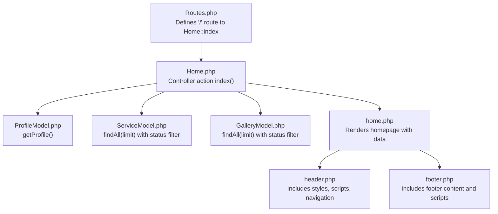
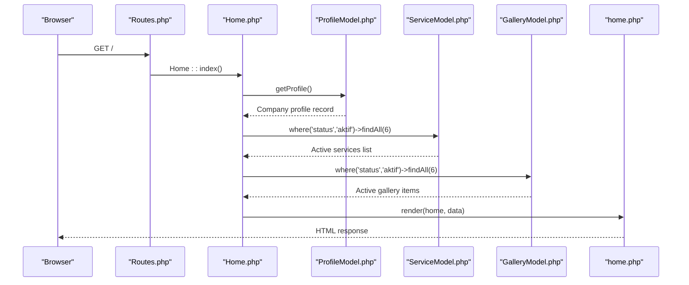
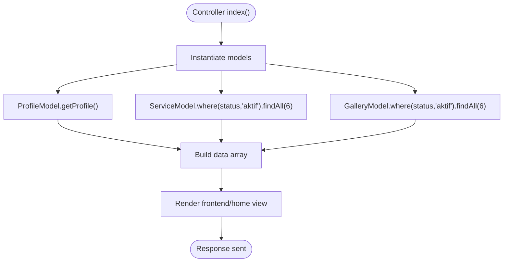
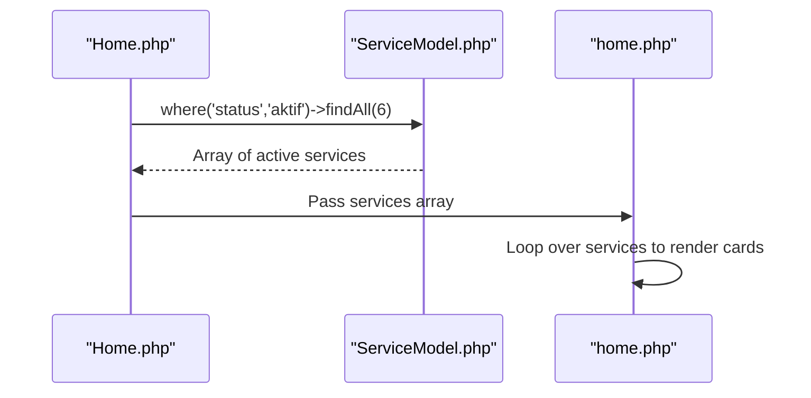
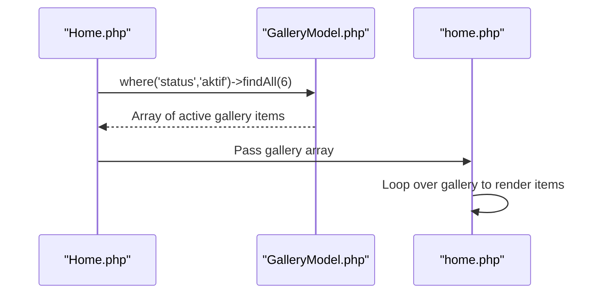
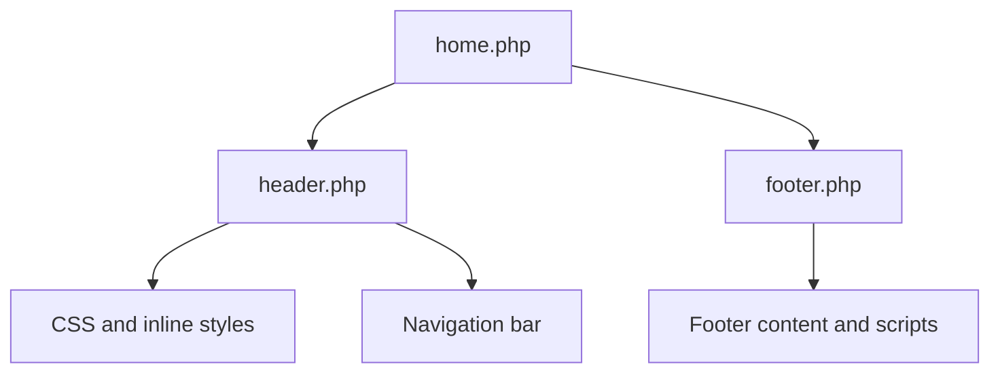
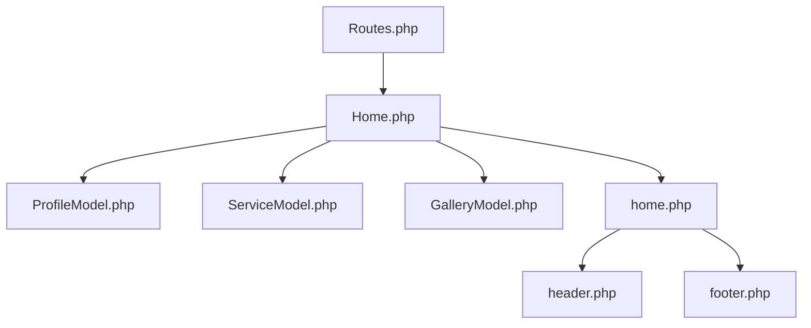

# Homepage

<cite>
**Referenced Files in This Document**
- [Home.php](file://app/Controllers/Home.php)
- [BaseController.php](file://app/Controllers/BaseController.php)
- [ProfileModel.php](file://app/Models/ProfileModel.php)
- [ServiceModel.php](file://app/Models/ServiceModel.php)
- [GalleryModel.php](file://app/Models/GalleryModel.php)
- [home.php](file://app/Views/frontend/home.php)
- [header.php](file://app/Views/frontend/layout/header.php)
- [footer.php](file://app/Views/frontend/layout/footer.php)
- [Routes.php](file://app/Config/Routes.php)
- [CreateProfileTable.php](file://app/Database/Migrations/2024-01-01-000001_CreateProfileTable.php)
- [CreateServicesTable.php](file://app/Database/Migrations/2024-01-01-000002_CreateServicesTable.php)
- [CreateGalleryTable.php](file://app/Database/Migrations/2024-01-01-000003_CreateGalleryTable.php)
</cite>

## Table of Contents
1. [Introduction](#introduction)
2. [Project Structure](#project-structure)
3. [Core Components](#core-components)
4. [Architecture Overview](#architecture-overview)
5. [Detailed Component Analysis](#detailed-component-analysis)
6. [Dependency Analysis](#dependency-analysis)
7. [Performance Considerations](#performance-considerations)
8. [Troubleshooting Guide](#troubleshooting-guide)
9. [Conclusion](#conclusion)

## Introduction
This document provides comprehensive documentation for the homepage implementation of a company profile website built with CodeIgniter 4. It covers the hero section with dynamic company profile content, the featured services showcase with automatic filtering of active services, the recent gallery items display, and the responsive layout structure. It also explains the controller logic for fetching profile data, services, and gallery items with status filtering, documents the view template organization, partial includes for header/footer, dynamic content rendering, and outlines considerations for mobile responsiveness, performance optimization for image loading, and SEO meta tags configuration.

## Project Structure
The homepage implementation spans the controller layer, model layer, and view templates organized under the frontend namespace. Routes define the homepage endpoint, while migrations establish the underlying database schema for profile, services, and gallery content.

**Diagram sources**
- [Routes.php:9-14](file://app/Config/Routes.php#L9-L14)
- [Home.php:11-25](file://app/Controllers/Home.php#L11-L25)
- [ProfileModel.php:13-16](file://app/Models/ProfileModel.php#L13-L16)
- [ServiceModel.php:7-13](file://app/Models/ServiceModel.php#L7-L13)
- [GalleryModel.php:7-13](file://app/Models/GalleryModel.php#L7-L13)
- [home.php:1-196](file://app/Views/frontend/home.php#L1-L196)
- [header.php:1-359](file://app/Views/frontend/layout/header.php#L1-L359)
- [footer.php:1-103](file://app/Views/frontend/layout/footer.php#L1-L103)

**Section sources**
- [Routes.php:9-14](file://app/Config/Routes.php#L9-L14)
- [Home.php:11-25](file://app/Controllers/Home.php#L11-L25)
- [home.php:1-196](file://app/Views/frontend/home.php#L1-L196)

## Core Components
- Controller: Home::index orchestrates data fetching from models and renders the homepage view with title, profile, services, and gallery items.
- Models: ProfileModel retrieves the company profile record; ServiceModel and GalleryModel provide filtered lists of active items.
- Views: The homepage template organizes sections for hero, services, stats, gallery, and call-to-action, and includes shared header and footer partials.

Key responsibilities:
- Fetching and filtering data: Controller applies status filters and limits for active services and gallery items.
- Dynamic rendering: Views render profile content, service cards, and gallery items with fallbacks for missing images.
- Layout and responsiveness: Shared header/footer provide responsive navigation and styling; homepage sections use grid layouts and AOS animations.

**Section sources**
- [Home.php:11-25](file://app/Controllers/Home.php#L11-L25)
- [ProfileModel.php:13-16](file://app/Models/ProfileModel.php#L13-L16)
- [ServiceModel.php:7-13](file://app/Models/ServiceModel.php#L7-L13)
- [GalleryModel.php:7-13](file://app/Models/GalleryModel.php#L7-L13)
- [home.php:1-196](file://app/Views/frontend/home.php#L1-L196)

## Architecture Overview
The homepage follows a standard MVC pattern:
- Route '/': Home::index
- Controller: instantiates models, queries data, passes to view
- Models: encapsulate database access and field definitions
- Views: render HTML with partial includes for header/footer

**Diagram sources**
- [Routes.php:10](file://app/Config/Routes.php#L10)
- [Home.php:11-25](file://app/Controllers/Home.php#L11-L25)
- [ProfileModel.php:13-16](file://app/Models/ProfileModel.php#L13-L16)
- [ServiceModel.php:7-13](file://app/Models/ServiceModel.php#L7-L13)
- [GalleryModel.php:7-13](file://app/Models/GalleryModel.php#L7-L13)
- [home.php:1-196](file://app/Views/frontend/home.php#L1-L196)

## Detailed Component Analysis

### Controller Logic: Home::index
- Instantiates ProfileModel, ServiceModel, and GalleryModel.
- Builds data array with:
  - title: localized page title
  - profile: single record from ProfileModel
  - services: active services limited to 6 items
  - gallery: active gallery items limited to 6 items
- Renders the frontend/home view with the prepared data.

**Diagram sources**
- [Home.php:11-25](file://app/Controllers/Home.php#L11-L25)

**Section sources**
- [Home.php:11-25](file://app/Controllers/Home.php#L11-L25)

### Hero Section: Dynamic Company Profile Content
- Title and description: Uses profile data for headline and excerpt.
- Stats panel: Displays counts and badges derived from services and static values.
- CTA buttons: Links to services and contact pages.
- Responsive layout: Uses Bootstrap grid classes with alignment and spacing utilities.

Rendering highlights:
- Description truncation to 180 characters for hero paragraph.
- Fallback for missing profile fields in title/description.
- AOS animation attributes for fade effects.

**Section sources**
- [home.php:4-72](file://app/Views/frontend/home.php#L4-L72)
- [header.php:16-321](file://app/Views/frontend/layout/header.php#L16-L321)

### Featured Services Showcase: Automatic Loading of Active Services
- Status filter: Services are filtered by status 'aktif'.
- Limit: Maximum 6 services displayed.
- Rendering loop: Iterates over services array to build service cards with icon, name, short description, and category tag.
- AOS delays: staggered animation timing for visual effect.

**Diagram sources**
- [Home.php:20](file://app/Controllers/Home.php#L20)
- [ServiceModel.php:7-13](file://app/Models/ServiceModel.php#L7-L13)
- [home.php:86-97](file://app/Views/frontend/home.php#L86-L97)

**Section sources**
- [Home.php:20](file://app/Controllers/Home.php#L20)
- [home.php:74-105](file://app/Views/frontend/home.php#L74-L105)

### Recent Gallery Items Display: Status Filtering and Dynamic Rendering
- Status filter: Gallery items are filtered by status 'aktif'.
- Limit: Maximum 6 gallery items displayed.
- Rendering loop: Iterates over gallery array to build gallery items with image or placeholder, overlay content, and category label.
- AOS delays: Staggered zoom-in animation timing.

**Diagram sources**
- [Home.php:21](file://app/Controllers/Home.php#L21)
- [GalleryModel.php:7-13](file://app/Models/GalleryModel.php#L7-L13)
- [home.php:144-162](file://app/Views/frontend/home.php#L144-L162)

**Section sources**
- [Home.php:21](file://app/Controllers/Home.php#L21)
- [home.php:132-170](file://app/Views/frontend/home.php#L132-L170)

### View Template Organization and Partial Includes
- Header inclusion: The homepage includes the shared header partial which defines styles, fonts, navigation, and meta tags.
- Footer inclusion: The homepage includes the shared footer partial which provides site footer, social links, and scripts.
- Dynamic content rendering: Views use PHP loops and conditionals to render profile, services, and gallery items with safe escaping.

**Diagram sources**
- [home.php:1](file://app/Views/frontend/home.php#L1)
- [home.php:195](file://app/Views/frontend/home.php#L195)
- [header.php:1-359](file://app/Views/frontend/layout/header.php#L1-L359)
- [footer.php:1-103](file://app/Views/frontend/layout/footer.php#L1-L103)

**Section sources**
- [home.php:1-196](file://app/Views/frontend/home.php#L1-L196)
- [header.php:1-359](file://app/Views/frontend/layout/header.php#L1-L359)
- [footer.php:1-103](file://app/Views/frontend/layout/footer.php#L1-L103)

### Carousel/Slider Implementation Notes
- Current implementation does not include a dedicated carousel or slider component for the homepage.
- The gallery section displays items in a grid layout with hover overlays.
- If a carousel is desired, integrate a JavaScript library and update the gallery section accordingly.

[No sources needed since this section provides general guidance]

### Mobile Responsiveness Considerations
- Grid classes: Uses responsive column classes (e.g., col-lg-4, col-md-6) to adapt content layout across screen sizes.
- AOS animations: Animations are configured with durations and offsets suitable for various devices.
- Navigation: Responsive navbar toggler and collapsed menu behavior.
- Typography and spacing: CSS clamp units and responsive font sizing improve readability on small screens.

**Section sources**
- [home.php:86-97](file://app/Views/frontend/home.php#L86-L97)
- [home.php:144-162](file://app/Views/frontend/home.php#L144-L162)
- [header.php:326-352](file://app/Views/frontend/layout/header.php#L326-L352)

### SEO Meta Tags Configuration
- Title and description: Generated dynamically using profile data for better SEO relevance.
- Viewport meta: Ensures proper mobile rendering.
- External resources: CDN-hosted libraries for Bootstrap, Font Awesome, Google Fonts, and AOS.

**Section sources**
- [header.php:4-7](file://app/Views/frontend/layout/header.php#L4-L7)
- [header.php:8-15](file://app/Views/frontend/layout/header.php#L8-L15)

## Dependency Analysis
The homepage depends on:
- Route definition for '/' mapping to Home::index
- Controller instantiation of models
- Model field definitions and status constraints
- View partials for consistent header/footer rendering

**Diagram sources**
- [Routes.php:9-14](file://app/Config/Routes.php#L9-L14)
- [Home.php:11-25](file://app/Controllers/Home.php#L11-L25)
- [ProfileModel.php:7-16](file://app/Models/ProfileModel.php#L7-L16)
- [ServiceModel.php:7-13](file://app/Models/ServiceModel.php#L7-L13)
- [GalleryModel.php:7-13](file://app/Models/GalleryModel.php#L7-L13)
- [home.php:1-196](file://app/Views/frontend/home.php#L1-L196)

**Section sources**
- [Routes.php:9-14](file://app/Config/Routes.php#L9-L14)
- [Home.php:11-25](file://app/Controllers/Home.php#L11-L25)

## Performance Considerations
- Database queries: The controller fetches limited sets (6 items) of active services and gallery items, reducing payload size.
- Image handling: Gallery items use base URLs for uploaded images; consider lazy loading attributes and responsive image variants for improved performance.
- Static assets: CDN-hosted libraries reduce local bandwidth usage.
- Minimizing reflows: CSS animations and transitions are hardware-accelerated where possible.

[No sources needed since this section provides general guidance]

## Troubleshooting Guide
- Missing profile data: The controller uses a single record retrieval; ensure the profile table has at least one row.
- Empty services or gallery: Status filtering requires entries with status 'aktif'; verify seed data or admin content creation.
- Broken image paths: Confirm upload directories exist and images are stored under the expected paths.
- Navigation highlighting: Active state checks rely on URL matching; ensure routes match expected patterns.

**Section sources**
- [ProfileModel.php:13-16](file://app/Models/ProfileModel.php#L13-L16)
- [ServiceModel.php:18](file://app/Models/ServiceModel.php#L18)
- [GalleryModel.php:17](file://app/Models/GalleryModel.php#L17)

## Conclusion
The homepage implementation integrates a clean MVC structure with dynamic content rendering, responsive design, and SEO-friendly metadata. The controller efficiently fetches and filters active content, while the view templates leverage shared partials for consistent presentation. Future enhancements could include lazy-loading for images, optional carousel integration, and structured data markup for improved SEO.