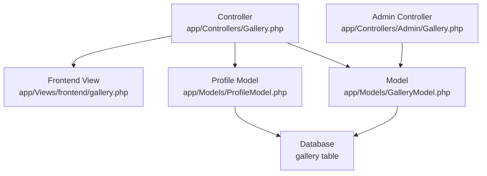
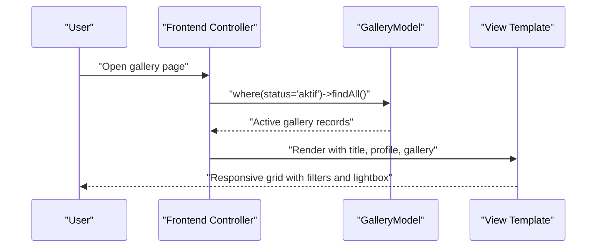
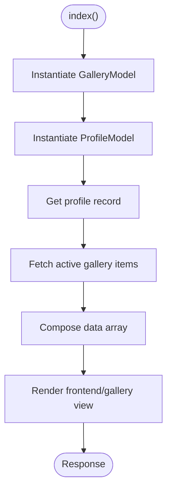
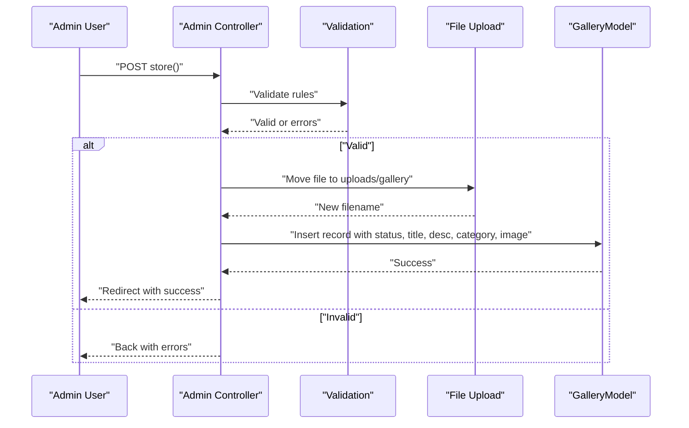
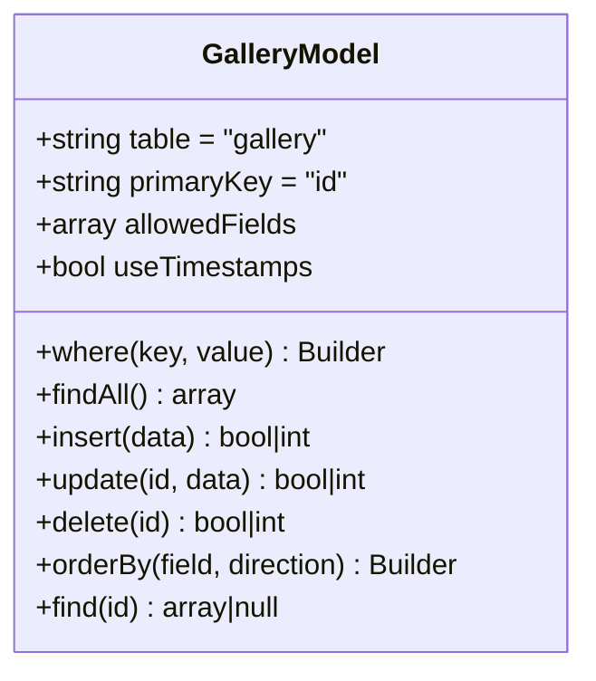
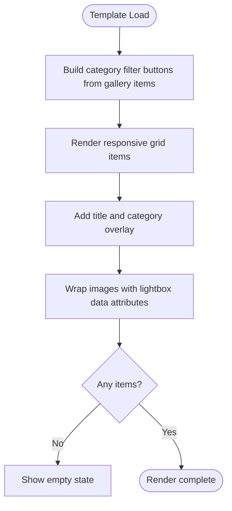
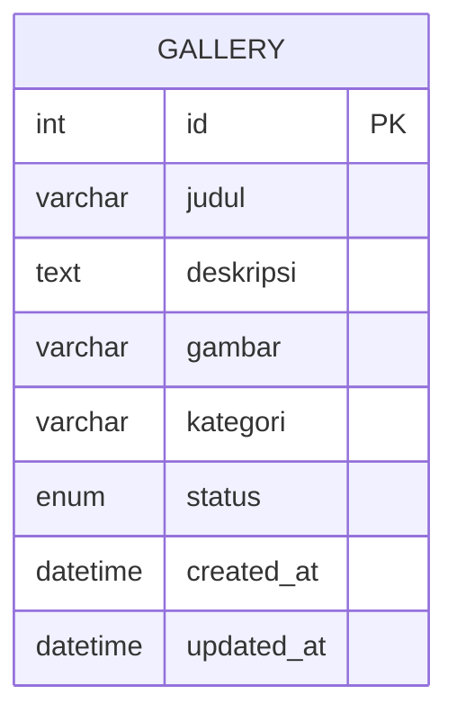
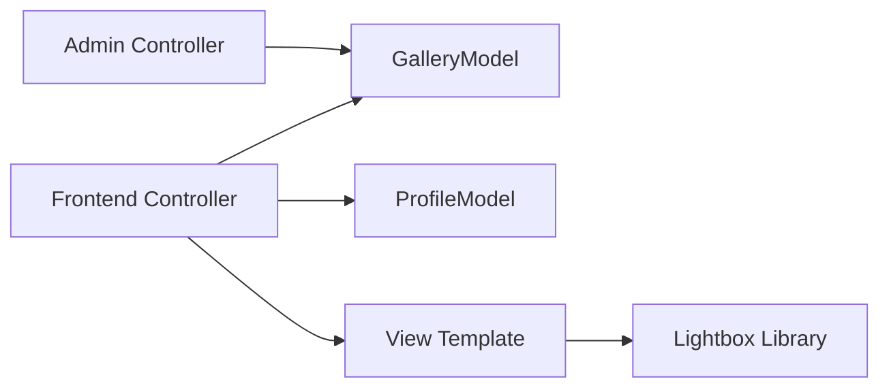

# Photo Gallery

<cite>
**Referenced Files in This Document**
- [Gallery.php](file://app/Controllers/Gallery.php)
- [Admin_Gallery.php](file://app/Controllers/Admin/Gallery.php)
- [GalleryModel.php](file://app/Models/GalleryModel.php)
- [ProfileModel.php](file://app/Models/ProfileModel.php)
- [CreateGalleryTable.php](file://app/Database/Migrations/2024-01-01-000003_CreateGalleryTable.php)
- [gallery.php](file://app/Views/frontend/gallery.php)
- [Images.php](file://app/Config/Images.php)
- [Optimize.php](file://app/Config/Optimize.php)
- [BaseController.php](file://app/Controllers/BaseController.php)
- [db_company.sql](file://db_company.sql)
</cite>

## Table of Contents
1. [Introduction](#introduction)
2. [Project Structure](#project-structure)
3. [Core Components](#core-components)
4. [Architecture Overview](#architecture-overview)
5. [Detailed Component Analysis](#detailed-component-analysis)
6. [Dependency Analysis](#dependency-analysis)
7. [Performance Considerations](#performance-considerations)
8. [Troubleshooting Guide](#troubleshooting-guide)
9. [Conclusion](#conclusion)

## Introduction
This document explains the photo gallery implementation, focusing on how gallery items are fetched and displayed, how active status filtering works, how images are uploaded and stored, and how the lightbox viewer is integrated. It also documents the controller data fetching, model methods for gallery queries, and the view template structure with a responsive grid layout. Additionally, it covers image optimization and thumbnail generation capabilities, lazy loading considerations, file upload security measures, gallery navigation and category filtering, and user interaction patterns for image viewing.

## Project Structure
The gallery feature spans three layers:
- Frontend presentation: a dedicated view template renders the gallery grid, categories, and lightbox links.
- Backend controller: fetches gallery items filtered by active status and passes them to the view.
- Data model: persists gallery entries with fields for title, description, image filename, category, and status.

**Diagram sources**
- [gallery.php](file://app/Views/frontend/gallery.php)
- [Gallery.php](file://app/Controllers/Gallery.php)
- [Admin_Gallery.php](file://app/Controllers/Admin/Gallery.php)
- [GalleryModel.php](file://app/Models/GalleryModel.php)
- [ProfileModel.php](file://app/Models/ProfileModel.php)
- [CreateGalleryTable.php](file://app/Database/Migrations/2024-01-01-000003_CreateGalleryTable.php)

**Section sources**
- [Gallery.php:10-20](file://app/Controllers/Gallery.php#L10-L20)
- [gallery.php:19-67](file://app/Views/frontend/gallery.php#L19-L67)
- [GalleryModel.php:7-13](file://app/Models/GalleryModel.php#L7-L13)
- [CreateGalleryTable.php:9-22](file://app/Database/Migrations/2024-01-01-000003_CreateGalleryTable.php#L9-L22)

## Core Components
- Controller (frontend): loads profile metadata and active gallery items, then renders the gallery view.
- Controller (admin): manages CRUD operations for gallery items, including secure file upload and deletion.
- Model: defines the gallery table schema and allowed fields; timestamps are enabled.
- View: renders a responsive grid with category filters and a lightbox-enabled image gallery.
- Configuration: image handlers and optimization settings.

Key responsibilities:
- Fetching active gallery items via status filtering.
- Rendering category buttons dynamically from existing gallery categories.
- Generating lightbox links with titles from item metadata.
- Admin-side validation, sanitization, and secure storage of uploaded images.

**Section sources**
- [Gallery.php:10-20](file://app/Controllers/Gallery.php#L10-L20)
- [Admin_Gallery.php:31-56](file://app/Controllers/Admin/Gallery.php#L31-L56)
- [GalleryModel.php:7-13](file://app/Models/GalleryModel.php#L7-L13)
- [gallery.php:21-28](file://app/Views/frontend/gallery.php#L21-L28)
- [gallery.php:41-44](file://app/Views/frontend/gallery.php#L41-L44)

## Architecture Overview
The gallery architecture follows a clean MVC pattern:
- The frontend controller initializes models, applies status filtering, and forwards data to the view.
- The admin controller handles form validation, file handling, and persistence.
- The view composes the UI with category filtering and lightbox integration.

**Diagram sources**
- [Gallery.php:10-20](file://app/Controllers/Gallery.php#L10-L20)
- [GalleryModel.php:7-13](file://app/Models/GalleryModel.php#L7-L13)
- [gallery.php:19-67](file://app/Views/frontend/gallery.php#L19-L67)

## Detailed Component Analysis

### Frontend Controller: Gallery
- Purpose: Load profile metadata and active gallery items, then render the frontend gallery view.
- Data fetching: Uses the gallery model to filter by status equal to active and retrieves all matching records.
- View rendering: Passes title, profile, and gallery data to the frontend view.

**Diagram sources**
- [Gallery.php:10-20](file://app/Controllers/Gallery.php#L10-L20)
- [ProfileModel.php:13-16](file://app/Models/ProfileModel.php#L13-L16)
- [GalleryModel.php:7-13](file://app/Models/GalleryModel.php#L7-L13)

**Section sources**
- [Gallery.php:10-20](file://app/Controllers/Gallery.php#L10-L20)

### Admin Controller: Gallery (Upload and Management)
- Purpose: Provide admin CRUD for gallery items including secure image upload, update, and delete.
- Validation: Enforces required fields and image constraints (uploaded, is_image, max_size).
- Upload handling: Generates a random filename, moves the file to the uploads directory, and updates the model.
- Update logic: Optionally replaces the existing image file if a new one is provided.
- Delete logic: Removes the associated image file from disk before deleting the database record.

**Diagram sources**
- [Admin_Gallery.php:31-56](file://app/Controllers/Admin/Gallery.php#L31-L56)

**Section sources**
- [Admin_Gallery.php:31-56](file://app/Controllers/Admin/Gallery.php#L31-L56)
- [Admin_Gallery.php:66-99](file://app/Controllers/Admin/Gallery.php#L66-L99)
- [Admin_Gallery.php:101-112](file://app/Controllers/Admin/Gallery.php#L101-L112)

### Model: GalleryModel
- Defines the gallery table, primary key, allowed fields, and enables timestamps.
- Provides the method chain used by the frontend controller to fetch active items.

**Diagram sources**
- [GalleryModel.php:7-13](file://app/Models/GalleryModel.php#L7-L13)

**Section sources**
- [GalleryModel.php:7-13](file://app/Models/GalleryModel.php#L7-L13)

### View: Frontend Gallery Template
- Layout: Includes header and footer partials, breadcrumb navigation, and a category filter bar.
- Category filtering: Dynamically lists unique categories from the loaded gallery items and generates filter buttons.
- Grid layout: Responsive column sizing with overlay content displaying title and category.
- Lightbox integration: Links wrap images and set data attributes for lightbox grouping and titles.
- Empty state: Displays a friendly message when no gallery items are present.

**Diagram sources**
- [gallery.php:21-28](file://app/Views/frontend/gallery.php#L21-L28)
- [gallery.php:37-67](file://app/Views/frontend/gallery.php#L37-L67)
- [gallery.php:41-44](file://app/Views/frontend/gallery.php#L41-L44)

**Section sources**
- [gallery.php:19-67](file://app/Views/frontend/gallery.php#L19-L67)

### Database Schema: Gallery Table
- Fields include identifiers, title, description, image filename, category, status, and timestamps.
- Status defaults to active and supports filtering by active items.
- Categories are stored as text values, enabling dynamic filter generation.

**Diagram sources**
- [CreateGalleryTable.php:11-20](file://app/Database/Migrations/2024-01-01-000003_CreateGalleryTable.php#L11-L20)
- [db_company.sql:48-58](file://db_company.sql#L48-L58)

**Section sources**
- [CreateGalleryTable.php:9-22](file://app/Database/Migrations/2024-01-01-000003_CreateGalleryTable.php#L9-L22)
- [db_company.sql:118-122](file://db_company.sql#L118-L122)

## Dependency Analysis
- The frontend controller depends on the gallery and profile models to assemble view data.
- The admin controller depends on the gallery model for persistence and on server-side validation for uploads.
- The view depends on external libraries for lightbox styling and behavior.
- The gallery model depends on the framework’s base model and builder for query construction.

**Diagram sources**
- [Gallery.php:10-20](file://app/Controllers/Gallery.php#L10-L20)
- [Admin_Gallery.php:17-24](file://app/Controllers/Admin/Gallery.php#L17-L24)
- [gallery.php:2-2](file://app/Views/frontend/gallery.php#L2-L2)

**Section sources**
- [Gallery.php:10-20](file://app/Controllers/Gallery.php#L10-L20)
- [Admin_Gallery.php:17-24](file://app/Controllers/Admin/Gallery.php#L17-L24)

## Performance Considerations
- Pagination: Consider adding pagination for large galleries to reduce memory usage and improve responsiveness.
- Lazy loading: Integrate native lazy-loading attributes on images to defer offscreen image loading.
- Thumbnails: Generate and serve thumbnails for preview grids to reduce bandwidth and improve perceived load speed.
- CDN: Serve static assets (CSS/JS/Lightbox) and uploaded images from a CDN to reduce origin latency.
- Image optimization: Enable automatic compression and modern formats (AVIF/WEBP) via server-side handlers or build pipeline.
- Caching: Cache frequently accessed gallery metadata and rendered HTML fragments where appropriate.

[No sources needed since this section provides general guidance]

## Troubleshooting Guide
- Active status filtering not working:
  - Verify that the status field is set to the expected value and that the frontend controller filters by active status.
  - Confirm the database schema includes the status field with allowed values.
  - Check the model’s query chain and ensure the where clause is applied correctly.

- Lightbox not opening images:
  - Ensure the lightbox stylesheet and script are included in the view.
  - Verify that the anchor and image URLs are correct and accessible.
  - Confirm that data attributes for lightbox grouping and titles are properly set.

- Category filter not showing expected categories:
  - Confirm that gallery items have non-empty category values.
  - Ensure the view iterates over the loaded gallery collection and extracts unique categories.

- Upload failures or missing images:
  - Validate that the upload validation rules match the incoming request.
  - Check that the destination directory exists and is writable.
  - Confirm that filenames are randomized and stored consistently.

- Empty gallery state:
  - The view includes an explicit empty state; confirm that no items are returned by the active query.

**Section sources**
- [Gallery.php:17-17](file://app/Controllers/Gallery.php#L17-L17)
- [gallery.php:21-28](file://app/Views/frontend/gallery.php#L21-L28)
- [gallery.php:41-44](file://app/Views/frontend/gallery.php#L41-L44)
- [Admin_Gallery.php:33-41](file://app/Controllers/Admin/Gallery.php#L33-L41)
- [Admin_Gallery.php:43-45](file://app/Controllers/Admin/Gallery.php#L43-L45)

## Conclusion
The gallery implementation integrates a straightforward MVC design with secure admin-driven uploads, robust active-status filtering, and a responsive, interactive frontend. The current solution leverages external lightbox libraries for image viewing and dynamic category filtering. To further enhance the user experience, consider implementing pagination, lazy loading, thumbnail generation, and CDN delivery. The modular structure allows for incremental improvements while maintaining clear separation of concerns.