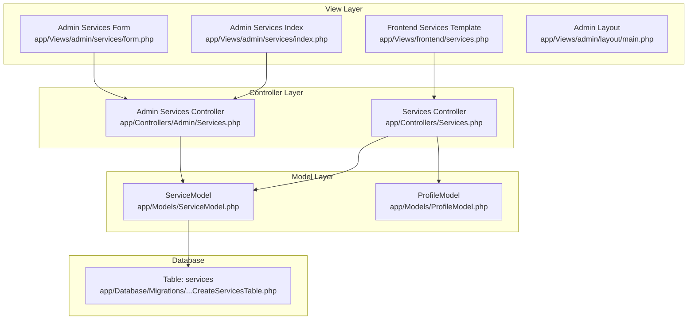
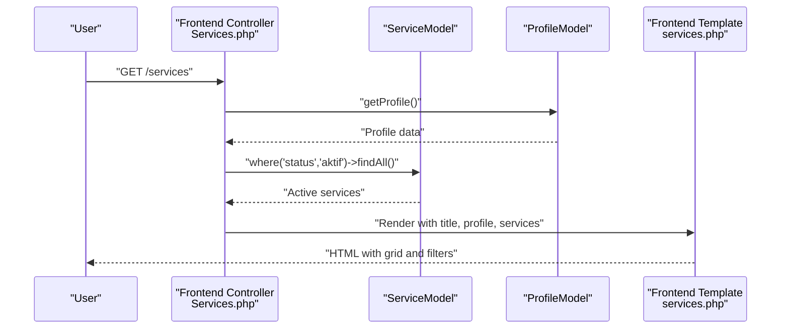
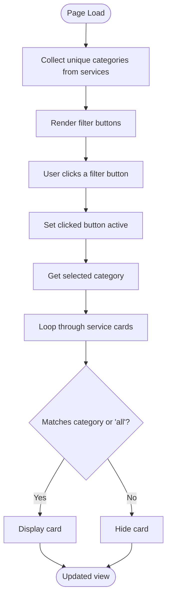
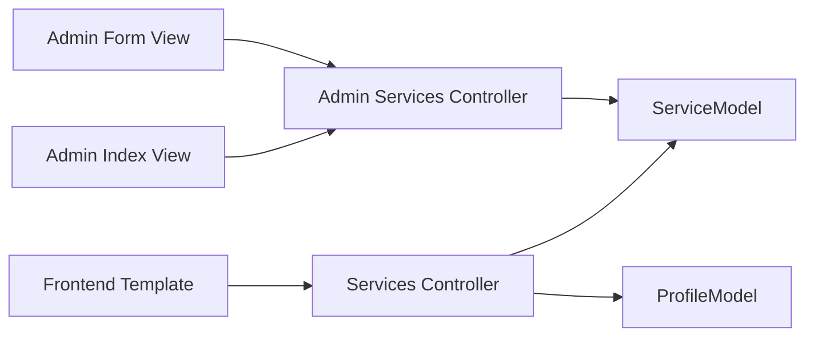

# Services Catalog

<cite>
**Referenced Files in This Document**
- [Services.php](file://app/Controllers/Services.php)
- [BaseController.php](file://app/Controllers/BaseController.php)
- [ServiceModel.php](file://app/Models/ServiceModel.php)
- [ProfileModel.php](file://app/Models/ProfileModel.php)
- [services.php](file://app/Views/frontend/services.php)
- [2024-01-01-000002_CreateServicesTable.php](file://app/Database/Migrations/2024-01-01-000002_CreateServicesTable.php)
- [db_company.sql](file://db_company.sql)
- [Admin_Services_Controller.php](file://app/Controllers/Admin/Services.php)
- [Admin_Services_Index_View.php](file://app/Views/admin/services/index.php)
- [Admin_Services_Form_View.php](file://app/Views/admin/services/form.php)
- [Admin_Main_Layout.php](file://app/Views/admin/layout/main.php)
</cite>

## Table of Contents
1. [Introduction](#introduction)
2. [Project Structure](#project-structure)
3. [Core Components](#core-components)
4. [Architecture Overview](#architecture-overview)
5. [Detailed Component Analysis](#detailed-component-analysis)
6. [Dependency Analysis](#dependency-analysis)
7. [Performance Considerations](#performance-considerations)
8. [Troubleshooting Guide](#troubleshooting-guide)
9. [Conclusion](#conclusion)

## Introduction
This document explains the services catalog page implementation for the company profile website. It covers how services are retrieved and filtered for display, how categories are organized and filtered client-side, and how the frontend template renders the grid of services. It also documents the admin CRUD operations for managing services, the underlying database schema, and practical guidance for scaling to larger catalogs.

## Project Structure
The services catalog spans three layers:
- Controller layer: retrieves data and prepares the view
- Model layer: defines the service entity and persistence
- View layer: renders the frontend catalog and admin management UI

**Diagram sources**
- [Services.php:10-20](file://app/Controllers/Services.php#L10-L20)
- [Admin_Services_Controller.php:17-24](file://app/Controllers/Admin/Services.php#L17-L24)
- [ServiceModel.php:7-13](file://app/Models/ServiceModel.php#L7-L13)
- [ProfileModel.php:7-17](file://app/Models/ProfileModel.php#L7-L17)
- [services.php:1-87](file://app/Views/frontend/services.php#L1-L87)
- [Admin_Services_Index_View.php:1-69](file://app/Views/admin/services/index.php#L1-L69)
- [Admin_Services_Form_View.php:1-104](file://app/Views/admin/services/form.php#L1-L104)
- [Admin_Main_Layout.php:1-198](file://app/Views/admin/layout/main.php#L1-L198)
- [2024-01-01-000002_CreateServicesTable.php:9-24](file://app/Database/Migrations/2024-01-01-000002_CreateServicesTable.php#L9-L24)

**Section sources**
- [Services.php:10-20](file://app/Controllers/Services.php#L10-L20)
- [ServiceModel.php:7-13](file://app/Models/ServiceModel.php#L7-L13)
- [ProfileModel.php:13-16](file://app/Models/ProfileModel.php#L13-L16)
- [services.php:1-87](file://app/Views/frontend/services.php#L1-L87)
- [Admin_Services_Controller.php:17-24](file://app/Controllers/Admin/Services.php#L17-L24)
- [Admin_Services_Index_View.php:1-69](file://app/Views/admin/services/index.php#L1-L69)
- [Admin_Services_Form_View.php:1-104](file://app/Views/admin/services/form.php#L1-L104)
- [Admin_Main_Layout.php:1-198](file://app/Views/admin/layout/main.php#L1-L198)
- [2024-01-01-000002_CreateServicesTable.php:9-24](file://app/Database/Migrations/2024-01-01-000002_CreateServicesTable.php#L9-L24)

## Core Components
- Frontend Services Controller
  - Retrieves profile metadata and active services
  - Passes data to the frontend template
  - Reference: [Services.php:10-20](file://app/Controllers/Services.php#L10-L20)

- Service Model
  - Defines table, primary key, allowed fields, and timestamps
  - Used to fetch active services via status filtering
  - Reference: [ServiceModel.php:7-13](file://app/Models/ServiceModel.php#L7-L13)

- Profile Model
  - Provides company profile data for header context
  - Reference: [ProfileModel.php:13-16](file://app/Models/ProfileModel.php#L13-L16)

- Frontend Services Template
  - Renders a responsive grid of services
  - Implements client-side category filtering
  - Handles fallback icons and images
  - Reference: [services.php:18-87](file://app/Views/frontend/services.php#L18-L87)

- Admin Services Management
  - Lists services with status badges and actions
  - CRUD forms for adding/updating/deleting services
  - Reference: [Admin_Services_Index_View.php:1-69](file://app/Views/admin/services/index.php#L1-L69), [Admin_Services_Form_View.php:1-104](file://app/Views/admin/services/form.php#L1-L104), [Admin_Services_Controller.php:17-121](file://app/Controllers/Admin/Services.php#L17-L121)

**Section sources**
- [Services.php:10-20](file://app/Controllers/Services.php#L10-L20)
- [ServiceModel.php:7-13](file://app/Models/ServiceModel.php#L7-L13)
- [ProfileModel.php:13-16](file://app/Models/ProfileModel.php#L13-L16)
- [services.php:18-87](file://app/Views/frontend/services.php#L18-L87)
- [Admin_Services_Index_View.php:1-69](file://app/Views/admin/services/index.php#L1-L69)
- [Admin_Services_Form_View.php:1-104](file://app/Views/admin/services/form.php#L1-L104)
- [Admin_Services_Controller.php:17-121](file://app/Controllers/Admin/Services.php#L17-L121)

## Architecture Overview
The frontend services page follows a straightforward MVC pattern:
- Controller fetches data from models
- Template renders the UI with category filters and responsive grid
- Admin controller manages the dataset behind the scenes

**Diagram sources**
- [Services.php:10-20](file://app/Controllers/Services.php#L10-L20)
- [ServiceModel.php:7-13](file://app/Models/ServiceModel.php#L7-L13)
- [ProfileModel.php:13-16](file://app/Models/ProfileModel.php#L13-L16)
- [services.php:1-87](file://app/Views/frontend/services.php#L1-L87)

## Detailed Component Analysis

### Frontend Services Controller Logic
- Purpose: Load active services and pass them to the view along with profile metadata
- Key steps:
  - Instantiate models
  - Fetch profile record
  - Filter services by status equals "aktif"
  - Render frontend template with prepared data
- References:
  - [Services.php:10-20](file://app/Controllers/Services.php#L10-L20)

**Section sources**
- [Services.php:10-20](file://app/Controllers/Services.php#L10-L20)

### Service Model Methods and Status Filtering
- Model definition:
  - Table: services
  - Primary key: id
  - Allowed fields: nama, deskripsi, icon, gambar, kategori, status
  - Timestamps enabled
- Status filtering:
  - Controller uses where('status','aktif')->findAll() to retrieve only active services
- References:
  - [ServiceModel.php:7-13](file://app/Models/ServiceModel.php#L7-L13)
  - [Services.php:17-17](file://app/Controllers/Services.php#L17-L17)

**Section sources**
- [ServiceModel.php:7-13](file://app/Models/ServiceModel.php#L7-L13)
- [Services.php:17-17](file://app/Controllers/Services.php#L17-L17)

### Database Schema and Migration
- Table: services
  - Fields: id, nama, deskripsi, icon, gambar, kategori, status (ENUM), created_at, updated_at
  - Default status: aktif
- Migration creates the table and sets primary key
- Sample data included in SQL dump demonstrates typical entries
- References:
  - [2024-01-01-000002_CreateServicesTable.php:9-24](file://app/Database/Migrations/2024-01-01-000002_CreateServicesTable.php#L9-L24)
  - [db_company.sql:32-43](file://db_company.sql#L32-L43)
  - [db_company.sql:107-113](file://db_company.sql#L107-L113)

**Section sources**
- [2024-01-01-000002_CreateServicesTable.php:9-24](file://app/Database/Migrations/2024-01-01-000002_CreateServicesTable.php#L9-L24)
- [db_company.sql:32-43](file://db_company.sql#L32-L43)
- [db_company.sql:107-113](file://db_company.sql#L107-L113)

### View Template Structure and Grid Layout
- Header and breadcrumbs
- Category filter bar built from existing categories in the dataset
- Responsive grid using column classes for device-specific widths
- Card layout per service with:
  - Optional image from uploads/services
  - Fallback icon if no image
  - Name, description, and category tag
- Empty state handling when no services are present
- References:
  - [services.php:1-87](file://app/Views/frontend/services.php#L1-L87)

**Section sources**
- [services.php:1-87](file://app/Views/frontend/services.php#L1-L87)

### Client-Side Category Filtering
- Implementation:
  - Buttons for each unique category derived from loaded services
  - Active button highlighting
  - JavaScript toggles display of service items based on data-category attributes
- References:
  - [services.php:18-87](file://app/Views/frontend/services.php#L18-L87)

**Diagram sources**
- [services.php:18-87](file://app/Views/frontend/services.php#L18-L87)

**Section sources**
- [services.php:18-87](file://app/Views/frontend/services.php#L18-L87)

### Pagination Handling
- Current implementation:
  - The frontend template does not implement pagination
  - The controller loads all active services at once
- Recommendations for large catalogs:
  - Use CodeIgniter’s Pager library to paginate results
  - Modify controller to accept page parameter and pass renderer to view
  - Update template to render pager controls
- References:
  - [Services.php:10-20](file://app/Controllers/Services.php#L10-L20)

**Section sources**
- [Services.php:10-20](file://app/Controllers/Services.php#L10-L20)

### Search and Filtering Capabilities
- Category filtering:
  - Implemented client-side using dataset attributes
- Full-text search:
  - Not implemented in the current template
  - Can be added by extending the filter bar and filtering by name/description
- References:
  - [services.php:18-87](file://app/Views/frontend/services.php#L18-L87)

**Section sources**
- [services.php:18-87](file://app/Views/frontend/services.php#L18-L87)

### Service Display Options, Images, and Descriptions
- Image handling:
  - Uses uploaded images from uploads/services when available
  - Falls back to gradient background with icon when missing
- Description formatting:
  - Descriptions rendered as-is; consider truncation for grid consistency
- Tagging:
  - Category displayed as a badge-like element
- References:
  - [services.php:44-61](file://app/Views/frontend/services.php#L44-L61)

**Section sources**
- [services.php:44-61](file://app/Views/frontend/services.php#L44-L61)

### User Interaction Patterns
- Navigation:
  - Breadcrumb navigation to services
- Filtering:
  - Clickable category buttons to filter cards
- Empty state:
  - Friendly message when no services are present
- References:
  - [services.php:1-87](file://app/Views/frontend/services.php#L1-L87)

**Section sources**
- [services.php:1-87](file://app/Views/frontend/services.php#L1-L87)

### Admin CRUD Operations
- Listing:
  - Admin view lists services with image preview, truncated description, category, status badges, and action buttons
- Creation:
  - Form validates required fields, handles image upload, inserts new record
- Editing:
  - Loads existing record, replaces image if provided, updates record
- Deletion:
  - Removes associated image file if present, deletes record
- References:
  - [Admin_Services_Index_View.php:1-69](file://app/Views/admin/services/index.php#L1-L69)
  - [Admin_Services_Form_View.php:1-104](file://app/Views/admin/services/form.php#L1-L104)
  - [Admin_Services_Controller.php:26-121](file://app/Controllers/Admin/Services.php#L26-L121)

**Section sources**
- [Admin_Services_Index_View.php:1-69](file://app/Views/admin/services/index.php#L1-L69)
- [Admin_Services_Form_View.php:1-104](file://app/Views/admin/services/form.php#L1-L104)
- [Admin_Services_Controller.php:26-121](file://app/Controllers/Admin/Services.php#L26-L121)

## Dependency Analysis
- Controller depends on:
  - ServiceModel for retrieving active services
  - ProfileModel for company metadata
- Template depends on:
  - Controller-provided data arrays
  - Client-side script for filtering
- Admin depends on:
  - ServiceModel for CRUD operations
  - Layout for consistent UI

**Diagram sources**
- [Services.php:10-20](file://app/Controllers/Services.php#L10-L20)
- [ServiceModel.php:7-13](file://app/Models/ServiceModel.php#L7-L13)
- [ProfileModel.php:13-16](file://app/Models/ProfileModel.php#L13-L16)
- [services.php:1-87](file://app/Views/frontend/services.php#L1-L87)
- [Admin_Services_Controller.php:17-24](file://app/Controllers/Admin/Services.php#L17-L24)
- [Admin_Services_Index_View.php:1-69](file://app/Views/admin/services/index.php#L1-L69)
- [Admin_Services_Form_View.php:1-104](file://app/Views/admin/services/form.php#L1-L104)

**Section sources**
- [Services.php:10-20](file://app/Controllers/Services.php#L10-L20)
- [ServiceModel.php:7-13](file://app/Models/ServiceModel.php#L7-L13)
- [ProfileModel.php:13-16](file://app/Models/ProfileModel.php#L13-L16)
- [services.php:1-87](file://app/Views/frontend/services.php#L1-L87)
- [Admin_Services_Controller.php:17-24](file://app/Controllers/Admin/Services.php#L17-L24)
- [Admin_Services_Index_View.php:1-69](file://app/Views/admin/services/index.php#L1-L69)
- [Admin_Services_Form_View.php:1-104](file://app/Views/admin/services/form.php#L1-L104)

## Performance Considerations
- Current state:
  - Loading all active services in memory on each request
  - Client-side filtering of a single page of data
- Recommendations:
  - Introduce server-side pagination to reduce payload size
  - Add database indexes on frequently filtered columns (e.g., status, kategori)
  - Lazy-load images or use placeholders to improve perceived performance
  - Consider caching active services for short TTL if data changes infrequently
- References:
  - [Services.php:10-20](file://app/Controllers/Services.php#L10-L20)
  - [2024-01-01-000002_CreateServicesTable.php:22-23](file://app/Database/Migrations/2024-01-01-000002_CreateServicesTable.php#L22-L23)

[No sources needed since this section provides general guidance]

## Troubleshooting Guide
- No services displayed:
  - Verify database contains records with status aktif
  - Confirm migration applied and table exists
  - References:
    - [db_company.sql:107-113](file://db_company.sql#L107-L113)
    - [2024-01-01-000002_CreateServicesTable.php:9-24](file://app/Database/Migrations/2024-01-01-000002_CreateServicesTable.php#L9-L24)
- Images not showing:
  - Ensure uploads/services directory exists and is writable
  - Confirm image filenames match stored values
  - References:
    - [Admin_Services_Controller.php:43-48](file://app/Controllers/Admin/Services.php#L43-L48)
    - [Admin_Services_Controller.php:85-94](file://app/Controllers/Admin/Services.php#L85-L94)
- Category filter not working:
  - Ensure data-category attributes match actual categories
  - Confirm JavaScript runs after DOM load
  - References:
    - [services.php:23-25](file://app/Views/frontend/services.php#L23-L25)
    - [services.php:74-83](file://app/Views/frontend/services.php#L74-L83)

**Section sources**
- [db_company.sql:107-113](file://db_company.sql#L107-L113)
- [2024-01-01-000002_CreateServicesTable.php:9-24](file://app/Database/Migrations/2024-01-01-000002_CreateServicesTable.php#L9-L24)
- [Admin_Services_Controller.php:43-48](file://app/Controllers/Admin/Services.php#L43-L48)
- [Admin_Services_Controller.php:85-94](file://app/Controllers/Admin/Services.php#L85-L94)
- [services.php:23-25](file://app/Views/frontend/services.php#L23-L25)
- [services.php:74-83](file://app/Views/frontend/services.php#L74-L83)

## Conclusion
The services catalog is implemented with a clean separation of concerns: a controller that filters active services, a model that defines the domain, and templates that render the frontend grid and admin management UI. Client-side filtering provides immediate interactivity, while the admin interface supports full CRUD lifecycle. For production at scale, introduce pagination, indexing, and caching to optimize performance.