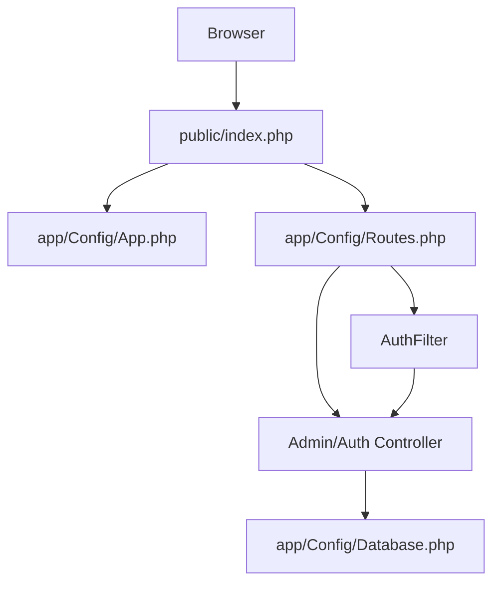

# Getting Started

<cite>
**Referenced Files in This Document**
- [README.md](file://README.md)
- [composer.json](file://composer.json)
- [public/index.php](file://public/index.php)
- [public/.htaccess](file://public/.htaccess)
- [app/.htaccess](file://app/.htaccess)
- [app/Config/App.php](file://app/Config/App.php)
- [app/Config/Database.php](file://app/Config/Database.php)
- [app/Config/Routes.php](file://app/Config/Routes.php)
- [app/Filters/AuthFilter.php](file://app/Filters/AuthFilter.php)
- [app/Controllers/Admin/Auth.php](file://app/Controllers/Admin/Auth.php)
- [db_company.sql](file://db_company.sql)
- [app/Database/Migrations/2024-01-01-000001_CreateProfileTable.php](file://app/Database/Migrations/2024-01-01-000001_CreateProfileTable.php)
- [app/Database/Migrations/2024-01-01-000004_CreateUsersTable.php](file://app/Database/Migrations/2024-01-01-000004_CreateUsersTable.php)
- [app/Database/Seeds/DatabaseSeeder.php](file://app/Database/Seeds/DatabaseSeeder.php)
</cite>

## Table of Contents
1. [Introduction](#introduction)
2. [System Requirements](#system-requirements)
3. [Installation Prerequisites](#installation-prerequisites)
4. [Environment Setup](#environment-setup)
5. [Database Setup](#database-setup)
6. [.env Configuration](#env-configuration)
7. [URL Rewriting Enablement](#url-rewriting-enablement)
8. [Initial Access and Verification](#initial-access-and-verification)
9. [Architecture Overview](#architecture-overview)
10. [Troubleshooting Guide](#troubleshooting-guide)
11. [Conclusion](#conclusion)

## Introduction
This guide helps you install and configure the Company Profile system built with CodeIgniter 4. It covers environment setup, database import, configuration, URL rewriting, and first-time access. The system includes a public frontend and an admin dashboard protected by authentication.

## System Requirements
- PHP: 8.2 or higher
- Web Server: Apache (XAMPP, WAMP, or Laragon)
- Database: MySQL or MariaDB
- Apache module: mod_rewrite must be enabled
- Required PHP extensions: mbstring, json, mysqlnd

These requirements are enforced during application startup and are documented in the project's installation guide and configuration files.

**Section sources**
- [README.md:8-12](file://README.md#L8-L12)
- [composer.json:12-18](file://composer.json#L12-L18)
- [public/index.php:12-32](file://public/index.php#L12-L32)

## Installation Prerequisites
Before installing, ensure your development environment meets the requirements:
- PHP 8.2+ with mbstring, json, and mysqlnd extensions loaded
- Apache server with mod_rewrite enabled
- MySQL or MariaDB server running and accessible

The project README explicitly lists these prerequisites and provides environment-specific guidance.

**Section sources**
- [README.md:8-12](file://README.md#L8-L12)
- [composer.json:12-18](file://composer.json#L12-L18)
- [public/index.php:24-32](file://public/index.php#L24-L32)

## Environment Setup
Choose one of the recommended local environments and place the project accordingly:

- XAMPP: Place the project folder under htdocs
  - Example path: C:/xampp/htdocs/companyprofile/
- WAMP: Place the project folder under www
  - Example path: C:/wamp64/www/companyprofile/
- Laragon: Place the project folder under www
  - Example path: C:/laragon/www/companyprofile/

After placing the folder, verify that Apache serves the public/index.php entry point and that mod_rewrite is enabled.

**Section sources**
- [README.md:14-18](file://README.md#L14-L18)
- [README.md:37-41](file://README.md#L37-L41)

## Database Setup
The project includes a ready-to-import SQL dump that creates the database, tables, and initial data.

Steps:
1. Open phpMyAdmin in your local environment.
2. Click Import.
3. Select the file: companyprofile/db_company.sql
4. Confirm import; the database db_companyprofile and tables will be created automatically.

The SQL dump defines four tables: profile, services, gallery, users, and includes sample data and a default admin user.

Verification:
- Database name: db_companyprofile
- Tables created: profile, services, gallery, users, ci_sessions
- Initial data included for profile, services, gallery
- Default admin user created with hashed password

**Section sources**
- [README.md:20-25](file://README.md#L20-L25)
- [db_company.sql:6-139](file://db_company.sql#L6-L139)

## .env Configuration
Configure the application environment and database connection:

1. Open the .env file in the project root.
2. Set the base URL to match your local server path:
   - app.baseURL = http://localhost/companyprofile/public/
3. Configure database credentials:
   - database.default.hostname = localhost
   - database.default.database = db_companyprofile
   - database.default.username = root
   - database.default.password = [leave empty if none]

These settings align with the default configuration in the application config files and ensure the app resolves routes and connects to the imported database.

**Section sources**
- [README.md:27-35](file://README.md#L27-L35)
- [app/Config/App.php:19](file://app/Config/App.php#L19)
- [app/Config/Database.php:27-52](file://app/Config/Database.php#L27-L52)

## URL Rewriting Enablement
Enable Apache's mod_rewrite module so clean URLs work correctly:

- For XAMPP: Open httpd.conf and ensure the rewrite module is loaded
  - LoadModule rewrite_module modules/mod_rewrite.so
- For WAMP and Laragon: Verify that the Apache rewrite module is enabled in the service manager

After enabling, restart Apache and confirm that requests resolve to index.php without exposing it in the URL.

**Section sources**
- [README.md:37-41](file://README.md#L37-L41)
- [public/.htaccess:1-12](file://public/.htaccess#L1-L12)

## Initial Access and Verification
Access the application and admin panel:

- Public website: http://localhost/companyprofile/public/
- Admin login: http://localhost/companyprofile/public/admin/login
- Default admin credentials:
  - Email: admin@jayamakmur.co.id
  - Password: admin123

Verification steps:
1. Visit the public homepage to confirm the frontend loads without errors.
2. Navigate to /admin/login and log in with the default admin credentials.
3. After logging in, you should land on /admin/dashboard.
4. Use the admin menu to manage profile, services, gallery, and users.

The routing configuration protects admin routes with an authentication filter, redirecting unauthenticated users to the login page.

**Section sources**
- [README.md:43-46](file://README.md#L43-L46)
- [README.md:50-56](file://README.md#L50-L56)
- [app/Config/Routes.php:17-54](file://app/Config/Routes.php#L17-L54)
- [app/Filters/AuthFilter.php:11-16](file://app/Filters/AuthFilter.php#L11-L16)
- [app/Controllers/Admin/Auth.php:10-48](file://app/Controllers/Admin/Auth.php#L10-L48)

## Architecture Overview
The system follows a standard CodeIgniter 4 structure with a public entry point, admin authentication, and protected routes.

**Diagram sources**
- [public/index.php:59-67](file://public/index.php#L59-L67)
- [app/Config/App.php:19](file://app/Config/App.php#L19)
- [app/Config/Routes.php:17-54](file://app/Config/Routes.php#L17-L54)
- [app/Controllers/Admin/Auth.php:10-48](file://app/Controllers/Admin/Auth.php#L10-L48)
- [app/Filters/AuthFilter.php:11-16](file://app/Filters/AuthFilter.php#L11-L16)
- [app/Config/Database.php:27-52](file://app/Config/Database.php#L27-L52)

## Troubleshooting Guide
Common installation issues and resolutions:

- PHP version or missing extensions
  - Symptom: Immediate error on accessing the site
  - Cause: PHP < 8.2 or missing mbstring/json/mysqlnd
  - Resolution: Install/enable the required PHP version and extensions
  - Reference: [PHP version and extensions check:12-32](file://public/index.php#L12-L32)

- mod_rewrite not enabled
  - Symptom: 404 errors or index.php visible in URLs
  - Cause: Apache rewrite module disabled
  - Resolution: Enable mod_rewrite in Apache configuration and restart the server
  - Reference: [mod_rewrite enablement:37-41](file://README.md#L37-L41), [URL rewriting rules:1-12](file://public/.htaccess#L1-L12)

- Incorrect base URL
  - Symptom: Mixed-content or broken asset links
  - Cause: baseURL does not match the project path
  - Resolution: Update app.baseURL in .env to match your local path
  - Reference: [Base URL configuration](file://app/Config/App.php#L19), [.env settings:27-35](file://README.md#L27-L35)

- Database connection failure
  - Symptom: Database-related errors on login or dashboard
  - Cause: Wrong hostname/database/credentials
  - Resolution: Verify database.default.* settings in .env and ensure the database exists
  - Reference: [Database configuration:27-52](file://app/Config/Database.php#L27-L52), [Database import:20-25](file://README.md#L20-L25)

- Admin login fails
  - Symptom: Redirect to login with error messages
  - Cause: Incorrect email/password or inactive account
  - Resolution: Use the default admin credentials; ensure the user status is active
  - Reference: [Default admin credentials:50-56](file://README.md#L50-L56), [Admin login logic:18-42](file://app/Controllers/Admin/Auth.php#L18-L42)

- Protected admin routes inaccessible
  - Symptom: Redirect to login from admin pages
  - Cause: Missing or invalid session
  - Resolution: Log in successfully; the AuthFilter redirects unauthenticated requests
  - Reference: [Admin routes and filter:23-54](file://app/Config/Routes.php#L23-L54), [AuthFilter:11-16](file://app/Filters/AuthFilter.php#L11-L16)

- File permissions
  - Symptom: Write failures for uploads/logs/cache
  - Cause: Insufficient permissions on writable/ directory
  - Resolution: Grant write permissions to writable/ and its subdirectories
  - Reference: [Writable directory](file://writable/index.html)

- Application visibility
  - Symptom: Access to app/ source files
  - Resolution: Ensure app/.htaccess denies all access
  - Reference: [App directory protection:1-7](file://app/.htaccess#L1-L7)

**Section sources**
- [public/index.php:12-32](file://public/index.php#L12-L32)
- [README.md:27-35](file://README.md#L27-L35)
- [app/Config/App.php:19](file://app/Config/App.php#L19)
- [app/Config/Database.php:27-52](file://app/Config/Database.php#L27-L52)
- [README.md:50-56](file://README.md#L50-L56)
- [app/Controllers/Admin/Auth.php:18-42](file://app/Controllers/Admin/Auth.php#L18-L42)
- [app/Config/Routes.php:23-54](file://app/Config/Routes.php#L23-L54)
- [app/Filters/AuthFilter.php:11-16](file://app/Filters/AuthFilter.php#L11-L16)
- [app/.htaccess:1-7](file://app/.htaccess#L1-L7)

## Conclusion
You now have the essential steps to install, configure, and verify the Company Profile system. Ensure your environment meets the requirements, import the database, configure .env, enable URL rewriting, and access the admin panel with the provided credentials. Use the troubleshooting guide to resolve common issues quickly.