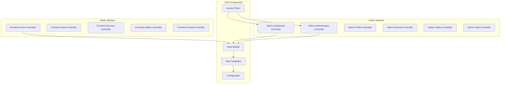
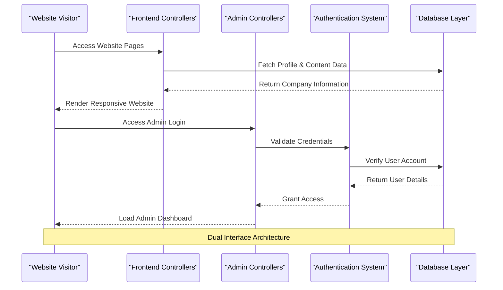
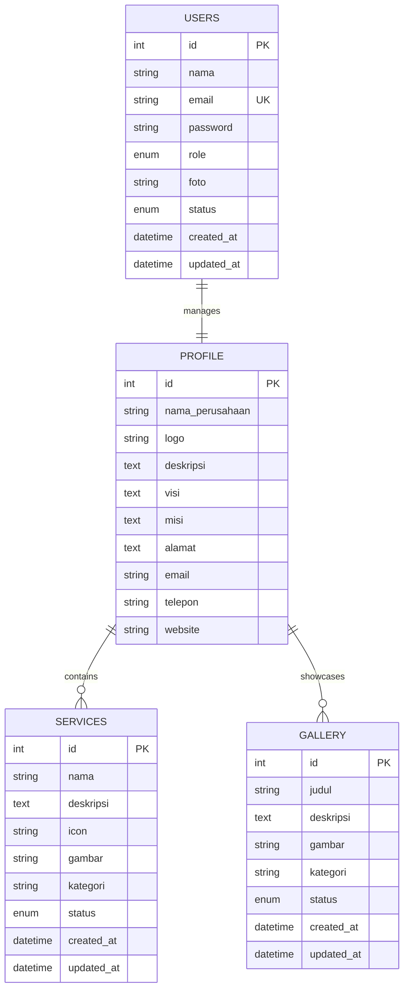
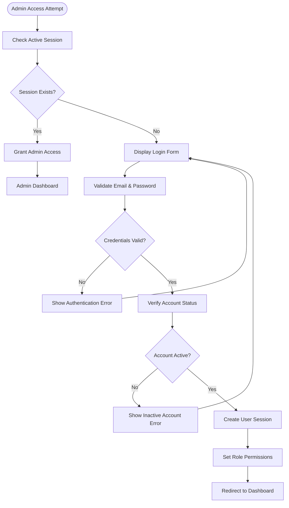
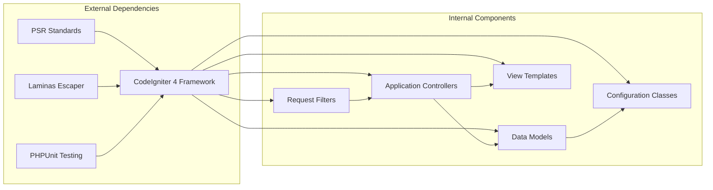

# Project Overview

<cite>
**Referenced Files in This Document**
- [Home.php](file://app/Controllers/Home.php)
- [Dashboard.php](file://app/Controllers/Admin/Dashboard.php)
- [App.php](file://app/Config/App.php)
- [Routes.php](file://app/Config/Routes.php)
- [composer.json](file://composer.json)
- [ProfileModel.php](file://app/Models/ProfileModel.php)
- [UserModel.php](file://app/Models/UserModel.php)
- [AuthFilter.php](file://app/Filters/AuthFilter.php)
- [header.php](file://app/Views/frontend/layout/header.php)
- [dashboard.php](file://app/Views/admin/dashboard.php)
- [Auth.php](file://app/Controllers/Admin/Auth.php)
- [db_company.sql](file://db_company.sql)
- [home.php](file://app/Views/frontend/home.php)
- [about.php](file://app/Views/frontend/about.php)
</cite>

## Table of Contents
1. [Introduction](#introduction)
2. [Project Structure](#project-structure)
3. [Core Components](#core-components)
4. [Architecture Overview](#architecture-overview)
5. [Detailed Component Analysis](#detailed-component-analysis)
6. [Dependency Analysis](#dependency-analysis)
7. [Performance Considerations](#performance-considerations)
8. [Troubleshooting Guide](#troubleshooting-guide)
9. [Conclusion](#conclusion)

## Introduction
This project is a professional company profile website system designed for PT Jaya Makmur. Built with the CodeIgniter 4 framework, it provides a dual-interface architecture:
- Frontend visitor interface for showcasing company information, services, and gallery
- Administrative backend for managing content, users, and company profile

The system emphasizes responsive design, content management capabilities, and secure user authentication to establish a strong digital presence for PT Jaya Makmur.

## Project Structure
The project follows CodeIgniter 4's MVC architecture with clear separation between frontend and admin interfaces:

**Diagram sources**
- [Home.php:1-27](file://app/Controllers/Home.php#L1-L27)
- [Dashboard.php:1-25](file://app/Controllers/Admin/Dashboard.php#L1-L25)
- [Routes.php:1-55](file://app/Config/Routes.php#L1-L55)

**Section sources**
- [Home.php:1-27](file://app/Controllers/Home.php#L1-L27)
- [Dashboard.php:1-25](file://app/Controllers/Admin/Dashboard.php#L1-L25)
- [Routes.php:1-55](file://app/Config/Routes.php#L1-L55)

## Core Components
The system comprises several key components working together to deliver a comprehensive company profile solution:

### Frontend Controllers
- **Home Controller**: Manages the main landing page with integrated profile, services, and gallery data
- **About Controller**: Handles company profile and corporate information pages
- **Services Controller**: Manages service listings and individual service pages
- **Gallery Controller**: Handles photo gallery displays
- **Contact Controller**: Processes contact form submissions

### Admin Controllers
- **Dashboard Controller**: Provides administrative overview with statistics and quick actions
- **Authentication Controller**: Manages admin login, logout, and session handling
- **Content Management Controllers**: Handle CRUD operations for services, gallery, and user management

### Data Models
- **Profile Model**: Manages company information including name, description, vision, mission, and contact details
- **User Model**: Handles administrator accounts with role-based permissions and authentication
- **Service Model**: Manages service offerings with status tracking
- **Gallery Model**: Handles image gallery items with categorization

**Section sources**
- [Home.php:9-25](file://app/Controllers/Home.php#L9-L25)
- [Dashboard.php:11-23](file://app/Controllers/Admin/Dashboard.php#L11-L23)
- [ProfileModel.php:7-17](file://app/Models/ProfileModel.php#L7-L17)
- [UserModel.php:7-19](file://app/Models/UserModel.php#L7-L19)

## Architecture Overview
The system implements a clean dual-interface architecture with separate routing, controllers, and view templates for frontend and admin sections:

**Diagram sources**
- [Routes.php:9-54](file://app/Config/Routes.php#L9-L54)
- [Auth.php:18-42](file://app/Controllers/Admin/Auth.php#L18-L42)
- [AuthFilter.php:11-16](file://app/Filters/AuthFilter.php#L11-L16)

The architecture separates concerns with:
- **Frontend routes** for public website access
- **Admin routes** with authentication filters
- **Shared models** for data persistence
- **Template inheritance** for consistent layouts

**Section sources**
- [Routes.php:17-54](file://app/Config/Routes.php#L17-L54)
- [AuthFilter.php:9-22](file://app/Filters/AuthFilter.php#L9-L22)

## Detailed Component Analysis

### Technology Stack Overview
The project leverages a modern PHP stack optimized for content management and professional presentation:

#### Backend Framework
- **CodeIgniter 4**: MVC framework providing structured application development
- **PHP 8.2+**: Modern PHP runtime with enhanced performance and security
- **MySQL Database**: Relational database for structured content storage

#### Frontend Technologies
- **Bootstrap 5**: Responsive CSS framework for mobile-first design
- **Font Awesome 6**: Icon library for visual elements
- **Google Fonts**: Web fonts for typography consistency
- **AOS Library**: Animation on scroll effects

#### Administration Features
- **AdminLTE 3.2.0**: Professional admin dashboard template
- **Session-based Authentication**: Secure user management
- **Role-based Permissions**: Superadmin and standard admin access levels

### Database Schema Design
The system uses normalized database tables with appropriate relationships:

**Diagram sources**
- [db_company.sql:15-75](file://db_company.sql#L15-L75)

**Section sources**
- [db_company.sql:1-139](file://db_company.sql#L1-L139)

### Authentication and Authorization System
The admin authentication system provides robust security measures:

**Diagram sources**
- [Auth.php:18-42](file://app/Controllers/Admin/Auth.php#L18-L42)
- [AuthFilter.php:11-16](file://app/Filters/AuthFilter.php#L11-L16)

**Section sources**
- [Auth.php:8-49](file://app/Controllers/Admin/Auth.php#L8-L49)
- [AuthFilter.php:9-22](file://app/Filters/AuthFilter.php#L9-L22)

## Dependency Analysis
The project maintains clean dependency relationships through CodeIgniter 4's modular architecture:

**Diagram sources**
- [composer.json:12-28](file://composer.json#L12-L28)
- [App.php:1-203](file://app/Config/App.php#L1-L203)

**Section sources**
- [composer.json:1-70](file://composer.json#L1-L70)
- [App.php:7-203](file://app/Config/App.php#L7-L203)

## Performance Considerations
The system incorporates several performance optimization strategies:

### Caching Strategy
- **Model-level caching**: Efficient data retrieval through CodeIgniter's model caching
- **Static asset optimization**: CDN-hosted libraries (Bootstrap, Font Awesome, Google Fonts)
- **Database query optimization**: Selective field retrieval and proper indexing

### Security Measures
- **CSRF protection**: Built-in CodeIgniter CSRF prevention
- **Input validation**: Comprehensive form validation and sanitization
- **Password hashing**: bcrypt encryption for secure credential storage
- **Session security**: Secure session management with proper timeout handling

### Scalability Features
- **Modular architecture**: Easy addition of new content types and features
- **Database normalization**: Optimized table relationships for efficient queries
- **Responsive design**: Mobile-first approach ensuring cross-device compatibility

## Troubleshooting Guide
Common issues and their solutions:

### Authentication Problems
- **Login failures**: Verify email/password combination and account status
- **Session timeouts**: Check server session configuration and browser cookie settings
- **Permission errors**: Confirm user role assignments and access level configurations

### Database Connectivity
- **Connection errors**: Verify database credentials and server availability
- **Schema issues**: Run database migrations to ensure table structures are current
- **Data integrity**: Check foreign key relationships and constraint violations

### Performance Issues
- **Slow page loads**: Enable CodeIgniter's profiler to identify bottlenecks
- **Memory usage**: Monitor model query efficiency and optimize database indexes
- **Asset loading**: Verify CDN accessibility and local fallback resources

**Section sources**
- [Auth.php:26-41](file://app/Controllers/Admin/Auth.php#L26-L41)
- [db_company.sql:80-86](file://db_company.sql#L80-L86)

## Conclusion
The PT Jaya Makmur Company Profile System represents a comprehensive digital solution that effectively establishes and maintains the company's online presence. Through its dual-interface architecture, the system successfully serves both external stakeholders seeking information and internal administrators managing content updates.

Key strengths include:
- **Professional presentation**: Modern design with responsive layouts
- **Content management**: Intuitive admin interface for maintaining company information
- **Security foundation**: Robust authentication and authorization mechanisms
- **Technical excellence**: Well-structured CodeIgniter 4 implementation with clear separation of concerns

The system provides a scalable foundation for future enhancements while delivering immediate value through improved digital communication and professional presentation of PT Jaya Makmur's services and achievements.