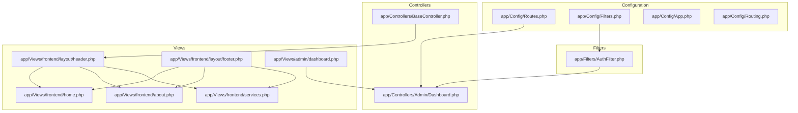
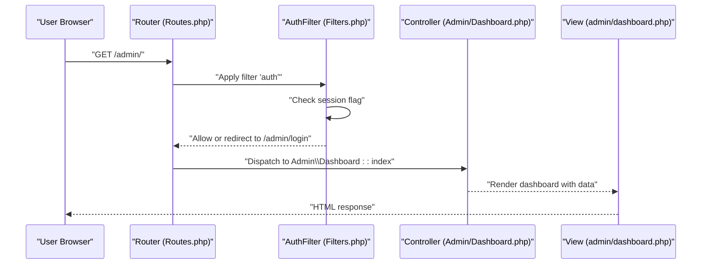
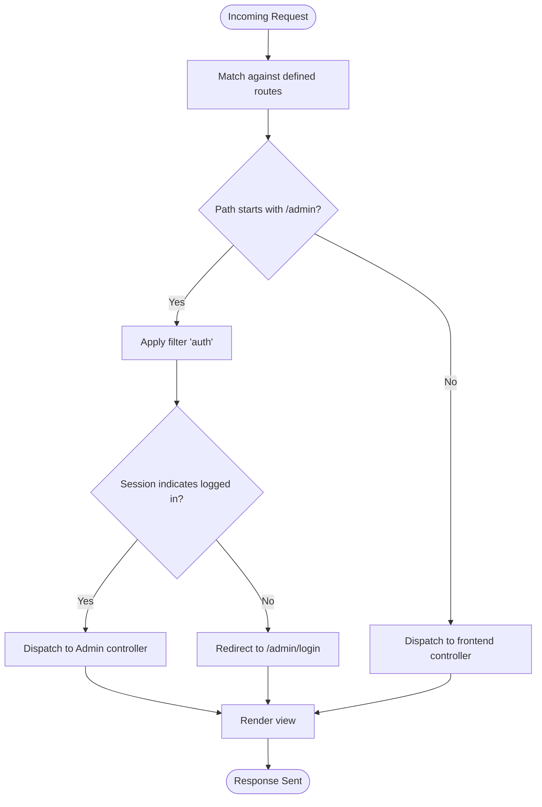
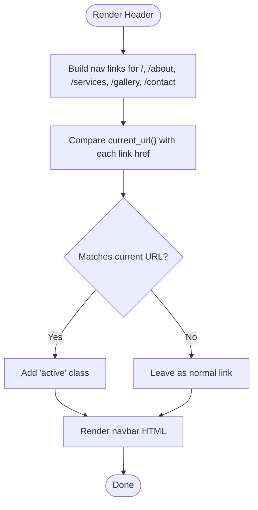
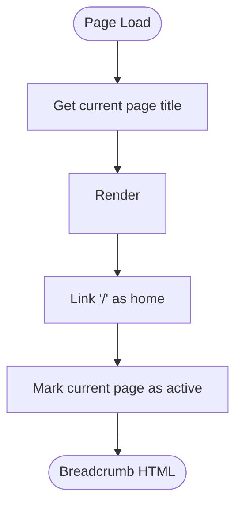
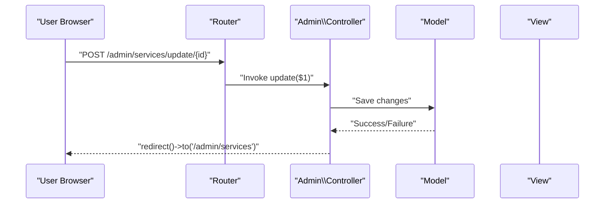
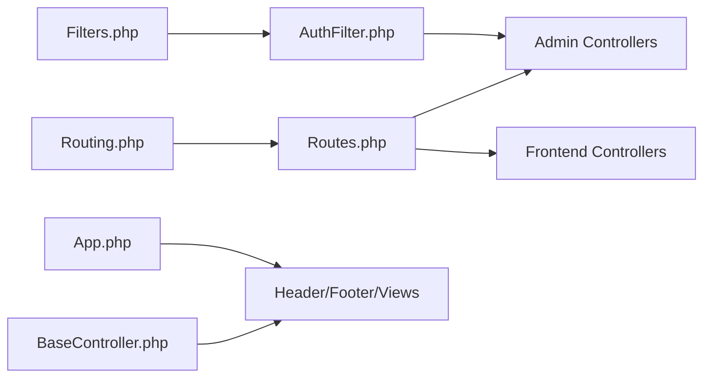

# Routing & Navigation

<cite>
**Referenced Files in This Document**
- [Routes.php](file://app/Config/Routes.php)
- [BaseController.php](file://app/Controllers/BaseController.php)
- [AuthFilter.php](file://app/Filters/AuthFilter.php)
- [Filters.php](file://app/Config/Filters.php)
- [header.php](file://app/Views/frontend/layout/header.php)
- [footer.php](file://app/Views/frontend/layout/footer.php)
- [home.php](file://app/Views/frontend/home.php)
- [about.php](file://app/Views/frontend/about.php)
- [services.php](file://app/Views/frontend/services.php)
- [dashboard.php](file://app/Views/admin/dashboard.php)
- [Dashboard.php](file://app/Controllers/Admin/Dashboard.php)
- [App.php](file://app/Config/App.php)
- [Routing.php](file://app/Config/Routing.php)
</cite>

## Table of Contents
1. [Introduction](#introduction)
2. [Project Structure](#project-structure)
3. [Core Components](#core-components)
4. [Architecture Overview](#architecture-overview)
5. [Detailed Component Analysis](#detailed-component-analysis)
6. [Dependency Analysis](#dependency-analysis)
7. [Performance Considerations](#performance-considerations)
8. [Troubleshooting Guide](#troubleshooting-guide)
9. [Conclusion](#conclusion)

## Introduction
This document explains the routing and navigation system of the company profile website built on CodeIgniter 4. It covers URL routing configuration, route grouping for admin protection, clean URL structure, navigation menu generation, active link highlighting, and breadcrumbs. It also details BaseController helper methods for URL generation, route parameter handling, and redirect mechanisms. Finally, it addresses SEO-friendly URL patterns, canonical links, meta tag management, route caching, performance optimization, and URL scheme consistency.

## Project Structure
The routing and navigation system spans configuration, controllers, filters, and view templates:
- Routing configuration defines frontend and admin routes, including grouped admin routes with authentication filtering.
- Controllers handle requests and pass data to views.
- Filters enforce admin authentication.
- Views render navigation menus, active states, and breadcrumbs.



**Diagram sources**
- [Routes.php:1-55](file://app/Config/Routes.php#L1-L55)
- [Filters.php:1-31](file://app/Config/Filters.php#L1-L31)
- [App.php:1-203](file://app/Config/App.php#L1-L203)
- [Routing.php:1-150](file://app/Config/Routing.php#L1-L150)
- [BaseController.php:1-26](file://app/Controllers/BaseController.php#L1-L26)
- [AuthFilter.php:1-23](file://app/Filters/AuthFilter.php#L1-L23)
- [header.php:1-359](file://app/Views/frontend/layout/header.php#L1-L359)
- [footer.php:1-103](file://app/Views/frontend/layout/footer.php#L1-L103)
- [home.php:1-196](file://app/Views/frontend/home.php#L1-L196)
- [about.php:1-152](file://app/Views/frontend/about.php#L1-L152)
- [services.php:1-87](file://app/Views/frontend/services.php#L1-L87)
- [dashboard.php:1-133](file://app/Views/admin/dashboard.php#L1-L133)
- [Dashboard.php:1-25](file://app/Controllers/Admin/Dashboard.php#L1-L25)

**Section sources**
- [Routes.php:1-55](file://app/Config/Routes.php#L1-L55)
- [Filters.php:1-31](file://app/Config/Filters.php#L1-L31)
- [App.php:1-203](file://app/Config/App.php#L1-L203)
- [Routing.php:1-150](file://app/Config/Routing.php#L1-L150)
- [BaseController.php:1-26](file://app/Controllers/BaseController.php#L1-L26)
- [header.php:1-359](file://app/Views/frontend/layout/header.php#L1-L359)
- [footer.php:1-103](file://app/Views/frontend/layout/footer.php#L1-L103)
- [home.php:1-196](file://app/Views/frontend/home.php#L1-L196)
- [about.php:1-152](file://app/Views/frontend/about.php#L1-L152)
- [services.php:1-87](file://app/Views/frontend/services.php#L1-L87)
- [dashboard.php:1-133](file://app/Views/admin/dashboard.php#L1-L133)
- [Dashboard.php:1-25](file://app/Controllers/Admin/Dashboard.php#L1-L25)

## Core Components
- URL routing configuration: Defines static routes for frontend pages and admin area, including grouped routes with a filter for authentication.
- Admin protection: A dedicated filter checks session state and redirects unauthenticated users to the login page.
- Navigation and breadcrumbs: Views render navigation menus and breadcrumbs with active link highlighting logic.
- BaseController helpers: Provides loaded helpers for URL and form generation, enabling consistent URL construction across views and controllers.
- URL scheme and base configuration: App configuration sets the base URL and index page behavior, ensuring consistent absolute URLs.

**Section sources**
- [Routes.php:9-54](file://app/Config/Routes.php#L9-L54)
- [AuthFilter.php:11-16](file://app/Filters/AuthFilter.php#L11-L16)
- [Filters.php:14-21](file://app/Config/Filters.php#L14-L21)
- [header.php:342-351](file://app/Views/frontend/layout/header.php#L342-L351)
- [BaseController.php:16-16](file://app/Controllers/BaseController.php#L16-L16)
- [App.php:19-43](file://app/Config/App.php#L19-L43)

## Architecture Overview
The routing and navigation architecture integrates configuration, filters, controllers, and views to deliver clean URLs, protected admin routes, and consistent navigation.



**Diagram sources**
- [Routes.php:23-25](file://app/Config/Routes.php#L23-L25)
- [Filters.php:14-21](file://app/Config/Filters.php#L14-L21)
- [AuthFilter.php:11-16](file://app/Filters/AuthFilter.php#L11-L16)
- [Dashboard.php:13-23](file://app/Controllers/Admin/Dashboard.php#L13-L23)
- [dashboard.php:1-133](file://app/Views/admin/dashboard.php#L1-L133)

## Detailed Component Analysis

### URL Routing Configuration
- Frontend routes define clean, semantic paths for home, about, services, gallery, and contact.
- Admin authentication routes expose login and logout endpoints.
- Admin routes are grouped under the “admin” prefix and protected by the “auth” filter.
- Route parameters are captured using placeholders for edit/update/delete actions.



**Diagram sources**
- [Routes.php:10-54](file://app/Config/Routes.php#L10-L54)
- [Filters.php:14-21](file://app/Config/Filters.php#L14-L21)
- [AuthFilter.php:11-16](file://app/Filters/AuthFilter.php#L11-L16)

**Section sources**
- [Routes.php:9-54](file://app/Config/Routes.php#L9-L54)

### Route Groups for Admin Protection
- Admin routes are grouped with a filter alias “auth”.
- The filter checks a session flag and redirects to the login page if missing.
- This ensures all admin endpoints remain protected without duplicating logic in controllers.

```mermaid
classDiagram
class RoutesConfig {
+group("admin", {filter : "auth"}, routes)
}
class AuthFilter {
+before(request) Response
+after(request, response)
}
RoutesConfig --> AuthFilter : "applies filter 'auth'"
```

**Diagram sources**
- [Routes.php:23-25](file://app/Config/Routes.php#L23-L25)
- [AuthFilter.php:11-16](file://app/Filters/AuthFilter.php#L11-L16)

**Section sources**
- [Routes.php:23-25](file://app/Config/Routes.php#L23-L25)
- [AuthFilter.php:11-16](file://app/Filters/AuthFilter.php#L11-L16)

### Clean URL Structure
- Frontend URLs are clean and human-readable (/, /about, /services, /gallery, /contact).
- Admin URLs follow a consistent “/admin/{endpoint}” pattern with CRUD endpoints using numeric IDs as parameters.
- The configuration disables auto-routing and relies on explicit route definitions for predictable URLs.

**Section sources**
- [Routes.php:10-54](file://app/Config/Routes.php#L10-L54)
- [Routing.php:97-97](file://app/Config/Routing.php#L97-L97)

### Navigation Menu Generation and Active Link Highlighting
- The frontend header template renders a responsive navigation bar with links to all primary pages.
- Active state is determined by comparing the current URL with the link’s href using a helper function.
- The footer template mirrors navigation links for accessibility and SEO.



**Diagram sources**
- [header.php:342-351](file://app/Views/frontend/layout/header.php#L342-L351)

**Section sources**
- [header.php:342-351](file://app/Views/frontend/layout/header.php#L342-L351)
- [footer.php:22-28](file://app/Views/frontend/layout/footer.php#L22-L28)

### Breadcrumb Implementation
- Breadcrumbs are implemented in specific page views (About and Services) using Bootstrap breadcrumb classes.
- They reflect the current page context and link back to the homepage.



**Diagram sources**
- [about.php:10-15](file://app/Views/frontend/about.php#L10-L15)
- [services.php:9-15](file://app/Views/frontend/services.php#L9-L15)

**Section sources**
- [about.php:10-15](file://app/Views/frontend/about.php#L10-L15)
- [services.php:9-15](file://app/Views/frontend/services.php#L9-L15)

### BaseController Helper Methods for URL Generation
- BaseController declares helper loading for URL, form, and text helpers.
- These helpers enable consistent URL construction and form rendering across views and controllers.

**Section sources**
- [BaseController.php:16-16](file://app/Controllers/BaseController.php#L16-L16)

### Route Parameter Handling and Redirect Mechanisms
- Numeric parameters are captured for edit/update/delete endpoints in admin routes.
- Controllers receive parameters and perform model operations; redirects are used to maintain clean post-action URLs.



**Diagram sources**
- [Routes.php:35-37](file://app/Config/Routes.php#L35-L37)

**Section sources**
- [Routes.php:35-37](file://app/Config/Routes.php#L35-L37)

### SEO-Friendly URL Patterns, Canonical Links, and Meta Tags
- Meta tags include charset, viewport, title, and description derived from dynamic data.
- Canonical and alternate canonical patterns are not explicitly defined in the provided files; consider adding canonical links in views for each page to avoid duplicate content issues.

**Section sources**
- [header.php:4-8](file://app/Views/frontend/layout/header.php#L4-L8)

### URL Scheme Consistency Across the Application
- The base URL is configured in the application config, ensuring absolute URLs generated by helpers are consistent.
- The index page is set to an empty string, supporting clean URLs without index.php.

**Section sources**
- [App.php:19-43](file://app/Config/App.php#L19-L43)

## Dependency Analysis
The routing and navigation system depends on configuration, filters, controllers, and views working together.



**Diagram sources**
- [Routes.php:1-55](file://app/Config/Routes.php#L1-L55)
- [Filters.php:1-31](file://app/Config/Filters.php#L1-L31)
- [AuthFilter.php:1-23](file://app/Filters/AuthFilter.php#L1-L23)
- [BaseController.php:1-26](file://app/Controllers/BaseController.php#L1-L26)
- [App.php:1-203](file://app/Config/App.php#L1-L203)
- [Routing.php:1-150](file://app/Config/Routing.php#L1-L150)

**Section sources**
- [Routes.php:1-55](file://app/Config/Routes.php#L1-L55)
- [Filters.php:1-31](file://app/Config/Filters.php#L1-L31)
- [AuthFilter.php:1-23](file://app/Filters/AuthFilter.php#L1-L23)
- [BaseController.php:1-26](file://app/Controllers/BaseController.php#L1-L26)
- [App.php:1-203](file://app/Config/App.php#L1-L203)
- [Routing.php:1-150](file://app/Config/Routing.php#L1-L150)

## Performance Considerations
- Explicit route definitions prevent unnecessary auto-routing overhead.
- Keep route groups minimal and centralized for maintainability.
- Use caching strategies at the application level for frequently accessed pages.
- Ensure base URL and index page settings are optimized for production environments.

[No sources needed since this section provides general guidance]

## Troubleshooting Guide
- Admin access denied: Verify the session flag used by the filter and ensure login sets the expected session state.
- Active link not highlighted: Confirm the comparison logic uses the correct helper and that the current URL matches the intended href.
- Broken absolute URLs: Check the base URL configuration and ensure helpers generate absolute URLs consistently.

**Section sources**
- [AuthFilter.php:11-16](file://app/Filters/AuthFilter.php#L11-L16)
- [header.php:342-351](file://app/Views/frontend/layout/header.php#L342-L351)
- [App.php:19-43](file://app/Config/App.php#L19-L43)

## Conclusion
The application employs clean, explicit routes with centralized admin protection through a filter. Navigation and breadcrumbs are implemented in views with active link highlighting. BaseController loads essential helpers for URL generation. While SEO metadata is present, canonical links are not yet implemented—adding canonical tags per page would further improve SEO. The configuration supports URL scheme consistency and predictable routing behavior.