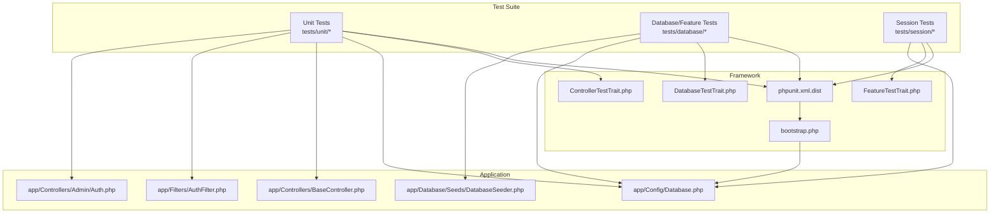
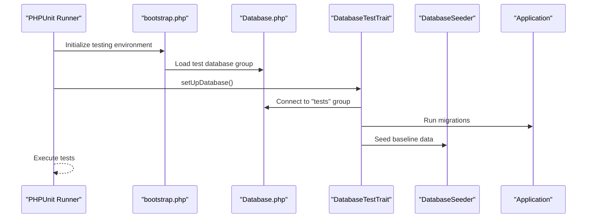
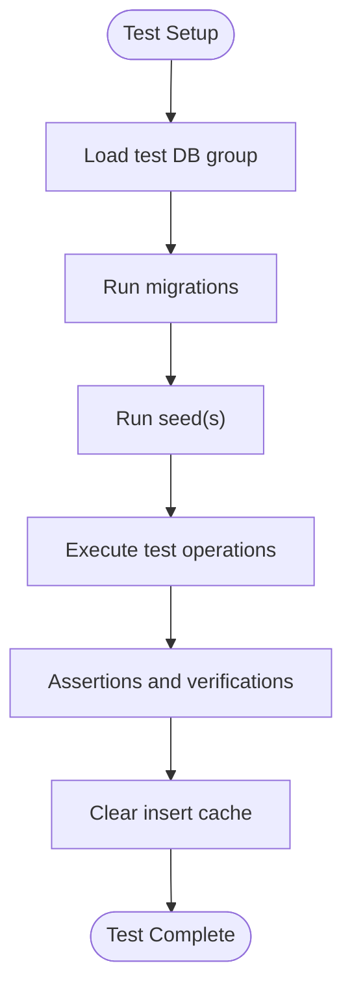
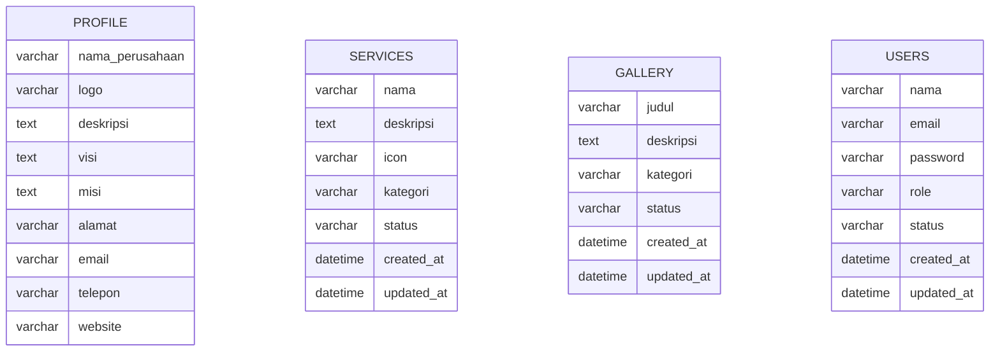
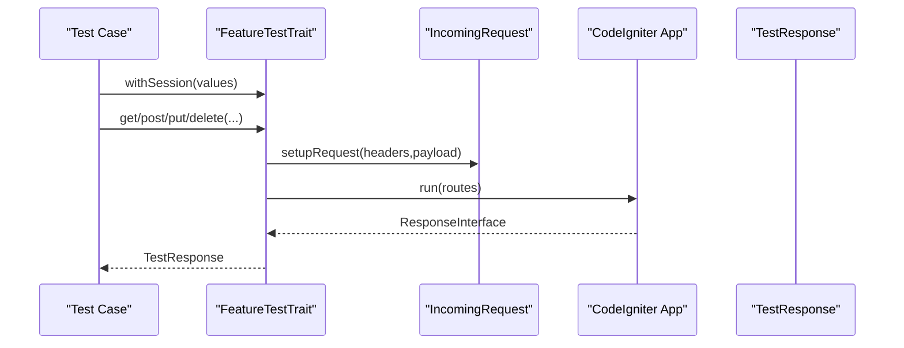
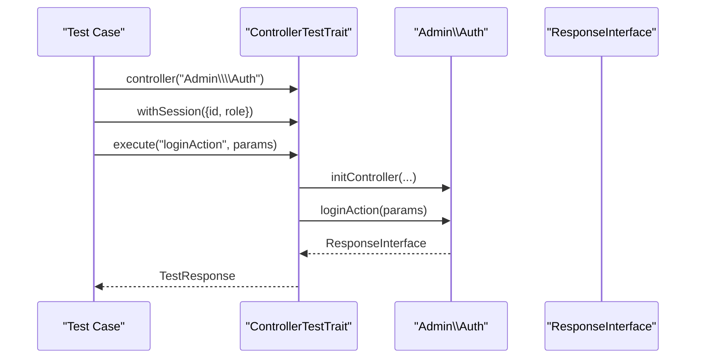
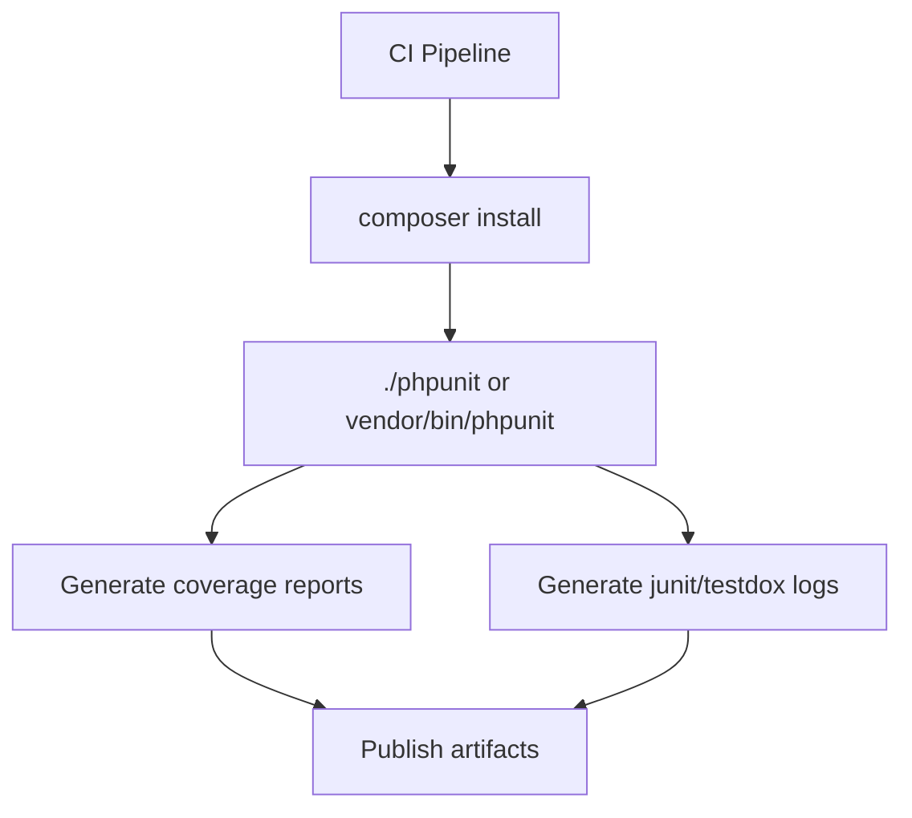
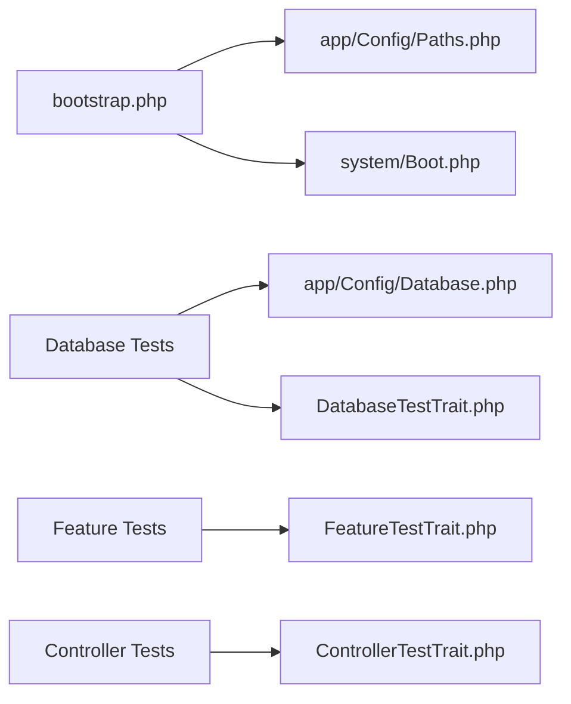

# Testing Strategy

<cite>
**Referenced Files in This Document**
- [Database.php](file://app/Config/Database.php)
- [DatabaseSeeder.php](file://app/Database/Seeds/DatabaseSeeder.php)
- [README.md](file://codeigniter4-framework-v4.7.2-0-gb3359be/README.md)
- [phpunit.xml.dist](file://codeigniter4-framework-v4.7.2-0-gb3359be/phpunit.xml.dist)
- [bootstrap.php](file://codeigniter4-framework-v4.7.2-0-gb3359be/system/Test/bootstrap.php)
- [App.php](file://app/Config/App.php)
- [DatabaseTestTrait.php](file://codeigniter4-framework-v4.7.2-0-gb3359be/system/Test/DatabaseTestTrait.php)
- [FeatureTestTrait.php](file://codeigniter4-framework-v4.7.2-0-gb3359be/system/Test/FeatureTestTrait.php)
- [ControllerTestTrait.php](file://codeigniter4-framework-v4.7.2-0-gb3359be/system/Test/ControllerTestTrait.php)
- [AuthFilter.php](file://app/Filters/AuthFilter.php)
- [BaseController.php](file://app/Controllers/BaseController.php)
- [Auth.php](file://app/Controllers/Admin/Auth.php)
- [HealthTest.php](file://codeigniter4-framework-v4.7.2-0-gb3359be/tests/unit/HealthTest.php)
- [ExampleDatabaseTest.php](file://codeigniter4-framework-v4.7.2-0-gb3359be/tests/database/ExampleDatabaseTest.php)
- [ExampleSessionTest.php](file://codeigniter4-framework-v4.7.2-0-gb3359be/tests/session/ExampleSessionTest.php)
</cite>

## Table of Contents
1. [Introduction](#introduction)
2. [Project Structure](#project-structure)
3. [Core Components](#core-components)
4. [Architecture Overview](#architecture-overview)
5. [Detailed Component Analysis](#detailed-component-analysis)
6. [Dependency Analysis](#dependency-analysis)
7. [Performance Considerations](#performance-considerations)
8. [Troubleshooting Guide](#troubleshooting-guide)
9. [Conclusion](#conclusion)
10. [Appendices](#appendices)

## Introduction
This document defines the testing strategy and implementation for the CodeIgniter 4 company profile application. It covers unit testing, integration testing, database testing, session and authentication testing, controller testing, test data management, environment configuration, and continuous integration considerations. The goal is to provide a practical, maintainable, and scalable approach to quality assurance for the project.

## Project Structure
The testing ecosystem is organized around the CodeIgniter 4 test framework and follows a conventional layout:
- Unit tests under tests/unit
- Feature/integration tests under tests/database and tests/session
- A shared phpunit.xml.dist configuration for coverage, logging, and environment
- Bootstrap and test traits in system/Test for reusable testing capabilities

**Diagram sources**
- [phpunit.xml.dist:1-64](file://codeigniter4-framework-v4.7.2-0-gb3359be/phpunit.xml.dist#L1-L64)
- [bootstrap.php:1-91](file://codeigniter4-framework-v4.7.2-0-gb3359be/system/Test/bootstrap.php#L1-L91)
- [Database.php:160-203](file://app/Config/Database.php#L160-L203)
- [DatabaseTestTrait.php:40-392](file://codeigniter4-framework-v4.7.2-0-gb3359be/system/Test/DatabaseTestTrait.php#L40-L392)
- [FeatureTestTrait.php:44-453](file://codeigniter4-framework-v4.7.2-0-gb3359be/system/Test/FeatureTestTrait.php#L44-L453)
- [ControllerTestTrait.php:39-308](file://codeigniter4-framework-v4.7.2-0-gb3359be/system/Test/ControllerTestTrait.php#L39-L308)
- [DatabaseSeeder.php:1-66](file://app/Database/Seeds/DatabaseSeeder.php#L1-L66)
- [AuthFilter.php](file://app/Filters/AuthFilter.php)
- [BaseController.php](file://app/Controllers/BaseController.php)
- [Auth.php](file://app/Controllers/Admin/Auth.php)

**Section sources**
- [phpunit.xml.dist:1-64](file://codeigniter4-framework-v4.7.2-0-gb3359be/phpunit.xml.dist#L1-L64)
- [bootstrap.php:1-91](file://codeigniter4-framework-v4.7.2-0-gb3359be/system/Test/bootstrap.php#L1-L91)
- [Database.php:160-203](file://app/Config/Database.php#L160-L203)

## Core Components
- Database configuration for testing: The tests group uses an in-memory SQLite database and ensures ENVIRONMENT === testing switches the default group to tests.
- Test bootstrap: Establishes the testing environment, path constants, and boots the framework for tests.
- Test traits:
  - DatabaseTestTrait: Handles migrations, seeding, and database assertions.
  - FeatureTestTrait: Provides HTTP-level feature tests with request setup, headers, body formats, and response handling.
  - ControllerTestTrait: Enables isolated controller testing with mocked request/response/logger and method execution.
- Test data: A central DatabaseSeeder creates realistic baseline data for profile, services, gallery, and an admin user.

**Section sources**
- [Database.php:160-203](file://app/Config/Database.php#L160-L203)
- [bootstrap.php:27-31](file://codeigniter4-framework-v4.7.2-0-gb3359be/system/Test/bootstrap.php#L27-L31)
- [DatabaseTestTrait.php:40-392](file://codeigniter4-framework-v4.7.2-0-gb3359be/system/Test/DatabaseTestTrait.php#L40-L392)
- [FeatureTestTrait.php:44-453](file://codeigniter4-framework-v4.7.2-0-gb3359be/system/Test/FeatureTestTrait.php#L44-L453)
- [ControllerTestTrait.php:39-308](file://codeigniter4-framework-v4.7.2-0-gb3359be/system/Test/ControllerTestTrait.php#L39-L308)
- [DatabaseSeeder.php:1-66](file://app/Database/Seeds/DatabaseSeeder.php#L1-L66)

## Architecture Overview
The testing architecture integrates PHPUnit, CodeIgniter’s test traits, and the application configuration to support:
- Unit tests for models and services
- Feature tests for HTTP endpoints and sessions
- Database tests with controlled migrations and seed data
- Controller tests for action-level verification

**Diagram sources**
- [bootstrap.php:27-31](file://codeigniter4-framework-v4.7.2-0-gb3359be/system/Test/bootstrap.php#L27-L31)
- [Database.php:193-203](file://app/Config/Database.php#L193-L203)
- [DatabaseTestTrait.php:65-107](file://codeigniter4-framework-v4.7.2-0-gb3359be/system/Test/DatabaseTestTrait.php#L65-L107)
- [DatabaseSeeder.php:9-64](file://app/Database/Seeds/DatabaseSeeder.php#L9-L64)

## Detailed Component Analysis

### Database Testing Setup and Seed Data Management
- Test database: The tests group connects to an in-memory SQLite database with strict mode and foreign keys enabled, ensuring deterministic and fast tests.
- Environment switch: When ENVIRONMENT equals testing, the default group switches to tests automatically.
- Migrations and seeding: The trait supports running migrations and seeds per test class, with options to refresh and control namespaces.
- Assertions: Built-in helpers assert presence/absence of records, count rows, and fetch values.
- Insert caching: Tracks temporary inserts to clean up after tests.

**Diagram sources**
- [Database.php:165-191](file://app/Config/Database.php#L165-L191)
- [DatabaseTestTrait.php:65-225](file://codeigniter4-framework-v4.7.2-0-gb3359be/system/Test/DatabaseTestTrait.php#L65-L225)
- [DatabaseSeeder.php:9-64](file://app/Database/Seeds/DatabaseSeeder.php#L9-L64)

**Section sources**
- [Database.php:160-203](file://app/Config/Database.php#L160-L203)
- [DatabaseTestTrait.php:40-392](file://codeigniter4-framework-v4.7.2-0-gb3359be/system/Test/DatabaseTestTrait.php#L40-L392)
- [DatabaseSeeder.php:1-66](file://app/Database/Seeds/DatabaseSeeder.php#L1-L66)

### Test Data Management and Baseline Seeding
- Centralized seeding: The DatabaseSeeder inserts profile, services, gallery entries, and an initial admin user with hashed credentials.
- Timestamps: Automated created_at/updated_at timestamps ensure realistic dataset state.
- Repeatability: Using a single seeder guarantees consistent baseline data across environments.

**Diagram sources**
- [DatabaseSeeder.php:12-63](file://app/Database/Seeds/DatabaseSeeder.php#L12-L63)

**Section sources**
- [DatabaseSeeder.php:1-66](file://app/Database/Seeds/DatabaseSeeder.php#L1-L66)

### Session Testing Methodology
- Session injection: FeatureTestTrait supports injecting session arrays into requests.
- Event and filter isolation: Events can be simulated off and filters reset between tests for determinism.
- Body formats: JSON/XML body formats can be set for API-style endpoints.

**Diagram sources**
- [FeatureTestTrait.php:111-240](file://codeigniter4-framework-v4.7.2-0-gb3359be/system/Test/FeatureTestTrait.php#L111-L240)

**Section sources**
- [FeatureTestTrait.php:44-453](file://codeigniter4-framework-v4.7.2-0-gb3359be/system/Test/FeatureTestTrait.php#L44-L453)

### Authentication Testing and Controller Testing
- Authentication filter: AuthFilter can guard admin routes; tests should simulate session state and verify redirects/unauthorized responses.
- Controller testing: ControllerTestTrait enables instantiating a controller, injecting request/response/logger, and invoking actions directly.
- Assertions: Combine controller responses with database assertions to validate side effects.

**Diagram sources**
- [ControllerTestTrait.php:132-215](file://codeigniter4-framework-v4.7.2-0-gb3359be/system/Test/ControllerTestTrait.php#L132-L215)
- [AuthFilter.php](file://app/Filters/AuthFilter.php)
- [Auth.php](file://app/Controllers/Admin/Auth.php)

**Section sources**
- [ControllerTestTrait.php:39-308](file://codeigniter4-framework-v4.7.2-0-gb3359be/system/Test/ControllerTestTrait.php#L39-L308)
- [AuthFilter.php](file://app/Filters/AuthFilter.php)
- [Auth.php](file://app/Controllers/Admin/Auth.php)

### Test Case Organization, Assertion Patterns, and Mocking Strategies
- Test case organization:
  - Unit tests under tests/unit for pure logic and model-level checks.
  - Feature tests under tests/database for database-backed workflows.
  - Session tests under tests/session for session-aware flows.
- Assertion patterns:
  - Use DatabaseTestTrait assertions for database checks (presence, absence, count).
  - Use FeatureTestTrait/TestResponse for HTTP status/body/header checks.
  - Use ControllerTestTrait for controller action return types and side effects.
- Mocking strategies:
  - Inject mocks for request/response/validation/filters via services injection.
  - Use withRoutes to override routing for targeted endpoint tests.
  - Use withHeaders and withBodyFormat for API-style testing.

**Section sources**
- [DatabaseTestTrait.php:314-372](file://codeigniter4-framework-v4.7.2-0-gb3359be/system/Test/DatabaseTestTrait.php#L314-L372)
- [FeatureTestTrait.php:186-240](file://codeigniter4-framework-v4.7.2-0-gb3359be/system/Test/FeatureTestTrait.php#L186-L240)
- [ControllerTestTrait.php:238-292](file://codeigniter4-framework-v4.7.2-0-gb3359be/system/Test/ControllerTestTrait.php#L238-L292)

### Continuous Integration and Quality Assurance
- PHPUnit configuration:
  - Coverage reporting in clover/html/php/text formats.
  - Logging in junit and testdox formats.
  - Source inclusion/exclusion rules.
- Environment variables:
  - phpunit.xml.dist includes commented examples for overriding test database settings.
- Bootstrap:
  - Ensures ENVIRONMENT is testing and path constants are defined before loading the framework.

**Diagram sources**
- [phpunit.xml.dist:13-43](file://codeigniter4-framework-v4.7.2-0-gb3359be/phpunit.xml.dist#L13-L43)
- [bootstrap.php:27-31](file://codeigniter4-framework-v4.7.2-0-gb3359be/system/Test/bootstrap.php#L27-L31)

**Section sources**
- [phpunit.xml.dist:1-64](file://codeigniter4-framework-v4.7.2-0-gb3359be/phpunit.xml.dist#L1-L64)
- [bootstrap.php:1-91](file://codeigniter4-framework-v4.7.2-0-gb3359be/system/Test/bootstrap.php#L1-L91)

## Dependency Analysis
- Test bootstrap depends on app/Config/Paths and system/Boot to initialize the framework in testing mode.
- Database tests depend on Database.php (tests group) and DatabaseTestTrait for migrations/seeding.
- Feature/controller tests depend on their respective traits and injected services.

**Diagram sources**
- [bootstrap.php:54-82](file://codeigniter4-framework-v4.7.2-0-gb3359be/system/Test/bootstrap.php#L54-L82)
- [Database.php:160-203](file://app/Config/Database.php#L160-L203)
- [DatabaseTestTrait.php:87-107](file://codeigniter4-framework-v4.7.2-0-gb3359be/system/Test/DatabaseTestTrait.php#L87-L107)
- [FeatureTestTrait.php:206-240](file://codeigniter4-framework-v4.7.2-0-gb3359be/system/Test/FeatureTestTrait.php#L206-L240)
- [ControllerTestTrait.php:108-125](file://codeigniter4-framework-v4.7.2-0-gb3359be/system/Test/ControllerTestTrait.php#L108-L125)

**Section sources**
- [bootstrap.php:1-91](file://codeigniter4-framework-v4.7.2-0-gb3359be/system/Test/bootstrap.php#L1-L91)
- [Database.php:160-203](file://app/Config/Database.php#L160-L203)
- [DatabaseTestTrait.php:40-107](file://codeigniter4-framework-v4.7.2-0-gb3359be/system/Test/DatabaseTestTrait.php#L40-L107)
- [FeatureTestTrait.php:44-102](file://codeigniter4-framework-v4.7.2-0-gb3359be/system/Test/FeatureTestTrait.php#L44-L102)
- [ControllerTestTrait.php:39-125](file://codeigniter4-framework-v4.7.2-0-gb3359be/system/Test/ControllerTestTrait.php#L39-L125)

## Performance Considerations
- Use in-memory SQLite for tests to avoid disk I/O overhead.
- Keep migrations minimal and deterministic; leverage refresh only when necessary.
- Prefer targeted namespaces for migrations to reduce runtime.
- Limit heavy fixtures; rely on DatabaseSeeder for essential baseline data.

## Troubleshooting Guide
- Environment mismatch:
  - Symptom: Tests connect to production DB.
  - Fix: Ensure ENVIRONMENT is testing and Database.php switches defaultGroup to tests.
- Database connectivity:
  - Symptom: Migration/seeding fails.
  - Fix: Verify tests group credentials and driver; confirm strict mode and foreign keys align with schema.
- Session state issues:
  - Symptom: Unexpected session behavior in feature tests.
  - Fix: Use withSession to inject explicit session arrays; reset filters and events between tests.
- Controller test failures:
  - Symptom: Action returns unexpected status or output.
  - Fix: Use ControllerTestTrait to inject request/response/logger; verify method signatures and parameter types.
- Coverage generation:
  - Symptom: Coverage report missing or incomplete.
  - Fix: Enable xdebug.mode=coverage in php.ini; run with coverage flags as documented.

**Section sources**
- [bootstrap.php:27-31](file://codeigniter4-framework-v4.7.2-0-gb3359be/system/Test/bootstrap.php#L27-L31)
- [Database.php:193-203](file://app/Config/Database.php#L193-L203)
- [DatabaseTestTrait.php:118-187](file://codeigniter4-framework-v4.7.2-0-gb3359be/system/Test/DatabaseTestTrait.php#L118-L187)
- [FeatureTestTrait.php:111-176](file://codeigniter4-framework-v4.7.2-0-gb3359be/system/Test/FeatureTestTrait.php#L111-L176)
- [ControllerTestTrait.php:132-215](file://codeigniter4-framework-v4.7.2-0-gb3359be/system/Test/ControllerTestTrait.php#L132-L215)
- [phpunit.xml.dist:64-70](file://codeigniter4-framework-v4.7.2-0-gb3359be/phpunit.xml.dist#L64-L70)

## Conclusion
By leveraging CodeIgniter 4’s test traits, centralized database configuration, and a robust seed strategy, this project achieves a cohesive testing approach. The combination of unit, feature, and session tests, backed by deterministic database setups and clear assertion patterns, provides strong confidence in code quality and maintainability. Integrating these practices with CI pipelines ensures continuous feedback and high standards across releases.

## Appendices
- Example test files included in the framework:
  - Unit health check: [HealthTest.php](file://codeigniter4-framework-v4.7.2-0-gb3359be/tests/unit/HealthTest.php)
  - Database example: [ExampleDatabaseTest.php](file://codeigniter4-framework-v4.7.2-0-gb3359be/tests/database/ExampleDatabaseTest.php)
  - Session example: [ExampleSessionTest.php](file://codeigniter4-framework-v4.7.2-0-gb3359be/tests/session/ExampleSessionTest.php)
- Additional resources:
  - [README.md](file://codeigniter4-framework-v4.7.2-0-gb3359be/README.md) for general guidance
  - [App.php](file://app/Config/App.php) for base URL and related configuration impacting tests