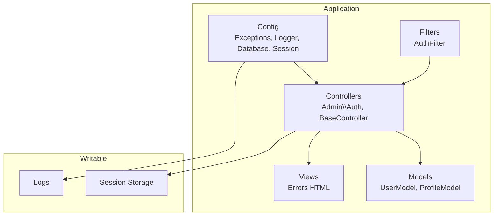
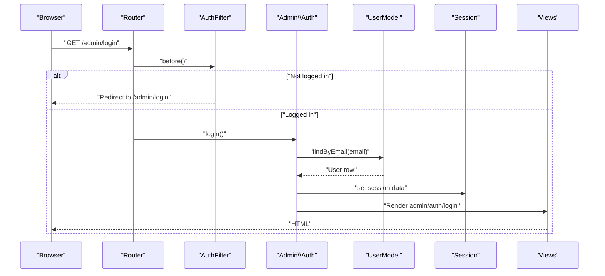
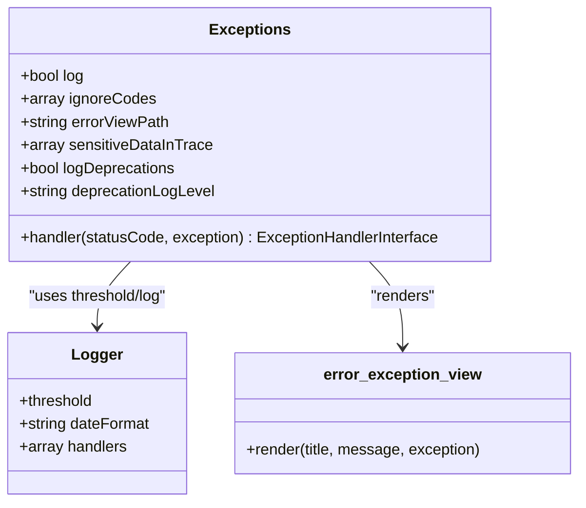
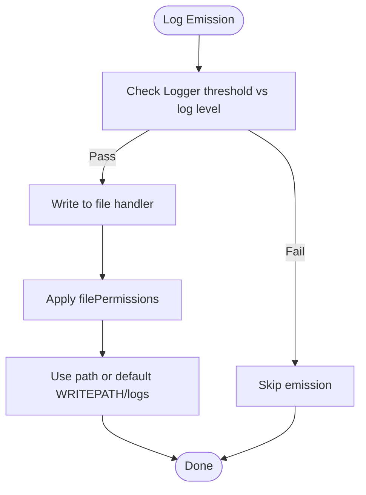
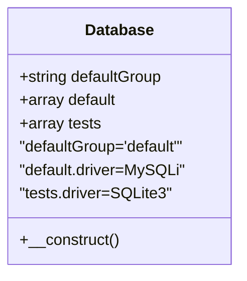
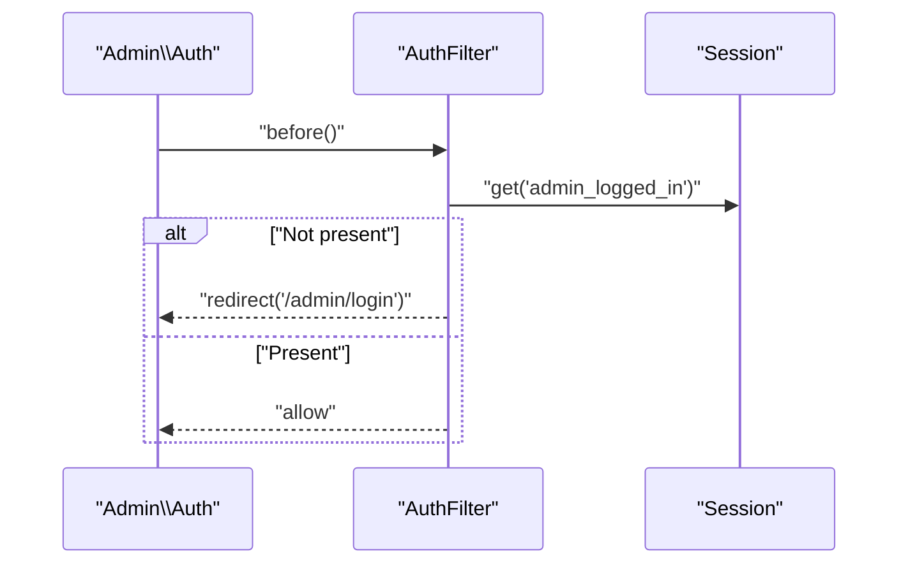
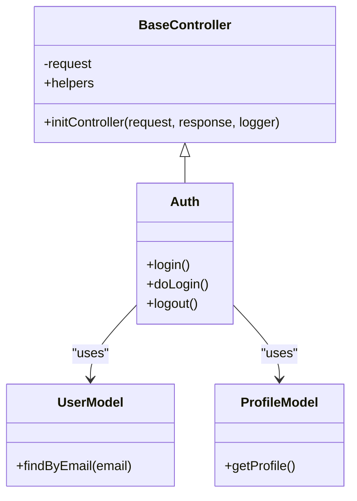
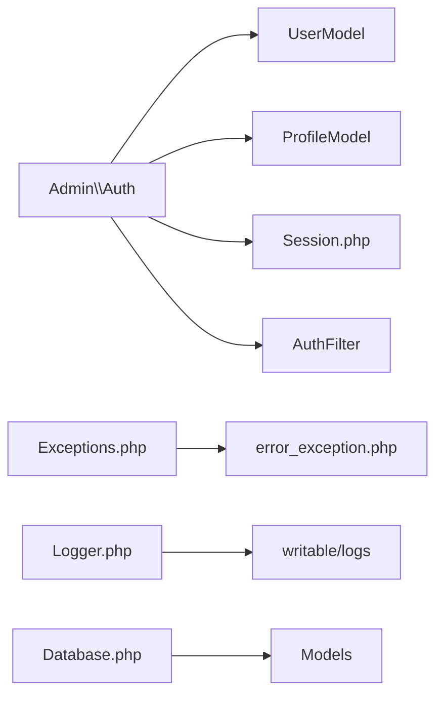

# Troubleshooting & FAQ

<cite>
**Referenced Files in This Document**
- [Exceptions.php](file://app/Config/Exceptions.php)
- [Logger.php](file://app/Config/Logger.php)
- [Database.php](file://app/Config/Database.php)
- [Session.php](file://app/Config/Session.php)
- [error_exception.php](file://app/Views/errors/html/error_exception.php)
- [FrameworkException.php](file://system/Exceptions/FrameworkException.php)
- [PageNotFoundException.php](file://system/Exceptions/PageNotFoundException.php)
- [BaseController.php](file://app/Controllers/BaseController.php)
- [UserModel.php](file://app/Models/UserModel.php)
- [ProfileModel.php](file://app/Models/ProfileModel.php)
- [Auth.php](file://app/Controllers/Admin/Auth.php)
- [AuthFilter.php](file://app/Filters/AuthFilter.php)
- [index.html](file://writable/logs/index.html)
</cite>

## Table of Contents
1. [Introduction](#introduction)
2. [Project Structure](#project-structure)
3. [Core Components](#core-components)
4. [Architecture Overview](#architecture-overview)
5. [Detailed Component Analysis](#detailed-component-analysis)
6. [Dependency Analysis](#dependency-analysis)
7. [Performance Considerations](#performance-considerations)
8. [Troubleshooting Guide](#troubleshooting-guide)
9. [Conclusion](#conclusion)
10. [Appendices](#appendices)

## Introduction
This document provides comprehensive troubleshooting guidance for the CodeIgniter 4 company profile application. It focuses on error handling, exception management, logging, database connectivity, file permissions, session issues, performance tuning, and security considerations. It also includes a FAQ section covering common setup, customization, and extension questions.

## Project Structure
The application follows a standard CodeIgniter 4 layout with configuration under app/Config, controllers under app/Controllers, models under app/Models, views under app/Views, and writable assets under writable/. Error pages are rendered via app/Views/errors/html.

**Diagram sources**
- [Exceptions.php:1-107](file://app/Config/Exceptions.php#L1-L107)
- [Logger.php:1-152](file://app/Config/Logger.php#L1-L152)
- [Database.php:1-205](file://app/Config/Database.php#L1-L205)
- [Session.php:1-129](file://app/Config/Session.php#L1-L129)
- [BaseController.php:1-26](file://app/Controllers/BaseController.php#L1-L26)
- [Auth.php:1-50](file://app/Controllers/Admin/Auth.php#L1-L50)
- [UserModel.php:1-20](file://app/Models/UserModel.php#L1-L20)
- [ProfileModel.php:1-18](file://app/Models/ProfileModel.php#L1-L18)
- [AuthFilter.php:1-23](file://app/Filters/AuthFilter.php#L1-L23)
- [error_exception.php:1-42](file://app/Views/errors/html/error_exception.php#L1-L42)

**Section sources**
- [Exceptions.php:1-107](file://app/Config/Exceptions.php#L1-L107)
- [Logger.php:1-152](file://app/Config/Logger.php#L1-L152)
- [Database.php:1-205](file://app/Config/Database.php#L1-L205)
- [Session.php:1-129](file://app/Config/Session.php#L1-L129)
- [BaseController.php:1-26](file://app/Controllers/BaseController.php#L1-L26)
- [Auth.php:1-50](file://app/Controllers/Admin/Auth.php#L1-L50)
- [UserModel.php:1-20](file://app/Models/UserModel.php#L1-L20)
- [ProfileModel.php:1-18](file://app/Models/ProfileModel.php#L1-L18)
- [AuthFilter.php:1-23](file://app/Filters/AuthFilter.php#L1-L23)
- [error_exception.php:1-42](file://app/Views/errors/html/error_exception.php#L1-L42)

## Core Components
- Exception handling and error views: Centralized in app/Config/Exceptions.php and app/Views/errors/html/error_exception.php.
- Logging: Configured in app/Config/Logger.php with default file handler and environment-aware thresholds.
- Database: Default MySQLi connection configured in app/Config/Database.php; tests override defaults automatically.
- Sessions: Managed via app/Config/Session.php with file-based storage by default.
- Controllers and filters: Admin authentication flow in Admin/Auth.php guarded by AuthFilter.php; BaseController initializes helpers and logger.

**Section sources**
- [Exceptions.php:1-107](file://app/Config/Exceptions.php#L1-L107)
- [Logger.php:1-152](file://app/Config/Logger.php#L1-L152)
- [Database.php:1-205](file://app/Config/Database.php#L1-L205)
- [Session.php:1-129](file://app/Config/Session.php#L1-L129)
- [BaseController.php:1-26](file://app/Controllers/BaseController.php#L1-L26)
- [Auth.php:1-50](file://app/Controllers/Admin/Auth.php#L1-L50)
- [AuthFilter.php:1-23](file://app/Filters/AuthFilter.php#L1-L23)
- [error_exception.php:1-42](file://app/Views/errors/html/error_exception.php#L1-L42)

## Architecture Overview
The application routes HTTP requests through controllers, applies filters for authentication, interacts with models for data access, and persists state via sessions. Errors are captured centrally and rendered through dedicated error views. Logs are emitted according to the configured threshold and handler.

**Diagram sources**
- [AuthFilter.php:1-23](file://app/Filters/AuthFilter.php#L1-L23)
- [Auth.php:1-50](file://app/Controllers/Admin/Auth.php#L1-L50)
- [UserModel.php:1-20](file://app/Models/UserModel.php#L1-L20)
- [Session.php:1-129](file://app/Config/Session.php#L1-L129)

## Detailed Component Analysis

### Exception Handling and Error Views
- Centralized exception configuration controls logging, ignored status codes, sensitive data visibility in traces, and handler selection.
- Error views render user-friendly messages and stack traces conditionally based on environment.
- Framework-level exceptions provide standardized runtime errors.

**Diagram sources**
- [Exceptions.php:1-107](file://app/Config/Exceptions.php#L1-L107)
- [Logger.php:1-152](file://app/Config/Logger.php#L1-L152)
- [error_exception.php:1-42](file://app/Views/errors/html/error_exception.php#L1-L42)

**Section sources**
- [Exceptions.php:1-107](file://app/Config/Exceptions.php#L1-L107)
- [Logger.php:1-152](file://app/Config/Logger.php#L1-L152)
- [error_exception.php:1-42](file://app/Views/errors/html/error_exception.php#L1-L42)
- [FrameworkException.php:1-95](file://system/Exceptions/FrameworkException.php#L1-L95)
- [PageNotFoundException.php:1-83](file://system/Exceptions/PageNotFoundException.php#L1-L83)

### Logging Configuration and Diagnostics
- Threshold is environment-aware: debug in development, runtime errors in production.
- File handler writes logs with configurable permissions and path.
- Diagnostic steps include verifying writable/logs availability and permissions.

**Diagram sources**
- [Logger.php:1-152](file://app/Config/Logger.php#L1-L152)

**Section sources**
- [Logger.php:1-152](file://app/Config/Logger.php#L1-L152)
- [index.html:1-12](file://writable/logs/index.html#L1-L12)

### Database Connectivity
- Default connection uses MySQLi with UTF-8 multibyte character set and collation.
- Tests group uses an in-memory SQLite3 connection to avoid accidental data loss.
- Environment-driven overrides ensure test isolation.

**Diagram sources**
- [Database.php:1-205](file://app/Config/Database.php#L1-L205)

**Section sources**
- [Database.php:1-205](file://app/Config/Database.php#L1-L205)

### Session Management
- File-based session storage by default with an absolute save path under writable/session.
- Cookie name, expiration, regeneration interval, and IP matching are configurable.
- Authentication filter checks session presence to protect admin routes.

**Diagram sources**
- [AuthFilter.php:1-23](file://app/Filters/AuthFilter.php#L1-L23)
- [Session.php:1-129](file://app/Config/Session.php#L1-L129)

**Section sources**
- [Session.php:1-129](file://app/Config/Session.php#L1-L129)
- [AuthFilter.php:1-23](file://app/Filters/AuthFilter.php#L1-L23)
- [Auth.php:1-50](file://app/Controllers/Admin/Auth.php#L1-L50)

### Models and Controllers
- Models encapsulate table metadata and simple queries (e.g., finding a user by email).
- Controllers initialize helpers and logger via BaseController and implement admin login/logout flows.

**Diagram sources**
- [BaseController.php:1-26](file://app/Controllers/BaseController.php#L1-L26)
- [UserModel.php:1-20](file://app/Models/UserModel.php#L1-L20)
- [ProfileModel.php:1-18](file://app/Models/ProfileModel.php#L1-L18)
- [Auth.php:1-50](file://app/Controllers/Admin/Auth.php#L1-L50)

**Section sources**
- [BaseController.php:1-26](file://app/Controllers/BaseController.php#L1-L26)
- [UserModel.php:1-20](file://app/Models/UserModel.php#L1-L20)
- [ProfileModel.php:1-18](file://app/Models/ProfileModel.php#L1-L18)
- [Auth.php:1-50](file://app/Controllers/Admin/Auth.php#L1-L50)

## Dependency Analysis
- Controllers depend on models for data access and on session/filter infrastructure for protection.
- Exception and logging configurations influence error rendering and diagnostics.
- Database configuration affects model behavior and migration/test execution.

**Diagram sources**
- [Auth.php:1-50](file://app/Controllers/Admin/Auth.php#L1-L50)
- [UserModel.php:1-20](file://app/Models/UserModel.php#L1-L20)
- [ProfileModel.php:1-18](file://app/Models/ProfileModel.php#L1-L18)
- [AuthFilter.php:1-23](file://app/Filters/AuthFilter.php#L1-L23)
- [Session.php:1-129](file://app/Config/Session.php#L1-L129)
- [Exceptions.php:1-107](file://app/Config/Exceptions.php#L1-L107)
- [error_exception.php:1-42](file://app/Views/errors/html/error_exception.php#L1-L42)
- [Logger.php:1-152](file://app/Config/Logger.php#L1-L152)
- [Database.php:1-205](file://app/Config/Database.php#L1-L205)

**Section sources**
- [Auth.php:1-50](file://app/Controllers/Admin/Auth.php#L1-L50)
- [UserModel.php:1-20](file://app/Models/UserModel.php#L1-L20)
- [ProfileModel.php:1-18](file://app/Models/ProfileModel.php#L1-L18)
- [AuthFilter.php:1-23](file://app/Filters/AuthFilter.php#L1-L23)
- [Session.php:1-129](file://app/Config/Session.php#L1-L129)
- [Exceptions.php:1-107](file://app/Config/Exceptions.php#L1-L107)
- [error_exception.php:1-42](file://app/Views/errors/html/error_exception.php#L1-L42)
- [Logger.php:1-152](file://app/Config/Logger.php#L1-L152)
- [Database.php:1-205](file://app/Config/Database.php#L1-L205)

## Performance Considerations
- Logging threshold: Set to a conservative level in production to reduce I/O overhead.
- Session save path: Ensure the path is on fast storage; avoid network-mounted directories for file-based sessions.
- Database charset/collation: utf8mb4 reduces conversion overhead and improves compatibility.
- Views and helpers: Keep view logic minimal; defer heavy computations to controllers/models.

[No sources needed since this section provides general guidance]

## Troubleshooting Guide

### Installation Problems
- Verify Composer dependencies are installed and autoload is generated.
- Confirm the web server document root points to the public directory.
- Ensure the .htaccess files are enabled and allow overrides if using Apache.

**Section sources**
- [Logger.php:1-152](file://app/Config/Logger.php#L1-L152)

### Configuration Errors
- Environment mismatch: Ensure ENVIRONMENT matches deployment stage (development, production, testing).
- Logger threshold: Adjust threshold to capture desired log levels; confirm writable/logs is writable.
- Database credentials: Validate hostname, username, password, and database name; ensure the database exists and is reachable.
- Session save path: Confirm the absolute path is writable and accessible by the web server process.

**Section sources**
- [Logger.php:1-152](file://app/Config/Logger.php#L1-L152)
- [Database.php:1-205](file://app/Config/Database.php#L1-L205)
- [Session.php:1-129](file://app/Config/Session.php#L1-L129)

### Runtime Issues
- Exception rendering: Review app/Views/errors/html/error_exception.php for environment-specific details.
- Ignored status codes: 404 exceptions are ignored by default; adjust Exceptions.php if you need to log them.
- Deprecations: Enable deprecation logging and set appropriate log level in Exceptions.php.

**Section sources**
- [error_exception.php:1-42](file://app/Views/errors/html/error_exception.php#L1-L42)
- [Exceptions.php:1-107](file://app/Config/Exceptions.php#L1-L107)

### Database Connection Problems
- Symptoms: Cannot connect to database, migrations fail, or models throw connection errors.
- Steps:
  1. Verify credentials and host in app/Config/Database.php.
  2. Ensure the database server is running and accepts connections on the specified port.
  3. Check firewall/network policies blocking the connection.
  4. For testing, confirm the tests group uses SQLite3 and runs in-memory.
  5. Review writable/logs for database-related entries.

**Section sources**
- [Database.php:1-205](file://app/Config/Database.php#L1-L205)
- [Logger.php:1-152](file://app/Config/Logger.php#L1-L152)

### File Permission Issues
- Symptoms: 403 Forbidden when accessing logs or uploads; inability to write session files.
- Steps:
  1. Confirm writable/logs, writable/session, and writable/uploads are writable by the web server process.
  2. Check file permissions and ownership; ensure the web server user can create files and directories.
  3. Validate that directory access is permitted per the included index.html protections.

**Section sources**
- [Logger.php:1-152](file://app/Config/Logger.php#L1-L152)
- [Session.php:1-129](file://app/Config/Session.php#L1-L129)
- [index.html:1-12](file://writable/logs/index.html#L1-L12)

### Session-Related Errors
- Symptoms: Users cannot stay logged in, session cookies rejected, or session regeneration failures.
- Steps:
  1. Verify session.save_path points to a valid, writable directory.
  2. Check cookie name and expiration settings in app/Config/Session.php.
  3. Confirm the AuthFilter checks for the expected session keys.
  4. For file-based sessions, ensure the path is absolute and accessible.

**Section sources**
- [Session.php:1-129](file://app/Config/Session.php#L1-L129)
- [AuthFilter.php:1-23](file://app/Filters/AuthFilter.php#L1-L23)
- [Auth.php:1-50](file://app/Controllers/Admin/Auth.php#L1-L50)

### Logging Configuration and Diagnostics
- Enable logging in app/Config/Exceptions.php and adjust Logger.php threshold.
- Confirm logs are written to writable/logs with correct permissions.
- Use stack traces in non-production environments to locate issues quickly.

**Section sources**
- [Exceptions.php:1-107](file://app/Config/Exceptions.php#L1-L107)
- [Logger.php:1-152](file://app/Config/Logger.php#L1-L152)
- [error_exception.php:1-42](file://app/Views/errors/html/error_exception.php#L1-L42)

### Performance Issues
- Reduce log verbosity in production by raising the threshold.
- Minimize unnecessary queries; use model caching where appropriate.
- Monitor session storage performance; consider Redis/Memcached handlers for high traffic.

**Section sources**
- [Logger.php:1-152](file://app/Config/Logger.php#L1-L152)
- [Session.php:1-129](file://app/Config/Session.php#L1-L129)

### Security Vulnerabilities
- Keep framework and dependencies updated.
- Avoid exposing sensitive data in debug traces; configure sensitiveDataInTrace in Exceptions.php.
- Enforce HTTPS and secure headers via framework filters.
- Sanitize inputs and enforce strict validation rules.

**Section sources**
- [Exceptions.php:1-107](file://app/Config/Exceptions.php#L1-L107)

### Frequently Asked Questions
- Q: Why am I seeing a 404 page?
  - A: 404 exceptions are ignored by default in Exceptions.php; check routing and controller existence.
- Q: How do I change the log level?
  - A: Adjust threshold in Logger.php; higher values suppress lower severity logs.
- Q: How do I switch to Redis/Memcached sessions?
  - A: Update driver and related settings in app/Config/Session.php.
- Q: How do I customize error pages?
  - A: Modify app/Views/errors/html/error_exception.php and configure errorViewPath in Exceptions.php.
- Q: How do I run database migrations/tests safely?
  - A: Use CLI commands; tests automatically target the tests group in Database.php.

**Section sources**
- [Exceptions.php:1-107](file://app/Config/Exceptions.php#L1-L107)
- [Logger.php:1-152](file://app/Config/Logger.php#L1-L152)
- [Session.php:1-129](file://app/Config/Session.php#L1-L129)
- [error_exception.php:1-42](file://app/Views/errors/html/error_exception.php#L1-L42)
- [Database.php:1-205](file://app/Config/Database.php#L1-L205)

## Conclusion
This guide consolidates actionable steps to diagnose and resolve common issues in the CodeIgniter 4 company profile application. By aligning configuration, permissions, and logging with environment needs, most problems can be resolved quickly. Regular monitoring and adherence to security best practices will help maintain stability and performance.

## Appendices
- Quick checklist:
  - writable/logs writable and readable by web server
  - database credentials valid and reachable
  - session.save_path absolute and writable
  - logger threshold appropriate for environment
  - error views customized for UX and security

[No sources needed since this section provides general guidance]